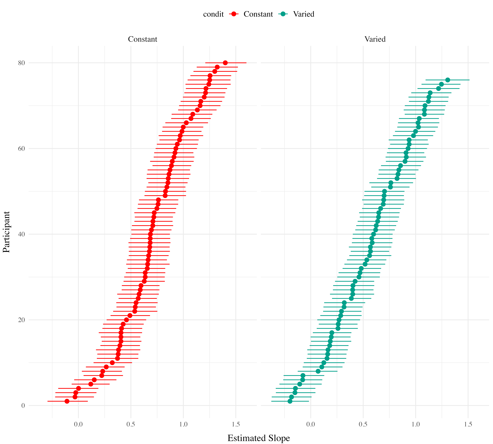
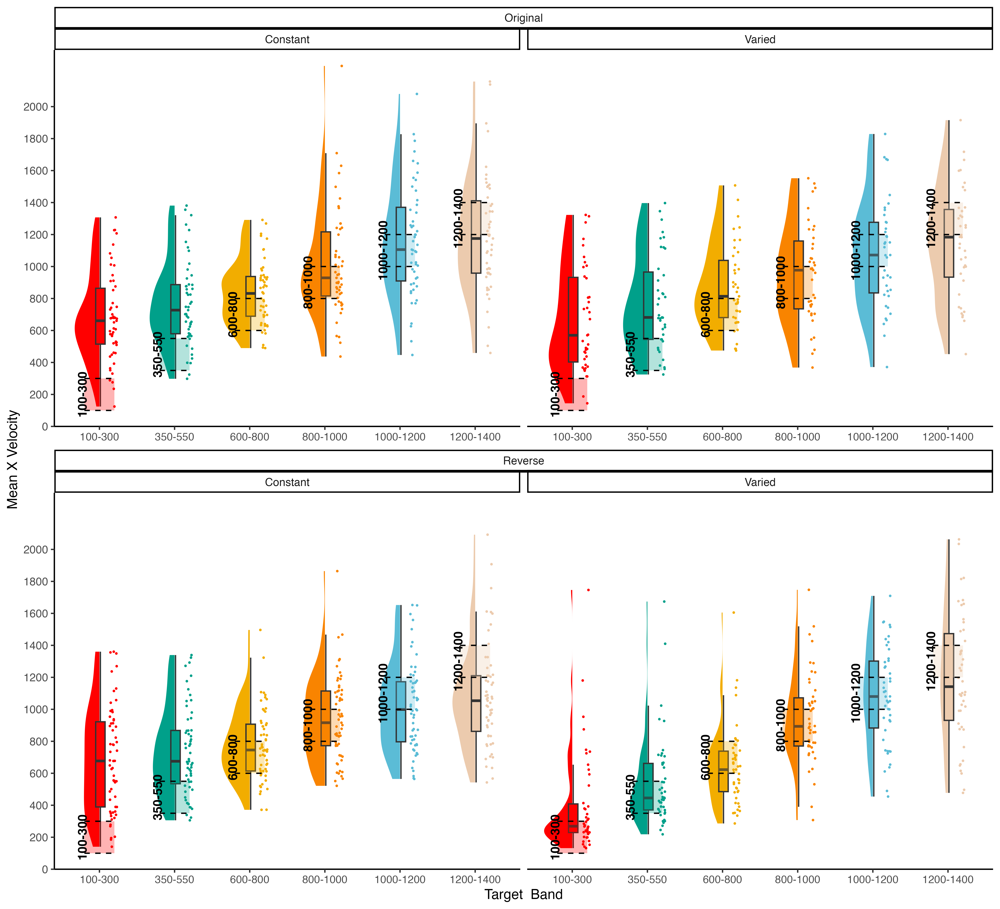

::: {.cell layout-align="center"}

:::


# Project 1


## Abstract

Exposing learners to variability during training has been demonstrated
to improve performance in subsequent transfer testing. Such variability
benefits are often accounted for by assuming that learners are
developing some general task schema or structure. However much of this
research has neglected to account for differences in similarity between
varied and constant training conditions. In a between-groups
manipulation, we trained participants on a simple projectile launching
task, with either varied or constant conditions. We replicate previous
findings showing a transfer advantage of varied over constant training.
Furthermore, we show that a standard similarity model is insufficient to
account for the benefits of variation, but, if the model is adjusted to
assume that varied learners are tuned towards a broader generalization
gradient, then a similarity-based model is sufficient to explain the
observed benefits of variation. Our results therefore suggest that some
variability benefits can be accommodated within instance-based models
without positing the learning of some schemata or structure.


## Introduction

The past century of research on human learning has produced ample
evidence that although learners can improve at almost any task, such
improvements are often specific to the trained task, with unreliable or
even nonexistent transfer to novel tasks or conditions
[@barnettWhenWhereWe2002; @dettermanCaseProsecutionTransfer1993]. Such
transfer challenges are of noteworthy practical relevance, given that
educators, trainers, and rehabilitators typically intend for their
students to be able to apply what they have learned to new situations.
It is therefore important to better understand the factors that
influence transfer, and to develop cognitive models that can predict
when transfer is likely to occur. The factor of interest to the present
investigation is variation during training. Our experiments add to the
longstanding empirical investigation of the controversial relationship
between training variation, and subsequent transfer. We also offer a
novel explanation for such results in the form of an instance-based
model that accounts for the benefits of variation in simple terms of
psychological similarity. We first review the relevant concepts and
literature.

### Similarity and instance-based approaches to transfer of learning

Notions of similarity have long played a central role in many prominent
models of generalization of learning, as well as in the longstanding
theoretical issue of whether learners abstract an aggregate, summary
representation, or if they simply store individual instances. Early
models of learning often assumed that discrete experiences with some
task or category were not stored individually in memory, but instead
promoted the formation of a summary representation, often referred to as
a prototype or schema, and that exposure to novel examples would then
prompt the retrieval of whichever preexisting prototype was most similar
[@posnerGenesisAbstractIdeas1968]. Prototype
models were later challenged by the success of instance-based or
exemplar models -- which were shown to provide an account of
generalization as good or better than prototype models, with the
advantage of not assuming the explicit construction of an internal
prototype [@estesClassificationCognition1994;
@hintzmanMINERVASimulationModel1984;
@medinContextTheoryClassification1978;
@nosofskyAttentionSimilarityIdentificationcategorization1986 ].
Instance-based models assume that learners encode each experience with a
task as a separate instance/exemplar/trace, and that each encoded trace
is in turn compared against novel stimuli. As the number of stored
instances increases, so does the likelihood that some previously stored
instance will be retrieved to aid in the performance of a novel task.
Stored instances are retrieved in the context of novel stimuli or tasks
if they are sufficiently similar, thus suggesting that the process of
computing similarity is of central importance to generalization.

Similarity, defined in this literature as a function of psychological
distance between instances or categories, has provided a successful
account of generalization across numerous tasks and domains. In an
influential study demonstrating an ordinal similarity effect,
experimenters employed a numerosity judgment task in which participants
quickly report the number of dots flashed on a screen. Performance (in
terms of response times to new patterns) on novel dot configurations
varied as an inverse function of their similarity to previously trained
dot configurations @palmeriExemplarSimilarityDevelopment1997. That is, performance was better on
novel configurations moderately similar to trained configurations than
to configurations with low-similarity, and also better on low-similarity
configurations than to even less similar, unrelated configurations.
Instance-based approaches have had some success accounting for
performance in certain sub-domains of motor learning [@cohenWhereGraspsAre2004; @crumpEpisodicContributionsSequential2010; @meighWhatMemoryRepresentation2018; @poldrackRelationshipSkillLearning1999; @wifallReachingResponseSelection2017; @crumpEpisodicContributionsSequential2010] trained participants to type words on an unfamiliar keyboard, while constraining the letters composing the training words to a pre-specified letter set. Following
training, typing speed was tested on previously experienced words
composed of previously experienced letters; novel words composed of
letters from the trained letter set; and novel words composed of letters
from an untrained letter set. Consistent with an instance-based account,
transfer performance was graded such that participants were fastest at
typing the words they had previously trained on, followed by novel words
composed of letters they had trained on, and slowest performance for new
words composed of untrained letters.

## The effect of training variability on transfer

While similarity-based models account for transfer by the degree of
similarity between previous and new experiences, a largely separate body
of research has focused on improving transfer by manipulating
characteristics of the initial training stage. Such characteristics have
included training difficulty, spacing, temporal order, feedback
schedules, and the primary focus of the current work -- variability of
training examples.

Research on the effects of varied training typically compares
participants trained under constant, or minimal variability conditions
to those trained from a variety of examples or conditions [@czyzVariabilityPracticeInformation2021; @soderstromLearningPerformanceIntegrative2015]. Varied training has been shown to influence
learning in myriad domains including categorization of simple stimuli [@hahnEffectsCategoryDiversity2005; @maddoxStimulusRangeDiscontinuity2011; @posnerGenesisAbstractIdeas1968],
complex categorization [@nosofskyModelguidedSearchOptimal2018], language learning [@jonesDensityDistinctivenessEarly2020; @perryLearnLocallyThink2010; @twomeyAllRightNoises2018; @wonnacottInputEffectsAcquisition2012], anagram completion [@goodeSuperiorityVariableRepeated2008], trajectory
extrapolation [@fulvioTaskSpecificResponseStrategy2014], task switching [@sabahWhenLessMore2019], associative learning [@leeEvidentialDiversityIncreases2019], visual search [@georgeStimulusVariabilityTask2021; @gonzalezDiversityTrainingEnhances2011; @kelleyLearningAttendEffects2009], voice
identity learning [@lavanEffectsHighVariability2019], simple motor learning [@braunMotorTaskVariation2009; @kerrSpecificVariedPractice1978; @rollerVariablePracticeLenses2001; @willeyLimitedGeneralizationVaried2018],
sports training  [@greenPracticeVariabilityTransfer1995; @greenPracticeVariabilityTransfer1995a @northEffectConsistentVaried2019], and training
on a complex video game [@seowTransferEffectsVaried2019].

Training variation has received a particularly large amount of attention
within the domain of visuomotor skill learning. Much of this research
has been influenced by the work of @schmidtSchemaTheoryDiscrete1975, who proposed a
schema-based account of motor learning as an attempt to address the
longstanding problem of how novel movements are produced. According to
Schema Theory, learners possess general motor programs for classes of
movements (e.g. throwing a ball with an underhand movement), as well as
schema rules that determine how a motor program is parameterized or
scaled for a particular movement. Schema theory predicts that varied
training results in the formation of a more general schema-rule, which
can allow for transfer to novel movements within a given movement class.
Experiments that test this hypothesis are often designed to compare the
transfer performance of a constant-trained group against that of a
varied-trained group. Both groups train on the same task, but the varied
group practices from multiple levels of a task-relevant dimension that
remains invariant for the constant group. For example, investigators
might train two groups of participants to throw a projectile at a
target, with a constant group that throws from a single location, and a
varied group that throws from multiple locations. Both groups are then
tested from novel locations. Empirically observed benefits of the
varied-trained group are then attributed to the variation they received
during training, a finding observed in numerous studies [@catalanoDistantTransferCoincident1984a; @chuaPracticeVariabilityPromotes2019; @goodwinEffectDifferentQuantities1998; @kerrSpecificVariedPractice1978; @wulfEffectTypePractice1991], and the benefits of this variation are typically
thought to be mediated by the development of a more general schema for
the throwing motion.

Of course, the relationship between training variability and transfer is
unlikely to be a simple function wherein increased variation is always
beneficial. Numerous studies have found null, or in some cases negative
effects of training variation [@deloshExtrapolationSineQua1997; @sinkeviciuteRoleInputVariability2019; @wrisbergVariabilityPracticeHypothesis1987], and many more have suggested that the
benefits of variability may depend on additional factors such as prior
task experience, the order of training trials, or the type of transfer
being measured [@bernikerEffectsTrainingBreadth2014; @braithwaiteEffectsVariationPrior2015; @hahnEffectsCategoryDiversity2005; @lavanEffectsHighVariability2019; @northEffectConsistentVaried2019; @sadakataIndividualAptitudeMandarin2014; @zamanPerceptualVariabilityImplications2021]. 

### Issues with Previous Research

Although the benefits of training variation in visuomotor skill learning
have been observed many times, null findings have also been repeatedly
found, leading some researchers to question the veracity of the
variability of practice hypothesis [@newellSchemaTheory19752003; @vanrossumSchmidtSchemaTheory1990].
Critics have also pointed out that investigations of the effects of
training variability, of the sort described above, often fail to control
for the effect of similarity between training and testing conditions.
For training tasks in which participants have numerous degrees of
freedom (e.g. projectile throwing tasks where participants control the x
and y velocity of the projectile), varied groups are likely to
experience a wider range of the task space over the course of their
training (e.g. more unique combinations of x and y velocities).
Experimenters may attempt to account for this possibility by ensuring
that the training location(s) of the varied and constant groups are an
equal distance away from the eventual transfer locations, such that
their training throws are, on average, equally similar to throws that
would lead to good performance at the transfer locations. However, even
this level of experimental control may still be insufficient to rule out
the effect of similarity on transfer. Given that psychological
similarity is typically best described as either a Gaussian or
exponentially decaying function of psychological distance [@ennisMultidimensionalStochasticTheory1988; @ghahramaniGeneralizationLocalRemappings1996; @loganInstanceTheoryAutomatization1988; @nosofskySimilarityScalingCognitive1992; @shepardUniversalLawGeneralization1987; @thoroughmanRapidReshapingHuman2005 ], it is plausible that a subset of the
most similar training instances could have a disproportionate impact on
generalization to transfer conditions, even if the average distance
between training and transfer conditions is identical between groups.
@fig-toy-model1 demonstrates the consequences of a generalization gradient that
drops off as a Gaussian function of distance from training, as compared
to a linear drop-off.


::: {.cell layout-align="center"}
::: {.cell-output-display}
![Left panel- Generalization predicted from a simple model that assumes a linear generalization function. A varied group (red vertical lines indicate the 2 training locations) trained from positions 400 and 800, and a constant group (blue vertical line), trained from position 600. Right panel- if a Gaussian generalization function is assumed, then varied training (400, 800) is predicted to result in better generalization to positions close to 400 and 800 than does constant training at 600. (For interpretation of the references to color in this figure legend, the reader is referred to the web version of this article.)](manuscript_files/figure-html/fig-toy-model1-1.png){#fig-toy-model1 fig-align='center' width=100%}
:::
:::


In addition to largely overlooking the potential for non-linear
generalization to confound interpretations of training manipulations,
the visuomotor skill learning literature also rarely considers
alternatives to schema representations [@chamberlinMemoryRepresentationMotor1992].
Although schema-theory remains influential within certain literatures,
instance or exemplar-based models have accounted for human behavior
across myriad domains [@jamiesonInstanceTheoryDomaingeneral2022; @loganInstanceTheoryAttention2002a]. As mentioned above, instance based accounts have been shown to perform well on a
variety of different tasks with motoric components [@crumpEpisodicContributionsSequential2010;@gandolfoMotorLearningField1996a;  @meighWhatMemoryRepresentation2018; @rosenbaumPlanningReachesEvaluating1995; @vandamMappingShapeVisuomotor2015]. However, such accounts have received little
attention within the subdomain of visuomotor skill learning focused on
the benefits of varied training.

The present work examines whether the commonly observed benefits of
varied training can be accounted for by between-group differences in
similarity between training and testing throws. We first attempt to
replicate previous work finding an advantage of varied training over
constant training in a projectile launching task. We then examine the
extent to which this advantage can be explained by an instance-based
similarity model.

## Experiment 1

### Methods

#### Sample Size Estimation

To obtain an independent estimate of effect size, we identified previous
investigations which included between-subjects contrasts of varied and
constant conditions following training on an accuracy based projectile
launching task [@chuaPracticeVariabilityPromotes2019; @goodwinEffectDifferentQuantities1998; @kerrSpecificVariedPractice1978; @wulfEffectTypePractice1991]. We then averaged effects across these studies,
yielding a Cohens f =.43. The GPower 3.1 software package [@faulStatisticalPowerAnalyses2009],
2009) was then used to determine that a power of 80% requires a sample
size of at least 23 participants per condition. All experiments reported
in the present manuscript exceed this minimum number of participants per
condition.

#### Participants

Participants were recruited from an undergraduate population that is 63%
female and consists almost entirely of individuals aged 18-22 years. A
total of 110 Indiana University psychology students participated in
Experiment 1. We subsequently excluded 34 participants poor performance
at one of the dependent measures of the task (2.5-3 standard deviations
worse than the median subject at the task) or for displaying a pattern
of responses that was clearly indicative of a lack of engagement with
the task (e.g. simply dropping the ball on each trial rather than
throwing it at the target), or for reporting that they completed the
experiment on a phone or tablet device, despite the instructions not to
use one of these devices. A total of 74 participants were retained for
the final analyses, 35 in the varied group and 39 in the constant group.

#### Task

The experimental task was programmed in JavaScript, using packages from
the Phaser physics engine (https://phaser.io) and the jsPsych library
(de Leeuw, 2015). The stimuli, presented on a black background,
consisted of a circular blue ball -- controlled by the participant via
the mouse or trackpad cursor; a rectangular green target; a red
rectangular barrier located between the ball and the target; and an
orange square within which the participant could control the ball before
releasing it in a throw towards the target. Because the task was
administered online, the absolute distance between stimuli could vary
depending on the size of the computer monitor being used, but the
relative distance between the stimuli was held constant. Likewise, the
distance between the center of the target, and the training and testing
locations was scaled such that relative distances were preserved
regardless of screen size. For the sake of brevity, subsequent mentions
of this relative distance between stimuli, or the position where the
ball landed in relation to the center of the target, will be referred to
simply as distance. @fig-igasTask displays the layout of the task, as
it would appear to a participant at the start of a trial, with the ball
appearing in the center of the orange square. Using a mouse or trackpad,
participants click down on the ball to take control of the ball,
connecting the movement of the ball to the movement of the cursor.
Participants can then "wind up" the ball by dragging it (within the
confines of the orange square) and then launch the ball by releasing the
cursor. If the ball does not land on the target, participants are
presented with feedback in red text at the top right of the screen, on
how many units away they were from the center of the target. If the ball
was thrown outside of the boundary of the screen participants are given
feedback as to how far away from the target center the ball would have
been if it had continued its trajectory. If the ball strikes the barrier
(from the side or by landing on top), feedback is presented telling
participants to avoid hitting the barrier. If participants drag the ball
outside of the orange square before releasing it, the trial terminates,
and they are reminded to release the ball within the orange square. If
the ball lands on the target, feedback is presented in green text,
confirming that the target was hit, and presenting additional feedback
on how many units away the ball was from the exact center of the target.

[Link to abbrevaited example of
task](https://pcl.sitehost.iu.edu/tg/demos/igas_expt1_demo.html){target="_blank"}.

{#fig-igasTask}


### Results

#### Data Processing and Statistical Packages

To prepare the data, we first removed trials that were not easily
interpretable as performance indicators in our task. Removed trials
included: 1) those in which participants dragged the ball outside of the
orange starting box without releasing it, 2) trials in which
participants clicked on the ball, and then immediately released it,
causing the ball to drop straight down, 3) outlier trials in which the
ball was thrown more than 2.5 standard deviations further than the
average throw (calculated separately for each throwing position), and 4)
trials in which the ball struck the barrier. The primary measure of
performance used in all analyses was the absolute distance away from the
center of the target. The absolute distance was calculated on every
trial, and then averaged within each subject to yield a single
performance score, for each position. A consistent pattern across
training and testing phases in both experiments was for participants to
perform worse from throwing positions further away from the target -- a
pattern which we refer to as the difficulty of the positions. However,
there were no interactions between throwing position and training
conditions, allowing us to collapse across positions in cases where
contrasts for specific positions were not of interest. All data
processing and statistical analyses were performed in R version 4.03 (R
Core Team, 2020). ANOVAs for group comparisons were performed using the
rstatix package (Kassambara, 2021)****.

#### Training Phase

@fig-IGAS-Training1 below shows aggregate training performance binned into three
stages representing the beginning, middle, and end of the training
phase. Because the two conditions trained from target distances that
were not equally difficult, it was not possible to directly compare
performance between conditions in the training phase. Our focus for the
training data analysis was instead to establish that participants did
improve their performance over the course of training, and to examine
whether there was any interaction between training stage and condition.
Descriptive statistics for the intermittent testing phase are provided
in the supplementary materials.

We performed an ANOVA comparison with stage as a within-group factor and
condition as between-group factor. The analysis revealed a significant
effect of training stage F(2,142)=62.4, p\<.001, $\eta^{2}_G$ = .17,
such that performance improved over the course of training There was no
significant effect of condition F(1,71)=1.42, p=.24, $\eta^{2}_G$ = .02,
and no significant interaction between condition and training stage,
F(2,142)=.10, p=.91, $\eta^{2}_G$ \< .01.


::: {.cell layout-align="center"}
::: {.cell-output-display}
{#fig-IGAS-Training1 fig-align='center' width=100%}
:::
:::


### Testing Phase

In Experiment 1, a single constant-trained group was compared against a
single varied-trained group. At the transfer phase, all participants
were tested from 3 positions: 1) the positions(s) from their own
training, 2) the training position(s) of the other group, and 3) a
position novel to both groups. Overall, group performance was compared
with a mixed type III ANOVA, with condition (varied vs. constant) as a
between-subject factor and throwing location as a within-subject
variable. The effect of throwing position was strong, F(3,213) = 56.12,
p\<.001, η2G = .23. The effect of training condition was significant
F(1,71)=8.19, p\<.01, η2G = .07. There was no significant interaction
between group and position, F(3,213)=1.81, p=.15, η2G = .01.


::: {.cell layout-align="center"}
::: {.cell-output-display}
{#fig-IGAS-Testing1 fig-align='center' width=100%}
:::
:::


\
\


::: {#tbl-IGAS-Table1 .cell layout-align="center" tab.cap='Testing performance for varied and constant groups in experiment 1. Mean absolute deviation from the center of the target, with standard deviations in parenthesis.'}
::: {.cell-output-display}

`````{=html}
<table class="table lightable-classic" style=' font-family: "Arial Narrow", "Source Sans Pro", sans-serif; margin-left: auto; margin-right: auto;'>
 <thead>
  <tr>
   <th style="text-align:left;"> Position </th>
   <th style="text-align:left;"> Constant </th>
   <th style="text-align:left;"> Varied </th>
  </tr>
 </thead>
<tbody>
  <tr>
   <td style="text-align:left;"> 610 </td>
   <td style="text-align:left;"> 132.48(50.85) </td>
   <td style="text-align:left;"> 104.2(38.92) </td>
  </tr>
  <tr>
   <td style="text-align:left;"> 760 </td>
   <td style="text-align:left;"> 207.26(89.19) </td>
   <td style="text-align:left;"> 167.12(72.29) </td>
  </tr>
  <tr>
   <td style="text-align:left;"> 835 </td>
   <td style="text-align:left;"> 249.13(105.92) </td>
   <td style="text-align:left;"> 197.22(109.71) </td>
  </tr>
  <tr>
   <td style="text-align:left;"> 910 </td>
   <td style="text-align:left;"> 289.36(122.48) </td>
   <td style="text-align:left;"> 212.86(113.93) </td>
  </tr>
</tbody>
</table>

`````

:::
:::


### Discussion

In Experiment 1, we found that varied training resulted in superior
testing performance than constant training, from both a position novel
to both groups, and from the position at which the constant group was
trained, which was novel to the varied condition. The superiority of
varied training over constant training even at the constant training
position is of particular note, given that testing at this position
should have been highly similar for participants in the constant
condition. It should also be noted, though, that testing at the constant
trained position is not exactly identical to training from that
position, given that the context of testing is different in several ways
from that of training, such as the testing trials from the different
positions being intermixed, as well as a simple change in context as a
function of time. Such contextual differences will be further considered
in the General Discussion.

In addition to the variation of throwing position during training, the
participants in the varied condition of Experiment 1 also received
training practice from the closest/easiest position, as well as from the
furthest/most difficult position that would later be encountered by all
participants during testing. The varied condition also had the potential
advantage of interpolating both of the novel positions from which they
would later be tested. Experiment 2 thus sought to address these issues
by comparing a varied condition to multiple constant conditions.

## Experiment 2

In Experiment 2, we sought to replicate our findings from Experiment 1
with a new sample of participants, while also addressing the possibility
of the pattern of results in Experiment 1 being explained by some
idiosyncrasy of the particular training location of the constant group
relative to the varied group. To this end, Experiment 2 employed the
same basic procedure as Experiment 1, but was designed with six separate
constant groups each trained from one of six different locations (400,
500, 625, 675, 800, or 900), and a varied group trained from two
locations (500 and 800). Participants in all seven groups were then
tested from each of the 6 unique positions.

## Methods

### Participants

A total of 306 Indiana University psychology students participated in
Experiment 2, which was also conducted online. As was the case in
experiment 1, the undergraduate population from which we recruited
participants was 63% female and primarily composed of 18--22-year-old
individuals. Using the same procedure as experiment 1, we excluded 98
participants for exceptionally poor performance at one of the dependent
measures of the task, or for displaying a pattern of responses
indicative of a lack of engagement with the task. A total of 208
participants were included in the final analyses with 31 in the varied
group and 32, 28, 37, 25, 29, 26 participants in the constant groups
training from location 400, 500, 625, 675, 800, and 900, respectively.
All participants were compensated with course credit.

### Task and Procedure

The task of Experiment 2 was identical to that of Experiment 1, in all
but some minor adjustments to the height of the barrier, and the
relative distance between the barrier and the target. Additionally, the
intermittent testing trials featured in experiment 1 were not utilized
in experiment 2, and all training and testing trials were presented with
feedback. An abbreviated demo of the task used for Experiment 2 can be
found at (https://pcl.sitehost.iu.edu/tg/demos/igas_expt2_demo.html).

The procedure for Experiment 2 was also quite similar to experiment 1.
Participants completed 140 training trials, all of which were from the
same position for the constant groups and split evenly (70 trials each -
randomized) for the varied group. In the testing phase, participants
completed 30 trials from each of the six locations that had been used
separately across each of the constant groups during training. Each of
the constant groups thus experience one trained location and five novel
throwing locations in the testing phase, while the varied group
experiences 2 previously trained, and 4 novel locations.

## Results

#### Data Processing and Statistical Packages

After confirming that condition and throwing position did not have any
significant interactions, we standardized performance within each
position, and then average across position to yield a single performance
measure per participant. This standardization did not influence our
pattern of results. As in experiment 1, we performed type III ANOVA's
due to our unbalanced design, however the pattern of results presented
below is not altered if type 1 or type III tests are used instead. The
statistical software for the primary analyses was the same as for
experiment 1. Individual learning rates in the testing phase, compared
between groups in the supplementary analyses, were fit using the TEfit
package in R [@cochraneTEfitsNonlinearRegression2020].

#### Training Phase

The different training conditions trained from positions that were not
equivalently difficult and are thus not easily amenable to comparison.
As previously stated, the primary interest of the training data is
confirmation that some learning did occur. @fig-e2train depicts the training
performance of the varied group alongside that of the aggregate of the
six constant groups (5a), and each of the 6 separate constant groups
(5b). An ANOVA comparison with training stage (beginning, middle, end)
as a within-group factor and group (the varied condition vs. the 6
constant conditions collapsed together) as a between-subject factor
revealed no significant effect of group on training performance,
F(1,206)=.55,p=.49, $\eta^{2}_G$ \<.01, a significant effect of training
stage F(2,412)=77.91, p\<.001, $\eta^{2}_G$ =.05, and no significant
interaction between group and training stage, F(2,412)=.489 p=.61,
$\eta^{2}_G$ \<.01. We also tested for a difference in training
performance between the varied group and the two constant groups that
trained matching throwing positions (i.e., the constant groups training
from position 500, and position 800). The results of our ANOVA on this
limited dataset mirrors that of the full-group analysis, with no
significant effect of group F(1,86)=.48, p=.49, $\eta^{2}_G$ \<.01, a
significant effect of training stage F(2,172)=56.29, p\<.001,
$\eta^{2}_G$ =.11, and no significant interaction between group and
training stage, F(2,172)=.341 p=.71, $\eta^{2}_G$ \<.01.


::: {.cell layout-align="center"}

:::

::: {.cell layout-align="center"}
::: {.cell-output-display}
![Training performance for the six constant conditions, and the varied condition, binned into three stages. On the left side, the six constant groups are averaged together, as are the two training positions for the varied group. On the right side, the six constant groups are shown separately, with each set of bars representing the beginning, middle, and end of training for a single constant group that trained from the position indicated on the x-axis. Figure 5b also shows training performance separately for both of the throwing locations trained by the varied group. Error bars indicate standard error of the mean.](manuscript_files/figure-html/fig-e2train-1.png){#fig-e2train-1 fig-align='center' width=100%}
:::

::: {.cell-output-display}
![Training performance for the six constant conditions, and the varied condition, binned into three stages. On the left side, the six constant groups are averaged together, as are the two training positions for the varied group. On the right side, the six constant groups are shown separately, with each set of bars representing the beginning, middle, and end of training for a single constant group that trained from the position indicated on the x-axis. Figure 5b also shows training performance separately for both of the throwing locations trained by the varied group. Error bars indicate standard error of the mean.](manuscript_files/figure-html/fig-e2train-2.png){#fig-e2train-2 fig-align='center' width=100%}
:::
:::


#### Testing Phase

In Experiment 2, a single varied condition (trained from two positions,
500 and 800), was compared against six separate constant groups (trained
from a single position, 400, 500, 625, 675, 800 or 900). For the testing
phase, all participants were tested from all six positions, four of
which were novel for the varied condition, and five of which were novel
for each of the constant groups. For a general comparison, we took the
absolute deviations for each throwing position and computed standardized
scores across all participants, and then averaged across throwing
position. The six constant groups were then collapsed together allowing
us to make a simple comparison between training conditions (constant vs.
varied). A type III between-subjects ANOVA was performed, yielding a
significant effect of condition F(1,206)=4.33, p=.039, $\eta^{2}_G$
=.02. Descriptive statistics for each condition are shown in table 2. In
@fig-e2testa visualizes the consistent advantage of the varied condition
over the constant groups across the testing positions. @fig-e2testa shows
performance between the varied condition and the individual constant
groups.


::: {.cell layout-align="center"}
::: {.cell-output-display}
![Testing phase performance from each of the six testing positions. The six constant conditions are averaged together into a single constant group, compared against the single varied-trained group.B) Transfer performance from each of the 6 throwing locations from which all participants were tested. Each bar represents performance from one of seven distinct training groups (six constant groups in red, one varied group in blue). The x axis labels indicate the location(s) from which each group trained. Lower values along the y axis reflect better performance at the task (closer distance to target center). Error bars indicate standard error of the mean.](manuscript_files/figure-html/fig-e2testa-1.png){#fig-e2testa fig-align='center' width=100%}
:::
:::


\


::: {#tbl-e2table1 .cell layout-align="center" tbl-cap='Transfer performance from each of the 6 throwing locations from which all participants were tested. Each bar represents performance from one of seven distinct training groups (six constant groups in red, one varied group in blue). The x axis labels indicate the location(s) from which each group trained. Lower values along the y axis reflect better performance at the task (closer distance to target center). Error bars indicate standard error of the mean.'}
::: {.cell-output-display}

`````{=html}
<table class="table lightable-classic" style=' font-family: "Arial Narrow", "Source Sans Pro", sans-serif; margin-left: auto; margin-right: auto;'>
 <thead>
  <tr>
   <th style="text-align:left;"> Position </th>
   <th style="text-align:left;"> Constant </th>
   <th style="text-align:left;"> Varied </th>
  </tr>
 </thead>
<tbody>
  <tr>
   <td style="text-align:left;"> 400 </td>
   <td style="text-align:left;"> 100.59(46.3) </td>
   <td style="text-align:left;"> 83.92(33.76) </td>
  </tr>
  <tr>
   <td style="text-align:left;"> 500 </td>
   <td style="text-align:left;"> 152.28(69.82) </td>
   <td style="text-align:left;"> 134.38(61.38) </td>
  </tr>
  <tr>
   <td style="text-align:left;"> 625 </td>
   <td style="text-align:left;"> 211.21(90.95) </td>
   <td style="text-align:left;"> 183.51(75.92) </td>
  </tr>
  <tr>
   <td style="text-align:left;"> 675 </td>
   <td style="text-align:left;"> 233.32(93.35) </td>
   <td style="text-align:left;"> 206.32(94.64) </td>
  </tr>
  <tr>
   <td style="text-align:left;"> 800 </td>
   <td style="text-align:left;"> 283.24(102.85) </td>
   <td style="text-align:left;"> 242.65(89.73) </td>
  </tr>
  <tr>
   <td style="text-align:left;"> 900 </td>
   <td style="text-align:left;"> 343.51(114.33) </td>
   <td style="text-align:left;"> 289.62(110.07) </td>
  </tr>
</tbody>
</table>

`````

:::
:::


Next, we compared the testing performance of constant and varied groups
from only positions that participants had not encountered during
training. Constant participants each had 5 novel positions, whereas
varied participants tested from 4 novel positions (400,625,675,900). We
first standardized performance within in each position, and then
averaged across positions. Here again, we found a significant effect of
condition (constant vs. varied): F(1,206)=4.30, p=.039, $\eta^{2}_G$ =
.02 .


::: {#tbl-e2table2 .cell layout-align="center" tbl-cap='Testing performance from novel positions. Includes data only from positions that were not encountered during the training stage (e.g. excludes positions 500 and 800 for the varied group, and one of the six locations for each of the constant groups). Table presents Mean absolute deviations from the center of the target, and standard deviations in parenthesis.'}
::: {.cell-output-display}

`````{=html}
<table class="table lightable-classic" style=' font-family: "Arial Narrow", "Source Sans Pro", sans-serif; margin-left: auto; margin-right: auto;'>
 <thead>
  <tr>
   <th style="text-align:left;"> Position </th>
   <th style="text-align:left;"> Constant </th>
   <th style="text-align:left;"> Varied </th>
  </tr>
 </thead>
<tbody>
  <tr>
   <td style="text-align:left;"> 400 </td>
   <td style="text-align:left;"> 98.84(45.31) </td>
   <td style="text-align:left;"> 83.92(33.76) </td>
  </tr>
  <tr>
   <td style="text-align:left;"> 500 </td>
   <td style="text-align:left;"> 152.12(69.94) </td>
   <td style="text-align:left;">  </td>
  </tr>
  <tr>
   <td style="text-align:left;"> 625 </td>
   <td style="text-align:left;"> 212.91(92.76) </td>
   <td style="text-align:left;"> 183.51(75.92) </td>
  </tr>
  <tr>
   <td style="text-align:left;"> 675 </td>
   <td style="text-align:left;"> 232.9(95.53) </td>
   <td style="text-align:left;"> 206.32(94.64) </td>
  </tr>
  <tr>
   <td style="text-align:left;"> 800 </td>
   <td style="text-align:left;"> 285.91(102.81) </td>
   <td style="text-align:left;">  </td>
  </tr>
  <tr>
   <td style="text-align:left;"> 900 </td>
   <td style="text-align:left;"> 346.96(111.35) </td>
   <td style="text-align:left;"> 289.62(110.07) </td>
  </tr>
</tbody>
</table>

`````

:::
:::


Finally, corresponding to the comparison of position 760 from experiment
1, we compared the test performance of the varied group against the
constant group from only the positions that the constant groups trained.
Such positions were novel to the varied group (thus this analysis
omitted two constant groups that trained from positions 500 or 800 as
those positions were not novel to the varied group). @fig-e2test1 displays
the particular subset of comparisons utilized for this analysis. Again,
we standardized performance within each position before performing the
analyses on the aggregated data. In this case, the effect of condition
did not reach statistical significance F(1,149)=3.14, p=.079,
$\eta^{2}_G$ = .02. Table 4 provides descriptive statistics.


::: {.cell layout-align="center"}
::: {.cell-output-display}
{#fig-e2test1 fig-align='center' width=100%}
:::
:::


\


::: {#tbl-e2tab3 .cell layout-align="center" tbl-cap='Testing performance from the locations trained by constant participants and novel to varied participants. Locations 500 and 800 are not included as these were trained by the varied participants. Table presents Mean absolute deviation from the center of the target, and standard deviations in parenthesis.'}
::: {.cell-output-display}

`````{=html}
<table class="table lightable-classic" style=' font-family: "Arial Narrow", "Source Sans Pro", sans-serif; margin-left: auto; margin-right: auto;'>
 <thead>
  <tr>
   <th style="text-align:left;"> Position </th>
   <th style="text-align:left;"> Constant </th>
   <th style="text-align:left;"> Varied </th>
  </tr>
 </thead>
<tbody>
  <tr>
   <td style="text-align:left;"> 400 </td>
   <td style="text-align:left;"> 108.85(50.63) </td>
   <td style="text-align:left;"> 83.92(33.76) </td>
  </tr>
  <tr>
   <td style="text-align:left;"> 625 </td>
   <td style="text-align:left;"> 204.75(84.66) </td>
   <td style="text-align:left;"> 183.51(75.92) </td>
  </tr>
  <tr>
   <td style="text-align:left;"> 675 </td>
   <td style="text-align:left;"> 235.75(81.15) </td>
   <td style="text-align:left;"> 206.32(94.64) </td>
  </tr>
  <tr>
   <td style="text-align:left;"> 900 </td>
   <td style="text-align:left;"> 323.5(130.9) </td>
   <td style="text-align:left;"> 289.62(110.07) </td>
  </tr>
</tbody>
</table>

`````

:::
:::


### Discussion

The results of experiment 2 largely conform to the findings of
experiment 1. Participants in both varied and constant conditions
improved at the task during the training phase. We did not observe the
common finding of training under varied conditions producing worse
performance during acquisition than training under constant conditions [@catalanoDistantTransferCoincident1984a; @wrisbergVariabilityPracticeHypothesis1987], which has been
suggested to relate to the subsequent benefits of varied training in
retention and generalization testing [@soderstromLearningPerformanceIntegrative2015]. However
our finding of no difference in training performance between constant
and varied groups has been observed in previous work [@chuaPracticeVariabilityPromotes2019; @moxleySchemaVariabilityPractice1979; @pigottMotorSchemaStructure1984].

In the testing phase, our varied group significantly outperformed the
constant conditions in both a general comparison, and in an analysis
limited to novel throwing positions. The observed benefit of varied over
constant training echoes the findings of many previous visuomotor skill
learning studies that have continued to emerge since the introduction of
Schmidt's influential Schema Theory [@catalanoDistantTransferCoincident1984a; @chuaPracticeVariabilityPromotes2019; @goodwinEffectDifferentQuantities1998; @mccrackenTestSchemaTheory1977; @moxleySchemaVariabilityPractice1979; @newellVariabilityPracticeTransfer1976; @pigottMotorSchemaStructure1984; @rollerVariablePracticeLenses2001; @schmidtSchemaTheoryDiscrete1975; @willeyLongtermMotorLearning2018; @wrisbergVariabilityPracticeHypothesis1987; @wulfEffectTypePractice1991]. We also join a much smaller set of research to observe this
pattern in a computerized task [@seowTransferEffectsVaried2019]. One departure from
the experiment 1 findings concerns the pattern wherein the varied group
outperformed the constant group even from the training position of the
constant group, which was significant in experiment 1, but did not reach
significance in experiment 2. Although this pattern has been observed
elsewhere in the literature [@goodeSuperiorityVariableRepeated2008; @kerrSpecificVariedPractice1978], 
the overall evidence for this effect appears to be far weaker than for
the more general benefit of varied training in conditions novel to all
training groups.

### Computational Model

Controlling for the similarity between training and testing The primary
goal of Experiment 2 was to examine whether the benefits of variability
would persist after accounting for individual differences in the
similarity between trained and tested throwing locations. To this end,
we modelled each throw as a two-dimensional point in the space of x and
y velocities applied to the projectile at the moment of release. For
each participant, we took each individual training throw, and computed
the similarity between that throw and the entire population of throws
within the solution space for each of the 6 testing positions. We
defined the solution space empirically as the set of all combinations of
x and y throw velocities that resulted in hitting the target. We then
summed each of the trial-level similarities to produce a single
similarity for each testing position score relating how the participant
threw the ball during training and the solutions that would result in
target hits from each of the six testing positions -- thus resulting in
six separate similarity scores for each participant. @fig-taskSpace
visualizes the solution space for each location and illustrates how
different combinations of x and y velocity result in successfully
striking the target from different launching positions. As illustrated
in @fig-taskSpace, the solution throws represent just a small fraction of the
entire space of velocity combinations used by participants throughout
the experiment.


::: {.cell layout-align="center"}
::: {.cell-output-display}
{#fig-taskSpace-1 fig-align='center' width=100%}
:::

::: {.cell-output-display}
{#fig-taskSpace-2 fig-align='center' width=100%}
:::
:::


For each individual trial, the Euclidean distance (Equation 1) was
computed between the velocity components (x and y) of that trial and the
velocity components of each individual solution throw for each of the 6
positions from which participants would be tested in the final phase of
the study. The P parameter in Equation 1 is set equal to 2, reflecting a
Gaussian similarity gradient. Then, as per an instance-based model of
similarity [@loganInstanceTheoryAttention2002a; @nosofskySimilarityScalingCognitive1992], these distances were
multiplied by a sensitivity parameter, c, and then exponentiated to
yield a similarity value. The parameter c controls the rate with which
similarity-based generalization drops off as the Euclidean distance
between two throws in x- and y-velocity space increases. If c has a
large value, then even a small difference between two throws' velocities
greatly decreases the extent of generalization from one to the other. A
small value for c produces broad generalization from one throw to
another despite relatively large differences in their velocities. The
similarity values for each training individual throw made by a given
participant were then summed to yield a final similarity score, with a
separate score computed for each of the 6 testing positions. The final
similarity score is construable as index of how accurate the throws a
participant made during the training phase would be for each of the
testing positions.

**Equation 1:** \[ Similarity\_{I,J} = \sum*{i = I}*\sum{j=J}
e^{-c^\cdot dp\_{i,j}} \]

**Equation 2:**
$$ d_{i,j} = \sqrt{(x_{Train_i}-x_{Solution_j})^2 + (y_{Train_i}-y_{Solution_j})^2 } $$

A simple linear regression revealed that these similarity scores were
significantly predictive of performance in the transfer stage, t
=-15.88, p\<.01, $r^2$=.17, such that greater similarity between
training throws and solution spaces for each of the test locations
resulted in better performance. We then repeated the group comparisons
above while including similarity as a covariate in the model. Comparing
the varied and constant groups in testing performance from all testing
positions yielded a significant effect of similarity, F(1, 205)=85.66,
p\<.001, $\eta^{2}_G$ =.29, and also a significant effect of condition
(varied vs. constant), F(1, 205)=6.03, p=.015, $\eta^{2}_G$ =.03. The
group comparison limited to only novel locations for the varied group
pit against trained location for the constant group resulted in a
significant effect of similarity, F(1,148)=31.12, p\<.001, $\eta^{2}_G$
=.18 as well as for condition F(1,148)=11.55, p\<.001, $\eta^{2}_G$
=.07. For all comparisons, the pattern of results was consistent with
the initial findings from experiment 2, with the varied group still
performing significantly better than the constant group.

#### Fitting model parameters separately by group

To directly control for similarity in Experiment 2, we developed a
model-based measure of the similarity between training throws and
testing conditions. This similarity measure was a significant predictor
of testing performance, e.g., participants whose training throws were
more similar to throws that resulted in target hits from the testing
positions, tended to perform better during the testing phase.
Importantly, the similarity measure did not explain away the group-level
benefits of varied training, which remained significant in our linear
model predicting testing performance after similarity was added to the
model. However, previous research has suggested that participants may
differ in their level of generalization as a function of prior
experience, and that such differences in generalization gradients can be
captured by fitting the generalization parameter of an instance-based
model separately to each group [@hahnEffectsCategoryDiversity2005; @lambertsFlexibleTuningSimilarity1994].
Relatedly, the influential Bayesian generalization model developed by @tenenbaumGeneralizationSimilarityBayesian2001a predicts that the breadth of generalization
will increase when a rational agent encounters a wider variety of
examples. Following these leads, we assume that in addition to learning
the task itself, participants are also adjusting how generalizable their
experience should be. Varied versus constant participants may be
expected to learn to generalize their experience to different degrees.
To accommodate this difference, the generalization parameter of the
instance-based model (in the present case, the c parameter) can be
allowed to vary between the two groups to reflect the tendency of
learners to adaptively tune the extent of their generalization. One
specific hypothesis is that people adaptively set a value of c to fit
the variability of their training experience [@nosofskyExemplarbasedAccountsMultiplesystem2000; @sakamotoTrackingVariabilityLearning2006]. If one's training experience is relatively
variable, as with the variable training condition, then one might infer
that future test situations will also be variable, in which case a low
value of c will allow better generalization because generalization will
drop off slowly with training-to-testing distance. Conversely, if one's
training experience has little variability, as found in the constant
training conditions, then one might adopt a high value of c so that
generalization falls off rapidly away from the trained positions.

To address this possibility, we compared the original instance-based
model of similarity fit against a modified model which separately fits
the generalization parameter, c, to varied and constant participants. To
perform this parameter fitting, we used the optim function in R, and fit
the model to find the c value(s) that maximized the correlation between
similarity and testing performance.

Both models generate distinct similarity values between training and
testing locations. Much like the analyses in Experiment 2, these
similarity values are regressed against testing performance in models of
the form shown below. As was the case previously, testing performance is
defined as the mean absolute distance from the center of the target
(with a separate score for each participant, from each position).

Linear models 1 and 3 both show that similarity is a significant
predictor of testing performance (p\<.01). Of greater interest is the
difference between linear model 2, in which similarity is computed from
a single c value fit from all participants (Similarity1c), with linear
model 4, which fits the c parameter separately between groups
(Similarity2c). In linear model 2, the effect of training group remains
significant when controlling for Similarity1c (p\<.01), with the varied
group still performing significantly better. However, in linear model 4
the addition of the Similarity2c predictor results in the effect of
training group becoming nonsignificant (p=.40), suggesting that the
effect of varied vs. constant training is accounted for by the
Similarity2c predictor. Next, to further establish a difference between
the models, we performed nested model comparisons using ANOVA, to see if
the addition of the training group parameter led to a significant
improvement in model performance. In the first comparison, ANOVA(Linear
Model 1, Linear Model 2), the addition of the training group predictor
significantly improved the performance of the model (F=22.07, p\<.01).
However, in the second model comparison, ANOVA (Linear model 3, Linear
Model 4) found no improvement in model performance with the addition of
the training group predictor (F=1.61, p=.20).

Finally, we sought to confirm that similarity values generated from the
adjusted Similarity2c model had more predictive power than those
generated from the original Similarity1c model. Using the BIC function
in R, we compared BIC values between linear model 1 (BIC=14604.00) and
linear model 3 (BIC = 14587.64). The lower BIC value of model 3 suggests
a modest advantage for predicting performance using a similarity measure
computed with two c values over similarity computed with a single c
value. When fit with separate c values, the best fitting c parameters
for the model consistently optimized such that the c value for the
varied group (c=.00008) was smaller in magnitude than the c value for
the constant group(c= .00011). Recall that similarity decreases as a
Gaussian function of distance (equation 1 above), and a smaller value of
c will result in a more gradual drop-off in similarity as the distance
between training throws and testing solutions increases.

In summary, our modeling suggests that an instance-based model which
assumes equivalent generalization gradients between constant and varied
trained participants is unable to account for the extent of benefits of
varied over constant training observed at testing. The evidence for this
in the comparative model fits is that when a varied/constant dummy-coded
variable for condition is explicitly added to the model, the variable
adds a significant contribution to the prediction of test performance,
with the variable condition yielding better performance than the
constant conditions. However, if the instance-based generalization model
is modified to assume that the training groups can differ in the
steepness of their generalization gradient, by incorporating a separate
generalization parameter for each group, then the instance-based model
can account for our experimental results without explicitly taking
training group into account. Henceforth this model will be referred to
as the Instance-based Generalization with Adaptive Similarity (IGAS)
model.

### General Discussion

Across two experiments, we found evidence in support of the benefits of
variability hypothesis in a simple, computerized projectile throwing
task. Generalization was observed in both constant and varied
participants, in that both groups tended to perform better at novel
positions in the testing phase than did participants who started with
those positions in the training phase. However, varied trained
participants consistently performed better than constant trained
participants, in terms of both the testing phase in general, and in a
comparison that only included untrained positions. We also found some
evidence for the less commonly observed pattern wherein varied-trained
participants outperform constant-trained participants even from
conditions identical to the constant group training [@goodeSuperiorityVariableRepeated2008; @greenPracticeVariabilityTransfer1995a; @kerrSpecificVariedPractice1978]. In experiment 1 varied
participants performed significantly better on this identity comparison.
In Experiment 2, the comparison was not significant initially, but
became significant after controlling for the similarity measure that
incorporates only a single value for the steepness of similarity-based
generalization (c). Furthermore, we showed that the general pattern of
results from Experiment 2 could be parsimoniously accommodated by an
instance-based similarity model, but only with the assumption that
constant and varied participants generalize their training experience to
different degrees. Our results thus suggest that the benefits of
variation cannot be explained by the varied-trained participants simply
covering a broader range of the task space. Rather, the modeling
suggests that varied participants also learn to adaptively tune their
generalization function such that throwing locations generalize more
broadly to one another than they do in the constant condition. A
learning system could end up adopting a higher c value in the constant
than variable training conditions by monitoring the trial-by-trial
variability of the training items. The c parameter would be adapted
downwards when adjacent training items are dissimilar to each other and
adapted upwards when adjacent training items are the same. In this
fashion, contextually appropriate c values could be empirically learned.
This learning procedure would capture the insight that if a situation
has a high amount variability, then the learner should be predisposed
toward thinking that subsequent test items will also show considerable
variability, in which case generalization gradients should be broad, as
is achieved by low values for c.

Also of interest is whether the IGAS model can predict the pattern of
results wherein the varied condition outperforms the constant condition
even from the position on which the constant condition trained. Although
our models were fit using all of the Experiment 2 training and testing
data, not just that of the identity comparisons, in @fig-Toy-Model2 we
demonstrate how a simplified version of the IGAS model could in
principle produce such a pattern. In addition to the assumption of
differential generalization between varied and constant conditions, our
simplified model makes explicit an assumption that is incorporated into
the full IGAS model -- namely that even when being tested from a
position identical to that which was trained, there are always some
psychological contextual differences between training and testing
throws, resulting in a non-zero dissimilarity.


::: {.cell layout-align="center"}
::: {.cell-output-display}
![A simple model depicting the necessity of both of two separately fit generalization parameters, c, and a positive distance between training and testing contexts, in order for an instance model to predict a pattern of varied training from stimuli 400 and 800 outperforming constant training from position 600 at a test position of 600. For the top left panel, in which the generalization model assumes a single c value (-.008) for  both varied and constant conditions, and identical contexts across training and testing, the equation which generates the varied condition is - Amount of Generalization =  $e^{(c\\cdot|x-800|)}  +e^{(c\\cdot|x-400|)}$, whereas the constant group generalization is generated from $2\\cdot e^{(c\\cdot|x-600|)}$. For the top right panel, the c constants in the original equations are different for the 2 conditions, with $c=-.002$ for the varied condition, and $c=-.008$ for the constant condition. The bottom two panels are generated from identical equations to those immediately above, except for the addition of extra distance (100 units) to reflect the assumption of some change in context between training and testing conditions. Thus, the generalization model for the varied condition in the bottom-right panel is of the form - Amount of Generalization = $e^{(cvaried\\cdot|x-800|)}  +e^{(cvaried\\cdot|x-400|)}$.](manuscript_files/figure-html/fig-Toy-Model2-1.png){#fig-Toy-Model2 fig-align='center' width=100%}
:::
:::


As mentioned above, the idea that learners flexibly adjust their
generalization gradient based on prior experience does have precedent in
the domains of category learning [@ahaConceptLearningFlexible1992; @briscoeConceptualComplexityBias2011; @hahnEffectsCategoryDiversity2005; @lambertsFlexibleTuningSimilarity1994; @opdebeeckRepresentationPerceivedShape2008], and sensorimotor adaptation [@marongelliAdvantageFlexibleNeuronal2013; @taylorContextdependentGeneralization2013; @thoroughmanRapidReshapingHuman2005]. @lambertsFlexibleTuningSimilarity1994 showed
that a simple manipulation of background knowledge during a
categorization test resulted in participants generalizing their training
experience more or less broadly, and moreover that such a pattern could
be captured by allowing the generalization parameter of an
instance-based similarity model to be fit separately between conditions.
The flexible generalization parameter has also successfully accounted
for generalization behavior in cases where participants have been
trained on categories that differ in their relative variability [@hahnEffectsCategoryDiversity2005; @sakamotoTrackingVariabilityLearning2006]. However, to the best of our
knowledge, IGAS is the first instance-based similarity model that has
been put forward to account for the effect of varied training in a
visuomotor skill task. Although IGAS was inspired by work in the domain
of category learning, its success in a distinct domain may not be
surprising in light of the numerous prior observations that at least
certain aspects of learning and generalization may operate under common
principles across different tasks and domains [@censorCommonMechanismsHuman2012; @hillsCentralExecutiveSearch2010; @jamiesonInstanceTheoryDomaingeneral2022; @lawSharedMechanismsPerceptual2010; @roarkComparingPerceptualCategory2021; @rosenbaumAcquisitionIntellectualPerceptualMotor2001a; @vigoLearningDifficultyVisual2018; @wallIdentifyingRelationshipsCognitive2021; @wuSimilaritiesDifferencesSpatial2020; @yangGeneralLearningAbility2020].


Our modelling approach does differ from category learning
implementations of instance-based models in several ways. One such
difference is the nature of the training instances that are assumed to
be stored. In category learning studies, instances are represented as
points in a multidimensional space of all of the attributes that define
a category item (e.g. size/color/shape). Rather than defining instances
in terms of what stimuli learners experience, our approach assumes that
stored, motor instances reflect how they act, in terms of the velocity
applied to the ball on each throw. An advantage of many motor learning
tasks is the relative ease with which task execution variables can be
directly measured (e.g. movement force, velocity, angle, posture) in
addition to the decision and response time measures that typically
exhaust the data generated from more classical cognitive tasks. Of
course, whether learners actually are storing each individual motor
instance is a fundamental question beyond the scope of the current work
-- though as described in the introduction there is some evidence in
support of this idea [@chamberlinNoteSchemaExemplar1992; @crumpEpisodicContributionsSequential2010; @hommelEventFilesEvidence1998; @meighWhatMemoryRepresentation2018; @poldrackRelationshipSkillLearning1999]. A particularly
noteworthy instance-based model of sensory-motor behavior is the
Knowledge II model of Rosenbaum and colleagues [@cohenWhereGraspsAre2004; @rosenbaumPlanningReachesEvaluating1995]. Knowledge II explicitly defines instances as
postures (joint combinations), and is thus far more detailed than IGAS
in regards to the contents of stored instances. Knowledge II also
differs from IGAS in that learning is accounted for by both the
retrieval of stored postures, and the generation of novel postures via
the modification of retrieved postures. A promising avenue for future
research would be to combine the adaptive similarity mechanism of IGAS
with the novel instance generation mechanisms of Knowledge II.

Our findings also have some conceptual overlap with an earlier study on
the effects of varied training in a coincident timing task [@catalanoDistantTransferCoincident1984a].  In this task, participants observe a series of lamps
lighting up consecutively, and attempt to time a button press with the
onset of the final lamp. The design consisted of four separate constant
groups, each training from a single lighting velocity, and a single
varied group training with all four of the lighting velocities used by
the individual constant groups. Participants were then split into four
separate testing conditions, each of which were tested from a single
novel lighting velocity of varying distance from the training
conditions. The result of primary interest was that all participants
performed worse as the distance between training and testing velocity
increased -- a typical generalization decrement. However, varied
participants showed less of a decrement than did constant participants.
The authors take this result as evidence that varied training results in
a less-steep generalization gradient than does constant training.
Although the experimental conclusions of Catalano and Kleiner are
similar to our own, our work is novel in that we account for our results
with a cognitive model, and without assuming the formation of a schema.
Additionally, the way in which Catalano and Kleiner collapse their
separate constant groups together may result in similarity confounds
between varied and constant conditions that leaves their study open to
methodological criticisms, especially in light of related work which
demonstrated that the extent to which varied training may be beneficial
can depend on whether the constant group they are compared against
trained from similar conditions to those later tested [@wrisbergVariabilityPracticeHypothesis1987]. Our study alleviates such concerns by explicitly controlling for
similarity.

## Limitations

A limitation of this study concerns the ordering of the testing/transfer
trials at the conclusion of both experiments. Participants were tested
from each separate position (4 in Experiment 1, 6 in Experiment 2) in a
random, intermixed order. Because the varied group was trained from two
positions that were also randomly ordered, they may have benefited from
experience with this type of sequencing, whereas the constant groups had
no experience with switching between positions trial to trial. This
concern is somewhat ameliorated by the fact that the testing phase
performance of the constant groups from their trained position was not
significantly worse than their level of performance at the end of the
training phase, suggesting that they were not harmed by random ordering
of positions during testing. It should also be noted that the
computerized task utilized in the present work is relatively simple
compared to many of the real-world tasks utilized in prior research. It
is thus conceivable that the effect of variability in more complex tasks
is distinct from the process put forward in the present work. An
important challenge for future work will be to assess the extent to
which IGAS can account for generalization in relatively complex tasks
with far more degrees of freedom.

It is common for psychological process models of categorization learning
to use an approach such as multidimensional scaling so as to transform
the stimuli from the physical dimensions used in the particular task
into the psychological dimensions more reflective of the actual human
representations [@nosofskySimilarityScalingCognitive1992; @shepardUniversalLawGeneralization1987]. Such scaling typically entails having participants rate the similarity between individual items
and using these similarity judgements to then compute the psychological
distances between stimuli, which can then be fed into a subsequent
model. In the present investigation, there was no such way to scale the
x and y velocity components in terms of the psychological similarity,
and thus our modelling does rely on the assumption that the
psychological distances between the different throwing positions are
proportional to absolute distances in the metric space of the task (e.g.
the relative distance between positions 400 and 500 is equivalent to
that between 800 and 900). However, an advantage of our approach is that
we are measuring similarity in terms of how participants behave
(applying a velocity to the ball), rather than the metric features of
the task stimuli.

## Conclusion

Our experiments demonstrate a reliable benefit of varied training in a
simple projectile launching task. Such results were accounted for by an
instance-based model that assumes that varied training results in the
computation of a broader similarity-based generalization gradient.
Instance-based models augmented with this assumption may be a valuable
approach towards better understanding skill generalization and transfer.


# Project 2


::: {.cell layout-align="center"}

:::


# Introduction

In project 1, we applied model-based techniques to quantify and control for the similarity between training and testing experience, which in turn enabled us to account for the difference between varied and constant training via an extended version of a similarity based generalization model. In project 2, we will go a step further, implementing a full process model capable of both 1) producing novel responses and 2) modeling behavior in both the learning and testing stages of the experiment. Project 2 also places a greater emphasis on extrapolation performance following training - as varied training has often been purported to be particularly beneficial in such situations. Extrapolation has long been a focus of the literature on function learning [@brehmerHypothesesRelationsScaled1974; @carrollFunctionalLearningLearning1963]. Central questions of the function learning literature have included the relative difficulties of learning various functional forms (e.g. linear vs.bilinear vs. quadratic), and the relative effectiveness of rule-based vs. association-based exemplar models vs. various hybrid models [@bottNonmonotonicExtrapolationFunction2004; @deloshExtrapolationSineQua1997; @jonesActiveFunctionLearning2018; @kalishPopulationLinearExperts2004; @mcdanielConceptualBasisFunction2005; @mcdanielPredictingTransferPerformance2009]. However the issue of training variation has received surprisingly little attention in this area.


# Methods

## Participants

Data was collected from 647 participants (after exclusions). The results shown below consider data from subjects in our initial experiment, which consisted of 196 participants (106 constant, 90 varied). The follow-up experiments entailed minor manipulations: 1) reversing the velocity bands that were trained on vs. novel during testing; 2) providing ordinal rather than numerical feedback during training (e.g. correct, too low, too high). The data from these subsequent experiments are largely consistently with our initial results shown below.

## Task

We developed a novel visuomotor extrapolation task, termed the Hit The Wall task, wherein participants learned to launch a projectile such that it hit a rectangle at the far end of the screen with an appropriate amount of force. Although the projectile had both x and y velocity components, only the x-dimension was relevant for the task.  [Link to task demo](https://pcl.sitehost.iu.edu/tg/HTW/HTW_Index.html?sonaid=){target="_blank"}

## Procedure
Upon arrival at the laboratory, participants were provided with a description of the experiment and signed informed consent forms. They were then seated in front of a computer equipped with a mouse and were given instructions on how to perform the "Hit The Wall" (HTW) visuomotor extrapolation task.

The HTW task involved launching projectiles to hit a target displayed on the computer screen. Participants completed a total of 90 trials during the training stage. In the varied training condition, participants encountered three velocity bands (800-1000, 1000-1200, and 1200-1400). In contrast, participants in the constant training condition encountered only one velocity band (800-1000).

During the training stage, participants in both conditions also completed "no feedback" trials, where they received no information about their performance. These trials were randomly interleaved with the regular training trials.

Following the training stage, participants proceeded to the testing stage, which consisted of three phases. In the first phase, participants completed "no-feedback" testing from three novel extrapolation bands (100-300, 350-550, and 600-800), with each band consisting of 15 trials.

In the second phase of testing, participants completed "no-feedback" testing from the three velocity bands used during the training stage (800-1000, 1000-1200, and 1200-1400). In the constant training condition, two of these bands were novel, while in the varied training condition, all three bands were encountered during training.

The third and final phase of testing involved "feedback" testing for each of the three extrapolation bands (100-300, 350-550, and 600-800), with each band consisting of 10 trials. Participants received feedback on their performance during this phase.

Throughout the experiment, participants' performance was measured by calculating the distance between the produced x-velocity of the projectiles and the closest edge of the current velocity band. Lower distances indicated better performance.

After completing the experiment, participants were debriefed and provided with an opportunity to ask questions about the study.


:::{.cell .column-screen-inset-right fig-width="6" fig-height="2.5" fig-responsive=false}

:::{.cell-output-display}

:::{#fig-design-e1}

:::{}
```{=html}
<svg width="576" height="240" viewbox="0.00 0.00 643.85 174.00" xmlns="http://www.w3.org/2000/svg" xlink="http://www.w3.org/1999/xlink" style="; max-width: none; max-height: none">
<g id="graph0" class="graph" transform="scale(1 1) rotate(0) translate(4 170)">
<polygon fill="white" stroke="transparent" points="-4,4 -4,-170 639.85,-170 639.85,4 -4,4"></polygon>
<g id="clust1" class="cluster">
<title>cluster</title>
<polygon fill="none" stroke="black" points="152.49,-8 152.49,-158 455,-158 455,-8 152.49,-8"></polygon>
<text text-anchor="middle" x="303.74" y="-141.4" font-family="Times,serif" font-size="14.00">Test Phase </text>
<text text-anchor="middle" x="303.74" y="-124.6" font-family="Times,serif" font-size="14.00">(Counterbalanced Order)</text>
</g>
<!-- data1 -->
<g id="node1" class="node">
<title>data1</title>
<polygon fill="#ff0000" stroke="black" points="118.54,-137.7 5.95,-137.7 5.95,-62.3 118.54,-62.3 118.54,-137.7"></polygon>
<text text-anchor="middle" x="62.24" y="-121" font-family="Times,serif" font-size="14.00"> Varied Training </text>
<text text-anchor="middle" x="62.24" y="-104.2" font-family="Times,serif" font-size="14.00">800-1000</text>
<text text-anchor="middle" x="62.24" y="-87.4" font-family="Times,serif" font-size="14.00">1000-1200</text>
<text text-anchor="middle" x="62.24" y="-70.6" font-family="Times,serif" font-size="14.00">1200-1400</text>
</g>
<!-- Test1 -->
<g id="node4" class="node">
<title>Test1</title>
<polygon fill="#eccbae" stroke="black" points="252.81,-108 160.38,-108 160.38,-16 252.81,-16 252.81,-108"></polygon>
<text text-anchor="middle" x="206.59" y="-91.4" font-family="Times,serif" font-size="14.00">Test &nbsp;</text>
<text text-anchor="middle" x="206.59" y="-74.6" font-family="Times,serif" font-size="14.00">Novel Bands </text>
<text text-anchor="middle" x="206.59" y="-57.8" font-family="Times,serif" font-size="14.00">100-300</text>
<text text-anchor="middle" x="206.59" y="-41" font-family="Times,serif" font-size="14.00">350-550</text>
<text text-anchor="middle" x="206.59" y="-24.2" font-family="Times,serif" font-size="14.00">600-800</text>
</g>
<!-- data1&#45;&gt;Test1 -->
<g id="edge1" class="edge">
<title>data1-&gt;Test1</title>
<path fill="none" stroke="black" d="M118.69,-85.2C129.1,-82.42 139.98,-79.51 150.39,-76.74"></path>
<polygon fill="black" stroke="black" points="151.43,-80.08 160.19,-74.12 149.62,-73.32 151.43,-80.08"></polygon>
</g>
<!-- data2 -->
<g id="node2" class="node">
<title>data2</title>
<polygon fill="#00a08a" stroke="black" points="124.73,-44.6 -0.24,-44.6 -0.24,-3.4 124.73,-3.4 124.73,-44.6"></polygon>
<text text-anchor="middle" x="62.24" y="-28.2" font-family="Times,serif" font-size="14.00"> Constant Training </text>
<text text-anchor="middle" x="62.24" y="-11.4" font-family="Times,serif" font-size="14.00">800-1000</text>
</g>
<!-- data2&#45;&gt;Test1 -->
<g id="edge2" class="edge">
<title>data2-&gt;Test1</title>
<path fill="none" stroke="black" d="M124.85,-40.45C133.39,-42.72 142.11,-45.05 150.51,-47.3"></path>
<polygon fill="black" stroke="black" points="149.64,-50.68 160.2,-49.88 151.44,-43.92 149.64,-50.68"></polygon>
</g>
<!-- Test3 -->
<g id="node3" class="node">
<title>Test3</title>
<polygon fill="#eccbae" stroke="black" points="635.77,-108 483.07,-108 483.07,-16 635.77,-16 635.77,-108"></polygon>
<text text-anchor="middle" x="559.42" y="-91.4" font-family="Times,serif" font-size="14.00"> &nbsp;&nbsp;&nbsp;Final Test </text>
<text text-anchor="middle" x="559.42" y="-74.6" font-family="Times,serif" font-size="14.00"> &nbsp;Novel With Feedback &nbsp;</text>
<text text-anchor="middle" x="559.42" y="-57.8" font-family="Times,serif" font-size="14.00">100-300</text>
<text text-anchor="middle" x="559.42" y="-41" font-family="Times,serif" font-size="14.00">350-550</text>
<text text-anchor="middle" x="559.42" y="-24.2" font-family="Times,serif" font-size="14.00">600-800</text>
</g>
<!-- Test2 -->
<g id="node5" class="node">
<title>Test2</title>
<polygon fill="#eccbae" stroke="black" points="447.15,-108 288.55,-108 288.55,-16 447.15,-16 447.15,-108"></polygon>
<text text-anchor="middle" x="367.85" y="-91.4" font-family="Times,serif" font-size="14.00"> &nbsp;Test </text>
<text text-anchor="middle" x="367.85" y="-74.6" font-family="Times,serif" font-size="14.00"> &nbsp;Varied Training Bands &nbsp;</text>
<text text-anchor="middle" x="367.85" y="-57.8" font-family="Times,serif" font-size="14.00">800-1000</text>
<text text-anchor="middle" x="367.85" y="-41" font-family="Times,serif" font-size="14.00">1000-1200</text>
<text text-anchor="middle" x="367.85" y="-24.2" font-family="Times,serif" font-size="14.00">1200-1400</text>
</g>
<!-- Test1&#45;&gt;Test2 -->
<g id="edge3" class="edge">
<title>Test1-&gt;Test2</title>
<path fill="none" stroke="black" d="M252.8,-62C260.95,-62 269.7,-62 278.59,-62"></path>
<polygon fill="black" stroke="black" points="278.67,-65.5 288.67,-62 278.67,-58.5 278.67,-65.5"></polygon>
</g>
<!-- Test2&#45;&gt;Test3 -->
<g id="edge4" class="edge">
<title>Test2-&gt;Test3</title>
<path fill="none" stroke="black" d="M447.05,-62C455.55,-62 464.24,-62 472.83,-62"></path>
<polygon fill="black" stroke="black" points="472.84,-65.5 482.84,-62 472.84,-58.5 472.84,-65.5"></polygon>
</g>
</g>
</svg>
```
:::


Experiment 1 Design. Constant and Varied participants complete different training conditions.
:::
:::
:::


## Analyses Strategy

All data processing and statistical analyses were performed in R version 4.31 @rcoreteamLanguageEnvironmentStatistical2020. To assess differences between groups, we used Bayesian Mixed Effects Regression. Model fitting was performed with the brms package in R @burknerBrmsPackageBayesian2017, and descriptive stats and tables were extracted with the BayestestR package @makowskiBayestestRDescribingEffects2019a. Mixed effects regression enables us to take advantage of partial pooling, simultaneously estimating parameters at the individual and group level. Our use of Bayesian, rather than frequentist methods allows us to directly quantify the uncertainty in our parameter estimates, as well as circumventing convergence issues common to the frequentist analogues of our mixed models. For each model, we report the median values of the posterior distribution, and 95% credible intervals.

Each model was set to run with 4 chains, 5000 iterations per chain, with the first 2500 of which were discarded as warmup chains. Rhat values were generally within an acceptable range, with values \<=1.02 (see appendix for diagnostic plots). We used uninformative priors for the fixed effects of the model (condition and velocity band), and weakly informative Student T distributions for for the random effects.

We compared varied and constant performance across two measures, deviation and discrimination. Deviation was quantified as the absolute deviation from the nearest boundary of the velocity band, or set to 0 if the throw velocity fell anywhere inside the target band. Thus, when the target band was 600-800, throws of 400, 650, and 1100 would result in deviation values of 200, 0, and 300, respectively. Discrimination was measured by fitting a linear model to the testing throws of each subjects, with the lower end of the target velocity band as the predicted variable, and the x velocity produced by the participants as the predictor variable. Participants who reliably discriminated between velocity bands tended to have positive slopes with values \~1, while participants who made throws irrespective of the current target band would have slopes \~0.


::: {#tbl-e1-test-nf-deviation .cell layout-ncol="1" layout-align="center" tbl-cap='Testing Deviation - Empirical Summary' tbl-subcap='["Full datasets","Intersection of samples with all labels available"]'}
::: {.cell-output-display}

`````{=html}
<table>
<caption>Summary of Deviation- Constant</caption>
 <thead>
  <tr>
   <th style="text-align:left;"> Band </th>
   <th style="text-align:left;"> Band Type </th>
   <th style="text-align:right;"> Mean </th>
   <th style="text-align:right;"> Median </th>
   <th style="text-align:right;"> Sd </th>
  </tr>
 </thead>
<tbody>
  <tr>
   <td style="text-align:left;"> 100-300 </td>
   <td style="text-align:left;"> Extrapolation </td>
   <td style="text-align:right;"> 254 </td>
   <td style="text-align:right;"> 148 </td>
   <td style="text-align:right;"> 298 </td>
  </tr>
  <tr>
   <td style="text-align:left;"> 350-550 </td>
   <td style="text-align:left;"> Extrapolation </td>
   <td style="text-align:right;"> 191 </td>
   <td style="text-align:right;"> 110 </td>
   <td style="text-align:right;"> 229 </td>
  </tr>
  <tr>
   <td style="text-align:left;"> 600-800 </td>
   <td style="text-align:left;"> Extrapolation </td>
   <td style="text-align:right;"> 150 </td>
   <td style="text-align:right;"> 84 </td>
   <td style="text-align:right;"> 184 </td>
  </tr>
  <tr>
   <td style="text-align:left;"> 800-1000 </td>
   <td style="text-align:left;"> Trained </td>
   <td style="text-align:right;"> 184 </td>
   <td style="text-align:right;"> 106 </td>
   <td style="text-align:right;"> 242 </td>
  </tr>
  <tr>
   <td style="text-align:left;"> 1000-1200 </td>
   <td style="text-align:left;"> Extrapolation </td>
   <td style="text-align:right;"> 233 </td>
   <td style="text-align:right;"> 157 </td>
   <td style="text-align:right;"> 282 </td>
  </tr>
  <tr>
   <td style="text-align:left;"> 1200-1400 </td>
   <td style="text-align:left;"> Extrapolation </td>
   <td style="text-align:right;"> 287 </td>
   <td style="text-align:right;"> 214 </td>
   <td style="text-align:right;"> 290 </td>
  </tr>
</tbody>
</table>

`````

:::

::: {.cell-output-display}

`````{=html}
<table>
<caption>Summary of Deviation- Varied</caption>
 <thead>
  <tr>
   <th style="text-align:left;"> Band </th>
   <th style="text-align:left;"> Band Type </th>
   <th style="text-align:right;"> Mean </th>
   <th style="text-align:right;"> Median </th>
   <th style="text-align:right;"> Sd </th>
  </tr>
 </thead>
<tbody>
  <tr>
   <td style="text-align:left;"> 100-300 </td>
   <td style="text-align:left;"> Extrapolation </td>
   <td style="text-align:right;"> 386 </td>
   <td style="text-align:right;"> 233 </td>
   <td style="text-align:right;"> 426 </td>
  </tr>
  <tr>
   <td style="text-align:left;"> 350-550 </td>
   <td style="text-align:left;"> Extrapolation </td>
   <td style="text-align:right;"> 285 </td>
   <td style="text-align:right;"> 149 </td>
   <td style="text-align:right;"> 340 </td>
  </tr>
  <tr>
   <td style="text-align:left;"> 600-800 </td>
   <td style="text-align:left;"> Extrapolation </td>
   <td style="text-align:right;"> 234 </td>
   <td style="text-align:right;"> 144 </td>
   <td style="text-align:right;"> 270 </td>
  </tr>
  <tr>
   <td style="text-align:left;"> 800-1000 </td>
   <td style="text-align:left;"> Trained </td>
   <td style="text-align:right;"> 221 </td>
   <td style="text-align:right;"> 149 </td>
   <td style="text-align:right;"> 248 </td>
  </tr>
  <tr>
   <td style="text-align:left;"> 1000-1200 </td>
   <td style="text-align:left;"> Trained </td>
   <td style="text-align:right;"> 208 </td>
   <td style="text-align:right;"> 142 </td>
   <td style="text-align:right;"> 226 </td>
  </tr>
  <tr>
   <td style="text-align:left;"> 1200-1400 </td>
   <td style="text-align:left;"> Trained </td>
   <td style="text-align:right;"> 242 </td>
   <td style="text-align:right;"> 182 </td>
   <td style="text-align:right;"> 235 </td>
  </tr>
</tbody>
</table>

`````

:::
:::


## Results

### Testing Phase - No feedback.

In the first part of the testing phase, participants are tested from each of the velocity bands, and receive no feedback after each throw.

#### Deviation From Target Band

Descriptive summaries testing deviation data are provided in @tbl-e1-test-nf-deviation and @fig-e1-test-dev. To model differences in accuracy between groups, we used Bayesian mixed effects regression models to the trial level data from the testing phase. The primary model predicted the absolute deviation from the target velocity band (dist) as a function of training condition (condit), target velocity band (band), and their interaction, with random intercepts and slopes for each participant (id).


```{=tex}
\begin{equation}
dist_{ij} = \beta_0 + \beta_1 \cdot condit_{ij} + \beta_2 \cdot band_{ij} + \beta_3 \cdot condit_{ij} \cdot band_{ij} + b_{0i} + b_{1i} \cdot band_{ij} + \epsilon_{ij}
\end{equation}
```


::: {.cell layout-align="center"}
::: {.cell-output-display}
{#fig-e1-test-dev fig-align='center' width=100%}
:::
:::

::: {#tbl-e1-bmm-dist .cell layout-align="center" tbl-cap='Experiment 1. Bayesian Mixed Model predicting absolute deviation as a function of condition (Constant vs. Varied) and Velocity Band' tbl-subcap='["Constant Testing1 - Deviation","Varied Testing - Deviation"]'}
::: {.cell-output-display}

`````{=html}
<table>
<caption>Coefficients</caption>
 <thead>
  <tr>
   <th style="text-align:left;"> Term </th>
   <th style="text-align:right;"> Estimate </th>
   <th style="text-align:right;"> 95% CrI Lower </th>
   <th style="text-align:right;"> 95% CrI Upper </th>
   <th style="text-align:right;"> pd </th>
  </tr>
 </thead>
<tbody>
  <tr>
   <td style="text-align:left;"> Intercept </td>
   <td style="text-align:right;"> 205.09 </td>
   <td style="text-align:right;"> 136.86 </td>
   <td style="text-align:right;"> 274.06 </td>
   <td style="text-align:right;"> 1.00 </td>
  </tr>
  <tr>
   <td style="text-align:left;"> conditVaried </td>
   <td style="text-align:right;"> 157.44 </td>
   <td style="text-align:right;"> 60.53 </td>
   <td style="text-align:right;"> 254.90 </td>
   <td style="text-align:right;"> 1.00 </td>
  </tr>
  <tr>
   <td style="text-align:left;"> Band </td>
   <td style="text-align:right;"> 0.01 </td>
   <td style="text-align:right;"> -0.07 </td>
   <td style="text-align:right;"> 0.08 </td>
   <td style="text-align:right;"> 0.57 </td>
  </tr>
  <tr>
   <td style="text-align:left;"> condit*Band </td>
   <td style="text-align:right;"> -0.16 </td>
   <td style="text-align:right;"> -0.26 </td>
   <td style="text-align:right;"> -0.06 </td>
   <td style="text-align:right;"> 1.00 </td>
  </tr>
</tbody>
</table>

`````

:::

::: {.cell-output-display}

`````{=html}
<table>
 <thead>
  <tr>
   <th style="text-align:left;"> contrast </th>
   <th style="text-align:right;"> Band </th>
   <th style="text-align:right;"> value </th>
   <th style="text-align:right;"> lower </th>
   <th style="text-align:right;"> upper </th>
   <th style="text-align:right;"> pd </th>
  </tr>
 </thead>
<tbody>
  <tr>
   <td style="text-align:left;"> Constant - Varied </td>
   <td style="text-align:right;"> 100 </td>
   <td style="text-align:right;"> -141.49 </td>
   <td style="text-align:right;"> -229.2 </td>
   <td style="text-align:right;"> -53.83 </td>
   <td style="text-align:right;"> 1.00 </td>
  </tr>
  <tr>
   <td style="text-align:left;"> Constant - Varied </td>
   <td style="text-align:right;"> 350 </td>
   <td style="text-align:right;"> -101.79 </td>
   <td style="text-align:right;"> -165.6 </td>
   <td style="text-align:right;"> -36.32 </td>
   <td style="text-align:right;"> 1.00 </td>
  </tr>
  <tr>
   <td style="text-align:left;"> Constant - Varied </td>
   <td style="text-align:right;"> 600 </td>
   <td style="text-align:right;"> -62.02 </td>
   <td style="text-align:right;"> -106.2 </td>
   <td style="text-align:right;"> -14.77 </td>
   <td style="text-align:right;"> 1.00 </td>
  </tr>
  <tr>
   <td style="text-align:left;"> Constant - Varied </td>
   <td style="text-align:right;"> 800 </td>
   <td style="text-align:right;"> -30.11 </td>
   <td style="text-align:right;"> -65.1 </td>
   <td style="text-align:right;"> 6.98 </td>
   <td style="text-align:right;"> 0.94 </td>
  </tr>
  <tr>
   <td style="text-align:left;"> Constant - Varied </td>
   <td style="text-align:right;"> 1000 </td>
   <td style="text-align:right;"> 2.05 </td>
   <td style="text-align:right;"> -33.5 </td>
   <td style="text-align:right;"> 38.41 </td>
   <td style="text-align:right;"> 0.54 </td>
  </tr>
  <tr>
   <td style="text-align:left;"> Constant - Varied </td>
   <td style="text-align:right;"> 1200 </td>
   <td style="text-align:right;"> 33.96 </td>
   <td style="text-align:right;"> -11.9 </td>
   <td style="text-align:right;"> 81.01 </td>
   <td style="text-align:right;"> 0.92 </td>
  </tr>
</tbody>
</table>

`````

:::
:::


The model predicting absolute deviation (dist) showed clear effects of both training condition and target velocity band (Table X). Overall, the varied training group showed a larger deviation relative to the constant training group (β = 157.44, 95% CI \[60.53, 254.9\]). Deviation also depended on target velocity band, with lower bands showing less deviation. See @tbl-e1-bmm-dist for full model output.


#### Discrimination between bands

In addition to accuracy/deviation, we also assessed the ability of participants to reliably discriminate between the velocity bands (i.e. responding differently when prompted for band 600-800 than when prompted for band 150-350). @tbl-e1-test-nf-vx shows descriptive statistics of this measure, and Figure 1 visualizes the full distributions of throws for each combination of condition and velocity band. To quantify discrimination, we again fit Bayesian Mixed Models as above, but this time the dependent variable was the raw x velocity generated by participants on each testing trial.


```{=tex}
\begin{equation}
vx_{ij} = \beta_0 + \beta_1 \cdot condit_{ij} + \beta_2 \cdot bandInt_{ij} + \beta_3 \cdot condit_{ij} \cdot bandInt_{ij} + b_{0i} + b_{1i} \cdot bandInt_{ij} + \epsilon_{ij}
\end{equation}
```


::: {.cell layout-align="center"}
::: {.cell-output-display}
{#fig-e1-test-vx fig-align='center' width=100%}
:::
:::

::: {#tbl-e1-test-nf-vx .cell layout-ncol="1" layout-align="center" tbl-cap='Testing vx - Empirical Summary'}
::: {.cell-output-display}

`````{=html}
<table>
 <thead>
  <tr>
   <th style="text-align:left;"> Band </th>
   <th style="text-align:left;"> Band Type </th>
   <th style="text-align:right;"> Mean </th>
   <th style="text-align:right;"> Median </th>
   <th style="text-align:right;"> Sd </th>
  </tr>
 </thead>
<tbody>
  <tr>
   <td style="text-align:left;"> 100-300 </td>
   <td style="text-align:left;"> Extrapolation </td>
   <td style="text-align:right;"> 524 </td>
   <td style="text-align:right;"> 448 </td>
   <td style="text-align:right;"> 327 </td>
  </tr>
  <tr>
   <td style="text-align:left;"> 350-550 </td>
   <td style="text-align:left;"> Extrapolation </td>
   <td style="text-align:right;"> 659 </td>
   <td style="text-align:right;"> 624 </td>
   <td style="text-align:right;"> 303 </td>
  </tr>
  <tr>
   <td style="text-align:left;"> 600-800 </td>
   <td style="text-align:left;"> Extrapolation </td>
   <td style="text-align:right;"> 770 </td>
   <td style="text-align:right;"> 724 </td>
   <td style="text-align:right;"> 300 </td>
  </tr>
  <tr>
   <td style="text-align:left;"> 800-1000 </td>
   <td style="text-align:left;"> Trained </td>
   <td style="text-align:right;"> 1001 </td>
   <td style="text-align:right;"> 940 </td>
   <td style="text-align:right;"> 357 </td>
  </tr>
  <tr>
   <td style="text-align:left;"> 1000-1200 </td>
   <td style="text-align:left;"> Extrapolation </td>
   <td style="text-align:right;"> 1167 </td>
   <td style="text-align:right;"> 1104 </td>
   <td style="text-align:right;"> 430 </td>
  </tr>
  <tr>
   <td style="text-align:left;"> 1200-1400 </td>
   <td style="text-align:left;"> Extrapolation </td>
   <td style="text-align:right;"> 1283 </td>
   <td style="text-align:right;"> 1225 </td>
   <td style="text-align:right;"> 483 </td>
  </tr>
</tbody>
</table>

`````

:::

::: {.cell-output-display}

`````{=html}
<table>
 <thead>
  <tr>
   <th style="text-align:left;"> Band </th>
   <th style="text-align:left;"> Band Type </th>
   <th style="text-align:right;"> Mean </th>
   <th style="text-align:right;"> Median </th>
   <th style="text-align:right;"> Sd </th>
  </tr>
 </thead>
<tbody>
  <tr>
   <td style="text-align:left;"> 100-300 </td>
   <td style="text-align:left;"> Extrapolation </td>
   <td style="text-align:right;"> 664 </td>
   <td style="text-align:right;"> 533 </td>
   <td style="text-align:right;"> 448 </td>
  </tr>
  <tr>
   <td style="text-align:left;"> 350-550 </td>
   <td style="text-align:left;"> Extrapolation </td>
   <td style="text-align:right;"> 768 </td>
   <td style="text-align:right;"> 677 </td>
   <td style="text-align:right;"> 402 </td>
  </tr>
  <tr>
   <td style="text-align:left;"> 600-800 </td>
   <td style="text-align:left;"> Extrapolation </td>
   <td style="text-align:right;"> 876 </td>
   <td style="text-align:right;"> 813 </td>
   <td style="text-align:right;"> 390 </td>
  </tr>
  <tr>
   <td style="text-align:left;"> 800-1000 </td>
   <td style="text-align:left;"> Trained </td>
   <td style="text-align:right;"> 1064 </td>
   <td style="text-align:right;"> 1029 </td>
   <td style="text-align:right;"> 370 </td>
  </tr>
  <tr>
   <td style="text-align:left;"> 1000-1200 </td>
   <td style="text-align:left;"> Trained </td>
   <td style="text-align:right;"> 1180 </td>
   <td style="text-align:right;"> 1179 </td>
   <td style="text-align:right;"> 372 </td>
  </tr>
  <tr>
   <td style="text-align:left;"> 1200-1400 </td>
   <td style="text-align:left;"> Trained </td>
   <td style="text-align:right;"> 1265 </td>
   <td style="text-align:right;"> 1249 </td>
   <td style="text-align:right;"> 412 </td>
  </tr>
</tbody>
</table>

`````

:::
:::

::: {#tbl-e1-bmm-vx .cell layout-align="center" tbl-cap='Experiment 1. Bayesian Mixed Model Predicting Vx as a function of condition (Constant vs. Varied) and Velocity Band' tbl-subcap='["Model fit to all 6 bands","Model fit to 3 extrapolation bands"]'}
::: {.cell-output-display}

`````{=html}
<table>
<caption>Fit to all 6 bands</caption>
 <thead>
  <tr>
   <th style="text-align:left;"> Term </th>
   <th style="text-align:right;"> Estimate </th>
   <th style="text-align:right;"> 95% CrI Lower </th>
   <th style="text-align:right;"> 95% CrI Upper </th>
   <th style="text-align:right;"> pd </th>
  </tr>
 </thead>
<tbody>
  <tr>
   <td style="text-align:left;"> Intercept </td>
   <td style="text-align:right;"> 408.55 </td>
   <td style="text-align:right;"> 327.00 </td>
   <td style="text-align:right;"> 490.61 </td>
   <td style="text-align:right;"> 1.00 </td>
  </tr>
  <tr>
   <td style="text-align:left;"> conditVaried </td>
   <td style="text-align:right;"> 164.05 </td>
   <td style="text-align:right;"> 45.50 </td>
   <td style="text-align:right;"> 278.85 </td>
   <td style="text-align:right;"> 1.00 </td>
  </tr>
  <tr>
   <td style="text-align:left;"> Band </td>
   <td style="text-align:right;"> 0.71 </td>
   <td style="text-align:right;"> 0.62 </td>
   <td style="text-align:right;"> 0.80 </td>
   <td style="text-align:right;"> 1.00 </td>
  </tr>
  <tr>
   <td style="text-align:left;"> condit*Band </td>
   <td style="text-align:right;"> -0.14 </td>
   <td style="text-align:right;"> -0.26 </td>
   <td style="text-align:right;"> -0.01 </td>
   <td style="text-align:right;"> 0.98 </td>
  </tr>
</tbody>
</table>

`````

:::

::: {.cell-output-display}

`````{=html}
<table>
<caption>Fit to 3 extrapolation bands</caption>
 <thead>
  <tr>
   <th style="text-align:left;"> Term </th>
   <th style="text-align:right;"> Estimate </th>
   <th style="text-align:right;"> 95% CrI Lower </th>
   <th style="text-align:right;"> 95% CrI Upper </th>
   <th style="text-align:right;"> pd </th>
  </tr>
 </thead>
<tbody>
  <tr>
   <td style="text-align:left;"> Intercept </td>
   <td style="text-align:right;"> 478.47 </td>
   <td style="text-align:right;"> 404.00 </td>
   <td style="text-align:right;"> 551.45 </td>
   <td style="text-align:right;"> 1.00 </td>
  </tr>
  <tr>
   <td style="text-align:left;"> conditVaried </td>
   <td style="text-align:right;"> 142.04 </td>
   <td style="text-align:right;"> 37.17 </td>
   <td style="text-align:right;"> 247.59 </td>
   <td style="text-align:right;"> 1.00 </td>
  </tr>
  <tr>
   <td style="text-align:left;"> Band </td>
   <td style="text-align:right;"> 0.50 </td>
   <td style="text-align:right;"> 0.42 </td>
   <td style="text-align:right;"> 0.57 </td>
   <td style="text-align:right;"> 1.00 </td>
  </tr>
  <tr>
   <td style="text-align:left;"> condit*Band </td>
   <td style="text-align:right;"> -0.07 </td>
   <td style="text-align:right;"> -0.17 </td>
   <td style="text-align:right;"> 0.04 </td>
   <td style="text-align:right;"> 0.89 </td>
  </tr>
</tbody>
</table>

`````

:::
:::


See @tbl-e1-bmm-vx for the full model results. The estimated coefficient for training condition ($B$ = 164.05, 95% CrI \[45.5, 278.85\]) suggests that the varied group tends to produce harder throws than the constant group, but is not in and of itself useful for assessing discrimination. Most relevant to the issue of discrimination is the slope on Velocity Band ($B$ = 0.71, 95% CrI \[0.62, 0.8\]). Although the median slope does fall underneath the ideal of value of 1, the fact that the 95% credible interval does not contain 0 provides strong evidence that participants exhibited some discrimination between bands. The estimate for the interaction between slope and condition ($B$ = -0.14, 95% CrI \[-0.26, -0.01\]), suggests that the discrimination was somewhat modulated by training condition, with the varied participants showing less senitivity between vands than the constant condition. This difference is depicted visually in @fig-e1-bmm-vx.@tbl-e1-slope-quartile shows the average slope coefficients for varied and constant participants separately for each quartile. The constant participant participants appear to have larger slopes across quartiles, but the difference between conditions may be less pronounced for the top quartiles of subjects who show the strongest discrimination. Figure @fig-e1-bmm-bx2 shows the distributions of slope values for each participant, and the compares the probability density of slope coefficients between training conditions. @fig-e1-indv-slopes 

The second model, which focused solely on extrapolation bands, revealed similar patterns. The Velocity Band term ($B$ = 0.5, 95% CrI \[0.42, 0.57\]) still demonstrates a high degree of discrimination ability. However, the posterior distribution for interaction term ($B$ = -0.07, 95% CrI \[-0.17, 0.04\] ) does across over 0, suggesting that the evidence for decreased discrimination ability for the varied participants is not as strong when considering only the three extrapolation bands.


::: {#fig-e1-bmm-vx .cell layout-ncol="2" layout-align="center"}
::: {.cell-output-display}
{#fig-e1-bmm-vx-1 fig-align='center' width=100%}
:::

::: {.cell-output-display}
{#fig-e1-bmm-vx-2 fig-align='center' width=100%}
:::

Conditional effect of training condition and Band. Ribbons indicate 95% HDI. The steepness of the lines serves as an indicator of how well participants discriminated between velocity bands.
:::

::: {#tbl-e1-slope-quartile .cell layout-align="center" tbl-cap='Slope coefficients by quartile, per condition'}
::: {.cell-output-display}

`````{=html}
<table>
 <thead>
  <tr>
   <th style="text-align:left;"> Condition </th>
   <th style="text-align:right;"> Q_0%_mean </th>
   <th style="text-align:right;"> Q_25%_mean </th>
   <th style="text-align:right;"> Q_50%_mean </th>
   <th style="text-align:right;"> Q_75%_mean </th>
   <th style="text-align:right;"> Q_100%_mean </th>
  </tr>
 </thead>
<tbody>
  <tr>
   <td style="text-align:left;"> Constant </td>
   <td style="text-align:right;"> -0.11 </td>
   <td style="text-align:right;"> 0.480 </td>
   <td style="text-align:right;"> 0.691 </td>
   <td style="text-align:right;"> 0.931 </td>
   <td style="text-align:right;"> 1.4 </td>
  </tr>
  <tr>
   <td style="text-align:left;"> Varied </td>
   <td style="text-align:right;"> -0.20 </td>
   <td style="text-align:right;"> 0.266 </td>
   <td style="text-align:right;"> 0.584 </td>
   <td style="text-align:right;"> 0.893 </td>
   <td style="text-align:right;"> 1.3 </td>
  </tr>
</tbody>
</table>

`````

:::
:::

::: {#fig-e1-bmm-bx2 .cell layout-ncol="2" layout-align="center"}
::: {.cell-output-display}
{#fig-e1-bmm-bx2-1 fig-align='center' width=100%}
:::

::: {.cell-output-display}
{#fig-e1-bmm-bx2-2 fig-align='center' width=100%}
:::

Slope distributions between condition
:::

::: {#fig-e1-indv-slopes .cell layout-align="center"}
::: {.cell-output-display}
{#fig-e1-indv-slopes-1 fig-align='center' width=100%}
:::

::: {.cell-output-display}
{#fig-e1-indv-slopes-2 fig-align='center' width=100%}
:::

Subset of Varied and Constant Participants with the smallest and largest estimated slope values. Red lines represent the best fitting line for each participant, gray lines are 200 random samples from the posterior distribution. Colored points and intervals at each band represent the empirical median and 95% HDI.
:::


# Experiment 2


@fig-design-e2 illustrates the design of Experiment 2. The stages of the experiment (i.e. training, testing no-feedback, test with feedback), are identical to that of Experiment 1. The only change is that Experiment 2 participants train, and then test, on bands in the reverse order of Experiment 1 (i.e. training on the softer bands; and testing on the harder bands). 


:::{.cell .column-screen-inset-right fig-width="6" fig-height="2.5" fig-responsive=false}

:::{.cell-output-display}

:::{#fig-design-e2}

:::{}
```{=html}
<svg width="576" height="240" viewbox="0.00 0.00 647.35 174.00" xmlns="http://www.w3.org/2000/svg" xlink="http://www.w3.org/1999/xlink" style="; max-width: none; max-height: none">
<g id="graph0" class="graph" transform="scale(1 1) rotate(0) translate(4 170)">
<polygon fill="white" stroke="transparent" points="-4,4 -4,-170 643.35,-170 643.35,4 -4,4"></polygon>
<g id="clust1" class="cluster">
<title>cluster</title>
<polygon fill="none" stroke="black" points="152.49,-8 152.49,-158 458.5,-158 458.5,-8 152.49,-8"></polygon>
<text text-anchor="middle" x="305.49" y="-141.4" font-family="Times,serif" font-size="14.00">Test Phase </text>
<text text-anchor="middle" x="305.49" y="-124.6" font-family="Times,serif" font-size="14.00">(Counterbalanced Order)</text>
</g>
<!-- data1 -->
<g id="node1" class="node">
<title>data1</title>
<polygon fill="#ff0000" stroke="black" points="118.54,-137.7 5.95,-137.7 5.95,-62.3 118.54,-62.3 118.54,-137.7"></polygon>
<text text-anchor="middle" x="62.24" y="-121" font-family="Times,serif" font-size="14.00"> Varied Training </text>
<text text-anchor="middle" x="62.24" y="-104.2" font-family="Times,serif" font-size="14.00">100-300</text>
<text text-anchor="middle" x="62.24" y="-87.4" font-family="Times,serif" font-size="14.00">350-550</text>
<text text-anchor="middle" x="62.24" y="-70.6" font-family="Times,serif" font-size="14.00">600-800</text>
</g>
<!-- Test1 -->
<g id="node4" class="node">
<title>Test1</title>
<polygon fill="#eccbae" stroke="black" points="256.06,-108 160.63,-108 160.63,-16 256.06,-16 256.06,-108"></polygon>
<text text-anchor="middle" x="208.34" y="-91.4" font-family="Times,serif" font-size="14.00">Test &nbsp;</text>
<text text-anchor="middle" x="208.34" y="-74.6" font-family="Times,serif" font-size="14.00">Novel Bands &nbsp;</text>
<text text-anchor="middle" x="208.34" y="-57.8" font-family="Times,serif" font-size="14.00">800-1000</text>
<text text-anchor="middle" x="208.34" y="-41" font-family="Times,serif" font-size="14.00">1000-1200</text>
<text text-anchor="middle" x="208.34" y="-24.2" font-family="Times,serif" font-size="14.00">1200-1400</text>
</g>
<!-- data1&#45;&gt;Test1 -->
<g id="edge1" class="edge">
<title>data1-&gt;Test1</title>
<path fill="none" stroke="black" d="M118.54,-85.42C129.01,-82.66 139.97,-79.77 150.49,-76.99"></path>
<polygon fill="black" stroke="black" points="151.62,-80.31 160.4,-74.38 149.83,-73.55 151.62,-80.31"></polygon>
</g>
<!-- data2 -->
<g id="node2" class="node">
<title>data2</title>
<polygon fill="#00a08a" stroke="black" points="124.73,-44.6 -0.24,-44.6 -0.24,-3.4 124.73,-3.4 124.73,-44.6"></polygon>
<text text-anchor="middle" x="62.24" y="-28.2" font-family="Times,serif" font-size="14.00"> Constant Training </text>
<text text-anchor="middle" x="62.24" y="-11.4" font-family="Times,serif" font-size="14.00">600-800</text>
</g>
<!-- data2&#45;&gt;Test1 -->
<g id="edge2" class="edge">
<title>data2-&gt;Test1</title>
<path fill="none" stroke="black" d="M124.77,-40.23C133.35,-42.49 142.13,-44.8 150.61,-47.04"></path>
<polygon fill="black" stroke="black" points="149.84,-50.46 160.41,-49.62 151.63,-43.69 149.84,-50.46"></polygon>
</g>
<!-- Test3 -->
<g id="node3" class="node">
<title>Test3</title>
<polygon fill="#eccbae" stroke="black" points="639.27,-108 486.57,-108 486.57,-16 639.27,-16 639.27,-108"></polygon>
<text text-anchor="middle" x="562.92" y="-91.4" font-family="Times,serif" font-size="14.00"> &nbsp;&nbsp;&nbsp;Final Test </text>
<text text-anchor="middle" x="562.92" y="-74.6" font-family="Times,serif" font-size="14.00"> &nbsp;Novel With Feedback &nbsp;</text>
<text text-anchor="middle" x="562.92" y="-57.8" font-family="Times,serif" font-size="14.00">800-1000</text>
<text text-anchor="middle" x="562.92" y="-41" font-family="Times,serif" font-size="14.00">1000-1200</text>
<text text-anchor="middle" x="562.92" y="-24.2" font-family="Times,serif" font-size="14.00">1200-1400</text>
</g>
<!-- Test2 -->
<g id="node5" class="node">
<title>Test2</title>
<polygon fill="#eccbae" stroke="black" points="450.65,-108 292.05,-108 292.05,-16 450.65,-16 450.65,-108"></polygon>
<text text-anchor="middle" x="371.35" y="-91.4" font-family="Times,serif" font-size="14.00"> &nbsp;Test </text>
<text text-anchor="middle" x="371.35" y="-74.6" font-family="Times,serif" font-size="14.00"> &nbsp;Varied Training Bands &nbsp;</text>
<text text-anchor="middle" x="371.35" y="-57.8" font-family="Times,serif" font-size="14.00">100-300</text>
<text text-anchor="middle" x="371.35" y="-41" font-family="Times,serif" font-size="14.00">350-550</text>
<text text-anchor="middle" x="371.35" y="-24.2" font-family="Times,serif" font-size="14.00">600-800</text>
</g>
<!-- Test1&#45;&gt;Test2 -->
<g id="edge3" class="edge">
<title>Test1-&gt;Test2</title>
<path fill="none" stroke="black" d="M256.35,-62C264.51,-62 273.22,-62 282.07,-62"></path>
<polygon fill="black" stroke="black" points="282.09,-65.5 292.09,-62 282.09,-58.5 282.09,-65.5"></polygon>
</g>
<!-- Test2&#45;&gt;Test3 -->
<g id="edge4" class="edge">
<title>Test2-&gt;Test3</title>
<path fill="none" stroke="black" d="M450.55,-62C459.05,-62 467.74,-62 476.33,-62"></path>
<polygon fill="black" stroke="black" points="476.34,-65.5 486.34,-62 476.34,-58.5 476.34,-65.5"></polygon>
</g>
</g>
</svg>
```
:::


Experiment 2 Design. Constant and Varied participants complete different training conditions. The training and testing bands are the reverse of Experiment 1. 
:::
:::
:::


## E2 Results

### Testing Phase - No feedback. 

In the first part of the testing phase, participants are tested from each of the velocity bands, and receive no feedback after each throw. 


#### Deviation From Target Band

Descriptive summaries testing deviation data are provided in @tbl-e2-test-nf-deviation and @fig-e2-test-dev. 
To model differences in accuracy between groups, we used Bayesian mixed effects regression models to the trial level data from the testing phase. The primary model predicted the absolute deviation from the target velocity band (dist) as a function of training condition (condit), target velocity band (band), and their interaction, with random intercepts and slopes for each participant (id). 

\begin{equation}
dist_{ij} = \beta_0 + \beta_1 \cdot condit_{ij} + \beta_2 \cdot band_{ij} + \beta_3 \cdot condit_{ij} \cdot band_{ij} + b_{0i} + b_{1i} \cdot band_{ij} + \epsilon_{ij}
\end{equation}


::: {#tbl-e2-test-nf-deviation .cell layout-align="center" tbl-cap='Testing Deviation - Empirical Summary' tbl-subcap='["Constant Testing - Deviation","Varied Testing - Deviation"]'}
::: {.cell-output-display}

`````{=html}
<table>
 <thead>
  <tr>
   <th style="text-align:left;"> Band </th>
   <th style="text-align:left;"> Band Type </th>
   <th style="text-align:right;"> Mean </th>
   <th style="text-align:right;"> Median </th>
   <th style="text-align:right;"> Sd </th>
  </tr>
 </thead>
<tbody>
  <tr>
   <td style="text-align:left;"> 100-300 </td>
   <td style="text-align:left;"> Extrapolation </td>
   <td style="text-align:right;"> 206 </td>
   <td style="text-align:right;"> 48 </td>
   <td style="text-align:right;"> 317 </td>
  </tr>
  <tr>
   <td style="text-align:left;"> 350-550 </td>
   <td style="text-align:left;"> Extrapolation </td>
   <td style="text-align:right;"> 194 </td>
   <td style="text-align:right;"> 86 </td>
   <td style="text-align:right;"> 268 </td>
  </tr>
  <tr>
   <td style="text-align:left;"> 600-800 </td>
   <td style="text-align:left;"> Trained </td>
   <td style="text-align:right;"> 182 </td>
   <td style="text-align:right;"> 112 </td>
   <td style="text-align:right;"> 240 </td>
  </tr>
  <tr>
   <td style="text-align:left;"> 800-1000 </td>
   <td style="text-align:left;"> Extrapolation </td>
   <td style="text-align:right;"> 200 </td>
   <td style="text-align:right;"> 129 </td>
   <td style="text-align:right;"> 233 </td>
  </tr>
  <tr>
   <td style="text-align:left;"> 1000-1200 </td>
   <td style="text-align:left;"> Extrapolation </td>
   <td style="text-align:right;"> 238 </td>
   <td style="text-align:right;"> 190 </td>
   <td style="text-align:right;"> 234 </td>
  </tr>
  <tr>
   <td style="text-align:left;"> 1200-1400 </td>
   <td style="text-align:left;"> Extrapolation </td>
   <td style="text-align:right;"> 311 </td>
   <td style="text-align:right;"> 254 </td>
   <td style="text-align:right;"> 288 </td>
  </tr>
</tbody>
</table>

`````

:::

::: {.cell-output-display}

`````{=html}
<table>
 <thead>
  <tr>
   <th style="text-align:left;"> Band </th>
   <th style="text-align:left;"> Band Type </th>
   <th style="text-align:right;"> Mean </th>
   <th style="text-align:right;"> Median </th>
   <th style="text-align:right;"> Sd </th>
  </tr>
 </thead>
<tbody>
  <tr>
   <td style="text-align:left;"> 100-300 </td>
   <td style="text-align:left;"> Trained </td>
   <td style="text-align:right;"> 153 </td>
   <td style="text-align:right;"> 25 </td>
   <td style="text-align:right;"> 266 </td>
  </tr>
  <tr>
   <td style="text-align:left;"> 350-550 </td>
   <td style="text-align:left;"> Trained </td>
   <td style="text-align:right;"> 138 </td>
   <td style="text-align:right;"> 53 </td>
   <td style="text-align:right;"> 233 </td>
  </tr>
  <tr>
   <td style="text-align:left;"> 600-800 </td>
   <td style="text-align:left;"> Trained </td>
   <td style="text-align:right;"> 160 </td>
   <td style="text-align:right;"> 120 </td>
   <td style="text-align:right;"> 183 </td>
  </tr>
  <tr>
   <td style="text-align:left;"> 800-1000 </td>
   <td style="text-align:left;"> Extrapolation </td>
   <td style="text-align:right;"> 261 </td>
   <td style="text-align:right;"> 207 </td>
   <td style="text-align:right;"> 257 </td>
  </tr>
  <tr>
   <td style="text-align:left;"> 1000-1200 </td>
   <td style="text-align:left;"> Extrapolation </td>
   <td style="text-align:right;"> 305 </td>
   <td style="text-align:right;"> 258 </td>
   <td style="text-align:right;"> 273 </td>
  </tr>
  <tr>
   <td style="text-align:left;"> 1200-1400 </td>
   <td style="text-align:left;"> Extrapolation </td>
   <td style="text-align:right;"> 363 </td>
   <td style="text-align:right;"> 314 </td>
   <td style="text-align:right;"> 297 </td>
  </tr>
</tbody>
</table>

`````

:::
:::

::: {.cell layout-align="center"}
::: {.cell-output-display}
{#fig-e2-test-dev fig-align='center' width=100%}
:::
:::

::: {#tbl-e2-bmm-dist .cell layout-align="center" tbl-cap='Experiment 2. Bayesian Mixed Model predicting absolute deviation as a function of condition (Constant vs. Varied) and Velocity Band'}
::: {.cell-output-display}

`````{=html}
<table>
 <thead>
  <tr>
   <th style="text-align:left;"> Term </th>
   <th style="text-align:right;"> Estimate </th>
   <th style="text-align:right;"> 95% CrI Lower </th>
   <th style="text-align:right;"> 95% CrI Upper </th>
   <th style="text-align:right;"> pd </th>
  </tr>
 </thead>
<tbody>
  <tr>
   <td style="text-align:left;"> Intercept </td>
   <td style="text-align:right;"> 151.71 </td>
   <td style="text-align:right;"> 90.51 </td>
   <td style="text-align:right;"> 215.86 </td>
   <td style="text-align:right;"> 1.00 </td>
  </tr>
  <tr>
   <td style="text-align:left;"> conditVaried </td>
   <td style="text-align:right;"> -70.33 </td>
   <td style="text-align:right;"> -156.87 </td>
   <td style="text-align:right;"> 16.66 </td>
   <td style="text-align:right;"> 0.94 </td>
  </tr>
  <tr>
   <td style="text-align:left;"> Band </td>
   <td style="text-align:right;"> 0.10 </td>
   <td style="text-align:right;"> 0.02 </td>
   <td style="text-align:right;"> 0.18 </td>
   <td style="text-align:right;"> 1.00 </td>
  </tr>
  <tr>
   <td style="text-align:left;"> condit*Band </td>
   <td style="text-align:right;"> 0.12 </td>
   <td style="text-align:right;"> 0.02 </td>
   <td style="text-align:right;"> 0.23 </td>
   <td style="text-align:right;"> 0.99 </td>
  </tr>
</tbody>
</table>

`````

:::

::: {.cell-output-display}

`````{=html}
<table>
<caption>Contrasts</caption>
 <thead>
  <tr>
   <th style="text-align:left;"> contrast </th>
   <th style="text-align:right;"> Band </th>
   <th style="text-align:right;"> value </th>
   <th style="text-align:right;"> lower </th>
   <th style="text-align:right;"> upper </th>
   <th style="text-align:right;"> pd </th>
  </tr>
 </thead>
<tbody>
  <tr>
   <td style="text-align:left;"> Constant - Varied </td>
   <td style="text-align:right;"> 100 </td>
   <td style="text-align:right;"> 57.6 </td>
   <td style="text-align:right;"> -20.5 </td>
   <td style="text-align:right;"> 135.32 </td>
   <td style="text-align:right;"> 0.93 </td>
  </tr>
  <tr>
   <td style="text-align:left;"> Constant - Varied </td>
   <td style="text-align:right;"> 350 </td>
   <td style="text-align:right;"> 26.6 </td>
   <td style="text-align:right;"> -30.9 </td>
   <td style="text-align:right;"> 83.84 </td>
   <td style="text-align:right;"> 0.83 </td>
  </tr>
  <tr>
   <td style="text-align:left;"> Constant - Varied </td>
   <td style="text-align:right;"> 600 </td>
   <td style="text-align:right;"> -4.3 </td>
   <td style="text-align:right;"> -46.7 </td>
   <td style="text-align:right;"> 38.52 </td>
   <td style="text-align:right;"> 0.58 </td>
  </tr>
  <tr>
   <td style="text-align:left;"> Constant - Varied </td>
   <td style="text-align:right;"> 800 </td>
   <td style="text-align:right;"> -29.3 </td>
   <td style="text-align:right;"> -69.4 </td>
   <td style="text-align:right;"> 11.29 </td>
   <td style="text-align:right;"> 0.92 </td>
  </tr>
  <tr>
   <td style="text-align:left;"> Constant - Varied </td>
   <td style="text-align:right;"> 1000 </td>
   <td style="text-align:right;"> -54.6 </td>
   <td style="text-align:right;"> -101.1 </td>
   <td style="text-align:right;"> -5.32 </td>
   <td style="text-align:right;"> 0.98 </td>
  </tr>
  <tr>
   <td style="text-align:left;"> Constant - Varied </td>
   <td style="text-align:right;"> 1200 </td>
   <td style="text-align:right;"> -79.6 </td>
   <td style="text-align:right;"> -139.5 </td>
   <td style="text-align:right;"> -15.45 </td>
   <td style="text-align:right;"> 0.99 </td>
  </tr>
</tbody>
</table>

`````

:::
:::


The model predicting absolute deviation showed a modest tendency for the varied training group to have lower deviation compared to the constant training group (β = -70.33, 95% CI \[-156.87, 16.66\]),with 94% of the posterior distribution being less than 0. This suggests a potential benefit of training with variation, though the evidence is not definitive.


# Experiment 3


The major manipulation adjustment of experiment 3 is for participants to receive ordinal feedback during training, in contrast to the continuous feedback of the earlier experiments. Ordinal feedback informs participants whether a throw was too soft, too hard, or fell within the target velocity range. Experiment 3 participants were randomly assigned to both a training condition (Constant vs. Varied) and a Band Order condition (original order used in Experiment 1, or the Reverse order of Experiment 2). 


## Results

### Testing Phase - No feedback. 

In the first part of the testing phase, participants are tested from each of the velocity bands, and receive no feedback after each throw. Note that these no-feedback testing trials are identical to those of Experiment 1 and 2, as the ordinal feedback only occurs during the training phase, and final testing phase, of Experiment 3. 


#### Deviation From Target Band

Descriptive summaries testing deviation data are provided in @tbl-e3-test-nf-deviation and @fig-e3-test-dev. 
To model differences in accuracy between groups, we fit Bayesian mixed effects regression models to the trial level data from the testing phase. The primary model predicted the absolute deviation from the target velocity band (dist) as a function of training condition (condit), target velocity band (band), and their interaction, with random intercepts and slopes for each participant (id). 


::: {#tbl-e3-test-nf-deviation .cell layout-align="center" tbl-cap='Testing Deviation - Empirical Summary' tbl-subcap='["Constant Testing - Deviation","Varied Testing - Deviation"]'}
::: {.cell-output-display}

`````{=html}
<table>
 <thead>
  <tr>
   <th style="text-align:left;"> Band </th>
   <th style="text-align:left;"> Band Type </th>
   <th style="text-align:right;"> Mean </th>
   <th style="text-align:right;"> Median </th>
   <th style="text-align:right;"> Sd </th>
  </tr>
 </thead>
<tbody>
  <tr>
   <td style="text-align:left;"> 100-300 </td>
   <td style="text-align:left;"> Extrapolation </td>
   <td style="text-align:right;"> 396 </td>
   <td style="text-align:right;"> 325 </td>
   <td style="text-align:right;"> 350 </td>
  </tr>
  <tr>
   <td style="text-align:left;"> 350-550 </td>
   <td style="text-align:left;"> Extrapolation </td>
   <td style="text-align:right;"> 278 </td>
   <td style="text-align:right;"> 176 </td>
   <td style="text-align:right;"> 299 </td>
  </tr>
  <tr>
   <td style="text-align:left;"> 600-800 </td>
   <td style="text-align:left;"> Extrapolation </td>
   <td style="text-align:right;"> 173 </td>
   <td style="text-align:right;"> 102 </td>
   <td style="text-align:right;"> 215 </td>
  </tr>
  <tr>
   <td style="text-align:left;"> 800-1000 </td>
   <td style="text-align:left;"> Trained </td>
   <td style="text-align:right;"> 225 </td>
   <td style="text-align:right;"> 126 </td>
   <td style="text-align:right;"> 284 </td>
  </tr>
  <tr>
   <td style="text-align:left;"> 1000-1200 </td>
   <td style="text-align:left;"> Extrapolation </td>
   <td style="text-align:right;"> 253 </td>
   <td style="text-align:right;"> 192 </td>
   <td style="text-align:right;"> 271 </td>
  </tr>
  <tr>
   <td style="text-align:left;"> 1200-1400 </td>
   <td style="text-align:left;"> Extrapolation </td>
   <td style="text-align:right;"> 277 </td>
   <td style="text-align:right;"> 210 </td>
   <td style="text-align:right;"> 262 </td>
  </tr>
</tbody>
</table>

`````

:::

::: {.cell-output-display}

`````{=html}
<table>
 <thead>
  <tr>
   <th style="text-align:left;"> Band </th>
   <th style="text-align:left;"> Band Type </th>
   <th style="text-align:right;"> Mean </th>
   <th style="text-align:right;"> Median </th>
   <th style="text-align:right;"> Sd </th>
  </tr>
 </thead>
<tbody>
  <tr>
   <td style="text-align:left;"> 100-300 </td>
   <td style="text-align:left;"> Extrapolation </td>
   <td style="text-align:right;"> 383 </td>
   <td style="text-align:right;"> 254 </td>
   <td style="text-align:right;"> 385 </td>
  </tr>
  <tr>
   <td style="text-align:left;"> 350-550 </td>
   <td style="text-align:left;"> Extrapolation </td>
   <td style="text-align:right;"> 287 </td>
   <td style="text-align:right;"> 154 </td>
   <td style="text-align:right;"> 318 </td>
  </tr>
  <tr>
   <td style="text-align:left;"> 600-800 </td>
   <td style="text-align:left;"> Extrapolation </td>
   <td style="text-align:right;"> 213 </td>
   <td style="text-align:right;"> 140 </td>
   <td style="text-align:right;"> 244 </td>
  </tr>
  <tr>
   <td style="text-align:left;"> 800-1000 </td>
   <td style="text-align:left;"> Trained </td>
   <td style="text-align:right;"> 199 </td>
   <td style="text-align:right;"> 142 </td>
   <td style="text-align:right;"> 209 </td>
  </tr>
  <tr>
   <td style="text-align:left;"> 1000-1200 </td>
   <td style="text-align:left;"> Trained </td>
   <td style="text-align:right;"> 222 </td>
   <td style="text-align:right;"> 163 </td>
   <td style="text-align:right;"> 221 </td>
  </tr>
  <tr>
   <td style="text-align:left;"> 1200-1400 </td>
   <td style="text-align:left;"> Trained </td>
   <td style="text-align:right;"> 281 </td>
   <td style="text-align:right;"> 227 </td>
   <td style="text-align:right;"> 246 </td>
  </tr>
</tbody>
</table>

`````

:::

::: {.cell-output-display}

`````{=html}
<table>
 <thead>
  <tr>
   <th style="text-align:left;"> Band </th>
   <th style="text-align:left;"> Band Type </th>
   <th style="text-align:right;"> Mean </th>
   <th style="text-align:right;"> Median </th>
   <th style="text-align:right;"> Sd </th>
  </tr>
 </thead>
<tbody>
  <tr>
   <td style="text-align:left;"> 100-300 </td>
   <td style="text-align:left;"> Extrapolation </td>
   <td style="text-align:right;"> 403 </td>
   <td style="text-align:right;"> 334 </td>
   <td style="text-align:right;"> 383 </td>
  </tr>
  <tr>
   <td style="text-align:left;"> 350-550 </td>
   <td style="text-align:left;"> Extrapolation </td>
   <td style="text-align:right;"> 246 </td>
   <td style="text-align:right;"> 149 </td>
   <td style="text-align:right;"> 287 </td>
  </tr>
  <tr>
   <td style="text-align:left;"> 600-800 </td>
   <td style="text-align:left;"> Trained </td>
   <td style="text-align:right;"> 155 </td>
   <td style="text-align:right;"> 82 </td>
   <td style="text-align:right;"> 209 </td>
  </tr>
  <tr>
   <td style="text-align:left;"> 800-1000 </td>
   <td style="text-align:left;"> Extrapolation </td>
   <td style="text-align:right;"> 207 </td>
   <td style="text-align:right;"> 151 </td>
   <td style="text-align:right;"> 241 </td>
  </tr>
  <tr>
   <td style="text-align:left;"> 1000-1200 </td>
   <td style="text-align:left;"> Extrapolation </td>
   <td style="text-align:right;"> 248 </td>
   <td style="text-align:right;"> 220 </td>
   <td style="text-align:right;"> 222 </td>
  </tr>
  <tr>
   <td style="text-align:left;"> 1200-1400 </td>
   <td style="text-align:left;"> Extrapolation </td>
   <td style="text-align:right;"> 322 </td>
   <td style="text-align:right;"> 281 </td>
   <td style="text-align:right;"> 264 </td>
  </tr>
</tbody>
</table>

`````

:::

::: {.cell-output-display}

`````{=html}
<table>
 <thead>
  <tr>
   <th style="text-align:left;"> Band </th>
   <th style="text-align:left;"> Band Type </th>
   <th style="text-align:right;"> Mean </th>
   <th style="text-align:right;"> Median </th>
   <th style="text-align:right;"> Sd </th>
  </tr>
 </thead>
<tbody>
  <tr>
   <td style="text-align:left;"> 100-300 </td>
   <td style="text-align:left;"> Trained </td>
   <td style="text-align:right;"> 153 </td>
   <td style="text-align:right;"> 0 </td>
   <td style="text-align:right;"> 307 </td>
  </tr>
  <tr>
   <td style="text-align:left;"> 350-550 </td>
   <td style="text-align:left;"> Trained </td>
   <td style="text-align:right;"> 147 </td>
   <td style="text-align:right;"> 55 </td>
   <td style="text-align:right;"> 258 </td>
  </tr>
  <tr>
   <td style="text-align:left;"> 600-800 </td>
   <td style="text-align:left;"> Trained </td>
   <td style="text-align:right;"> 159 </td>
   <td style="text-align:right;"> 107 </td>
   <td style="text-align:right;"> 192 </td>
  </tr>
  <tr>
   <td style="text-align:left;"> 800-1000 </td>
   <td style="text-align:left;"> Extrapolation </td>
   <td style="text-align:right;"> 221 </td>
   <td style="text-align:right;"> 160 </td>
   <td style="text-align:right;"> 235 </td>
  </tr>
  <tr>
   <td style="text-align:left;"> 1000-1200 </td>
   <td style="text-align:left;"> Extrapolation </td>
   <td style="text-align:right;"> 244 </td>
   <td style="text-align:right;"> 185 </td>
   <td style="text-align:right;"> 235 </td>
  </tr>
  <tr>
   <td style="text-align:left;"> 1200-1400 </td>
   <td style="text-align:left;"> Extrapolation </td>
   <td style="text-align:right;"> 324 </td>
   <td style="text-align:right;"> 264 </td>
   <td style="text-align:right;"> 291 </td>
  </tr>
</tbody>
</table>

`````

:::
:::

::: {.cell layout-align="center"}
::: {.cell-output-display}
{#fig-e3-test-dev fig-align='center' width=100%}
:::
:::

::: {#tbl-e3-bmm-dist .cell layout-align="center" tbl-cap='Experiment 3. Bayesian Mixed Model predicting absolute deviation as a function of condition (Constant vs. Varied) and Velocity Band'}
::: {.cell-output-display}

`````{=html}
<table>
 <thead>
  <tr>
   <th style="text-align:left;"> Term </th>
   <th style="text-align:right;"> Estimate </th>
   <th style="text-align:right;"> 95% CrI Lower </th>
   <th style="text-align:right;"> 95% CrI Upper </th>
   <th style="text-align:right;"> pd </th>
  </tr>
 </thead>
<tbody>
  <tr>
   <td style="text-align:left;"> Intercept </td>
   <td style="text-align:right;"> 306.47 </td>
   <td style="text-align:right;"> 243.89 </td>
   <td style="text-align:right;"> 368.75 </td>
   <td style="text-align:right;"> 1.00 </td>
  </tr>
  <tr>
   <td style="text-align:left;"> conditVaried </td>
   <td style="text-align:right;"> -90.65 </td>
   <td style="text-align:right;"> -182.79 </td>
   <td style="text-align:right;"> 3.75 </td>
   <td style="text-align:right;"> 0.97 </td>
  </tr>
  <tr>
   <td style="text-align:left;"> Band </td>
   <td style="text-align:right;"> -0.07 </td>
   <td style="text-align:right;"> -0.13 </td>
   <td style="text-align:right;"> 0.00 </td>
   <td style="text-align:right;"> 0.97 </td>
  </tr>
  <tr>
   <td style="text-align:left;"> condit*Band </td>
   <td style="text-align:right;"> 0.09 </td>
   <td style="text-align:right;"> -0.01 </td>
   <td style="text-align:right;"> 0.19 </td>
   <td style="text-align:right;"> 0.96 </td>
  </tr>
</tbody>
</table>

`````

:::
:::


The effect of training condition in Experiment 3 showed a similar pattern to Experiment 2, with the varied group tending to have lower deviation than the constant group (β = -90.65, 95% CrI \[-182.79, 3.75\]), with 97% of the posterior distribution falling under 0. 


::: {.cell layout-align="center"}
::: {.cell-output-display}
{#fig-e3-bmm-dist fig-align='center' width=100%}
:::
:::


#### Discrimination between Velocity Bands

In addition to accuracy/deviation. We also assessed the ability of participants to reliably discriminate between the velocity bands (i.e. responding differently when prompted for band 600-800 than when prompted for band 150-350). @tbl-e3-test-nf-vx shows descriptive statistics of this measure, and Figure 1 visualizes the full distributions of throws for each combination of condition and velocity band. To quantify discrimination, we again fit Bayesian Mixed Models as above, but this time the dependent variable was the raw x velocity generated by participants. 

\begin{equation}
vx_{ij} = \beta_0 + \beta_1 \cdot condit_{ij} + \beta_2 \cdot bandInt_{ij} + \beta_3 \cdot condit_{ij} \cdot bandInt_{ij} + b_{0i} + b_{1i} \cdot bandInt_{ij} + \epsilon_{ij}
\end{equation}


::: {.cell .column-screen-inset-right layout-align="center"}
::: {.cell-output-display}
{#fig-e3-test-vx fig-align='center' width=100%}
:::
:::

::: {#tbl-e3-test-nf-vx .cell layout-align="center" tbl-cap='Testing vx - Empirical Summary' tbl-subcap='["Constant Testing - vx","Varied Testing - vx"]'}
::: {.cell-output-display}

`````{=html}
<table>
 <thead>
  <tr>
   <th style="text-align:left;"> Band </th>
   <th style="text-align:left;"> Band Type </th>
   <th style="text-align:right;"> Mean </th>
   <th style="text-align:right;"> Median </th>
   <th style="text-align:right;"> Sd </th>
  </tr>
 </thead>
<tbody>
  <tr>
   <td style="text-align:left;"> 100-300 </td>
   <td style="text-align:left;"> Extrapolation </td>
   <td style="text-align:right;"> 680 </td>
   <td style="text-align:right;"> 625 </td>
   <td style="text-align:right;"> 370 </td>
  </tr>
  <tr>
   <td style="text-align:left;"> 350-550 </td>
   <td style="text-align:left;"> Extrapolation </td>
   <td style="text-align:right;"> 771 </td>
   <td style="text-align:right;"> 716 </td>
   <td style="text-align:right;"> 357 </td>
  </tr>
  <tr>
   <td style="text-align:left;"> 600-800 </td>
   <td style="text-align:left;"> Extrapolation </td>
   <td style="text-align:right;"> 832 </td>
   <td style="text-align:right;"> 786 </td>
   <td style="text-align:right;"> 318 </td>
  </tr>
  <tr>
   <td style="text-align:left;"> 800-1000 </td>
   <td style="text-align:left;"> Trained </td>
   <td style="text-align:right;"> 1006 </td>
   <td style="text-align:right;"> 916 </td>
   <td style="text-align:right;"> 417 </td>
  </tr>
  <tr>
   <td style="text-align:left;"> 1000-1200 </td>
   <td style="text-align:left;"> Extrapolation </td>
   <td style="text-align:right;"> 1149 </td>
   <td style="text-align:right;"> 1105 </td>
   <td style="text-align:right;"> 441 </td>
  </tr>
  <tr>
   <td style="text-align:left;"> 1200-1400 </td>
   <td style="text-align:left;"> Extrapolation </td>
   <td style="text-align:right;"> 1180 </td>
   <td style="text-align:right;"> 1112 </td>
   <td style="text-align:right;"> 443 </td>
  </tr>
</tbody>
</table>

`````

:::

::: {.cell-output-display}

`````{=html}
<table>
 <thead>
  <tr>
   <th style="text-align:left;"> Band </th>
   <th style="text-align:left;"> Band Type </th>
   <th style="text-align:right;"> Mean </th>
   <th style="text-align:right;"> Median </th>
   <th style="text-align:right;"> Sd </th>
  </tr>
 </thead>
<tbody>
  <tr>
   <td style="text-align:left;"> 100-300 </td>
   <td style="text-align:left;"> Extrapolation </td>
   <td style="text-align:right;"> 667 </td>
   <td style="text-align:right;"> 554 </td>
   <td style="text-align:right;"> 403 </td>
  </tr>
  <tr>
   <td style="text-align:left;"> 350-550 </td>
   <td style="text-align:left;"> Extrapolation </td>
   <td style="text-align:right;"> 770 </td>
   <td style="text-align:right;"> 688 </td>
   <td style="text-align:right;"> 383 </td>
  </tr>
  <tr>
   <td style="text-align:left;"> 600-800 </td>
   <td style="text-align:left;"> Extrapolation </td>
   <td style="text-align:right;"> 869 </td>
   <td style="text-align:right;"> 814 </td>
   <td style="text-align:right;"> 358 </td>
  </tr>
  <tr>
   <td style="text-align:left;"> 800-1000 </td>
   <td style="text-align:left;"> Trained </td>
   <td style="text-align:right;"> 953 </td>
   <td style="text-align:right;"> 928 </td>
   <td style="text-align:right;"> 359 </td>
  </tr>
  <tr>
   <td style="text-align:left;"> 1000-1200 </td>
   <td style="text-align:left;"> Trained </td>
   <td style="text-align:right;"> 1072 </td>
   <td style="text-align:right;"> 1066 </td>
   <td style="text-align:right;"> 388 </td>
  </tr>
  <tr>
   <td style="text-align:left;"> 1200-1400 </td>
   <td style="text-align:left;"> Trained </td>
   <td style="text-align:right;"> 1144 </td>
   <td style="text-align:right;"> 1093 </td>
   <td style="text-align:right;"> 426 </td>
  </tr>
</tbody>
</table>

`````

:::

::: {.cell-output-display}

`````{=html}
<table>
 <thead>
  <tr>
   <th style="text-align:left;"> Band </th>
   <th style="text-align:left;"> Band Type </th>
   <th style="text-align:right;"> Mean </th>
   <th style="text-align:right;"> Median </th>
   <th style="text-align:right;"> Sd </th>
  </tr>
 </thead>
<tbody>
  <tr>
   <td style="text-align:left;"> 100-300 </td>
   <td style="text-align:left;"> Extrapolation </td>
   <td style="text-align:right;"> 684 </td>
   <td style="text-align:right;"> 634 </td>
   <td style="text-align:right;"> 406 </td>
  </tr>
  <tr>
   <td style="text-align:left;"> 350-550 </td>
   <td style="text-align:left;"> Extrapolation </td>
   <td style="text-align:right;"> 729 </td>
   <td style="text-align:right;"> 679 </td>
   <td style="text-align:right;"> 350 </td>
  </tr>
  <tr>
   <td style="text-align:left;"> 600-800 </td>
   <td style="text-align:left;"> Trained </td>
   <td style="text-align:right;"> 776 </td>
   <td style="text-align:right;"> 721 </td>
   <td style="text-align:right;"> 318 </td>
  </tr>
  <tr>
   <td style="text-align:left;"> 800-1000 </td>
   <td style="text-align:left;"> Extrapolation </td>
   <td style="text-align:right;"> 941 </td>
   <td style="text-align:right;"> 883 </td>
   <td style="text-align:right;"> 387 </td>
  </tr>
  <tr>
   <td style="text-align:left;"> 1000-1200 </td>
   <td style="text-align:left;"> Extrapolation </td>
   <td style="text-align:right;"> 1014 </td>
   <td style="text-align:right;"> 956 </td>
   <td style="text-align:right;"> 403 </td>
  </tr>
  <tr>
   <td style="text-align:left;"> 1200-1400 </td>
   <td style="text-align:left;"> Extrapolation </td>
   <td style="text-align:right;"> 1072 </td>
   <td style="text-align:right;"> 1014 </td>
   <td style="text-align:right;"> 442 </td>
  </tr>
</tbody>
</table>

`````

:::

::: {.cell-output-display}

`````{=html}
<table>
 <thead>
  <tr>
   <th style="text-align:left;"> Band </th>
   <th style="text-align:left;"> Band Type </th>
   <th style="text-align:right;"> Mean </th>
   <th style="text-align:right;"> Median </th>
   <th style="text-align:right;"> Sd </th>
  </tr>
 </thead>
<tbody>
  <tr>
   <td style="text-align:left;"> 100-300 </td>
   <td style="text-align:left;"> Trained </td>
   <td style="text-align:right;"> 392 </td>
   <td style="text-align:right;"> 270 </td>
   <td style="text-align:right;"> 343 </td>
  </tr>
  <tr>
   <td style="text-align:left;"> 350-550 </td>
   <td style="text-align:left;"> Trained </td>
   <td style="text-align:right;"> 540 </td>
   <td style="text-align:right;"> 442 </td>
   <td style="text-align:right;"> 343 </td>
  </tr>
  <tr>
   <td style="text-align:left;"> 600-800 </td>
   <td style="text-align:left;"> Trained </td>
   <td style="text-align:right;"> 642 </td>
   <td style="text-align:right;"> 588 </td>
   <td style="text-align:right;"> 315 </td>
  </tr>
  <tr>
   <td style="text-align:left;"> 800-1000 </td>
   <td style="text-align:left;"> Extrapolation </td>
   <td style="text-align:right;"> 943 </td>
   <td style="text-align:right;"> 899 </td>
   <td style="text-align:right;"> 394 </td>
  </tr>
  <tr>
   <td style="text-align:left;"> 1000-1200 </td>
   <td style="text-align:left;"> Extrapolation </td>
   <td style="text-align:right;"> 1081 </td>
   <td style="text-align:right;"> 1048 </td>
   <td style="text-align:right;"> 415 </td>
  </tr>
  <tr>
   <td style="text-align:left;"> 1200-1400 </td>
   <td style="text-align:left;"> Extrapolation </td>
   <td style="text-align:right;"> 1185 </td>
   <td style="text-align:right;"> 1129 </td>
   <td style="text-align:right;"> 500 </td>
  </tr>
</tbody>
</table>

`````

:::
:::

::: {#tbl-e3-bmm-vx .cell layout-align="center" tbl-cap='Experiment 3. Bayesian Mixed Model Predicting Vx as a function of condition (Constant vs. Varied) and Velocity Band'}
::: {.cell-output-display}

`````{=html}
<table>
 <thead>
  <tr>
   <th style="text-align:left;"> Term </th>
   <th style="text-align:right;"> Estimate </th>
   <th style="text-align:right;"> 95% CrI Lower </th>
   <th style="text-align:right;"> 95% CrI Upper </th>
   <th style="text-align:right;"> pd </th>
  </tr>
 </thead>
<tbody>
  <tr>
   <td style="text-align:left;"> Intercept </td>
   <td style="text-align:right;"> 607.67 </td>
   <td style="text-align:right;"> 536.02 </td>
   <td style="text-align:right;"> 679.87 </td>
   <td style="text-align:right;"> 1 </td>
  </tr>
  <tr>
   <td style="text-align:left;"> conditVaried </td>
   <td style="text-align:right;"> -167.76 </td>
   <td style="text-align:right;"> -277.14 </td>
   <td style="text-align:right;"> -64.08 </td>
   <td style="text-align:right;"> 1 </td>
  </tr>
  <tr>
   <td style="text-align:left;"> Band </td>
   <td style="text-align:right;"> 0.44 </td>
   <td style="text-align:right;"> 0.35 </td>
   <td style="text-align:right;"> 0.52 </td>
   <td style="text-align:right;"> 1 </td>
  </tr>
  <tr>
   <td style="text-align:left;"> condit*Band </td>
   <td style="text-align:right;"> 0.18 </td>
   <td style="text-align:right;"> 0.06 </td>
   <td style="text-align:right;"> 0.31 </td>
   <td style="text-align:right;"> 1 </td>
  </tr>
</tbody>
</table>

`````

:::
:::


See @tbl-e3-bmm-vx for the full model results. 

Slope estimates for experiment 3 suggest that participants were capable of distinguishing between velocity bands even when provided only ordinal feedback during training (β = 0.44, 95% CrI \[0.35, 0.52\]). Unlike the previous two experiments, the posterior distribution for the interaction between condition and band was consistently positive, suggestive of superior discrimination for the varied participants 
β = 0.18, 95% CrI \[0.06, 0.31\]. 


# Modeling

In project 1, we applied model-based techniques to quantify and control for the similarity between training and testing experience, which in turn enabled us to account for the difference between varied and constant training via an extended version of a similarity based generalization model. In project 2, we will go a step further, implementing a full process model capable of both 1) producing novel responses and 2) modeling behavior in both the learning and testing stages of the experiment. For this purpose, we will apply the associative learning model (ALM) and the EXAM model of function learning (DeLosh 1997). ALM is a simple connectionist learning model which closely resembles Kruschke's ALCOVE model (Kruscke 1992), with modifications to allow for the generation of continuous responses.

## ALM & Exam Description

@deloshExtrapolationSineQua1997 introduced the associative learning model (ALM), a connectionist model within the popular class of radial-basis networks. ALM was inspired by, and closely resembles Kruschke's influential ALCOVE model of categorization [@kruschkeALCOVEExemplarbasedConnectionist1992]. 

ALM is a localist neural network model, with each input node corresponding to a particular stimulus, and each output node corresponding to a particular response value. The units in the input layer activate as a function of their Gaussian similarity to the input stimulus. So, for example, an input stimulus of value 55 would induce maximal activation of the input unit tuned to 55. Depending on thevalue of the generalization parameter, the nearby units (e.g. 54 and 56; 53 and 57) may also activate to some degree. ALM is structured with input and output nodes that correspond to regions of the stimulus space, and response space, respectively. The units in the input layer activate as a function of their similarity to a presented stimulus. As was the case with the exemplar-based models, similarity in ALM is exponentially decaying function of distance. The input layer is fully connected to the output layer, and the activation for any particular output node is simply the weighted sum of the connection weights between that node and the input activations. The network then produces a response by taking the weighted average of the output units (recall that each output unit has a value corresponding to a particular response). During training, the network receives feedback which activates each output unit as a function of its distance from the ideal level of activation necessary to produce the correct response. The connection weights between input and output units are then updated via the standard delta learning rule, where the magnitude of weight changes are controlled by a learning rate parameter.

See  for a full specification of the equations that define ALM and EXAM.





## Model Table
### ALM Activation & Response
| Step | Equation | Description |
|------|----------|-------------|
| **ALM Activation & Response**  |           |
| Input Activation | $a_i(X) = \frac{e^{-c(X-X_i)^2}}{\sum_{k=1}^M e^{-c(X-X_k)^2}}$ | Activation of each input node $X_i$, is a function of the Gaussian similarity between the node value and stimulus X.  |
| Output Activation                 | $O_j(X) = \sum_{k=1}^M w_{ji} \cdot a_i(X)$ | Activation of each Output unit $O_j$ is the weighted sum of the input activations and association weights.   |
| Output Probability                | $P[Y_j|X] = \frac{O_j(X)}{\sum_{k=1}^M O_k(X)}$ | Each output node has associated response, $Y_j$. The probability of response $Y_j$ is determined by the ratio of output activations.  |
| Mean Output                       | $m(x) = \sum_{j=1}^L Y_j \cdot \frac{O_j(x)}{\sum_{k=1}^M O_k(X)}$   | The response to stimulus x is the weighted average of the response probabilities. |
| **ALM Learning**                  |                                                                                                                                                          |
| Feedback Activation               | $f_j(Z) = e^{-c(Z-Y_j)^2}$                  | After responding, feedback signal Z is presented, activating each output node via the Gaussian similarity to the ideal response. |
| Update Weights                    | $w_{ji}(t + 1) = w_{ji}(t) + \alpha \cdot (f_j(Z(t)) - O_j(X(t)) \cdot a_i(X(t))$    | Delta rule to update weights. Magnitude of weight changes controlled by learning rate parameter alpha.  |  
| **EXAM**                          |                                                                                                                                                          |
| Extrapolation                     | $P[X_i|X] = \frac{a_i(X)}{\sum_{k=1}^M a_k(X)}$ | Novel test stimulus X activates input nodes associated with trained stimuli.     |
|                                   | $E[Y|X_i] = m(X_i) + \frac{m(X_{i+1})-m(X_{i-1})}{X_{i+1}-X_{i-1}} \cdot [X - X_i]$ | Slope value computed from nearest training instances and then added to the response associated with the nearest training instance,m(x)    |               





## Model Fitting and Comparison

Following the procedure used by @mcdanielPredictingTransferPerformance2009, we will assess the ability of both ALM and EXAM to account for the empirical data when fitting the models to 1) only the training data, and 2) both training and testing data. Models will be fit directly to the trial by trial data of each individual participants, both by minimizing the root-mean squared deviation (RMSE), and by maximizing log likelihood. Because ALM has been shown to do poorly at accounting for human patterns extrapolation [@deloshExtrapolationSineQua1997], we will also fit the extended EXAM version of the model, which operates identically to ALM during training, but includes a linear extrapolation mechanism for generating novel responses during testing.

# References