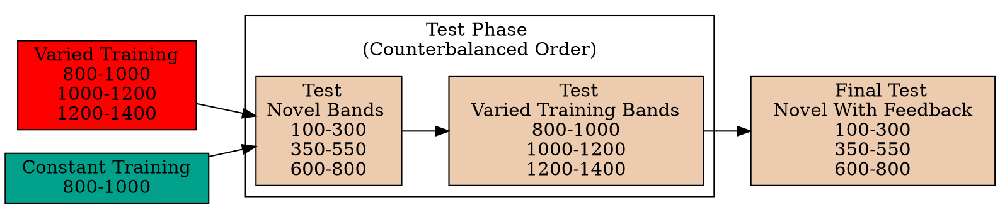
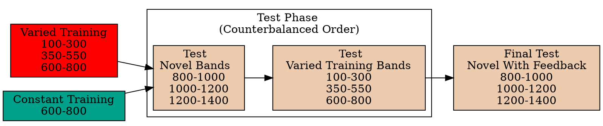

<link href="manuscript_files/libs/tabwid-1.1.3/tabwid.css" rel="stylesheet" />
<script src="manuscript_files/libs/tabwid-1.1.3/tabwid.js"></script>




# Abstract

This dissertation seeks to explore the cognitive underpinnings that govern the generalization of learning, focusing specifically on the role of variability during training in shaping subsequent transfer performance. A comprehensive review of the existing literature is presented, emphasizing the methodological complications associated with disentangling the confounding effects of similarity. Through a series of experiments involving several novel visuomotor tasks, this work investigates whether and how variability in training conditions affects performance in novel tasks. To theoretically account for the empirical outcomes, I employ both instance-based and connectionist computational models, both of which incorporate similarity-based mechanisms. These models serve to account for the extent to which variability influences the learners' generalization gradient, and also explain how training variation can produce both beneficial and deleterious outcomes.





# Literature Review

# Variability and Generalization

The factors that influence the generalization of learning are of considerable interest to both researchers exploring the human learning system and practitioners aiming to enhance the effectiveness of educational and training interventions. The present effort will focus specifically on the role of variability in the learning input. Variability manipulations typically regulate either the number of distinct instances presented to learners during training, or the dispersion of these instances. Such manipulations have been empirically demonstrated to affect subsequent generalization performance. This essay will offer an in-depth review of the extant literature on the influence of variability, spanning multiple relevant domains.

## The study of variability

Studies investigating the "benefits of variability" hypothesis usually assign participants to either a constant or varied group for the training stage of the experiment. Then, subjects in both groups complete an identical testing stage which often consists items/conditions seen during training, and novel items/conditions. If the varied group performs better in the testing stage, this is taken for evidence of the benefits of variability hypothesis. Even within this relatively straightforward between-groups design, researchers must navigate several crucial methodological choices, highlighted below:

1.  Variables Subject to Variation. In multidimensional tasks, researchers have the option to vary numerous variables. The experimenters must decide the specific dimension(s) across which variation will occur. For instance, in a projectile throwing accuracy task -- researchers might vary the distance from the target, the size of the target, the weight of the projectile. They might also vary a contextual variable not directly relevant to the task, but which will still be encoded by the subject on a trial by trial basis, e.g. the background color.

2.  Magnitude of Variation, relative to the control condition. The simplest comparison would be to compare a constant group who trains with 1 example/condition, against a varied group that trains from 2 examples/conditions. However, it is not uncommon in the literature for the varied condition to train from 3 or 4 conditions. For example, Catalano & Kleiner (1984) train varied subjects from 4 different velocities in their coincident timing task, and (Goode et al., 2008) have varied subjects' practice with 3 different variants (i.e. different letter scrambles of the same word) of an anagram for a given word, while their constant participants view the same variant 3 different times. Alternatively, rather than a constant vs. varied comparison, subjects in all conditions might experience a variety of training items, but with one group experiencing a greater number of unique items (Nosofsky, Sanders, Zhu, et al., 2018).

3.  Locations within Task-Space. For tasks in which the stimuli or conditions fall within a continuous metric space, the experimenter must decide whether the varied instances are relatively close together (e.g. throwing a ball from a distance of 4 feet and 5 feet), or far apart (throwing from 4 feet and 20 feet). Spreading the varied training items further apart may be beneficial in terms of providing a more representative sample of the task space to the learner, however large distances may also result in significant differences in difficulty between the training examples, which can be a common confound in variability studies.

4.  Proximity of Testing to Training Conditions. Intuitively, the fairest form of comparison is to include testing conditions that are of an equivalent distance from both the varied and constant groups. However researchers might also attempt to demonstrate the benefits of variation as being sufficiently powerful to outperform constant training, even in cases where the constant group trained from a closer proximity to the testing conditions, or whose training conditions are identical to the testing conditions (Goode et al., 2008; Kerr & Booth, 1978).

## Variability Literature Review

An early and influential work on the influence of variability on category learning is that of Posner & Keele (1968). In an ambitious attempt to address the question of how category information is represented, the authors trained participants to categorize artificial dot patterns, manipulating whether learners were exposed to examples clustered close to the category prototypes (e.g. a low variability condition), or spread further away from the prototype (the varied-training group). It should be noted that both groups in this study were trained with the same number of unique instances and the manipulated difference was how spread out the instances were. The authors claim based on prior experiments using the same stimuli, that the training stimuli for the varied group were at least as far away from the testing stimuli as the training stimuli of the less-varied group. The authors interpreted their findings as evidence for the extraction of an abstraction or schema that is extracted and stored, and then over time becomes more likely to be the reference point from which generalization occurs, given that specific instances are thought to decay at a faster rate than prototypes or schema. The Posner and Keele study has been extremely influential and continues to be cited in contemporary research as clear evidence that schema abstraction underlies the benefits of varied training. It's also referenced as a key influence in the development of "Schema Theory of Motor Learning" (Schmidt, 1975), which in turn influenced decades of investigations on the potential benefits of varied training in motor skill learning. However, the classic Posner & Keele study despite being far more carefully designed than many subsequent studies, and despite being a relative rarity in explicitly discussing and attempting to control for potential confounds of similarity between groups, may nevertheless be emblematic of a common issue in many investigations of the effects of varied training on learning. The problem with Posner & Keele's conclusion was demonstrated clearly almost 3 decades later (Palmeri & Nosofsky, 2001), when researchers conducting a near replication of the original study also collected similarity judgements following training and performed multidimensional scaling analysis. Rather than being in the middle of the training stimuli as was the case in the physical stimuli space, the psychological representation of the prototype was shown reside at an extreme point, and generalization patterns by participants that would have seemed to warrant the learning of a prototype were then easily accounted for with only the assumption that the participants encoded instances. One of the primary concerns of the present paper is that many of the studies which purport to explain the benefits of variation via prototypes, schemas, or other abstractions, are often overlooking the potential of instance based similarity accounts.

## Motor skill learning

Training variation has also been shown to promote transfer in motor learning. Much of this research has been influenced by the work of (Schmidt, 1975), who proposed a schema-based account of motor learning as an attempt to address the longstanding problem of how novel movements are produced. Schema theory presumes a priori that learners possess general motor programs for classes of movements, such as an underhand throw. When called up for use, such programs must be parameterized, as well as schema rules that determine how a motor program is parameterized or scaled for a particular movement. Schema theory predicts that varied training results in the formation of a more general schema-rule, which can allow for transfer to novel movements within a given movement class, such as an underhand throw (though it is agnostic to the development of the movement classes themselves). Experiments that test this hypothesis are often designed to compare the transfer performance of a constant-trained group against that of a varied-trained group. Both groups train on the same task, but the varied group practices with multiple instances along some task-relevant dimension that remains invariant for the constant group. For example, investigators might train two groups of participants to throw a projectile at a target, with a constant group that throws from a single location, and a varied group that throws from multiple locations. Both groups are then tested from novel locations.

One of the earliest, and still often cited investigations of Schmidt's benefits of variability hypothesis was the work of Kerr & Booth (1978). Two groups of children, aged 8 and 12, were assigned to either constant or varied training of a bean bag throwing task. The constant group practiced throwing a bean-bag at a small target placed 3 feet in front of them, and the varied group practiced throwing from a distance of both 2 feet and 4 feet. Participants were blindfolded and unable to see the target while making each throw but would receive feedback by looking at where the beanbag had landed in between each training trial. 12 weeks later, all of the children were given a final test from a distance of 3 feet which was novel for the varied participants and repeated for the constant participants. Participants were also blindfolded for testing and did not receive trial by trial feedback in this stage. However, at the halfway point of the testing stage they were allowed to see the landing location of the 4 beanbags they had thrown, and then completed the final 4 testing throws. In both age groups, participants performed significantly better in the varied condition than the constant condition, though the effect was larger for the younger, 8-year-old children. Although this design does not directly assess the hypothesis of varied training producing superior generalization to constant training (since the constant group is not tested from a novel position), it nevertheless offers a compelling example of the merits of varied practice.

On occasion the Kerr and Booth design may be nested within a larger experimental design. One such study that used a movement timing task, wherein subjects had to move their hand from a starting location, to a target location, attempting to arrive at the target location at specific time following the onset of a cue (Wrisberg et al., 1987). This study utilized 4 different constant groups, and 3 varied groups, with one of the constant groups training under conditions identical to the testing conditions, and which were not trained on by any of the varied groups, e.g. the design of Kerr and Booth. However, in this case the varied group did not outperform the constant group. A more recent study attempting a slightly more direct replication of the original Kerr & Booth study (Willey & Liu, 2018b), having subjects throw beanbags at a target, with the varied group training from positions (5 and 9 feet) on either side of the constant group (7 feet). However, this study diverged from the original in that the participants were adults; they faced away from the target and threw the beanbag backwards over their bodies; they alternated using their right and left hands every 6 trials; and underwent a relatively extreme amount of training (20 sessions with 60 practice trials each, spread out over 5-7 weeks). Like Wrisberg et al. (1987), this study did not find a varied advantage from the constant training position, though the varied group did perform better at distances novel to both groups.

Some support for the Kerr and Booth findings was found with a relatively less common experimental task of training participants in hitting a projectile at a target with the use of a racket (Green et al., 1995). Varied participants trained with tennis, squash, badminton, and short-tennis rackets were compared against constant subjects trained with only a tennis racket. One of the testing conditions had subjects repeat the use of the tennis racket, which had been used on all 128 training trials for the constant group, and only 32 training trials for the varied group. Nevertheless, the varied group outperformed the constant group when using the tennis racket at testing, and also performed better in conditions with several novel racket lengths. Of course, this finding is less surprising than that of Kerr & Booth, given that varied subjects did have some prior exposure to the constant groups condition. This highlights an issue rarely discussed in the literature, of how much practice from an additional position might be necessary to induce benefits. Experimenters almost uniformly have varied participants train with an equivalent number of trials from each of their conditions

One of the few studies that has replicated the surprising result of varied outperforming constant, from the constant training condition, did so in the relatively distant domain of verbal manipulation (Goode et al., 2008). All participants trained to solve anagrams of 40 different words ranging in length from 5 to 11 letters, with an anagram of each word repeated 3 times throughout training, for a total of 120 training trials. Although subjects in all conditions were exposed to the same 40 unique words (i.e. the solution to an anagram), participants in the varied group saw 3 different arrangements for each solution-word, such as DOLOF, FOLOD, and OOFLD for the solution word FLOOD, whereas constant subjects would train on three repetitions of LDOOF (spread evenly across training). Two different constant groups were used. Both constant groups trained with three repetitions of the same word scramble, but for constant group A, the testing phase consisted of the identical letter arrangement to that seen during training (e.g. LDOOF), whereas for constant group B, the testing phase consisted of a arrangement they had not seen during training, thus presenting them with a testing situation similar situation to the varied group. At the testing stage, the varied group outperformed both constant groups, a particularly impressive result, given that constant group A had 3 prior exposures to the word arrangement (i.e. the particular permutation of letters) which the varied group had not explicitly seen. However varied subjects in this study did not exhibit the typical decrement in the training phase typical of other varied manipulations in the literature, and actually achieved higher levels of anagram solving accuracy by the end of training than either of the constant groups -- solving 2 more anagrams on average than the constant group. This might suggest that for tasks of this nature where the learner can simply get stuck with a particular word scramble, repeated exposure to the identical scramble might be less helpful towards finding the solution than being given a different arrangement of the same letters. This contention is supported by the fact that constant group A, who was tested on the identical arrangement as they experienced during training, performed no better at testing than did constant group B, who had trained on a different arrangement of the same word solution -- further suggesting that there may not have been a strong identity advantage in this task.

Pitting varied against constant practice against each other on the home turf of the constant group provides a compelling argument for the benefits of varied training, as well as an interesting challenge for theoretical accounts that posit generalization to occur as some function of distance. However, despite its appeal this particular contrast is relatively uncommon in the literature. It is unclear whether this may be cause for concern over publication bias, or just researchers feeling the design is too risky. A far more common design is to have separate constant groups that each train exclusively from each of the conditions that the varied group encounters (Catalano & Kleiner, 1984; Chua et al., 2019; McCracken & Stelmach, 1977; Moxley, 1979; Newell & Shapiro, 1976), or for a single constant group to train from just one of the conditions experienced by the varied participants (Pigott & Shapiro, 1984; Roller et al., 2001; Wrisberg & McLean, 1984; Wrisberg & Mead, 1983). A less common contrast places the constant group training in a region of the task space outside of the range of examples experienced by the varied group, but distinct from the transfer condition (Wrisberg et al., 1987; Wulf & Schmidt, 1997).

Of particular relevant to the current essay is the early work of Catalano & Kleiner (1984), as theirs was one of the earliest studies to investigate the influence of varied vs. constant training on multiple testing locations of graded distance from the training condition. Participants were trained on coincident timing task, in which subjects observe a series of lightbulbs turning on sequentially at a consistent rate and attempt to time a button response with the onset of the final bulb. The constant groups trained with a single velocity of either 5,7,9, or 11 mph, while the varied group trained from all 4 of these velocities. Participants were then assigned to one of four possible generalization conditions, all of which fell outside of the range of the varied training conditions -- 1, 3, 13 or 15 mph. As is often the case, the varied group performed worse during the training phase. In the testing phase, the general pattern was for all participants to perform worse as the testing conditions became further away from the training conditions, but since the drop off in performance as a function of distance was far less steep for the varied group, the authors suggested that varied training induced a decremented generalization gradient, such that the varied participants were less affected by the change between training and testing conditions.

## Category learning

In the category learning literature, the constant vs. varied comparison is much less suitable. Instead, researchers tend to compare a condition with many repetitions of a few items against condition with fewer repetitions of a wider array of exemplars. Much of the earlier work in this sub-area trained subjects on artificial categories, such as dot patterns (Homa & Vosburgh, 1976; Posner & Keele, 1968), where more varied or distorted training examples were often shown to produce superior generalization when categorizing novel exemplars. More recently, researchers have also begun to utilize more realistic stimuli in their experiments. Wahlheim et al. (2012) conducted one such study. In a within-participants design, participants were trained on bird categories with either high repetitions of a few exemplars, or few repetitions of many exemplars. Across four different experiments, which were conducted to address an unrelated question on metacognitive judgements, the researchers consistently found that participants generalized better to novel species following training with more unique exemplars (i.e. higher variability), while high repetition training produced significantly better performance categorizing the specific species they had trained on. A variability advantage was also found in the relatively complex domain of rock categorization (Nosofsky, Sanders, & McDaniel, 2018). For 10 different rock categories, participants were trained with either many repetitions of 3 unique examples of each category, or few repetitions of 9 unique examples, with an equal number of total training trials in each group (the design also included 2 other conditions less amenable to considering the impact of variation). The high-variability group, trained with 9 unique examples, showed significantly better generalization performance than the other conditions. Moreover, the pattern of results in this study could be nicely accounted for by an extended version of the Generalized Context Model.

The studies described thus far have studied the benefits of variability by exposing participants to a greater or lesser number of distinct examples during training. A distinct sub-literature within the category learning domain has focused much less on benefits derived from varied training, instead emphasizing how increased variability during the learning of a novel category influences how far the category boundary will then be generalized. The general approach is to train participants on examples from two categories, with the examples from one of the categories being more dispersed than the other. Participants are then tested with novel items located within ambiguous regions of the task space which allow the experimenters to assess whether the difference in variability influences how far participants generalize the category boundaries.

A. L. Cohen et al. (2001) trained subjects on two categories, one with much more variability than the other. In experiment 1, a low variability category composed of 1 instance was compared against a high-variability category of 2 instances in one condition, and 7 instances in another. In experiment 2 both categories were composed of 3 instances, but for the low-variability group the instances were clustered close to each other, whereas the high-variability groups instances were spread much further apart. Participants were tested on an ambiguous novel instance that was located in between the two trained categories. Both experiments provided evidence that participants were much more likely to categorize the novel middle stimulus into a category with greater variation. Moreover, this effect was at odds with the predications of the baseline version of the GCM, thus providing some evidence that training variation may at least sometimes induce effects that cannot be entirely accounted for by exemplar-similarity accounts.

Further observations consonant with the results of A. L. Cohen et al. (2001) have since been observed in numerous investigations (Hahn et al., 2005; Hsu & Griffiths, 2010; Perlman et al., 2012; Sakamoto et al., 2008). The results of Sakamoto et al. (2008) are noteworthy. They first reproduced the basic finding of participants being more likely to categorize an unknown middle stimulus into a training category with higher variability. In a second experiment, they held the variability between the two training categories constant and instead manipulated the training sequence, such that the examples of one category appeared in an ordered fashion, with very small changes from one example to the other (the stimuli were lines that varied only in length), whereas examples in the alternate category were shown in a random order and thus included larger jumps in the stimulus space from trial to trial. They found that the middle stimulus was more likely to be categorized into the category that had been learned with a random sequence, which was attributed to an increased perception of variability which resulted from the larger trial to trial discrepancies.

The work of Hahn et al. (2005), is also of particular interest to the present discussion. Their experimental design was similar to previous studies, but they included a larger set of testing items which were used to assess generalization both between the two training categories as well as novel items located in the outer edges of the training categories. During generalization testing, participants were given the option to respond with "neither", in addition to responses to the two training categories. The "neither" response was included to test how far away in the stimulus space participants would continue to categorize novel items as belonging to a trained category. Consistent with prior findings, high-variability training resulted in an increased probability of categorizing items in between the training categories as belong to the high variability category. Additionally, participants trained with higher variability also extended the category boundary further out into the periphery than participants trained with a lower variability category were willing to do. The authors then used the standard GCM framework to compare a variety of similarity-based models to account for their results. Of particular interest are their evaluations of a category response bias parameter, and a similarity scaling parameter. A model fit improvement when the response bias parameter is allowed to vary between the high-variability and low-variability trained groups is taken to suggest a simple bias for responding with one of the trained categories over the other. Alternatively, an improvement in fit due to a separate similarity scaling parameter may reflect the groups being differentially sensitive to the distances between stimuli. No improvement in model fit was found by allowing the response-bias parameter to differ between groups, however the model performance did improvement significantly when the similarity scaling parameter was fit separately. The best fitting similarity-scaling parameters were such that the high-variability group was less sensitive to the distances between stimuli, resulting in greater similarity values between their training items and testing items. This model accounted for both the extended generalization gradients of the varied particpants, and also for their poor performance in a recognition condition. Additional model comparisons suggested that this similarity rescaling applied across the entire stimulus space, rather than to the high variability category in particular.

Variability effects have also been examined in the higher-level domain of how learners acquire novel concepts, and then instantiate (rather than merely recognize) that concept in untrained contexts (Braithwaite & Goldstone, 2015). This study trained participants on problems involving the concept of sampling with replacement (SWR). Training consisted of examples that were either highly similar in their semantic context (e.g. all involving people selecting objects) or in which the surface features were varied between examples (e.g. people choosing objects AND objects selected in a sequence). The experimenters also surveyed how much prior knowledge each participant had with SWR. They found that whether variation was beneficial depended on the prior knowledge of the participants -- such that participants with some prior knowledge benefited from varied training, whereas participants with minimal prior knowledge performed better after training with similar examples. The authors hypothesized that in order to benefit from varied examples, participants must be able to detect the structure common to the diverse examples, and that participants with prior knowledge are more likely to be sensitive to such structure, and thus to benefit from varied training. To test this hypothesis more directly, the authors conducted a 2nd experiment, wherein they controlled prior knowledge by exposing some subjects to a short graphical or verbal pre-training lesson, designed to increase sensitivity to the training examples. Consistent with their hypothesis, participants exposed to the structural sensitivity pre-training benefited more from varied training than the controls participants who benefited more from training with similar examples.

Variability has also been examined within the realm of language learning. A particularly impressive study is that of (Perry et al., 2010). In nine training sessions spread out over nine weeks infants were trained on object labels in a naturalistic play setting. All infants were introduced to three novel objects of the same category, with participants in the tight condition being exposed to three similar exemplars of the category, and participants in the varied condition being exposed to three dissimilar objects of the same category. Importantly, the similarity of the objects was carefully controlled for by having a separate group of adult subjects provide pairwise similarity judgements of the category objects prior to the study onset. Multidimensional scaling was then performed to obtain the coordinates of the objects psychological space, and out of the 10 objects for each category, the 3 most similar objects were selected for the tight group and the three least similar objects for the varied group, with the leftover four objects being retained for testing. By the end of the nine weeks, all of the infants had learned the labels of the training objects. The varied group demonstrated superior ability to correctly generalize the object labels to untrained exemplars of the same category, a pattern consistent with much of the existing literature. More interesting was the superior performance of the varied group on a higher order generalization task -- such that they were able to appropriately generalize the bias they had learned during training for attending to the shape of objects to novel solid objects, but not to non-solids. The tight training group, on the other hand, tended to overgeneralize the shape bias, leading the researchers to suggest that the varied training induced a more context-sensitive understanding of when to apply their knowledge.

## Complications to the influence of variability

### Sequence Effects

A necessary consequence of varied training is that participants will have the experience of switching from one task condition to another. The number of switches can vary greatly, with the two extremes being varied participants completing all of their training trials in one before switching to the next condition (blocked sequencing), or if they alternate between conditions on a trial by trial basis (random/intermixed/interleaved sequencing). Not long after the initial influx of schema-theory inspired studies testing the benefits of variability hypothesis was shown that the influence of varied training might interact with the type of training sequence chosen by the experimenter (J. B. Shea & Morgan, 1979). In this seminal study, both groups of training subjects trained with the same number of trials of three separate movement patterns. A blocked group that completed all of their trials with one sequence before beginning the next sequence, and a random group that trained with all three movement patterns interspersed throughout the course of training. Participants were also randomly assigned to retention testing under either blocked or random sequence conditions, thus resulting in all four training-testing combinations of blocked-blocked; blocked-random; random-blocked; random-random. There was some effect of sequence context, such that both groups performed better when the testing sequence matched their training sequence. However, the main finding of interest was the advantage of random-training, which resulted in superior testing performance than blocked training regardless of whether the testing stage had a blocked or random sequence, an effect observed both immediately after training, and in a follow up test ten days after the end of training.

Prior to the influential J. B. Shea & Morgan (1979) study, studies investigating the benefits of variability hypothesis had utilized both blocked and random training schedules, often without comment or justification. It was later observed (Lee et al., 1985) that positive evidence for benefits of varied training seemed more likely to occur for studies that utilized random schedules. The theoretical basis of such studies was invariably an appeal to Schmidt's schema theory; however schema theory made no clear predictions of an effect of study sequence on retention or generalization, thus prompting the need for alternate accounts. One such account, the elaborative processing account (J. B. Shea & Zimny, 1983), draws on the earlier work (Battig, 1966) and argues that randomly sequencing conditions during training promotes comparison and contrastive processes between those conditions, which result in a deeper understanding of the training task than could arise via blocked sequencing. Supporting evidence for elaborative processing comes in the form of random-sequence trained subjects self-reporting more nuanced mental representations of movement patterns following training (J. B. Shea & Zimny, 1983), and by manipulating whether subjects are able to perform comparisons during training (Wright et al., 1992). An alternative, though not incompatible account suggests that the benefits of random-sequencing are a result of such sequences forcing the learner to continually reconstruct the relevant motor task in working memory (Lee & Magill, n.d.). Blocked training, on the other hand, allows the learner to maintain the same motor task in short term memory without decay for much of the training which facilitates training performance, but hinders ability to retrieve the appropriate motor memory in a later testing context. A much more recent study (Chua et al., 2019), replicates the standard findings of an advantage of varied training over constant training (expt 1, bean-bag throwing task), and of random training over blocked training (expt 2 & 3, bean-bag throwing & golf putting). The novelty of this study is that the experimenters queried subjects about their attentional focus throughout the training stage. In all three experiments varied or random trained-subjects reported significantly greater external attention (e.g. attending to the target distance), and constant or blocked subjects reported more internal attention (e.g. posture or hand position). The authors argue that the benefits of varied/random training may be mediated by changes in attentional focus, however the claims made in the paper seem to go far beyond what can be justified by the analyses reported -- e.g. the increased external focus could be a simple byproduct of varied training. A stronger form of evidence that was not provided may have been to use multiple regression analyses to show that the testing advantage of the varied/random groups over the constant/blocked groups could be accounted for by the differences in self-reported attentional focus.

## Other task and participant effects

Of course, the effects of varied training, and different training sequences, are likely to be far more complex than simply more varied training being better than less, or random training being better than blocked. Null effects of both manipulations have been reported (see Magill & Hall, 1990; Van Rossum, 1990 for reviews), and a variety of moderators have emerged. In one of the earlier examples of the complex relationship between study sequence and learning (Del Rey et al., 1982), experimenters recruited participants who self-reported either large amounts, or very little experience with athletic actives, and then trained participants on a coincident timing task under with either a single constant training velocity, or with four training velocities under either blocked, or random training sequence conditions - resulting in six experimental conditions: (athlete vs. non-athlete) x (constant vs. blocked vs. random training). Athlete participants had superior performance during training, regardless of sequence condition, and training performance was superior for all subjects in the constant group, followed by blocked training in the middle, and then random training resulting in the worst training performance. Of greater interest is the pattern of testing results for novel transfer conditions. Among the athlete-participants, transfer performance was best for those who received random training, followed by blocked, and then constant training. Non-athletes showed the opposite pattern, with superior performance for those who had constant training. A similar pattern was later observed in a golf-putting training study, wherein participants who had some prior golf experience benefited most from random-sequenced training, and participants with no golf experience benefited most from blocked training (Guadagnoli et al., 1999). More recently, the same pattern was observed in the concept learning literature (Braithwaite & Goldstone, 2015 expt 1.). This study trained participants on a mathematical concept and found that participants who self-reported some prior experience with the concept improved more from pre-test to post-test after training with varied examples, while participants who reported no prior experience showed greater gains following training with highly similar examples.

In addition to the influence of prior experiences described above, ample evidence also suggests that numerous aspects of the experiment may also interact with the influence of variation. One important study examined the impact of the amount of training completed in a force production task (C. H. Shea et al., 1990). This study employed a typical blocked vs. random training procedure, but with the additional manipulation of separate groups receiving 50, 200, or 400 total training trials. For the group that received only 50 training trials retention was best when training had been blocked. However, for the conditions that received 200 or 400 training trials the pattern was reversed, with random training resulting in superior retention than blocked training. These results were taken to suggest that the benefits of randomization may take time to emerge. Another experimental factor shown to interact with training sequence is the complexity of the training task (Albaret & Thon, 1998). In addition to random or blocked training, participants in this study were assigned to train on a drawing task at one of three different levels of complexity (reproducing from memory shapes composed of two, three or four components). On a transfer task 48 hours after the completion of training, only participants trained at the lower levels of task complexity (2 or 3 components) showed superior performance to the blocked condition. The authors suggest that the benefits of random sequencing, thought to arise from more elaborate cognitive processing, or the necessity of continually recalling task information from long term into short term memory, are more likely to be obscured as the complexity of the task forces the blocked participants to also engage in such processes.

A final important influence of particular relevance to the practice-sequence literature concerns the exact structure of "random" sequencing. Although the term random is commonly used for convenience, experimenters do not typically leave the order of training entirely up to chance. Rather, the training sequence is often constrained such that each condition must occur a minimum number of times in each quartile of the training phase, thus resulting in an even distribution the conditions throughout training. While the assurance of the conditions being evenly spread throughout training is consistent across studies, other aspects of the sequence structure are a bit more idiosyncratic. Some researchers report setting a maximum number of consecutive repetitions, e.g. no more than 2 consecutive trials of the same condition (Del Rey et al., 1982; J. B. Shea & Morgan, 1979), or structure the random trials such that the same condition never occurs consecutively (Wulf, 1991). Also common is to structure experiments such that random condition really consists of many small blocks, where participants do a few trials of one condition consecutively and then switch to another condition (Chua et al., 2019; Willey & Liu, 2018b; Wrisberg et al., 1987), resulting in many more switches than would arise if training was perfectly blocked. The question of whether such differences in the structure of random sequencing are consequential has been addressed experimentally a few times, in all cases consisting of a 1) a no-repeat random condition; 2) a blocked random condition (typically 3 or 4 repeats before a switch); and 3) a standard fully-blocked condition. Blocked-random training resulted in better performance than either repeat-random, or fully - blocked training in both a bean-bag throwing (Pigott & Shapiro, 1984), and basketball shot training study (Landin & Hebert, 1997), and in a replication plus extension of the seminal (J. B. Shea & Morgan, 1979) study, blocked-random training was equally effective as no-repeat random training, with both random structures leading to better performance than the fully-blocked training condition. Consequences on different study schedules have also been repeatedly observed in the category learning literature (Carvalho & Goldstone, 2014, 2017). This line of research has revealed that the effects of blocking vs. interleaving can depend on the structure of the category being learned, and also that the different schedules can result in the participants requiring different representations. A fruitful line of inquiry in the motor skill learning literature may be to attempt to identify whether structural aspects of the motor task interact with different training sequences in a reliable manner.

Numerous researchers have attempted to provide coherent frameworks to account for the full range of influences of training variation and sequencing described above (along with many other effects not discussed). Such accounts are generally quite similar, invoking ideas of desirable levels of difficulty (Bjork & Bjork, 1992; Schmidt & Bjork, 1992), or optimal challenge points (Guadagnoli & Lee, 2004). They tend to start by describing the dissociation between acquisition performance (performance during training) and testing performance (delayed retention and/or transfer), most strikingly observed as varied/random training participants performing worse than their constant/blocked counterparts during the training stage of the study, but then outperforming the constant/blocked comparisons at a later retention or transfer stage. This observation is then used to justify the idea that the most enduring and generalizable learning occurs by training at an optimal level of training difficulty, with difficulty being some function of the experience of the learner, and the cognitive or visuomotor processing demands of the task. It then follows that the factors that tend to make training more difficult (i.e. increased variability or randomization), are more likely to be beneficial when the learner has some experience, or when the processing demands of the task are not too extreme (which may only occur after some experience with the task). Such frameworks may be helpful heuristics in some cases, but they also seem to be overly flexible such that any null result of some intervention might be accounted for by a suboptimal amount of training trials, or by suggesting the training task was too difficult. The development of computational models that can account for how changes in the parameters of the motor-skill task scale with difficulty, would be a great step forward.

``` r
#| 
here::set_here(path='..')
source(here::here("Functions", "packages.R"))

if (is.null(knitr::pandoc_to())) {
  fmt_out <- "interactive"
} else {
  fmt_out <- knitr::pandoc_to()
}

# knitr::opts_chunk$set(echo = FALSE, include =TRUE, 
#                       warning = FALSE, message = FALSE, eval=TRUE)

# knitr::opts_chunk$set(fig.align = "center", fig.retina = 3,
#                       fig.width = 6, fig.height = (6 * 0.618),
#                       out.width = "100%", collapse = TRUE)
# 
options(digits = 3, width = 120,
        dplyr.summarise.inform = FALSE,
        knitr.kable.NA = "")
```

``` r
source(here::here('Functions/IGAS_ProcessFunctions.R'))

e1 <- readRDS(here::here("data/igas_e1_cleanedData-final.rds")) %>% mutate(initialVelocityX=X_Velocity,initialVelocityY=Y_Velocity,stageInt=as.numeric(as.character(experimentStage)))

# load the processed data from experiment 1 and 2

e2<- readRDS(here::here('data/igas_e2_cleanedData-final.rds')) %>% mutate(initialVelocityX=X_Velocity,initialVelocityY=Y_Velocity)

# load subject similarity data - computed with the IGAS model in 'IGAS-SimModel.R'
e2_sim <- readRDS(here::here('data/IGAS_Similarity-Performance.rds'))

options(contrasts = c("contr.sum", "contr.poly"))
defaultContrasts = options()$contrasts

dodge <- position_dodge(width = 0.9)
e2GrpPos <- c("400","500","625","675","800","900")
e2Grp <- paste("Constant","Constant", "Constant","Constant","Constant","Constant", "Varied")
e2Labels <- paste(c("400\n Constant","500\n Constant","625\n Constant","675\n Constant",
                   "800\n Constant","900\n Constant","500-800\n Varied"),sep="")

e1Pos <- c("610","760","835","910")
e1Var <- paste("Varied Train Position","Constant Train Position", "Novel Position", "Varied Training Position")
e1Labels<- paste(c("610\n Varied Trained","760\n Constant Trained","835\n Novel Location","910\n Varied Trained"),sep="")
```

# Project 1

## Abstract

Exposing learners to variability during training has been demonstrated
to improve performance in subsequent transfer testing. Such variability
benefits are often accounted for by assuming that learners are
developing some general task schema or structure. However much of this
research has neglected to account for differences in similarity between
varied and constant training conditions. In a between-groups
manipulation, we trained participants on a simple projectile launching
task, with either varied or constant conditions. We replicate previous
findings showing a transfer advantage of varied over constant training.
Furthermore, we show that a standard similarity model is insufficient to
account for the benefits of variation, but, if the model is adjusted to
assume that varied learners are tuned towards a broader generalization
gradient, then a similarity-based model is sufficient to explain the
observed benefits of variation. Our results therefore suggest that some
variability benefits can be accommodated within instance-based models
without positing the learning of some schemata or structure.

## Introduction

The past century of research on human learning has produced ample
evidence that although learners can improve at almost any task, such
improvements are often specific to the trained task, with unreliable or
even nonexistent transfer to novel tasks or conditions
(Barnett & Ceci, 2002; Detterman, 1993). Such
transfer challenges are of noteworthy practical relevance, given that
educators, trainers, and rehabilitators typically intend for their
students to be able to apply what they have learned to new situations.
It is therefore important to better understand the factors that
influence transfer, and to develop cognitive models that can predict
when transfer is likely to occur. The factor of interest to the present
investigation is variation during training. Our experiments add to the
longstanding empirical investigation of the controversial relationship
between training variation, and subsequent transfer. We also offer a
novel explanation for such results in the form of an instance-based
model that accounts for the benefits of variation in simple terms of
psychological similarity. We first review the relevant concepts and
literature.

### Similarity and instance-based approaches to transfer of learning

Notions of similarity have long played a central role in many prominent
models of generalization of learning, as well as in the longstanding
theoretical issue of whether learners abstract an aggregate, summary
representation, or if they simply store individual instances. Early
models of learning often assumed that discrete experiences with some
task or category were not stored individually in memory, but instead
promoted the formation of a summary representation, often referred to as
a prototype or schema, and that exposure to novel examples would then
prompt the retrieval of whichever preexisting prototype was most similar
(Posner & Keele, 1968). Prototype
models were later challenged by the success of instance-based or
exemplar models -- which were shown to provide an account of
generalization as good or better than prototype models, with the
advantage of not assuming the explicit construction of an internal
prototype (Estes, 1994; Hintzman, 1984; Medin & Schaffer, 1978; Nosofsky, 1986 ).
Instance-based models assume that learners encode each experience with a
task as a separate instance/exemplar/trace, and that each encoded trace
is in turn compared against novel stimuli. As the number of stored
instances increases, so does the likelihood that some previously stored
instance will be retrieved to aid in the performance of a novel task.
Stored instances are retrieved in the context of novel stimuli or tasks
if they are sufficiently similar, thus suggesting that the process of
computing similarity is of central importance to generalization.

Similarity, defined in this literature as a function of psychological
distance between instances or categories, has provided a successful
account of generalization across numerous tasks and domains. In an
influential study demonstrating an ordinal similarity effect,
experimenters employed a numerosity judgment task in which participants
quickly report the number of dots flashed on a screen. Performance (in
terms of response times to new patterns) on novel dot configurations
varied as an inverse function of their similarity to previously trained
dot configurations Palmeri (1997). That is, performance was better on
novel configurations moderately similar to trained configurations than
to configurations with low-similarity, and also better on low-similarity
configurations than to even less similar, unrelated configurations.
Instance-based approaches have had some success accounting for
performance in certain sub-domains of motor learning (R. G. Cohen & Rosenbaum, 2004; Crump & Logan, 2010, 2010; Meigh et al., 2018; Poldrack et al., 1999; Wifall et al., 2017) trained participants to type words on an unfamiliar keyboard, while constraining the letters composing the training words to a pre-specified letter set. Following
training, typing speed was tested on previously experienced words
composed of previously experienced letters; novel words composed of
letters from the trained letter set; and novel words composed of letters
from an untrained letter set. Consistent with an instance-based account,
transfer performance was graded such that participants were fastest at
typing the words they had previously trained on, followed by novel words
composed of letters they had trained on, and slowest performance for new
words composed of untrained letters.

## The effect of training variability on transfer

While similarity-based models account for transfer by the degree of
similarity between previous and new experiences, a largely separate body
of research has focused on improving transfer by manipulating
characteristics of the initial training stage. Such characteristics have
included training difficulty, spacing, temporal order, feedback
schedules, and the primary focus of the current work -- variability of
training examples.

Research on the effects of varied training typically compares
participants trained under constant, or minimal variability conditions
to those trained from a variety of examples or conditions (Czyż, 2021; Soderstrom & Bjork, 2015). Varied training has been shown to influence
learning in myriad domains including categorization of simple stimuli (Hahn et al., 2005; Maddox & Filoteo, 2011; Posner & Keele, 1968),
complex categorization (Nosofsky, Sanders, Zhu, et al., 2018), language learning (Jones & Brandt, 2020; Perry et al., 2010; Twomey et al., 2018; Wonnacott et al., 2012), anagram completion (Goode et al., 2008), trajectory
extrapolation (Fulvio et al., 2014), task switching (Sabah et al., 2019), associative learning (J. C. Lee et al., 2019), visual search (George & Egner, 2021; Gonzalez & Madhavan, 2011; Kelley & Yantis, 2009), voice
identity learning (Lavan et al., 2019), simple motor learning (Braun et al., 2009; Kerr & Booth, 1978; Roller et al., 2001; Willey & Liu, 2018a),
sports training North et al. (2019), and training
on a complex video game (Seow et al., 2019).

Training variation has received a particularly large amount of attention
within the domain of visuomotor skill learning. Much of this research
has been influenced by the work of Schmidt (1975), who proposed a
schema-based account of motor learning as an attempt to address the
longstanding problem of how novel movements are produced. According to
Schema Theory, learners possess general motor programs for classes of
movements (e.g. throwing a ball with an underhand movement), as well as
schema rules that determine how a motor program is parameterized or
scaled for a particular movement. Schema theory predicts that varied
training results in the formation of a more general schema-rule, which
can allow for transfer to novel movements within a given movement class.
Experiments that test this hypothesis are often designed to compare the
transfer performance of a constant-trained group against that of a
varied-trained group. Both groups train on the same task, but the varied
group practices from multiple levels of a task-relevant dimension that
remains invariant for the constant group. For example, investigators
might train two groups of participants to throw a projectile at a
target, with a constant group that throws from a single location, and a
varied group that throws from multiple locations. Both groups are then
tested from novel locations. Empirically observed benefits of the
varied-trained group are then attributed to the variation they received
during training, a finding observed in numerous studies (Catalano & Kleiner, 1984; Chua et al., 2019; Goodwin et al., 1998; Kerr & Booth, 1978; Wulf, 1991), and the benefits of this variation are typically
thought to be mediated by the development of a more general schema for
the throwing motion.

Of course, the relationship between training variability and transfer is
unlikely to be a simple function wherein increased variation is always
beneficial. Numerous studies have found null, or in some cases negative
effects of training variation (DeLosh et al., 1997; Sinkeviciute et al., 2019; Wrisberg et al., 1987), and many more have suggested that the
benefits of variability may depend on additional factors such as prior
task experience, the order of training trials, or the type of transfer
being measured (Berniker et al., 2014; Braithwaite & Goldstone, 2015; Hahn et al., 2005; Lavan et al., 2019; North et al., 2019; Sadakata & McQueen, 2014; Zaman et al., 2021).

### Issues with Previous Research

Although the benefits of training variation in visuomotor skill learning
have been observed many times, null findings have also been repeatedly
found, leading some researchers to question the veracity of the
variability of practice hypothesis (Newell, 2003; Van Rossum, 1990).
Critics have also pointed out that investigations of the effects of
training variability, of the sort described above, often fail to control
for the effect of similarity between training and testing conditions.
For training tasks in which participants have numerous degrees of
freedom (e.g. projectile throwing tasks where participants control the x
and y velocity of the projectile), varied groups are likely to
experience a wider range of the task space over the course of their
training (e.g. more unique combinations of x and y velocities).
Experimenters may attempt to account for this possibility by ensuring
that the training location(s) of the varied and constant groups are an
equal distance away from the eventual transfer locations, such that
their training throws are, on average, equally similar to throws that
would lead to good performance at the transfer locations. However, even
this level of experimental control may still be insufficient to rule out
the effect of similarity on transfer. Given that psychological
similarity is typically best described as either a Gaussian or
exponentially decaying function of psychological distance (Ennis et al., 1988; Ghahramani et al., 1996; Logan, 1988; Nosofsky, 1992; Shepard, 1987; Thoroughman & Taylor, 2005 ), it is plausible that a subset of the
most similar training instances could have a disproportionate impact on
generalization to transfer conditions, even if the average distance
between training and transfer conditions is identical between groups.
<a href="#fig-toy-model1" class="quarto-xref">Figure 1</a> demonstrates the consequences of a generalization gradient that
drops off as a Gaussian function of distance from training, as compared
to a linear drop-off.

``` r
p=2
c<- .0002
simdat <- data.frame(x=rep(seq(200,1000),3),condit=c(rep("varied",1602),rep("constant",801)),
                     train.position=c(rep(400,801),rep(800,801),rep(600,801)),c=.0002,p=2) %>%
                     mutate(plotjitter=ifelse(condit=="varied",0,7),
                            linScale=ifelse(condit=="varied",980,1000),
                            genGauss=exp(-c*(abs((x-train.position)^p))),
                            genLinear=1000-abs(x-train.position)+plotjitter) %>% 
  #group_by(condit) %>% mutate(scaleLinear=(genLinear-min(genLinear))/(max(genLinear)-min(genLinear))) 
  group_by(x,condit) %>%
  reframe(genGauss=mean(genGauss),genLinear=mean(genLinear)/linScale,.groups = 'keep')
colorVec=c("darkblue","darkred")
plotSpecs <- list(geom_line(alpha=.7,size=.4),scale_color_manual(values=colorVec),
                  geom_vline(alpha=.55,xintercept = c(400,800),color=colorVec[2]),
                  geom_vline(alpha=.55,xintercept = c(600),color=colorVec[1]),
                  ylim(c(0,1.05)),
                  #xlim(c(250,950)),
                  scale_x_continuous(breaks=seq(200,1000,by=200)),
                  xlab("Test Stimulus"),
                  annotate(geom="text",x=447,y=1.05,label="Varied",size=3.1,fontface="plain"),
                  annotate(geom="text",x=450,y=.97,label="Training",size=3.1,fontface="plain"),
                  annotate(geom="text",x=659,y=1.05,label="Constant",size=3.1,fontface="plain"),
                  annotate(geom="text",x=657,y=.97,label="Training",size=3.1,fontface="plain"),
                  annotate(geom="text",x=847,y=1.05,label="Varied",size=3.1,fontface="plain"),
                  annotate(geom="text",x=850,y=.97,label="Training",size=3.1,fontface="plain"),
                  theme(panel.border = element_rect(colour = "black", fill=NA, linewidth=1),
                        legend.position="none"))

ip1 <- simdat  %>% ggplot(aes(x,y=genGauss,group=condit,col=condit))+plotSpecs+ylab("")
ip2 <- simdat %>%  ggplot(aes(x,y=genLinear,group=condit,col=condit))+plotSpecs+ylab("Amount of Generalization")

plot_grid(ip1,ip2,ncol=2,rel_heights=c(1))
```


In addition to largely overlooking the potential for non-linear
generalization to confound interpretations of training manipulations,
the visuomotor skill learning literature also rarely considers
alternatives to schema representations (Chamberlin & Magill, 1992b).
Although schema-theory remains influential within certain literatures,
instance or exemplar-based models have accounted for human behavior
across myriad domains (Jamieson et al., 2022; Logan, 2002). As mentioned above, instance based accounts have been shown to perform well on a
variety of different tasks with motoric components (Crump & Logan, 2010; Gandolfo et al., 1996; Meigh et al., 2018; Rosenbaum et al., 1995; van Dam & Ernst, 2015). However, such accounts have received little
attention within the subdomain of visuomotor skill learning focused on
the benefits of varied training.

The present work examines whether the commonly observed benefits of
varied training can be accounted for by between-group differences in
similarity between training and testing throws. We first attempt to
replicate previous work finding an advantage of varied training over
constant training in a projectile launching task. We then examine the
extent to which this advantage can be explained by an instance-based
similarity model.

## Experiment 1

### Methods

#### Sample Size Estimation

To obtain an independent estimate of effect size, we identified previous
investigations which included between-subjects contrasts of varied and
constant conditions following training on an accuracy based projectile
launching task (Chua et al., 2019; Goodwin et al., 1998; Kerr & Booth, 1978; Wulf, 1991). We then averaged effects across these studies,
yielding a Cohens f =.43. The GPower 3.1 software package (Faul et al., 2009),
2009) was then used to determine that a power of 80% requires a sample
size of at least 23 participants per condition. All experiments reported
in the present manuscript exceed this minimum number of participants per
condition.

#### Participants

Participants were recruited from an undergraduate population that is 63%
female and consists almost entirely of individuals aged 18-22 years. A
total of 110 Indiana University psychology students participated in
Experiment 1. We subsequently excluded 34 participants poor performance
at one of the dependent measures of the task (2.5-3 standard deviations
worse than the median subject at the task) or for displaying a pattern
of responses that was clearly indicative of a lack of engagement with
the task (e.g. simply dropping the ball on each trial rather than
throwing it at the target), or for reporting that they completed the
experiment on a phone or tablet device, despite the instructions not to
use one of these devices. A total of 74 participants were retained for
the final analyses, 35 in the varied group and 39 in the constant group.

#### Task

The experimental task was programmed in JavaScript, using packages from
the Phaser physics engine (https://phaser.io) and the jsPsych library
(de Leeuw, 2015). The stimuli, presented on a black background,
consisted of a circular blue ball -- controlled by the participant via
the mouse or trackpad cursor; a rectangular green target; a red
rectangular barrier located between the ball and the target; and an
orange square within which the participant could control the ball before
releasing it in a throw towards the target. Because the task was
administered online, the absolute distance between stimuli could vary
depending on the size of the computer monitor being used, but the
relative distance between the stimuli was held constant. Likewise, the
distance between the center of the target, and the training and testing
locations was scaled such that relative distances were preserved
regardless of screen size. For the sake of brevity, subsequent mentions
of this relative distance between stimuli, or the position where the
ball landed in relation to the center of the target, will be referred to
simply as distance. <a href="#fig-igasTask" class="quarto-xref">Figure 2</a> displays the layout of the task, as
it would appear to a participant at the start of a trial, with the ball
appearing in the center of the orange square. Using a mouse or trackpad,
participants click down on the ball to take control of the ball,
connecting the movement of the ball to the movement of the cursor.
Participants can then "wind up" the ball by dragging it (within the
confines of the orange square) and then launch the ball by releasing the
cursor. If the ball does not land on the target, participants are
presented with feedback in red text at the top right of the screen, on
how many units away they were from the center of the target. If the ball
was thrown outside of the boundary of the screen participants are given
feedback as to how far away from the target center the ball would have
been if it had continued its trajectory. If the ball strikes the barrier
(from the side or by landing on top), feedback is presented telling
participants to avoid hitting the barrier. If participants drag the ball
outside of the orange square before releasing it, the trial terminates,
and they are reminded to release the ball within the orange square. If
the ball lands on the target, feedback is presented in green text,
confirming that the target was hit, and presenting additional feedback
on how many units away the ball was from the exact center of the target.

<a href="https://pcl.sitehost.iu.edu/tg/demos/igas_expt1_demo.html" target="_blank">Link to abbrevaited example of
task</a>.


### Results

#### Data Processing and Statistical Packages

To prepare the data, we first removed trials that were not easily
interpretable as performance indicators in our task. Removed trials
included: 1) those in which participants dragged the ball outside of the
orange starting box without releasing it, 2) trials in which
participants clicked on the ball, and then immediately released it,
causing the ball to drop straight down, 3) outlier trials in which the
ball was thrown more than 2.5 standard deviations further than the
average throw (calculated separately for each throwing position), and 4)
trials in which the ball struck the barrier. The primary measure of
performance used in all analyses was the absolute distance away from the
center of the target. The absolute distance was calculated on every
trial, and then averaged within each subject to yield a single
performance score, for each position. A consistent pattern across
training and testing phases in both experiments was for participants to
perform worse from throwing positions further away from the target -- a
pattern which we refer to as the difficulty of the positions. However,
there were no interactions between throwing position and training
conditions, allowing us to collapse across positions in cases where
contrasts for specific positions were not of interest. All data
processing and statistical analyses were performed in R version 4.03 (R
Core Team, 2020). ANOVAs for group comparisons were performed using the
rstatix package (Kassambara, 2021)\*\*\*\*.

#### Training Phase

<a href="#fig-IGAS-Training1" class="quarto-xref">Figure 3</a> below shows aggregate training performance binned into three
stages representing the beginning, middle, and end of the training
phase. Because the two conditions trained from target distances that
were not equally difficult, it was not possible to directly compare
performance between conditions in the training phase. Our focus for the
training data analysis was instead to establish that participants did
improve their performance over the course of training, and to examine
whether there was any interaction between training stage and condition.
Descriptive statistics for the intermittent testing phase are provided
in the supplementary materials.

We performed an ANOVA comparison with stage as a within-group factor and
condition as between-group factor. The analysis revealed a significant
effect of training stage F(2,142)=62.4, p\<.001, $\eta^{2}_G$ = .17,
such that performance improved over the course of training There was no
significant effect of condition F(1,71)=1.42, p=.24, $\eta^{2}_G$ = .02,
and no significant interaction between condition and training stage,
F(2,142)=.10, p=.91, $\eta^{2}_G$ \< .01.

``` r
exp1TrainPosition <- e1 %>% filter(stage!="Transfer",mode==1) %>%ungroup() %>% 
  group_by(sbjCode,Group,conditType,trainHalf,positionX) %>% 
  summarise(MeanTargetDistance=mean(AbsDistFromCenter),.groups = 'keep')

exp1TrainPosition3 <- e1 %>% filter(stage!="Transfer",mode==1) %>%ungroup() %>% 
  group_by(sbjCode,Group,conditType,stage,positionX) %>% 
  summarise(MeanTargetDistance=mean(AbsDistFromCenter),.groups = 'keep')

exp1Train <- e1 %>% filter(stage!="Transfer",mode==1)  %>%
  group_by(sbjCode,Group,conditType,trainHalf) %>% 
  summarise(MeanTargetDistance=mean(AbsDistFromCenter),.groups = 'keep')

exp1Train3 <- e1 %>% filter(stage!="Transfer",mode==1)  %>%
  group_by(sbjCode,Group,conditType,stage) %>% 
  summarise(MeanTargetDistance=mean(AbsDistFromCenter),.groups = 'keep')


e1train2 <- exp1TrainPosition3 %>% ggplot(aes(x=positionX,y=MeanTargetDistance))+
  geom_bar(aes(group=stage,fill=stage),stat="summary",fun=mean,position=dodge)+
  facet_wrap(~conditType,ncol=2)+
  stat_summary(aes(x=positionX,group=stage),fun.data=mean_se,geom="errorbar",position=dodge,width=.8)+
  ylab("Mean Distance From Center Of Target")+
  xlab("Training Location(s)")+theme(plot.title = element_text(hjust = 0.5))+
  guides(fill=guide_legend(title="Training Stage"))+theme(legend.title.align=.25)


#plot_grid(title,e1train2,capt,ncol=1,rel_heights=c(.18,1,.15))
plot_grid(e1train2,ncol=1)
```


### Testing Phase

In Experiment 1, a single constant-trained group was compared against a
single varied-trained group. At the transfer phase, all participants
were tested from 3 positions: 1) the positions(s) from their own
training, 2) the training position(s) of the other group, and 3) a
position novel to both groups. Overall, group performance was compared
with a mixed type III ANOVA, with condition (varied vs. constant) as a
between-subject factor and throwing location as a within-subject
variable. The effect of throwing position was strong, F(3,213) = 56.12,
p\<.001, η2G = .23. The effect of training condition was significant
F(1,71)=8.19, p\<.01, η2G = .07. There was no significant interaction
between group and position, F(3,213)=1.81, p=.15, η2G = .01.

``` r
exp1.Test <- e1 %>% filter(stage=="Transfer") %>% select(-trainHalf)%>% group_by(positionX) %>% 
  mutate(globalAvg=mean(AbsDistFromCenter),globalSd=sd(AbsDistFromCenter)) %>% 
  group_by(sbjCode,positionX) %>% 
  mutate(scaledDev = scaleVar(globalAvg,globalSd,AbsDistFromCenter)) %>%
  ungroup() %>% group_by(sbjCode,conditType,positionX,ThrowPosition) %>%
summarise(MeanTargetDeviance = mean(AbsDistFromCenter),MeanScaleDev = mean(scaledDev),.groups="keep")%>% as.data.frame()

#manuscript plot
e1test1=exp1.Test %>% ggplot(aes(x=positionX,y=MeanTargetDeviance,group=conditType,fill=conditType))+
  geom_bar(stat="summary",fun=mean,position=dodge)+ stat_summary(fun.data=mean_se,geom="errorbar",position=dodge,width=.5)+ylab("Mean Distance From Center Of Target") +xlab("Testing Location")+theme(plot.title = element_text(hjust = 0.5))+guides(fill=guide_legend(title="Training Condition"))+theme(legend.title.align=.25)+scale_x_discrete(name="Testing Location",labels=e1Labels)

e1test1
```


  
  

``` r
exp1.Test <- e1 %>% filter(stage=="Transfer") %>% select(-trainHalf)%>% group_by(positionX) %>% 
  mutate(globalAvg=mean(AbsDistFromCenter),globalSd=sd(AbsDistFromCenter)) %>% 
  group_by(sbjCode,positionX) %>% 
  mutate(scaledDev = scaleVar(globalAvg,globalSd,AbsDistFromCenter)) %>%
  ungroup() %>% group_by(sbjCode,conditType,positionX,ThrowPosition) %>%
summarise(MeanTargetDeviance = mean(AbsDistFromCenter),MeanScaleDev = mean(scaledDev),.groups="keep")%>% as.data.frame()


test= exp1.Test %>% dplyr::rename(Condition="conditType") %>% group_by(Condition,positionX) %>%
   summarise(Mean=round(mean(MeanTargetDeviance),2),sd=round(sd(MeanTargetDeviance),2),.groups="keep")
 test=test %>% group_by(Condition) %>% mutate(GroupAvg=round(mean(Mean),2),groupSd=round(sd(Mean),2))
 test = test %>% mutate(msd=paste(Mean,"(",sd,")",sep=""),gsd=paste(GroupAvg,"(",groupSd,")",sep="")) %>% select(positionX,Condition,msd,gsd)%>%pivot_wider(names_from = Condition,values_from=c(msd,gsd))
 test=test[,1:3]

kable(test,escape=FALSE,booktabs=TRUE,col.names=c("Position","Constant","Varied"),align=c("l"))  
```

| Position | Constant       | Varied         |
|:---------|:---------------|:---------------|
| 610      | 132.48(50.85)  | 104.2(38.92)   |
| 760      | 207.26(89.19)  | 167.12(72.29)  |
| 835      | 249.13(105.92) | 197.22(109.71) |
| 910      | 289.36(122.48) | 212.86(113.93) |

``` r
#%>% kableExtra::kable_styling(position="left") 
# %>%   
#   kable_classic() #%>% kableExtra::footnote(general=captionText,general_title = "")
```

### Discussion

In Experiment 1, we found that varied training resulted in superior
testing performance than constant training, from both a position novel
to both groups, and from the position at which the constant group was
trained, which was novel to the varied condition. The superiority of
varied training over constant training even at the constant training
position is of particular note, given that testing at this position
should have been highly similar for participants in the constant
condition. It should also be noted, though, that testing at the constant
trained position is not exactly identical to training from that
position, given that the context of testing is different in several ways
from that of training, such as the testing trials from the different
positions being intermixed, as well as a simple change in context as a
function of time. Such contextual differences will be further considered
in the General Discussion.

In addition to the variation of throwing position during training, the
participants in the varied condition of Experiment 1 also received
training practice from the closest/easiest position, as well as from the
furthest/most difficult position that would later be encountered by all
participants during testing. The varied condition also had the potential
advantage of interpolating both of the novel positions from which they
would later be tested. Experiment 2 thus sought to address these issues
by comparing a varied condition to multiple constant conditions.

## Experiment 2

In Experiment 2, we sought to replicate our findings from Experiment 1
with a new sample of participants, while also addressing the possibility
of the pattern of results in Experiment 1 being explained by some
idiosyncrasy of the particular training location of the constant group
relative to the varied group. To this end, Experiment 2 employed the
same basic procedure as Experiment 1, but was designed with six separate
constant groups each trained from one of six different locations (400,
500, 625, 675, 800, or 900), and a varied group trained from two
locations (500 and 800). Participants in all seven groups were then
tested from each of the 6 unique positions.

## Methods

### Participants

A total of 306 Indiana University psychology students participated in
Experiment 2, which was also conducted online. As was the case in
experiment 1, the undergraduate population from which we recruited
participants was 63% female and primarily composed of 18--22-year-old
individuals. Using the same procedure as experiment 1, we excluded 98
participants for exceptionally poor performance at one of the dependent
measures of the task, or for displaying a pattern of responses
indicative of a lack of engagement with the task. A total of 208
participants were included in the final analyses with 31 in the varied
group and 32, 28, 37, 25, 29, 26 participants in the constant groups
training from location 400, 500, 625, 675, 800, and 900, respectively.
All participants were compensated with course credit.

### Task and Procedure

The task of Experiment 2 was identical to that of Experiment 1, in all
but some minor adjustments to the height of the barrier, and the
relative distance between the barrier and the target. Additionally, the
intermittent testing trials featured in experiment 1 were not utilized
in experiment 2, and all training and testing trials were presented with
feedback. An abbreviated demo of the task used for Experiment 2 can be
found at (https://pcl.sitehost.iu.edu/tg/demos/igas_expt2_demo.html).

The procedure for Experiment 2 was also quite similar to experiment 1.
Participants completed 140 training trials, all of which were from the
same position for the constant groups and split evenly (70 trials each -
randomized) for the varied group. In the testing phase, participants
completed 30 trials from each of the six locations that had been used
separately across each of the constant groups during training. Each of
the constant groups thus experience one trained location and five novel
throwing locations in the testing phase, while the varied group
experiences 2 previously trained, and 4 novel locations.

## Results

#### Data Processing and Statistical Packages

After confirming that condition and throwing position did not have any
significant interactions, we standardized performance within each
position, and then average across position to yield a single performance
measure per participant. This standardization did not influence our
pattern of results. As in experiment 1, we performed type III ANOVA's
due to our unbalanced design, however the pattern of results presented
below is not altered if type 1 or type III tests are used instead. The
statistical software for the primary analyses was the same as for
experiment 1. Individual learning rates in the testing phase, compared
between groups in the supplementary analyses, were fit using the TEfit
package in R (Cochrane, 2020).

#### Training Phase

The different training conditions trained from positions that were not
equivalently difficult and are thus not easily amenable to comparison.
As previously stated, the primary interest of the training data is
confirmation that some learning did occur. <a href="#fig-e2train" class="quarto-xref">Figure 5</a> depicts the training
performance of the varied group alongside that of the aggregate of the
six constant groups (5a), and each of the 6 separate constant groups
(5b). An ANOVA comparison with training stage (beginning, middle, end)
as a within-group factor and group (the varied condition vs. the 6
constant conditions collapsed together) as a between-subject factor
revealed no significant effect of group on training performance,
F(1,206)=.55,p=.49, $\eta^{2}_G$ \<.01, a significant effect of training
stage F(2,412)=77.91, p\<.001, $\eta^{2}_G$ =.05, and no significant
interaction between group and training stage, F(2,412)=.489 p=.61,
$\eta^{2}_G$ \<.01. We also tested for a difference in training
performance between the varied group and the two constant groups that
trained matching throwing positions (i.e., the constant groups training
from position 500, and position 800). The results of our ANOVA on this
limited dataset mirrors that of the full-group analysis, with no
significant effect of group F(1,86)=.48, p=.49, $\eta^{2}_G$ \<.01, a
significant effect of training stage F(2,172)=56.29, p\<.001,
$\eta^{2}_G$ =.11, and no significant interaction between group and
training stage, F(2,172)=.341 p=.71, $\eta^{2}_G$ \<.01.

``` r
e2$stage <- factor(e2$stage, levels = c("Beginning", "Middle", "End","Transfer"),ordered = TRUE)

exp2TrainPosition <- e2  %>% filter(stage!="Transfer") %>%ungroup() %>% 
  group_by(sbjCode,Group2,conditType,trainHalf,positionX) %>% 
  summarise(MeanTargetDistance=mean(AbsDistFromCenter))%>% as.data.frame()

exp2TrainPosition3 <- e2  %>% filter(stage!="Transfer") %>%ungroup() %>% 
  mutate(globalAvg=mean(AbsDistFromCenter),globalSd=sd(AbsDistFromCenter)) %>% 
  group_by(sbjCode,positionX) %>% mutate(scaledDev = scaleVar(globalAvg,globalSd,AbsDistFromCenter)) %>%ungroup() %>%
  group_by(sbjCode,Group2,conditType,stage,positionX) %>% 
  summarise(MeanTargetDistance=mean(AbsDistFromCenter),MeanScaledDev=mean(scaledDev,trim=.05))%>% as.data.frame()

exp2Train <- e2  %>% filter(stage!="Transfer")  %>% 
  group_by(sbjCode,Group2,conditType,trainHalf) %>% 
  summarise(MeanTargetDistance=mean(AbsDistFromCenter)) %>% as.data.frame()

exp2Train3 <- e2  %>% filter(stage!="Transfer")  %>% ungroup() %>% 
  mutate(globalAvg=mean(AbsDistFromCenter),globalSd=sd(AbsDistFromCenter)) %>% 
  group_by(sbjCode,positionX) %>% mutate(scaledDev = scaleVar(globalAvg,globalSd,AbsDistFromCenter)) %>%ungroup() %>%
  group_by(sbjCode,Group2,conditType,stage) %>% 
  summarise(MeanTargetDistance=mean(AbsDistFromCenter),MeanScaledDev=mean(scaledDev,trim=.05)) %>% as.data.frame()

transfer <- filter(e2, stage=="Transfer") %>% droplevels() %>% select(-trainHalf,-initialVelocityY,ThrowPosition2)%>% ungroup()
transfer <- transfer %>% group_by(positionX) %>% mutate(globalAvg=mean(AbsDistFromCenter),globalSd=sd(AbsDistFromCenter)) %>% 
  group_by(sbjCode,positionX) %>% mutate(scaledDev = scaleVar(globalAvg,globalSd,AbsDistFromCenter)) %>%ungroup()

transfer <- transfer %>% group_by(sbjCode,positionX) %>% mutate(ind=1,testPosIndex=cumsum(ind),posN=max(testPosIndex)) %>%
  select(-ind) %>% mutate(testHalf = case_when(testPosIndex<15 ~"1st Half",testPosIndex>=15 ~"2nd Half")) %>% convert_as_factor(testHalf)

variedTest <- transfer %>% filter(condit==7) %>% mutate(extrapolate=ifelse(positionX=="900" | positionX=="400","extrapolation","interpolation")) 
constantTest <- transfer %>% filter(condit!=7) %>% mutate(extrapolate=ifelse(distFromTrain==0,"interpolation","extrapolation"))

transfer <- rbind(variedTest,constantTest)
transfer<- transfer %>% mutate(novel=ifelse(distFromTrain3==0,"trainedLocation","novelLocation"))%>% convert_as_factor(novel,extrapolate)

transfer <- transfer %>% relocate(sbjCode,condit2,Group,conditType2,stage,trial,novel,extrapolate,positionX,AbsDistFromCenter,globalAvg,globalSd,scaledDev,distFromTrain3) %>% ungroup()


# novelAll <- transfer %>% filter(distFromTrain!=0, distFromTrain3!=0) %>% select(-globalAvg,-globalSd,-scaledDev)%>% droplevels() %>% ungroup()
# novelAll <- novelAll %>% group_by(positionX) %>%
#  mutate(globalAvg=mean(AbsDistFromCenter),globalSd=sd(AbsDistFromCenter)) %>% 
#   group_by(sbjCode,positionX) %>% mutate(scaledDev = scaleVar(globalAvg,globalSd,AbsDistFromCenter)) %>%ungroup()

novelAll <- transfer %>% filter(distFromTrain!=0, distFromTrain3!=0)
novelAllMatched <- novelAll %>% filter(condit!=5,condit!=2)


constantIden <- transfer %>% filter(condit !=7,distFromTrain==0) # only constant groups from their training position
variedTest <- transfer %>% filter(condit==7) # only varied testing
variedVsIden <- rbind(constantIden,variedTest) # all varied combined with constant identity


variedNovel <- variedTest %>% filter(distFromTrain3 !=0) # removes 500 and 800 from varied
constantIden2 <- transfer %>% filter(condit !=7,condit!=5,condit!=2,distFromTrain==0) # only constant groups from training position 400,625,675,900
variedVsNovelIden <- rbind(constantIden2,variedNovel) # novel positions for varied, trained for constant

exp2.Test <- transfer %>%group_by(sbjCode,conditType,positionX,ThrowPosition)%>%
  summarise(MeanTargetDeviance = mean(AbsDistFromCenter,trim=.05),MeanScaledDev=mean(scaledDev,trim=.05)) %>%ungroup() %>% as.data.frame()

exp2.Test2 <- exp2.Test %>% group_by(sbjCode,conditType)%>%
  summarise(MeanTargetDeviance = mean(MeanTargetDeviance),MeanScaledDev=mean(MeanScaledDev)) %>%ungroup() %>% as.data.frame()

exp2.Test7 <- transfer %>%group_by(Group2,sbjCode,positionX,Group,conditType,ThrowPosition4) %>% 
  summarise(MeanTargetDeviance = mean(AbsDistFromCenter,trim=.05),MeanScaledDev=mean(scaledDev,trim=.05)) %>% as.data.frame()

exp2.Test7.agg <- exp2.Test7  %>%group_by(Group2,sbjCode,Group,conditType) %>% 
  summarise(MeanTargetDeviance = mean(MeanTargetDeviance),MeanScaledDev=mean(MeanScaledDev)) %>% as.data.frame()

exp2.Test7.agg2 <- exp2.Test7  %>%group_by(sbjCode,conditType) %>% 
  summarise(MeanTargetDeviance = mean(MeanTargetDeviance),MeanScaledDev=mean(MeanScaledDev)) %>% as.data.frame()
```

``` r
### New - 3 stage
e2train1<-exp2TrainPosition3 %>% ggplot(aes(x=stage,y=MeanTargetDistance))+
  geom_bar(aes(group=stage,fill=stage),stat="summary",position=dodge,fun="mean")+
  stat_summary(aes(x=stage,group=stage),fun.data=mean_se,geom="errorbar",position=dodge,width=.8)+facet_wrap(~conditType,ncol=2)+
  ylab("Mean Distance From Center Of Target") +xlab("Training Stage")+
  theme(plot.title = element_text(face="bold",hjust = 0.0,size=9),
        plot.title.position = "plot")+
  guides(fill=guide_legend(title="Training Stage"))+theme(legend.title.align=.25)+ggtitle("A")

e2train2<-exp2TrainPosition3 %>% ggplot(aes(x=positionX,y=MeanTargetDistance))+
  geom_bar(aes(group=stage,fill=stage),stat="summary",position=dodge,fun="mean")+
  facet_wrap(~conditType,ncol=2)+stat_summary(aes(x=positionX,group=stage),fun.data=mean_se,geom="errorbar",position=dodge,width=.8)+ylab("Mean Distance From Center Of Target") +xlab("Training Location(s)")+
  theme(plot.title = element_text(face="bold",hjust = 0,size=9),
        plot.title.position = "plot")+
  guides(fill=guide_legend(title="Training Stage"))+theme(legend.title.align=.25)+ggtitle("B")

#plot_grid(e2train1,e2train2,ncol=1)

e2train1 / e2train2
```


#### Testing Phase

In Experiment 2, a single varied condition (trained from two positions,
500 and 800), was compared against six separate constant groups (trained
from a single position, 400, 500, 625, 675, 800 or 900). For the testing
phase, all participants were tested from all six positions, four of
which were novel for the varied condition, and five of which were novel
for each of the constant groups. For a general comparison, we took the
absolute deviations for each throwing position and computed standardized
scores across all participants, and then averaged across throwing
position. The six constant groups were then collapsed together allowing
us to make a simple comparison between training conditions (constant vs.
varied). A type III between-subjects ANOVA was performed, yielding a
significant effect of condition F(1,206)=4.33, p=.039, $\eta^{2}_G$
=.02. Descriptive statistics for each condition are shown in table 2. In
<a href="#fig-e2testa" class="quarto-xref">Figure 6</a> visualizes the consistent advantage of the varied condition
over the constant groups across the testing positions. <a href="#fig-e2testa" class="quarto-xref">Figure 6</a> shows
performance between the varied condition and the individual constant
groups.

``` r
# manuscript plot
e2test1<-exp2.Test %>% ggplot(aes(x=ThrowPosition,y=MeanTargetDeviance,group=conditType,fill=conditType))+geom_bar(stat="summary",position=dodge,fun="mean")+ stat_summary(fun.data=mean_se,geom="errorbar",position=dodge,width=.5)+ylab("Mean Distance From Center Of Target") +xlab("Testing Location")+guides(fill=guide_legend(title="Training Condition"))+
  theme(plot.title=element_text(face="bold",size=9),
        plot.title.position = "plot",
        legend.title.align=.25)+
  ggtitle("A")


e2test2<-exp2.Test7 %>% 
  ggplot(aes(x=Group,y=MeanTargetDeviance,group=conditType,fill=conditType))+
  geom_bar(stat="summary",position=position_dodge(),fun="mean")+ 
  stat_summary(fun.data=mean_se,geom="errorbar",position=position_dodge())+
  facet_wrap(~ThrowPosition4)+
  ylab("Mean Distance From Center Of Target")+
  guides(fill=guide_legend(title="Training Condition"))+
  theme(plot.title=element_text(face="bold",size=9),
        plot.title.position = "plot",
        legend.title.align=.25,
        axis.text.x = element_text(size = 7,angle=45,hjust=1))+
  scale_x_discrete(name=" Training Group",labels=e2Labels)+ggtitle("B")

e2test1 / e2test2
```


  

``` r
tab2= exp2.Test %>% rename(Condition="conditType") %>% group_by(Condition,positionX) %>%
   summarise(Mean=round(mean(MeanTargetDeviance),2),sd=round(sd(MeanTargetDeviance),2),.groups="keep")
 tab2=tab2 %>% group_by(Condition) %>% mutate(GroupAvg=round(mean(Mean),2),groupSd=round(sd(Mean),2))
 tab2 = tab2 %>% mutate(msd=paste(Mean,"(",sd,")",sep=""),gsd=paste(GroupAvg,"(",groupSd,")",sep="")) %>% 
   select(positionX,Condition,msd,gsd)%>%pivot_wider(names_from = Condition,values_from=c(msd,gsd))
 tab2=tab2[,1:3]


kable(tab2,escape=FALSE,booktabs=TRUE,col.names=c("Position","Constant","Varied"),align=c("l")) 
#  %>% kableExtra::kable_styling(position="left") %>% 
#   kable_classic() #%>% footnote(general=captionText,general_title = "")
```

| Position | Constant       | Varied         |
|:---------|:---------------|:---------------|
| 400      | 100.59(46.3)   | 83.92(33.76)   |
| 500      | 152.28(69.82)  | 134.38(61.38)  |
| 625      | 211.21(90.95)  | 183.51(75.92)  |
| 675      | 233.32(93.35)  | 206.32(94.64)  |
| 800      | 283.24(102.85) | 242.65(89.73)  |
| 900      | 343.51(114.33) | 289.62(110.07) |

Next, we compared the testing performance of constant and varied groups
from only positions that participants had not encountered during
training. Constant participants each had 5 novel positions, whereas
varied participants tested from 4 novel positions (400,625,675,900). We
first standardized performance within in each position, and then
averaged across positions. Here again, we found a significant effect of
condition (constant vs. varied): F(1,206)=4.30, p=.039, $\eta^{2}_G$ =
.02 .

``` r
sum.novelAll <- novelAll %>% group_by(sbjCode,conditType,positionX) %>% 
  summarise(MeanTargetDev=mean(AbsDistFromCenter,trim=.05),MeanScaledDev=mean(scaledDev,trim=.05),.groups="keep") %>% as.data.frame()

tab3=sum.novelAll %>% rename(Condition="conditType") %>% group_by(Condition,positionX) %>%
  summarise(Mean=round(mean(MeanTargetDev),2),sd=round(sd(MeanTargetDev),2),.groups="keep")

 tab3=tab3 %>% group_by(Condition) %>% mutate(GroupAvg=round(mean(Mean),2),groupSd=round(sd(Mean),2))
 
 tab3 = tab3 %>% 
   mutate(msd=paste(Mean,"(",sd,")",sep=""),gsd=paste(GroupAvg,"(",groupSd,")",sep="")) %>% select(positionX,Condition,msd,gsd)%>%pivot_wider(names_from = Condition,values_from=c(msd,gsd))
 tab3=tab3[,1:3]


kable(tab3,escape=FALSE,booktabs=TRUE,col.names=c("Position","Constant","Varied"),align=c("l"))  
# %>% kableExtra::kable_styling(position="left") %>% 
#   kable_classic() #%>% footnote(general=captionText,general_title = "")
```

| Position | Constant       | Varied         |
|:---------|:---------------|:---------------|
| 400      | 98.84(45.31)   | 83.92(33.76)   |
| 500      | 152.12(69.94)  |                |
| 625      | 212.91(92.76)  | 183.51(75.92)  |
| 675      | 232.9(95.53)   | 206.32(94.64)  |
| 800      | 285.91(102.81) |                |
| 900      | 346.96(111.35) | 289.62(110.07) |

Finally, corresponding to the comparison of position 760 from experiment
1, we compared the test performance of the varied group against the
constant group from only the positions that the constant groups trained.
Such positions were novel to the varied group (thus this analysis
omitted two constant groups that trained from positions 500 or 800 as
those positions were not novel to the varied group). <a href="#fig-e2test1" class="quarto-xref">Figure 7</a> displays
the particular subset of comparisons utilized for this analysis. Again,
we standardized performance within each position before performing the
analyses on the aggregated data. In this case, the effect of condition
did not reach statistical significance F(1,149)=3.14, p=.079,
$\eta^{2}_G$ = .02. Table 4 provides descriptive statistics.

``` r
sum.variedVsNovelIden <- variedVsNovelIden  %>%
  group_by(sbjCode,conditType,positionX) %>% 
  summarise(MeanTargetDev=mean(AbsDistFromCenter,trim=.05),MeanScaledDev=mean(scaledDev,trim=.05),.groups="keep") %>% as.data.frame()

e2Test2 <- sum.variedVsNovelIden %>% ggplot(aes(x=positionX,y=MeanTargetDev,group=conditType,fill=conditType))+geom_bar(stat="summary",position=dodge,fun="mean")+ stat_summary(fun.data=mean_se,geom="errorbar",position=dodge,width=.5)+ylab("Mean Distance From Center Of Target") +xlab("Testing Location")+theme(plot.title = element_text(hjust = 0.5))+guides(fill=guide_legend(title="Training Condition"))+theme(legend.title.align=.25)


e2Test2
```


  

``` r
tab4=sum.variedVsNovelIden %>% rename(Condition="conditType") %>% group_by(Condition,positionX) %>%
  summarise(Mean=round(mean(MeanTargetDev),2),sd=round(sd(MeanTargetDev),2),.groups="keep")

tab4=tab4 %>% group_by(Condition) %>% 
   mutate(GroupAvg=round(mean(Mean),2),groupSd=round(sd(Mean),2))
 
tab4 = tab4 %>% mutate(msd=paste(Mean,"(",sd,")",sep=""),gsd=paste(GroupAvg,"(",groupSd,")",sep="")) %>% select(positionX,Condition,msd,gsd)%>%pivot_wider(names_from = Condition,values_from=c(msd,gsd))
 tab4=tab4[,1:3]

kable(tab4,escape=FALSE,booktabs=TRUE,col.names=c("Position","Constant","Varied"),align=c("l")) 
#  %>% kableExtra::kable_styling(position="left") %>% 
#   kable_classic() #%>% footnote(general=captionText,general_title = "")
```

| Position | Constant      | Varied         |
|:---------|:--------------|:---------------|
| 400      | 108.85(50.63) | 83.92(33.76)   |
| 625      | 204.75(84.66) | 183.51(75.92)  |
| 675      | 235.75(81.15) | 206.32(94.64)  |
| 900      | 323.5(130.9)  | 289.62(110.07) |

### Discussion

The results of experiment 2 largely conform to the findings of
experiment 1. Participants in both varied and constant conditions
improved at the task during the training phase. We did not observe the
common finding of training under varied conditions producing worse
performance during acquisition than training under constant conditions (Catalano & Kleiner, 1984; Wrisberg et al., 1987), which has been
suggested to relate to the subsequent benefits of varied training in
retention and generalization testing (Soderstrom & Bjork, 2015). However
our finding of no difference in training performance between constant
and varied groups has been observed in previous work (Chua et al., 2019; Moxley, 1979; Pigott & Shapiro, 1984).

In the testing phase, our varied group significantly outperformed the
constant conditions in both a general comparison, and in an analysis
limited to novel throwing positions. The observed benefit of varied over
constant training echoes the findings of many previous visuomotor skill
learning studies that have continued to emerge since the introduction of
Schmidt's influential Schema Theory (Catalano & Kleiner, 1984; Chua et al., 2019; Goodwin et al., 1998; McCracken & Stelmach, 1977; Moxley, 1979; Newell & Shapiro, 1976; Pigott & Shapiro, 1984; Roller et al., 2001; Schmidt, 1975; Willey & Liu, 2018b; Wrisberg et al., 1987; Wulf, 1991). We also join a much smaller set of research to observe this
pattern in a computerized task (Seow et al., 2019). One departure from
the experiment 1 findings concerns the pattern wherein the varied group
outperformed the constant group even from the training position of the
constant group, which was significant in experiment 1, but did not reach
significance in experiment 2. Although this pattern has been observed
elsewhere in the literature (Goode et al., 2008; Kerr & Booth, 1978),
the overall evidence for this effect appears to be far weaker than for
the more general benefit of varied training in conditions novel to all
training groups.

### Computational Model

Controlling for the similarity between training and testing The primary
goal of Experiment 2 was to examine whether the benefits of variability
would persist after accounting for individual differences in the
similarity between trained and tested throwing locations. To this end,
we modelled each throw as a two-dimensional point in the space of x and
y velocities applied to the projectile at the moment of release. For
each participant, we took each individual training throw, and computed
the similarity between that throw and the entire population of throws
within the solution space for each of the 6 testing positions. We
defined the solution space empirically as the set of all combinations of
x and y throw velocities that resulted in hitting the target. We then
summed each of the trial-level similarities to produce a single
similarity for each testing position score relating how the participant
threw the ball during training and the solutions that would result in
target hits from each of the six testing positions -- thus resulting in
six separate similarity scores for each participant. <a href="#fig-taskSpace1" class="quarto-xref">Figure 8</a>
visualizes the solution space for each location and illustrates how
different combinations of x and y velocity result in successfully
striking the target from different launching positions. As illustrated
in <a href="#fig-taskSpace1" class="quarto-xref">Figure 8</a>, the solution throws represent just a small fraction of the
entire space of velocity combinations used by participants throughout
the experiment.

``` r
taskspace <- e2 %>% filter(AbsDistFromCenter<900)
taskspace$hitOrMiss <- ifelse(taskspace$trialType==11,"Hit Target","Missed Target")

solSpace <- e2 %>% filter(trialType==11)
#solSpace %>% ggplot(aes(x=X_Velocity,y=Y_Velocity)) + geom_point(aes(colour=ThrowPosition),alpha=0.58) + ggtitle("") 

solSpace$Result = ifelse(solSpace$ThrowPosition==400,"400",solSpace$ThrowPosition)
solSpace$Result = ifelse(solSpace$ThrowPosition==500,"500",solSpace$Result)
solSpace$Result= ifelse(solSpace$ThrowPosition==625,"625",solSpace$Result)
solSpace$Result = ifelse(solSpace$ThrowPosition==675,"675",solSpace$Result)
solSpace$Result = ifelse(solSpace$ThrowPosition==800,"800",solSpace$Result)
solSpace$Result = ifelse(solSpace$ThrowPosition==900,"900",solSpace$Result)


missSpace <- e2 %>% filter(trialType !=11)
missSpace$Result = "Missed Target"
solSpace$Result <- solSpace$Result

# the usual method of changing the legend title does not seem to work after the colours are manually scaled. 
# multiplied velocoties by -1 to make the axes less confusing
ss=solSpace %>% ggplot(aes(x=X_Velocity*-1,y=Y_Velocity*-1)) + 
  geom_point(aes(colour=Result),alpha=0.6) + 
  scale_color_manual(values =brewer.pal(n=6,name="Set1"))+
  labs(colour="Target Hit Thrown from Position:") + xlab("X Release Velocity") + ylab("Y Release Velocity")+ggtitle("A")

fullSpace <- rbind(missSpace,solSpace)

fs<- fullSpace %>% ggplot(aes(x=X_Velocity*-1,y=Y_Velocity*-1,colour=Result)) + 
  geom_point(aes(),alpha=0.6) + scale_color_manual(values =brewer.pal(n=7,name="Set1"))+
  labs(colour="Target Hit or Miss From Position:") + xlab("X Release Velocity") + ylab("Y Release Velocity") +ggtitle("B")


ss / fs
```


For each individual trial, the Euclidean distance (Equation 1) was
computed between the velocity components (x and y) of that trial and the
velocity components of each individual solution throw for each of the 6
positions from which participants would be tested in the final phase of
the study. The P parameter in Equation 1 is set equal to 2, reflecting a
Gaussian similarity gradient. Then, as per an instance-based model of
similarity (Logan, 2002; Nosofsky, 1992), these distances were
multiplied by a sensitivity parameter, c, and then exponentiated to
yield a similarity value. The parameter c controls the rate with which
similarity-based generalization drops off as the Euclidean distance
between two throws in x- and y-velocity space increases. If c has a
large value, then even a small difference between two throws' velocities
greatly decreases the extent of generalization from one to the other. A
small value for c produces broad generalization from one throw to
another despite relatively large differences in their velocities. The
similarity values for each training individual throw made by a given
participant were then summed to yield a final similarity score, with a
separate score computed for each of the 6 testing positions. The final
similarity score is construable as index of how accurate the throws a
participant made during the training phase would be for each of the
testing positions.

**Equation 1:** $$ Similarity_{I,J} = \sum_{i=I}\sum_{j=J}
(e^{-c^\cdot d^{p}_{i,j}}) $$

**Equation 2:**
$$ d_{i,j} = \sqrt{(x_{Train_i}-x_{Solution_j})^2 + (y_{Train_i}-y_{Solution_j})^2 } $$

A simple linear regression revealed that these similarity scores were
significantly predictive of performance in the transfer stage, t
=-15.88, p\<.01, $r^2$=.17, such that greater similarity between
training throws and solution spaces for each of the test locations
resulted in better performance. We then repeated the group comparisons
above while including similarity as a covariate in the model. Comparing
the varied and constant groups in testing performance from all testing
positions yielded a significant effect of similarity, F(1, 205)=85.66,
p\<.001, $\eta^{2}_G$ =.29, and also a significant effect of condition
(varied vs. constant), F(1, 205)=6.03, p=.015, $\eta^{2}_G$ =.03. The
group comparison limited to only novel locations for the varied group
pit against trained location for the constant group resulted in a
significant effect of similarity, F(1,148)=31.12, p\<.001, $\eta^{2}_G$
=.18 as well as for condition F(1,148)=11.55, p\<.001, $\eta^{2}_G$
=.07. For all comparisons, the pattern of results was consistent with
the initial findings from experiment 2, with the varied group still
performing significantly better than the constant group.

#### Fitting model parameters separately by group

To directly control for similarity in Experiment 2, we developed a
model-based measure of the similarity between training throws and
testing conditions. This similarity measure was a significant predictor
of testing performance, e.g., participants whose training throws were
more similar to throws that resulted in target hits from the testing
positions, tended to perform better during the testing phase.
Importantly, the similarity measure did not explain away the group-level
benefits of varied training, which remained significant in our linear
model predicting testing performance after similarity was added to the
model. However, previous research has suggested that participants may
differ in their level of generalization as a function of prior
experience, and that such differences in generalization gradients can be
captured by fitting the generalization parameter of an instance-based
model separately to each group (Hahn et al., 2005; Lamberts, 1994).
Relatedly, the influential Bayesian generalization model developed by Tenenbaum & Griffiths (2001) predicts that the breadth of generalization
will increase when a rational agent encounters a wider variety of
examples. Following these leads, we assume that in addition to learning
the task itself, participants are also adjusting how generalizable their
experience should be. Varied versus constant participants may be
expected to learn to generalize their experience to different degrees.
To accommodate this difference, the generalization parameter of the
instance-based model (in the present case, the c parameter) can be
allowed to vary between the two groups to reflect the tendency of
learners to adaptively tune the extent of their generalization. One
specific hypothesis is that people adaptively set a value of c to fit
the variability of their training experience (Nosofsky & Johansen, 2000; Sakamoto et al., 2006). If one's training experience is relatively
variable, as with the variable training condition, then one might infer
that future test situations will also be variable, in which case a low
value of c will allow better generalization because generalization will
drop off slowly with training-to-testing distance. Conversely, if one's
training experience has little variability, as found in the constant
training conditions, then one might adopt a high value of c so that
generalization falls off rapidly away from the trained positions.

To address this possibility, we compared the original instance-based
model of similarity fit against a modified model which separately fits
the generalization parameter, c, to varied and constant participants. To
perform this parameter fitting, we used the optim function in R, and fit
the model to find the c value(s) that maximized the correlation between
similarity and testing performance.

Both models generate distinct similarity values between training and
testing locations. Much like the analyses in Experiment 2, these
similarity values are regressed against testing performance in models of
the form shown below. As was the case previously, testing performance is
defined as the mean absolute distance from the center of the target
(with a separate score for each participant, from each position).

Linear models 1 and 3 both show that similarity is a significant
predictor of testing performance (p\<.01). Of greater interest is the
difference between linear model 2, in which similarity is computed from
a single c value fit from all participants (Similarity1c), with linear
model 4, which fits the c parameter separately between groups
(Similarity2c). In linear model 2, the effect of training group remains
significant when controlling for Similarity1c (p\<.01), with the varied
group still performing significantly better. However, in linear model 4
the addition of the Similarity2c predictor results in the effect of
training group becoming nonsignificant (p=.40), suggesting that the
effect of varied vs. constant training is accounted for by the
Similarity2c predictor. Next, to further establish a difference between
the models, we performed nested model comparisons using ANOVA, to see if
the addition of the training group parameter led to a significant
improvement in model performance. In the first comparison, ANOVA(Linear
Model 1, Linear Model 2), the addition of the training group predictor
significantly improved the performance of the model (F=22.07, p\<.01).
However, in the second model comparison, ANOVA (Linear model 3, Linear
Model 4) found no improvement in model performance with the addition of
the training group predictor (F=1.61, p=.20).

Finally, we sought to confirm that similarity values generated from the
adjusted Similarity2c model had more predictive power than those
generated from the original Similarity1c model. Using the BIC function
in R, we compared BIC values between linear model 1 (BIC=14604.00) and
linear model 3 (BIC = 14587.64). The lower BIC value of model 3 suggests
a modest advantage for predicting performance using a similarity measure
computed with two c values over similarity computed with a single c
value. When fit with separate c values, the best fitting c parameters
for the model consistently optimized such that the c value for the
varied group (c=.00008) was smaller in magnitude than the c value for
the constant group(c= .00011). Recall that similarity decreases as a
Gaussian function of distance (equation 1 above), and a smaller value of
c will result in a more gradual drop-off in similarity as the distance
between training throws and testing solutions increases.

In summary, our modeling suggests that an instance-based model which
assumes equivalent generalization gradients between constant and varied
trained participants is unable to account for the extent of benefits of
varied over constant training observed at testing. The evidence for this
in the comparative model fits is that when a varied/constant dummy-coded
variable for condition is explicitly added to the model, the variable
adds a significant contribution to the prediction of test performance,
with the variable condition yielding better performance than the
constant conditions. However, if the instance-based generalization model
is modified to assume that the training groups can differ in the
steepness of their generalization gradient, by incorporating a separate
generalization parameter for each group, then the instance-based model
can account for our experimental results without explicitly taking
training group into account. Henceforth this model will be referred to
as the Instance-based Generalization with Adaptive Similarity (IGAS)
model.

### General Discussion

Across two experiments, we found evidence in support of the benefits of
variability hypothesis in a simple, computerized projectile throwing
task. Generalization was observed in both constant and varied
participants, in that both groups tended to perform better at novel
positions in the testing phase than did participants who started with
those positions in the training phase. However, varied trained
participants consistently performed better than constant trained
participants, in terms of both the testing phase in general, and in a
comparison that only included untrained positions. We also found some
evidence for the less commonly observed pattern wherein varied-trained
participants outperform constant-trained participants even from
conditions identical to the constant group training (Goode et al., 2008; Green et al., 1995; Kerr & Booth, 1978). In experiment 1 varied
participants performed significantly better on this identity comparison.
In Experiment 2, the comparison was not significant initially, but
became significant after controlling for the similarity measure that
incorporates only a single value for the steepness of similarity-based
generalization (c). Furthermore, we showed that the general pattern of
results from Experiment 2 could be parsimoniously accommodated by an
instance-based similarity model, but only with the assumption that
constant and varied participants generalize their training experience to
different degrees. Our results thus suggest that the benefits of
variation cannot be explained by the varied-trained participants simply
covering a broader range of the task space. Rather, the modeling
suggests that varied participants also learn to adaptively tune their
generalization function such that throwing locations generalize more
broadly to one another than they do in the constant condition. A
learning system could end up adopting a higher c value in the constant
than variable training conditions by monitoring the trial-by-trial
variability of the training items. The c parameter would be adapted
downwards when adjacent training items are dissimilar to each other and
adapted upwards when adjacent training items are the same. In this
fashion, contextually appropriate c values could be empirically learned.
This learning procedure would capture the insight that if a situation
has a high amount variability, then the learner should be predisposed
toward thinking that subsequent test items will also show considerable
variability, in which case generalization gradients should be broad, as
is achieved by low values for c.

Also of interest is whether the IGAS model can predict the pattern of
results wherein the varied condition outperforms the constant condition
even from the position on which the constant condition trained. Although
our models were fit using all of the Experiment 2 training and testing
data, not just that of the identity comparisons, in <a href="#fig-Toy-Model2" class="quarto-xref">Figure 9</a> we
demonstrate how a simplified version of the IGAS model could in
principle produce such a pattern. In addition to the assumption of
differential generalization between varied and constant conditions, our
simplified model makes explicit an assumption that is incorporated into
the full IGAS model -- namely that even when being tested from a
position identical to that which was trained, there are always some
psychological contextual differences between training and testing
throws, resulting in a non-zero dissimilarity.

``` r
# 

p=2
c<- .000002

trainingTestingDifference=2000;
cvaried=.00002
cconstant=.0005
simdat <- data.frame(x=rep(seq(200,1000),3),condit=c(rep("varied",1602),rep("constant",801)),
                     train.position=c(rep(400,801),rep(800,801),rep(600,801)),c=.0002,p=2) %>%
                     mutate(c2=ifelse(condit=="varied",cvaried,cconstant),
                            genGauss=exp(-c*(abs((x-train.position)^p))),
                            genGaussDist=exp(-c*(trainingTestingDifference+abs((x-train.position)^p))),
                            genGauss2=exp(-c2*(abs((x-train.position)^p))),
                            genGaussDist2=exp(-c2*(trainingTestingDifference+abs((x-train.position)^p))),
                            ) %>% 
  group_by(x,condit) %>%
  summarise(genGauss=mean(genGauss),genGauss2=mean(genGauss2),genGaussDist=mean(genGaussDist),genGaussDist2=mean(genGaussDist2),.groups='keep')


#plot(x,exp(c*(trainingTestingDifference+abs(x-800)))+exp(c*(trainingTestingDifference+abs(x-400)))

colorVec=c("darkblue","darkred")
plotSpecs <- list(geom_line(alpha=.7),scale_color_manual(values=colorVec),
                  geom_vline(alpha=.55,xintercept = c(400,800),color=colorVec[2]),
                  geom_vline(alpha=.55,xintercept = c(600),color=colorVec[1]),
                  ylim(c(0,1.05)),
                  #xlim(c(250,950)),
                  scale_x_continuous(breaks=seq(200,1000,by=200)),
                  xlab("Test Stimulus"),
                  annotate(geom="text",x=455,y=1.05,label="Varied",size=3.0),
                  annotate(geom="text",x=455,y=.97,label="Training",size=3.0),
                  annotate(geom="text",x=662,y=1.05,label="Constant",size=3.0),
                  annotate(geom="text",x=657,y=.97,label="Training",size=3.0),
                  annotate(geom="text",x=855,y=1.05,label="Varied",size=3.0),
                  annotate(geom="text",x=855,y=.97,label="Training",size=3.0),
                  theme(panel.border = element_rect(colour = "black", fill=NA, size=1),
                        legend.position="none"))

ip1 <- simdat  %>% ggplot(aes(x,y=genGauss,group=condit,col=condit))+plotSpecs+ylab("Amount of Generalization")+ggtitle("Identical context, 1c")
ip2 <- simdat %>%  ggplot(aes(x,y=genGauss2,group=condit,col=condit))+plotSpecs+ylab("")+ggtitle("Identical context, 2c")
ip3 <- simdat  %>% ggplot(aes(x,y=genGaussDist,group=condit,col=condit))+plotSpecs+ylab("Amount of Generalization")+
  ggtitle("Added distance due to context, 1c")+theme(plot.margin = margin(0, 0, 0, 1))
ip4 <- simdat %>%  ggplot(aes(x,y=genGaussDist2,group=condit,col=condit))+plotSpecs+ylab("")+
  ggtitle("Added distance due to context, 2c")+theme(plot.margin = margin(0, 0, 0, 1))
# gridExtra::grid.arrange(ip1,ip2,ip3,ip4,ncol=2)

gtitle="Figure 9."
title = ggdraw()+draw_label(gtitle,fontface = 'bold',x=0,hjust=0,size=11)+theme(plot.margin = margin(0, 0, 0, 1))
plot_grid(title,NULL,ip1,ip2,ip3,ip4,ncol=2,rel_heights=c(.1,.8,.8))
```


As mentioned above, the idea that learners flexibly adjust their
generalization gradient based on prior experience does have precedent in
the domains of category learning (Aha & Goldstone, 1992; Briscoe & Feldman, 2011; Hahn et al., 2005; Lamberts, 1994; Op de Beeck et al., 2008), and sensorimotor adaptation (Marongelli & Thoroughman, 2013; Taylor & Ivry, 2013; Thoroughman & Taylor, 2005). Lamberts (1994) showed
that a simple manipulation of background knowledge during a
categorization test resulted in participants generalizing their training
experience more or less broadly, and moreover that such a pattern could
be captured by allowing the generalization parameter of an
instance-based similarity model to be fit separately between conditions.
The flexible generalization parameter has also successfully accounted
for generalization behavior in cases where participants have been
trained on categories that differ in their relative variability (Hahn et al., 2005; Sakamoto et al., 2006). However, to the best of our
knowledge, IGAS is the first instance-based similarity model that has
been put forward to account for the effect of varied training in a
visuomotor skill task. Although IGAS was inspired by work in the domain
of category learning, its success in a distinct domain may not be
surprising in light of the numerous prior observations that at least
certain aspects of learning and generalization may operate under common
principles across different tasks and domains (Censor et al., 2012; Hills et al., 2010; Jamieson et al., 2022; Law & Gold, 2010; Roark et al., 2021; Rosenbaum et al., 2001; Vigo et al., 2018; Wall et al., 2021; Wu et al., 2020; Yang et al., 2020).

Our modelling approach does differ from category learning
implementations of instance-based models in several ways. One such
difference is the nature of the training instances that are assumed to
be stored. In category learning studies, instances are represented as
points in a multidimensional space of all of the attributes that define
a category item (e.g. size/color/shape). Rather than defining instances
in terms of what stimuli learners experience, our approach assumes that
stored, motor instances reflect how they act, in terms of the velocity
applied to the ball on each throw. An advantage of many motor learning
tasks is the relative ease with which task execution variables can be
directly measured (e.g. movement force, velocity, angle, posture) in
addition to the decision and response time measures that typically
exhaust the data generated from more classical cognitive tasks. Of
course, whether learners actually are storing each individual motor
instance is a fundamental question beyond the scope of the current work
-- though as described in the introduction there is some evidence in
support of this idea (Chamberlin & Magill, 1992a; Crump & Logan, 2010; Hommel, 1998; Meigh et al., 2018; Poldrack et al., 1999). A particularly
noteworthy instance-based model of sensory-motor behavior is the
Knowledge II model of Rosenbaum and colleagues (R. G. Cohen & Rosenbaum, 2004; Rosenbaum et al., 1995). Knowledge II explicitly defines instances as
postures (joint combinations), and is thus far more detailed than IGAS
in regards to the contents of stored instances. Knowledge II also
differs from IGAS in that learning is accounted for by both the
retrieval of stored postures, and the generation of novel postures via
the modification of retrieved postures. A promising avenue for future
research would be to combine the adaptive similarity mechanism of IGAS
with the novel instance generation mechanisms of Knowledge II.

Our findings also have some conceptual overlap with an earlier study on
the effects of varied training in a coincident timing task (Catalano & Kleiner, 1984). In this task, participants observe a series of lamps
lighting up consecutively, and attempt to time a button press with the
onset of the final lamp. The design consisted of four separate constant
groups, each training from a single lighting velocity, and a single
varied group training with all four of the lighting velocities used by
the individual constant groups. Participants were then split into four
separate testing conditions, each of which were tested from a single
novel lighting velocity of varying distance from the training
conditions. The result of primary interest was that all participants
performed worse as the distance between training and testing velocity
increased -- a typical generalization decrement. However, varied
participants showed less of a decrement than did constant participants.
The authors take this result as evidence that varied training results in
a less-steep generalization gradient than does constant training.
Although the experimental conclusions of Catalano and Kleiner are
similar to our own, our work is novel in that we account for our results
with a cognitive model, and without assuming the formation of a schema.
Additionally, the way in which Catalano and Kleiner collapse their
separate constant groups together may result in similarity confounds
between varied and constant conditions that leaves their study open to
methodological criticisms, especially in light of related work which
demonstrated that the extent to which varied training may be beneficial
can depend on whether the constant group they are compared against
trained from similar conditions to those later tested (Wrisberg et al., 1987). Our study alleviates such concerns by explicitly controlling for
similarity.

## Limitations

A limitation of this study concerns the ordering of the testing/transfer
trials at the conclusion of both experiments. Participants were tested
from each separate position (4 in Experiment 1, 6 in Experiment 2) in a
random, intermixed order. Because the varied group was trained from two
positions that were also randomly ordered, they may have benefited from
experience with this type of sequencing, whereas the constant groups had
no experience with switching between positions trial to trial. This
concern is somewhat ameliorated by the fact that the testing phase
performance of the constant groups from their trained position was not
significantly worse than their level of performance at the end of the
training phase, suggesting that they were not harmed by random ordering
of positions during testing. It should also be noted that the
computerized task utilized in the present work is relatively simple
compared to many of the real-world tasks utilized in prior research. It
is thus conceivable that the effect of variability in more complex tasks
is distinct from the process put forward in the present work. An
important challenge for future work will be to assess the extent to
which IGAS can account for generalization in relatively complex tasks
with far more degrees of freedom.

It is common for psychological process models of categorization learning
to use an approach such as multidimensional scaling so as to transform
the stimuli from the physical dimensions used in the particular task
into the psychological dimensions more reflective of the actual human
representations (Nosofsky, 1992; Shepard, 1987). Such scaling typically entails having participants rate the similarity between individual items
and using these similarity judgements to then compute the psychological
distances between stimuli, which can then be fed into a subsequent
model. In the present investigation, there was no such way to scale the
x and y velocity components in terms of the psychological similarity,
and thus our modelling does rely on the assumption that the
psychological distances between the different throwing positions are
proportional to absolute distances in the metric space of the task (e.g.
the relative distance between positions 400 and 500 is equivalent to
that between 800 and 900). However, an advantage of our approach is that
we are measuring similarity in terms of how participants behave
(applying a velocity to the ball), rather than the metric features of
the task stimuli.

## Conclusion

Our experiments demonstrate a reliable benefit of varied training in a
simple projectile launching task. Such results were accounted for by an
instance-based model that assumes that varied training results in the
computation of a broader similarity-based generalization gradient.
Instance-based models augmented with this assumption may be a valuable
approach towards better understanding skill generalization and transfer.

# Project 2

``` r
test <- readRDS(here::here("data/e1_08-21-23.rds")) |> filter(expMode2 == "Test") 
#options(brms.backend="cmdstanr",mc.cores=4)
e1Sbjs <- test |> group_by(id,condit) |> summarise(n=n())
testAvg <- test %>% group_by(id, condit, vb, bandInt,bandType,tOrder) %>%
  summarise(nHits=sum(dist==0),vx=mean(vx),dist=mean(dist),sdist=mean(sdist),n=n(),Percent_Hit=nHits/n)
```

# Introduction

In project 1, I applied model-based techniques to quantify and control for the similarity between training and testing experience, which in turn enabled us to account for the difference between varied and constant training via an extended version of a similarity based generalization model. In project 2, we will go a step further, implementing a full process model capable of both 1) producing novel responses and 2) modeling behavior in both the learning and testing stages of the experiment. Project 2 also places a greater emphasis on extrapolation performance following training. Although varied training has often been purported to be particularly beneficial for generalization or transfer, few experiments have compared varied and constant training in contexts with unambiguous extrapolation testing.

## Function Learning and Extrapolation

The study of human function learning investigates how people learn relationships between continuous input and output values. Function learning is studied both in tasks where individuals are exposed to a sequence of input/output pairs (DeLosh et al., 1997; McDaniel et al., 2013), or situations where observers are presented with a an incomplete scatterplot or line graph and make predictions about regions of the plot that don't contain data (Ciccione & Dehaene, 2021; Courrieu, 2012; Said & Fischer, 2021; Schulz et al., 2020).

Carroll (1963) conducted the earliest work on function learning. Input stimuli and output responses were both lines of varying length. The correct output response was related to the length of the input line by a linear, quadratic, or random function. Participants in the linear and quadratic performed above chance levels during extrapolation testing, with those in the linear condition performing the best overall. Carroll argued that these results were best explained by a ruled based model wherein learners form an abstract representation of the underlying function. Subsequent work by Brehmer (1974),testing a wider array of functional forms, provided further evidence for superior extrapolation in tasks with linear functions. Brehmer argued that individuals start out with an assumption of a linear function, but given sufficient error will progressively test alternative hypothesis with polynomials of greater degree. Koh & Meyer (1991) employed a visuomotor function learning task, wherein participants were trained on examples from an unknown function relating the length of an input line to the duration of a response (time between keystrokes). In this domain, participants performed best when the relation between line length and response duration was determined by a power, as opposed to linear function. Koh & Meyer developed the log-polynomial adaptive-regression model to account for their results.

The first significant challenge to the rule-based accounts of function learning was put forth by DeLosh et al. (1997) . In their task, participants learned to associate stimulus magnitudes with response magnitudes that were related via either linear, exponential, or quadratic function. Participants approached ceiling performance by the end of training in each function condition, and were able to correctly respond in interpolation testing trials. All three conditions demonstrated some capacity for extrapolation, however participants in the linear condition tended to underestimate the true function, while exponential and quadratic participants reliably overestimated the true function on extrapolation trials. Extrapolation and interpolation performance are depicted in <a href="#fig-delosh-extrap" class="quarto-xref">Figure 10</a>.

The authors evaluated both of the rule-based models introduced in earlier research (with some modifications enabling trial-by-trial learning). The polynomial hypothesis testing model (Brehmer, 1974; Carroll, 1963) tended to mimic the true function closely in extrapolation, and thus offered a poor account of the human data. The log-polynomial adaptive regression model (Koh & Meyer, 1991) was able to mimic some of the systematic deviations produced by human subjects, but also predicted overestimation in cases where underestimation occurred.

The authors also introduced two new function-learning models. The Associative Learning Model (ALM) and the extrapolation-association model (EXAM). ALM is a two layer connectionist model adapted from the ALCOVE model in the category learning literature (Kruschke, 1992). ALM belongs to the general class of radial-basis function neural networks, and can be considered a similarity-based model in the sense that the nodes in the input layer of the network are activated as a function of distance. The EXAM model retains the same similarity based activation and associative learning mechanisms as ALM, while being augmented with a linear rule response mechanism. When presented with novel stimuli, EXAM will retrieve the most similar input-output examples encountered during training, and from those examples compute a local slope. ALM was able to provide a good account of participant training and interpolation data in all three function conditions, however it was unable to extrapolate. EXAM, on the other hand, was able to reproduce both the extrapolation underestimation, as well as the quadratic and exponential overestimation patterns exhibited by the human participants. Subsequent research identified some limitations in EXAM's ability to account for cases where human participants learn and extrapolate sinusoidal function Bott & Heit (2004) or to scenarios where different functions apply to different regions of the input space Kalish et al. (2004), though EXAM has been shown to provide a good account of human learning and extrapolation in tasks with bi-linear, V shaped input spaces Mcdaniel et al. (2009).

``` r
source(here::here("Functions","deLosh_data.R"))

extrapLines <- list(geom_vline(xintercept=30,color="black",alpha=.4,linetype="dashed"),
                    geom_vline(xintercept=70,color="black",alpha=.4,linetype="dashed"))
  

linear_function <- function(x) 2.2 * x + 30
exponential_function <- function(x) 200 * (1 - exp(-x/25))
quadratic_function <- function(x) 210 - (x - 50)^2 / 12

linear_plot <- ggplot(deLosh_data$human_data_linear, aes(x, y)) +
    geom_point(shape=1) + stat_function(fun = linear_function, color = "black") +
  labs(y="Response Magnitude", title="Linear Function",x="") + extrapLines

exponential_plot <- ggplot(deLosh_data$human_data_exp, aes(x, y)) +
  geom_point(aes(shape = "Observed", color = "Observed"),shape=1) + 
  stat_function(aes(color = "True Function"),fun = exponential_function, geom="line")+
  labs(x="Stimulus Magnitude", title="Exponential Function",y="")  +
  extrapLines +
  scale_shape_manual(values = c(1)) +
  scale_color_manual(values = c("Observed" = "black", "True Function" = "black")) +
  theme(legend.title = element_blank(), legend.position="top") +
  guides(color = guide_legend(override.aes = list(shape = c(1, NA), 
                                                  linetype = c(0, 1))))

quadratic_plot <- ggplot(deLosh_data$human_data_quad, aes(x = x, y = y)) +
  geom_point( shape = 1) +
  stat_function( fun = quadratic_function, geom = "line") +
  labs(title="Quadratic Function",x="",y="") + extrapLines

linear_plot + exponential_plot + quadratic_plot
```


# Methods

## Participants

Data was collected from 647 participants (after exclusions). The results shown below consider data from subjects in our initial experiment, which consisted of 196 participants (106 constant, 90 varied). The follow-up experiments entailed minor manipulations: 1) reversing the velocity bands that were trained on vs. novel during testing; 2) providing ordinal rather than numerical feedback during training (e.g. correct, too low, too high). The data from these subsequent experiments are largely consistently with our initial results shown below.

## Task

We developed a novel visuomotor extrapolation task, termed the Hit The Wall task, wherein participants learned to launch a projectile such that it hit a rectangle at the far end of the screen with an appropriate amount of force. Although the projectile had both x and y velocity components, only the x-dimension was relevant for the task.  <a href="https://pcl.sitehost.iu.edu/tg/HTW/HTW_Index.html?sonaid=" target="_blank">Link to task demo</a>

## Procedure

The HTW task involved launching projectiles to hit a target displayed on the computer screen. Participants completed a total of 90 trials during the training stage. In the varied training condition, participants encountered three velocity bands (800-1000, 1000-1200, and 1200-1400). In contrast, participants in the constant training condition encountered only one velocity band (800-1000).

During the training stage, participants in both conditions also completed "no feedback" trials, where they received no information about their performance. These trials were randomly interleaved with the regular training trials.

Following the training stage, participants proceeded to the testing stage, which consisted of three phases. In the first phase, participants completed "no-feedback" testing from three novel extrapolation bands (100-300, 350-550, and 600-800), with each band consisting of 15 trials.

In the second phase of testing, participants completed "no-feedback" testing from the three velocity bands used during the training stage (800-1000, 1000-1200, and 1200-1400). In the constant training condition, two of these bands were novel, while in the varied training condition, all three bands were encountered during training.

The third and final phase of testing involved "feedback" testing for each of the three extrapolation bands (100-300, 350-550, and 600-800), with each band consisting of 10 trials. Participants received feedback on their performance during this phase.

Throughout the experiment, participants' performance was measured by calculating the distance between the produced x-velocity of the projectiles and the closest edge of the current velocity band. Lower distances indicated better performance.

After completing the experiment, participants were debriefed and provided with an opportunity to ask questions about the study.



<svg width="576" height="240" viewbox="0.00 0.00 643.85 174.00" xmlns="http://www.w3.org/2000/svg" xlink="http://www.w3.org/1999/xlink" style="; max-width: none; max-height: none">
<g id="graph0" class="graph" transform="scale(1 1) rotate(0) translate(4 170)">
<polygon fill="white" stroke="transparent" points="-4,4 -4,-170 639.85,-170 639.85,4 -4,4"></polygon>
<g id="clust1" class="cluster">
<title>cluster</title>
<polygon fill="none" stroke="black" points="152.49,-8 152.49,-158 455,-158 455,-8 152.49,-8"></polygon>
<text text-anchor="middle" x="303.74" y="-141.4" font-family="Times,serif" font-size="14.00">Test Phase </text>
<text text-anchor="middle" x="303.74" y="-124.6" font-family="Times,serif" font-size="14.00">(Counterbalanced Order)</text>
</g>
<!-- data1 -->
<g id="node1" class="node">
<title>data1</title>
<polygon fill="#ff0000" stroke="black" points="118.54,-137.7 5.95,-137.7 5.95,-62.3 118.54,-62.3 118.54,-137.7"></polygon>
<text text-anchor="middle" x="62.24" y="-121" font-family="Times,serif" font-size="14.00"> Varied Training </text>
<text text-anchor="middle" x="62.24" y="-104.2" font-family="Times,serif" font-size="14.00">800-1000</text>
<text text-anchor="middle" x="62.24" y="-87.4" font-family="Times,serif" font-size="14.00">1000-1200</text>
<text text-anchor="middle" x="62.24" y="-70.6" font-family="Times,serif" font-size="14.00">1200-1400</text>
</g>
<!-- Test1 -->
<g id="node4" class="node">
<title>Test1</title>
<polygon fill="#eccbae" stroke="black" points="252.81,-108 160.38,-108 160.38,-16 252.81,-16 252.81,-108"></polygon>
<text text-anchor="middle" x="206.59" y="-91.4" font-family="Times,serif" font-size="14.00">Test &nbsp;</text>
<text text-anchor="middle" x="206.59" y="-74.6" font-family="Times,serif" font-size="14.00">Novel Bands </text>
<text text-anchor="middle" x="206.59" y="-57.8" font-family="Times,serif" font-size="14.00">100-300</text>
<text text-anchor="middle" x="206.59" y="-41" font-family="Times,serif" font-size="14.00">350-550</text>
<text text-anchor="middle" x="206.59" y="-24.2" font-family="Times,serif" font-size="14.00">600-800</text>
</g>
<!-- data1&#45;&gt;Test1 -->
<g id="edge1" class="edge">
<title>data1-&gt;Test1</title>
<path fill="none" stroke="black" d="M118.69,-85.2C129.1,-82.42 139.98,-79.51 150.39,-76.74"></path>
<polygon fill="black" stroke="black" points="151.43,-80.08 160.19,-74.12 149.62,-73.32 151.43,-80.08"></polygon>
</g>
<!-- data2 -->
<g id="node2" class="node">
<title>data2</title>
<polygon fill="#00a08a" stroke="black" points="124.73,-44.6 -0.24,-44.6 -0.24,-3.4 124.73,-3.4 124.73,-44.6"></polygon>
<text text-anchor="middle" x="62.24" y="-28.2" font-family="Times,serif" font-size="14.00"> Constant Training </text>
<text text-anchor="middle" x="62.24" y="-11.4" font-family="Times,serif" font-size="14.00">800-1000</text>
</g>
<!-- data2&#45;&gt;Test1 -->
<g id="edge2" class="edge">
<title>data2-&gt;Test1</title>
<path fill="none" stroke="black" d="M124.85,-40.45C133.39,-42.72 142.11,-45.05 150.51,-47.3"></path>
<polygon fill="black" stroke="black" points="149.64,-50.68 160.2,-49.88 151.44,-43.92 149.64,-50.68"></polygon>
</g>
<!-- Test3 -->
<g id="node3" class="node">
<title>Test3</title>
<polygon fill="#eccbae" stroke="black" points="635.77,-108 483.07,-108 483.07,-16 635.77,-16 635.77,-108"></polygon>
<text text-anchor="middle" x="559.42" y="-91.4" font-family="Times,serif" font-size="14.00"> &nbsp;&nbsp;&nbsp;Final Test </text>
<text text-anchor="middle" x="559.42" y="-74.6" font-family="Times,serif" font-size="14.00"> &nbsp;Novel With Feedback &nbsp;</text>
<text text-anchor="middle" x="559.42" y="-57.8" font-family="Times,serif" font-size="14.00">100-300</text>
<text text-anchor="middle" x="559.42" y="-41" font-family="Times,serif" font-size="14.00">350-550</text>
<text text-anchor="middle" x="559.42" y="-24.2" font-family="Times,serif" font-size="14.00">600-800</text>
</g>
<!-- Test2 -->
<g id="node5" class="node">
<title>Test2</title>
<polygon fill="#eccbae" stroke="black" points="447.15,-108 288.55,-108 288.55,-16 447.15,-16 447.15,-108"></polygon>
<text text-anchor="middle" x="367.85" y="-91.4" font-family="Times,serif" font-size="14.00"> &nbsp;Test </text>
<text text-anchor="middle" x="367.85" y="-74.6" font-family="Times,serif" font-size="14.00"> &nbsp;Varied Training Bands &nbsp;</text>
<text text-anchor="middle" x="367.85" y="-57.8" font-family="Times,serif" font-size="14.00">800-1000</text>
<text text-anchor="middle" x="367.85" y="-41" font-family="Times,serif" font-size="14.00">1000-1200</text>
<text text-anchor="middle" x="367.85" y="-24.2" font-family="Times,serif" font-size="14.00">1200-1400</text>
</g>
<!-- Test1&#45;&gt;Test2 -->
<g id="edge3" class="edge">
<title>Test1-&gt;Test2</title>
<path fill="none" stroke="black" d="M252.8,-62C260.95,-62 269.7,-62 278.59,-62"></path>
<polygon fill="black" stroke="black" points="278.67,-65.5 288.67,-62 278.67,-58.5 278.67,-65.5"></polygon>
</g>
<!-- Test2&#45;&gt;Test3 -->
<g id="edge4" class="edge">
<title>Test2-&gt;Test3</title>
<path fill="none" stroke="black" d="M447.05,-62C455.55,-62 464.24,-62 472.83,-62"></path>
<polygon fill="black" stroke="black" points="472.84,-65.5 482.84,-62 472.84,-58.5 472.84,-65.5"></polygon>
</g>
</g>
</svg>

## Analyses Strategy

All data processing and statistical analyses were performed in R version 4.31 Team (2020). To assess differences between groups, we used Bayesian Mixed Effects Regression. Model fitting was performed with the brms package in R Bürkner (2017), and descriptive stats and tables were extracted with the BayestestR package Makowski et al. (2019). Mixed effects regression enables us to take advantage of partial pooling, simultaneously estimating parameters at the individual and group level. Our use of Bayesian, rather than frequentist methods allows us to directly quantify the uncertainty in our parameter estimates, as well as circumventing convergence issues common to the frequentist analogues of our mixed models. For each model, we report the median values of the posterior distribution, and 95% credible intervals.

Each model was set to run with 4 chains, 5000 iterations per chain, with the first 2500 of which were discarded as warmup chains. Rhat values were generally within an acceptable range, with values \<=1.02 (see appendix for diagnostic plots). We used uninformative priors for the fixed effects of the model (condition and velocity band), and weakly informative Student T distributions for for the random effects.

We compared varied and constant performance across two measures, deviation and discrimination. Deviation was quantified as the absolute deviation from the nearest boundary of the velocity band, or set to 0 if the throw velocity fell anywhere inside the target band. Thus, when the target band was 600-800, throws of 400, 650, and 1100 would result in deviation values of 200, 0, and 300, respectively. Discrimination was measured by fitting a linear model to the testing throws of each subjects, with the lower end of the target velocity band as the predicted variable, and the x velocity produced by the participants as the predictor variable. Participants who reliably discriminated between velocity bands tended to have positive slopes with values ~1, while participants who made throws irrespective of the current target band would have slopes ~0.

``` r
result <- test_summary_table(test, "dist","Deviation", mfun = list(mean = mean, median = median, sd = sd))


result$constant |>kable(booktabs = TRUE,
                        linesep = "\\addlinespace[0.5em]",
                        caption = paste("Summary of Deviation- Constant"))
# |>
#   kable_styling(font_size = ifelse(fmt_out == "latex", 8.5, NA))

result$varied |> kable(booktabs = TRUE,
                        linesep = "\\addlinespace[0.5em]",
                        caption = paste("Summary of Deviation- Varied"))
```

| Band      | Band Type     | Mean | Median |  Sd |
|:----------|:--------------|-----:|-------:|----:|
| 100-300   | Extrapolation |  254 |    148 | 298 |
| 350-550   | Extrapolation |  191 |    110 | 229 |
| 600-800   | Extrapolation |  150 |     84 | 184 |
| 800-1000  | Trained       |  184 |    106 | 242 |
| 1000-1200 | Extrapolation |  233 |    157 | 282 |
| 1200-1400 | Extrapolation |  287 |    214 | 290 |

``` r
# |>
#   kable_styling(font_size = ifelse(fmt_out == "latex", 8.5, NA))

result$varied |> kable(booktabs = TRUE,
                        linesep = "\\addlinespace[0.5em]",
                        caption = paste("Summary of Deviation- Varied"))
```

| Band      | Band Type     | Mean | Median |  Sd |
|:----------|:--------------|-----:|-------:|----:|
| 100-300   | Extrapolation |  386 |    233 | 426 |
| 350-550   | Extrapolation |  285 |    149 | 340 |
| 600-800   | Extrapolation |  234 |    144 | 270 |
| 800-1000  | Trained       |  221 |    149 | 248 |
| 1000-1200 | Trained       |  208 |    142 | 226 |
| 1200-1400 | Trained       |  242 |    182 | 235 |

## Results

### Testing Phase - No feedback.

In the first part of the testing phase, participants are tested from each of the velocity bands, and receive no feedback after each throw.

#### Deviation From Target Band

Descriptive summaries testing deviation data are provided in <a href="#tbl-e1-test-nf-deviation" class="quarto-xref">Table 4</a> and <a href="#fig-e1-test-dev" class="quarto-xref">Figure 12</a>. To model differences in accuracy between groups, we used Bayesian mixed effects regression models to the trial level data from the testing phase. The primary model predicted the absolute deviation from the target velocity band (dist) as a function of training condition (condit), target velocity band (band), and their interaction, with random intercepts and slopes for each participant (id).

``` r
test |>  ggplot(aes(x = vb, y = dist,fill=condit)) +
    stat_summary(geom = "bar", position=position_dodge(), fun = mean) +
    stat_summary(geom = "errorbar", position=position_dodge(.9), fun.data = mean_se, width = .4, alpha = .7) + 
  labs(x="Band", y="Deviation From Target")
```


``` r
modelName <- "e1_testDistBand_RF_5K"
e1_distBMM <- brm(dist ~ condit * bandInt + (1 + bandInt|id),
                      data=test,file=paste0(here::here("data/model_cache",modelName)),
                      iter=5000,chains=4)
GetModelStats(e1_distBMM) |> kable(booktabs = TRUE,caption = paste("Coefficients"))
e1_distBMM |> 
  emmeans("condit",by="bandInt",at=list(bandInt=c(100,350,600,800,1000,1200)),
          epred = TRUE, re_formula = NA) |> 
  pairs() |> gather_emmeans_draws()  |> 
   summarize(median_qi(.value),pd=sum(.value>0)/n()) |>
   select(contrast,Band=bandInt,value=y,lower=ymin,upper=ymax,pd) |> 
   mutate(across(where(is.numeric), \(x) round(x, 2)),
          pd=ifelse(value<0,1-pd,pd)) |> kable(booktabs = TRUE)
# |> 
#   kable(caption="Contrasts")

coef_details <- get_coef_details(e1_distBMM, "conditVaried")
```

| Term         | Estimate | 95% CrI Lower | 95% CrI Upper |   pd |
|:-------------|---------:|--------------:|--------------:|-----:|
| Intercept    |   205.09 |        136.86 |        274.06 | 1.00 |
| conditVaried |   157.44 |         60.53 |        254.90 | 1.00 |
| Band         |     0.01 |         -0.07 |          0.08 | 0.57 |
| condit\*Band |    -0.16 |         -0.26 |         -0.06 | 1.00 |

| contrast          | Band |   value |  lower |  upper |   pd |
|:------------------|-----:|--------:|-------:|-------:|-----:|
| Constant - Varied |  100 | -141.49 | -229.2 | -53.83 | 1.00 |
| Constant - Varied |  350 | -101.79 | -165.6 | -36.32 | 1.00 |
| Constant - Varied |  600 |  -62.02 | -106.2 | -14.77 | 1.00 |
| Constant - Varied |  800 |  -30.11 |  -65.1 |   6.98 | 0.94 |
| Constant - Varied | 1000 |    2.05 |  -33.5 |  38.41 | 0.54 |
| Constant - Varied | 1200 |   33.96 |  -11.9 |  81.01 | 0.92 |

The model predicting absolute deviation (dist) showed clear effects of both training condition and target velocity band (Table X). Overall, the varied training group showed a larger deviation relative to the constant training group (β = 157.44, 95% CI \[60.53, 254.9\]). Deviation also depended on target velocity band, with lower bands showing less deviation. See <a href="#tbl-e1-bmm-dist" class="quarto-xref">Table 5</a> for full model output.

#### Discrimination between bands

In addition to accuracy/deviation, we also assessed the ability of participants to reliably discriminate between the velocity bands (i.e. responding differently when prompted for band 600-800 than when prompted for band 150-350). <a href="#tbl-e1-test-nf-vx" class="quarto-xref">Table 6</a> shows descriptive statistics of this measure, and Figure 1 visualizes the full distributions of throws for each combination of condition and velocity band. To quantify discrimination, we again fit Bayesian Mixed Models as above, but this time the dependent variable was the raw x velocity generated by participants on each testing trial.

``` r
test %>% group_by(id,vb,condit) |> plot_distByCondit()
```


``` r
result <- test_summary_table(test, "vx","X Velocity", mfun = list(mean = mean, median = median, sd = sd))
result$constant |> kable(booktabs = TRUE)
result$varied |> kable(booktabs = TRUE)
```

| Band      | Band Type     | Mean | Median |  Sd |
|:----------|:--------------|-----:|-------:|----:|
| 100-300   | Extrapolation |  524 |    448 | 327 |
| 350-550   | Extrapolation |  659 |    624 | 303 |
| 600-800   | Extrapolation |  770 |    724 | 300 |
| 800-1000  | Trained       | 1001 |    940 | 357 |
| 1000-1200 | Extrapolation | 1167 |   1104 | 430 |
| 1200-1400 | Extrapolation | 1283 |   1225 | 483 |

| Band      | Band Type     | Mean | Median |  Sd |
|:----------|:--------------|-----:|-------:|----:|
| 100-300   | Extrapolation |  664 |    533 | 448 |
| 350-550   | Extrapolation |  768 |    677 | 402 |
| 600-800   | Extrapolation |  876 |    813 | 390 |
| 800-1000  | Trained       | 1064 |   1029 | 370 |
| 1000-1200 | Trained       | 1180 |   1179 | 372 |
| 1200-1400 | Trained       | 1265 |   1249 | 412 |

``` r
e1_vxBMM <- brm(vx ~ condit * bandInt + (1 + bandInt|id),
                        data=test,file=paste0(here::here("data/model_cache", "e1_testVxBand_RF_5k")),
                        iter=5000,chains=4,silent=0,
                        control=list(adapt_delta=0.94, max_treedepth=13))
GetModelStats(e1_vxBMM ) |> kable(booktabs=T, caption="Fit to all 6 bands")
cd1 <- get_coef_details(e1_vxBMM, "conditVaried")
sc1 <- get_coef_details(e1_vxBMM, "bandInt")
intCoef1 <- get_coef_details(e1_vxBMM, "conditVaried:bandInt")


modelName <- "e1_extrap_testVxBand"
e1_extrap_VxBMM <- brm(vx ~ condit * bandInt + (1 + bandInt|id),
                  data=test |>
                    filter(expMode=="test-Nf"),file=paste0(here::here("data/model_cache",modelName)),
                  iter=5000,chains=4)
GetModelStats(e1_extrap_VxBMM ) |> kable(booktabs=T, caption="Fit to 3 extrapolation bands")
sc2 <- get_coef_details(e1_extrap_VxBMM, "bandInt")
intCoef2 <- get_coef_details(e1_extrap_VxBMM, "conditVaried:bandInt")
```

| Term         | Estimate | 95% CrI Lower | 95% CrI Upper |   pd |
|:-------------|---------:|--------------:|--------------:|-----:|
| Intercept    |   408.55 |        327.00 |        490.61 | 1.00 |
| conditVaried |   164.05 |         45.50 |        278.85 | 1.00 |
| Band         |     0.71 |          0.62 |          0.80 | 1.00 |
| condit\*Band |    -0.14 |         -0.26 |         -0.01 | 0.98 |

| Term         | Estimate | 95% CrI Lower | 95% CrI Upper |   pd |
|:-------------|---------:|--------------:|--------------:|-----:|
| Intercept    |   478.47 |        404.00 |        551.45 | 1.00 |
| conditVaried |   142.04 |         37.17 |        247.59 | 1.00 |
| Band         |     0.50 |          0.42 |          0.57 | 1.00 |
| condit\*Band |    -0.07 |         -0.17 |          0.04 | 0.89 |

See <a href="#tbl-e1-bmm-vx" class="quarto-xref">Table 7</a> for the full model results. The estimated coefficient for training condition ($B$ = 164.05, 95% CrI \[45.5, 278.85\]) suggests that the varied group tends to produce harder throws than the constant group, but is not in and of itself useful for assessing discrimination. Most relevant to the issue of discrimination is the slope on Velocity Band ($B$ = 0.71, 95% CrI \[0.62, 0.8\]). Although the median slope does fall underneath the ideal of value of 1, the fact that the 95% credible interval does not contain 0 provides strong evidence that participants exhibited some discrimination between bands. The estimate for the interaction between slope and condition ($B$ = -0.14, 95% CrI \[-0.26, -0.01\]), suggests that the discrimination was somewhat modulated by training condition, with the varied participants showing less senitivity between vands than the constant condition. This difference is depicted visually in **?@fig-e1-bmm-vx.Slope** coefficients are broken down by quartile in <a href="#tbl-e1-slope-quartile" class="quarto-xref">Table 8</a>. The constant participant participants appear to have larger slopes across quartiles, but the difference between conditions may be less pronounced for the top quartiles of subjects who show the strongest discrimination. Figure <a href="#fig-e1-bmm-bx2" class="quarto-xref">Figure 15</a> shows the distributions of slope values for each participant, and the compares the probability density of slope coefficients between training conditions. <a href="#fig-e1-indv-slopes" class="quarto-xref">Figure 16</a>

The second model, which focused solely on extrapolation bands, revealed similar patterns. The Velocity Band term ($B$ = 0.5, 95% CrI \[0.42, 0.57\]) still demonstrates a high degree of discrimination ability. However, the posterior distribution for interaction term ($B$ = -0.07, 95% CrI \[-0.17, 0.04\] ) does across over 0, suggesting that the evidence for decreased discrimination ability for the varied participants is not as strong when considering only the three extrapolation bands.

``` r
e1_vxBMM |> emmeans( ~condit + bandInt, 
                       at = list(bandInt = c(100, 350, 600, 800, 1000, 1200))) |>
  gather_emmeans_draws() |> 
  condEffects() +
  scale_x_continuous(breaks = c(100, 350, 600, 800, 1000, 1200), 
                     labels = levels(test$vb), 
                     limits = c(0, 1400))

e1_extrap_VxBMM |> emmeans( ~condit + bandInt, 
                       at = list(bandInt = c(100, 350, 600))) |>
  gather_emmeans_draws() |>
  condEffects() +
  scale_x_continuous(breaks = c(100, 350, 600), 
                     labels = levels(test$vb)[1:3], 
                     limits = c(0, 1000)) 
```

<embed src="manuscript.markdown_strict_files/figure-markdown_strict/fig-e1-bmm-vx-1.pdf" data-ref-parent="fig-e1-bmm-vx" />

<embed src="manuscript.markdown_strict_files/figure-markdown_strict/fig-e1-bmm-vx-2.pdf" data-ref-parent="fig-e1-bmm-vx" />

``` r
new_data_grid=map_dfr(1, ~data.frame(unique(test[,c("id","condit","bandInt")]))) |> 
  dplyr::arrange(id,bandInt) |> 
  mutate(condit_dummy = ifelse(condit == "Varied", 1, 0)) 

indv_coefs <- as_tibble(coef(e1_vxBMM)$id, rownames="id")|> 
  select(id, starts_with("Est")) |>
  left_join(e1Sbjs, by=join_by(id) ) 


fixed_effects <- e1_vxBMM |> 
  spread_draws(`^b_.*`,regex=TRUE) |> arrange(.chain,.draw,.iteration)


random_effects <- e1_vxBMM |> 
  gather_draws(`^r_id.*$`, regex = TRUE, ndraws = 1500) |> 
  separate(.variable, into = c("effect", "id", "term"), sep = "\\[|,|\\]") |> 
  mutate(id = factor(id,levels=levels(test$id))) |> 
  pivot_wider(names_from = term, values_from = .value) |> arrange(id,.chain,.draw,.iteration)


 indvDraws <- left_join(random_effects, fixed_effects, by = join_by(".chain", ".iteration", ".draw")) |> 
  rename(bandInt_RF = bandInt,RF_Intercept=Intercept) |>
  right_join(new_data_grid, by = join_by("id")) |> 
  mutate(
    Slope = bandInt_RF+b_bandInt,
    Intercept= RF_Intercept + b_Intercept,
    estimate = (b_Intercept + RF_Intercept) + (bandInt*(b_bandInt+bandInt_RF)) + (bandInt * condit_dummy) * `b_conditVaried:bandInt`,
    SlopeInt = Slope + (`b_conditVaried:bandInt`*condit_dummy)
  ) 

  indvSlopes <- indvDraws |> group_by(id) |> median_qi(Slope,SlopeInt, Intercept,b_Intercept,b_bandInt) |>
  left_join(e1Sbjs, by=join_by(id)) |> group_by(condit) |>
    select(id,condit,Intercept,b_Intercept,starts_with("Slope"),b_bandInt, n) |>
  mutate(rankSlope=rank(Slope)) |> arrange(rankSlope)   |> ungroup()
 
  
  indvSlopes |> mutate(Condition=condit) |>  group_by(Condition) |> 
    reframe(enframe(quantile(SlopeInt, c(0.0,0.25, 0.5, 0.75,1)), "quantile", "SlopeInt")) |> 
  pivot_wider(names_from=quantile,values_from=SlopeInt,names_prefix="Q_") |>
  group_by(Condition) |>
  summarise(across(starts_with("Q"), list(mean = mean))) |> kable()
```

| Condition | Q_0%\_mean | Q_25%\_mean | Q_50%\_mean | Q_75%\_mean | Q_100%\_mean |
|:----------|-----------:|------------:|------------:|------------:|-------------:|
| Constant  |     -0.110 |        0.48 |       0.691 |       0.930 |          1.4 |
| Varied    |     -0.201 |        0.27 |       0.588 |       0.898 |          1.3 |

``` r
indvSlopes |> ggplot(aes(y=rankSlope, x=SlopeInt,fill=condit,color=condit)) + 
  geom_pointrange(aes(xmin=SlopeInt.lower , xmax=SlopeInt.upper)) + 
  labs(x="Estimated Slope", y="Participant")  + facet_wrap(~condit)

   ggplot(indvSlopes, aes(x = SlopeInt, color = condit)) + 
  geom_density() + labs(x="Slope Coefficient",y="Density")
```

<embed src="manuscript.markdown_strict_files/figure-markdown_strict/fig-e1-bmm-bx2-1.pdf" data-ref-parent="fig-e1-bmm-bx2" />

<embed src="manuscript.markdown_strict_files/figure-markdown_strict/fig-e1-bmm-bx2-2.pdf" data-ref-parent="fig-e1-bmm-bx2" />

``` r
nSbj <- 3
indvDraws  |> indv_model_plot(indvSlopes, testAvg, SlopeInt,rank_variable=Slope,n_sbj=nSbj,"max")
indvDraws |> indv_model_plot(indvSlopes, testAvg,SlopeInt, rank_variable=Slope,n_sbj=nSbj,"min")
```

<embed src="manuscript.markdown_strict_files/figure-markdown_strict/fig-e1-indv-slopes-1.pdf" data-ref-parent="fig-e1-indv-slopes" />

<embed src="manuscript.markdown_strict_files/figure-markdown_strict/fig-e1-indv-slopes-2.pdf" data-ref-parent="fig-e1-indv-slopes" />

# Experiment 2

``` r
testE2 <- readRDS(here::here("data/e2_08-21-23.rds")) |> filter(expMode2 == "Test") 
e2Sbjs <- testE2 |> group_by(id,condit) |> summarise(n=n())
testE2Avg <- testE2 %>% group_by(id, condit, vb, bandInt,bandType,tOrder) %>%
  summarise(nHits=sum(dist==0),vx=mean(vx),dist=mean(dist),sdist=mean(sdist),n=n(),Percent_Hit=nHits/n)
```

<a href="#fig-design-e2" class="quarto-xref">Figure 17</a> illustrates the design of Experiment 2. The stages of the experiment (i.e. training, testing no-feedback, test with feedback), are identical to that of Experiment 1. The only change is that Experiment 2 participants train, and then test, on bands in the reverse order of Experiment 1 (i.e. training on the softer bands; and testing on the harder bands).



<svg width="576" height="240" viewbox="0.00 0.00 647.35 174.00" xmlns="http://www.w3.org/2000/svg" xlink="http://www.w3.org/1999/xlink" style="; max-width: none; max-height: none">
<g id="graph0" class="graph" transform="scale(1 1) rotate(0) translate(4 170)">
<polygon fill="white" stroke="transparent" points="-4,4 -4,-170 643.35,-170 643.35,4 -4,4"></polygon>
<g id="clust1" class="cluster">
<title>cluster</title>
<polygon fill="none" stroke="black" points="152.49,-8 152.49,-158 458.5,-158 458.5,-8 152.49,-8"></polygon>
<text text-anchor="middle" x="305.49" y="-141.4" font-family="Times,serif" font-size="14.00">Test Phase </text>
<text text-anchor="middle" x="305.49" y="-124.6" font-family="Times,serif" font-size="14.00">(Counterbalanced Order)</text>
</g>
<!-- data1 -->
<g id="node1" class="node">
<title>data1</title>
<polygon fill="#ff0000" stroke="black" points="118.54,-137.7 5.95,-137.7 5.95,-62.3 118.54,-62.3 118.54,-137.7"></polygon>
<text text-anchor="middle" x="62.24" y="-121" font-family="Times,serif" font-size="14.00"> Varied Training </text>
<text text-anchor="middle" x="62.24" y="-104.2" font-family="Times,serif" font-size="14.00">100-300</text>
<text text-anchor="middle" x="62.24" y="-87.4" font-family="Times,serif" font-size="14.00">350-550</text>
<text text-anchor="middle" x="62.24" y="-70.6" font-family="Times,serif" font-size="14.00">600-800</text>
</g>
<!-- Test1 -->
<g id="node4" class="node">
<title>Test1</title>
<polygon fill="#eccbae" stroke="black" points="256.06,-108 160.63,-108 160.63,-16 256.06,-16 256.06,-108"></polygon>
<text text-anchor="middle" x="208.34" y="-91.4" font-family="Times,serif" font-size="14.00">Test &nbsp;</text>
<text text-anchor="middle" x="208.34" y="-74.6" font-family="Times,serif" font-size="14.00">Novel Bands &nbsp;</text>
<text text-anchor="middle" x="208.34" y="-57.8" font-family="Times,serif" font-size="14.00">800-1000</text>
<text text-anchor="middle" x="208.34" y="-41" font-family="Times,serif" font-size="14.00">1000-1200</text>
<text text-anchor="middle" x="208.34" y="-24.2" font-family="Times,serif" font-size="14.00">1200-1400</text>
</g>
<!-- data1&#45;&gt;Test1 -->
<g id="edge1" class="edge">
<title>data1-&gt;Test1</title>
<path fill="none" stroke="black" d="M118.54,-85.42C129.01,-82.66 139.97,-79.77 150.49,-76.99"></path>
<polygon fill="black" stroke="black" points="151.62,-80.31 160.4,-74.38 149.83,-73.55 151.62,-80.31"></polygon>
</g>
<!-- data2 -->
<g id="node2" class="node">
<title>data2</title>
<polygon fill="#00a08a" stroke="black" points="124.73,-44.6 -0.24,-44.6 -0.24,-3.4 124.73,-3.4 124.73,-44.6"></polygon>
<text text-anchor="middle" x="62.24" y="-28.2" font-family="Times,serif" font-size="14.00"> Constant Training </text>
<text text-anchor="middle" x="62.24" y="-11.4" font-family="Times,serif" font-size="14.00">600-800</text>
</g>
<!-- data2&#45;&gt;Test1 -->
<g id="edge2" class="edge">
<title>data2-&gt;Test1</title>
<path fill="none" stroke="black" d="M124.77,-40.23C133.35,-42.49 142.13,-44.8 150.61,-47.04"></path>
<polygon fill="black" stroke="black" points="149.84,-50.46 160.41,-49.62 151.63,-43.69 149.84,-50.46"></polygon>
</g>
<!-- Test3 -->
<g id="node3" class="node">
<title>Test3</title>
<polygon fill="#eccbae" stroke="black" points="639.27,-108 486.57,-108 486.57,-16 639.27,-16 639.27,-108"></polygon>
<text text-anchor="middle" x="562.92" y="-91.4" font-family="Times,serif" font-size="14.00"> &nbsp;&nbsp;&nbsp;Final Test </text>
<text text-anchor="middle" x="562.92" y="-74.6" font-family="Times,serif" font-size="14.00"> &nbsp;Novel With Feedback &nbsp;</text>
<text text-anchor="middle" x="562.92" y="-57.8" font-family="Times,serif" font-size="14.00">800-1000</text>
<text text-anchor="middle" x="562.92" y="-41" font-family="Times,serif" font-size="14.00">1000-1200</text>
<text text-anchor="middle" x="562.92" y="-24.2" font-family="Times,serif" font-size="14.00">1200-1400</text>
</g>
<!-- Test2 -->
<g id="node5" class="node">
<title>Test2</title>
<polygon fill="#eccbae" stroke="black" points="450.65,-108 292.05,-108 292.05,-16 450.65,-16 450.65,-108"></polygon>
<text text-anchor="middle" x="371.35" y="-91.4" font-family="Times,serif" font-size="14.00"> &nbsp;Test </text>
<text text-anchor="middle" x="371.35" y="-74.6" font-family="Times,serif" font-size="14.00"> &nbsp;Varied Training Bands &nbsp;</text>
<text text-anchor="middle" x="371.35" y="-57.8" font-family="Times,serif" font-size="14.00">100-300</text>
<text text-anchor="middle" x="371.35" y="-41" font-family="Times,serif" font-size="14.00">350-550</text>
<text text-anchor="middle" x="371.35" y="-24.2" font-family="Times,serif" font-size="14.00">600-800</text>
</g>
<!-- Test1&#45;&gt;Test2 -->
<g id="edge3" class="edge">
<title>Test1-&gt;Test2</title>
<path fill="none" stroke="black" d="M256.35,-62C264.51,-62 273.22,-62 282.07,-62"></path>
<polygon fill="black" stroke="black" points="282.09,-65.5 292.09,-62 282.09,-58.5 282.09,-65.5"></polygon>
</g>
<!-- Test2&#45;&gt;Test3 -->
<g id="edge4" class="edge">
<title>Test2-&gt;Test3</title>
<path fill="none" stroke="black" d="M450.55,-62C459.05,-62 467.74,-62 476.33,-62"></path>
<polygon fill="black" stroke="black" points="476.34,-65.5 486.34,-62 476.34,-58.5 476.34,-65.5"></polygon>
</g>
</g>
</svg>

## E2 Results

### Testing Phase - No feedback.

In the first part of the testing phase, participants are tested from each of the velocity bands, and receive no feedback after each throw.

#### Deviation From Target Band

Descriptive summaries testing deviation data are provided in <a href="#tbl-e2-test-nf-deviation" class="quarto-xref">Table 9</a> and <a href="#fig-e2-test-dev" class="quarto-xref">Figure 18</a>.
To model differences in accuracy between groups, we used Bayesian mixed effects regression models to the trial level data from the testing phase. The primary model predicted the absolute deviation from the target velocity band (dist) as a function of training condition (condit), target velocity band (band), and their interaction, with random intercepts and slopes for each participant (id).

``` r
result <- test_summary_table(testE2, "dist","Deviation", mfun = list(mean = mean, median = median, sd = sd))
result$constant |> kable()
result$varied |> kable()
# make kable table with smaller font size
# result$constant |> kable(caption="Constant Testing - Deviation",booktabs=T,escape=F) |> kable_styling(font_size = 7)
```

| Band      | Band Type     | Mean | Median |  Sd |
|:----------|:--------------|-----:|-------:|----:|
| 100-300   | Extrapolation |  206 |     48 | 317 |
| 350-550   | Extrapolation |  194 |     86 | 268 |
| 600-800   | Trained       |  182 |    112 | 240 |
| 800-1000  | Extrapolation |  200 |    129 | 233 |
| 1000-1200 | Extrapolation |  238 |    190 | 234 |
| 1200-1400 | Extrapolation |  311 |    254 | 288 |

| Band      | Band Type     | Mean | Median |  Sd |
|:----------|:--------------|-----:|-------:|----:|
| 100-300   | Trained       |  153 |     25 | 266 |
| 350-550   | Trained       |  138 |     53 | 233 |
| 600-800   | Trained       |  160 |    120 | 183 |
| 800-1000  | Extrapolation |  261 |    207 | 257 |
| 1000-1200 | Extrapolation |  305 |    258 | 273 |
| 1200-1400 | Extrapolation |  363 |    314 | 297 |

``` r
testE2 |>  ggplot(aes(x = vb, y = dist,fill=condit)) +
    stat_summary(geom = "bar", position=position_dodge(), fun = mean) +
    stat_summary(geom = "errorbar", position=position_dodge(.9), fun.data = mean_se, width = .4, alpha = .7) + 
  labs(x="Band", y="Deviation From Target")
```


``` r
modelName <- "e2_testDistBand_RF_5K"
e2_distBMM <- brm(dist ~ condit * bandInt + (1 + bandInt|id),
                      data=testE2,file=paste0(here::here("data/model_cache",modelName)),
                      iter=5000,chains=4)
mp2 <- GetModelStats(e2_distBMM) |> kable(booktabs=T)
mp2
e2_distBMM |> 
  emmeans("condit",by="bandInt",at=list(bandInt=c(100,350,600,800,1000,1200)),
          epred = TRUE, re_formula = NA) |> 
  pairs() |> gather_emmeans_draws()  |> 
   summarize(median_qi(.value),pd=sum(.value>0)/n()) |>
   select(contrast,Band=bandInt,value=y,lower=ymin,upper=ymax,pd) |> 
   mutate(across(where(is.numeric), \(x) round(x, 2)),
          pd=ifelse(value<0,1-pd,pd)) |>
   kable(caption="Contrasts")
coef_details <- get_coef_details(e2_distBMM, "conditVaried")
```

| Term         | Estimate | 95% CrI Lower | 95% CrI Upper |   pd |
|:-------------|---------:|--------------:|--------------:|-----:|
| Intercept    |   151.71 |         90.51 |        215.86 | 1.00 |
| conditVaried |   -70.33 |       -156.87 |         16.66 | 0.94 |
| Band         |     0.10 |          0.02 |          0.18 | 1.00 |
| condit\*Band |     0.12 |          0.02 |          0.23 | 0.99 |

| contrast          | Band | value |  lower |  upper |   pd |
|:------------------|-----:|------:|-------:|-------:|-----:|
| Constant - Varied |  100 |  57.6 |  -20.5 | 135.32 | 0.93 |
| Constant - Varied |  350 |  26.6 |  -30.9 |  83.84 | 0.83 |
| Constant - Varied |  600 |  -4.3 |  -46.7 |  38.52 | 0.58 |
| Constant - Varied |  800 | -29.3 |  -69.4 |  11.29 | 0.92 |
| Constant - Varied | 1000 | -54.6 | -101.1 |  -5.32 | 0.98 |
| Constant - Varied | 1200 | -79.6 | -139.5 | -15.45 | 0.99 |

Contrasts

The model predicting absolute deviation showed a modest tendency for the varied training group to have lower deviation compared to the constant training group (β = -70.33, 95% CI \[-156.87, 16.66\]),with 94% of the posterior distribution being less than 0. This suggests a potential benefit of training with variation, though the evidence is not definitive.

#### Discrimination between Velocity Bands

In addition to accuracy/deviation. We also assessed the ability of participants to reliably discriminate between the velocity bands (i.e. responding differently when prompted for band 600-800 than when prompted for band 150-350). <a href="#tbl-e2-test-nf-vx" class="quarto-xref">Table 11</a> shows descriptive statistics of this measure, and Figure 1 visualizes the full distributions of throws for each combination of condition and velocity band. To quantify discrimination, we again fit Bayesian Mixed Models as above, but this time the dependent variable was the raw x velocity generated by participants.

``` r
testE2 %>% group_by(id,vb,condit) |> plot_distByCondit()
```


``` r
result <- test_summary_table(testE2, "vx","X Velocity" ,mfun = list(mean = mean, median = median, sd = sd))
result$constant |> kable()
result$varied |> kable()
```

| Band      | Band Type     | Mean | Median |  Sd |
|:----------|:--------------|-----:|-------:|----:|
| 100-300   | Extrapolation |  457 |    346 | 354 |
| 350-550   | Extrapolation |  597 |    485 | 368 |
| 600-800   | Trained       |  728 |    673 | 367 |
| 800-1000  | Extrapolation |  953 |    913 | 375 |
| 1000-1200 | Extrapolation | 1064 |   1012 | 408 |
| 1200-1400 | Extrapolation | 1213 |   1139 | 493 |

``` r
result$varied |> kable()
```

| Band      | Band Type     | Mean | Median |  Sd |
|:----------|:--------------|-----:|-------:|----:|
| 100-300   | Trained       |  410 |    323 | 297 |
| 350-550   | Trained       |  582 |    530 | 303 |
| 600-800   | Trained       |  696 |    641 | 316 |
| 800-1000  | Extrapolation |  910 |    848 | 443 |
| 1000-1200 | Extrapolation | 1028 |    962 | 482 |
| 1200-1400 | Extrapolation | 1095 |   1051 | 510 |

``` r
e2_vxBMM <- brm(vx ~ condit * bandInt + (1 + bandInt|id),
                        data=testE2,file=paste0(here::here("data/model_cache", "e2_testVxBand_RF_5k")),
                        iter=5000,chains=4,silent=0,
                        control=list(adapt_delta=0.94, max_treedepth=13))
mt3 <-GetModelStats(e2_vxBMM ) |> kable(escape=F,booktabs=T)
mt3
cd1 <- get_coef_details(e2_vxBMM, "conditVaried")
sc1 <- get_coef_details(e2_vxBMM, "bandInt")
intCoef1 <- get_coef_details(e2_vxBMM, "conditVaried:bandInt")
```

| Term         | Estimate | 95% CrI Lower | 95% CrI Upper |   pd |
|:-------------|---------:|--------------:|--------------:|-----:|
| Intercept    |   362.64 |        274.85 |        450.02 | 1.00 |
| conditVaried |    -8.56 |       -133.97 |        113.98 | 0.55 |
| Band         |     0.71 |          0.58 |          0.84 | 1.00 |
| condit\*Band |    -0.06 |         -0.24 |          0.13 | 0.73 |

See <a href="#tbl-e2-bmm-vx" class="quarto-xref">Table 12</a> for the full model results.

When examining discrimination ability using the model predicting raw x-velocity, the results were less clear than those of the absolute deviation analysis. The slope on Velocity Band (β = 0.71, 95% CrI \[0.58, 0.84\]) indicates that participants showed good discrimination between bands overall. However, the interaction term suggested this effect was not modulated by training condition (β = -0.06, 95% CrI \[-0.24, 0.13\]) Thus, while varied training may provide some advantage for accuracy, both training conditions seem to have similar abilities to discriminate between velocity bands.

``` r
e2_vxBMM |> emmeans( ~condit + bandInt, 
                       at = list(bandInt = c(100, 350, 600, 800, 1000, 1200))) |>
  gather_emmeans_draws() |>
  ggplot(aes(x = bandInt, y = .value, color = condit, fill = condit)) + 
  stat_dist_pointinterval() +
  stat_lineribbon(alpha = .25, size = 1, .width = c(.95)) +
  ylab("Predicted X Velocity") + xlab("Band")+
  scale_x_continuous(breaks = c(100, 350, 600, 800, 1000, 1200), 
                     labels = levels(testE2$vb), 
                     limits = c(0, 1400)) +
  theme(axis.text.x = element_text(angle = 45, hjust = 0.5, vjust = 0.5)) 
```


# Experiment 3

``` r
testE3 <- readRDS(here::here("data/e3_08-21-23.rds")) |> filter(expMode2 == "Test") 
e3Sbjs <- testE3 |> group_by(id,condit) |> summarise(n=n())
testE3Avg <- testE3 %>% group_by(id, condit, vb, bandInt,bandType,tOrder) %>%
  summarise(nHits=sum(dist==0),vx=mean(vx),dist=mean(dist),sdist=mean(sdist),n=n(),Percent_Hit=nHits/n)
```

The major manipulation adjustment of experiment 3 is for participants to receive ordinal feedback during training, in contrast to the continuous feedback of the earlier experiments. Ordinal feedback informs participants whether a throw was too soft, too hard, or fell within the target velocity range. Experiment 3 participants were randomly assigned to both a training condition (Constant vs. Varied) and a Band Order condition (original order used in Experiment 1, or the Reverse order of Experiment 2).

## Results

### Testing Phase - No feedback.

In the first part of the testing phase, participants are tested from each of the velocity bands, and receive no feedback after each throw. Note that these no-feedback testing trials are identical to those of Experiment 1 and 2, as the ordinal feedback only occurs during the training phase, and final testing phase, of Experiment 3.

#### Deviation From Target Band

Descriptive summaries testing deviation data are provided in <a href="#tbl-e3-test-nf-deviation" class="quarto-xref">Table 13</a> and <a href="#fig-e3-test-dev" class="quarto-xref">Figure 21</a>.
To model differences in accuracy between groups, we fit Bayesian mixed effects regression models to the trial level data from the testing phase. The primary model predicted the absolute deviation from the target velocity band (dist) as a function of training condition (condit), target velocity band (band), and their interaction, with random intercepts and slopes for each participant (id).

``` r
resultOrig <- test_summary_table(testE3 |> filter(bandOrder=="Original"), "dist","Deviation", mfun = list(mean = mean, median = median, sd = sd))
resultOrig$constant |> kable()
resultOrig$varied |> kable()
resultRev <- test_summary_table(testE3 |> filter(bandOrder=="Reverse"), "dist","Deviation", mfun = list(mean = mean, median = median, sd = sd))
resultRev$constant |> kable()
resultRev$varied |> kable()
```

| Band      | Band Type     | Mean | Median |  Sd |
|:----------|:--------------|-----:|-------:|----:|
| 100-300   | Extrapolation |  396 |    325 | 350 |
| 350-550   | Extrapolation |  278 |    176 | 299 |
| 600-800   | Extrapolation |  173 |    102 | 215 |
| 800-1000  | Trained       |  225 |    126 | 284 |
| 1000-1200 | Extrapolation |  253 |    192 | 271 |
| 1200-1400 | Extrapolation |  277 |    210 | 262 |

| Band      | Band Type     | Mean | Median |  Sd |
|:----------|:--------------|-----:|-------:|----:|
| 100-300   | Extrapolation |  383 |    254 | 385 |
| 350-550   | Extrapolation |  287 |    154 | 318 |
| 600-800   | Extrapolation |  213 |    140 | 244 |
| 800-1000  | Trained       |  199 |    142 | 209 |
| 1000-1200 | Trained       |  222 |    163 | 221 |
| 1200-1400 | Trained       |  281 |    227 | 246 |

| Band      | Band Type     | Mean | Median |  Sd |
|:----------|:--------------|-----:|-------:|----:|
| 100-300   | Extrapolation |  403 |    334 | 383 |
| 350-550   | Extrapolation |  246 |    149 | 287 |
| 600-800   | Trained       |  155 |     82 | 209 |
| 800-1000  | Extrapolation |  207 |    151 | 241 |
| 1000-1200 | Extrapolation |  248 |    220 | 222 |
| 1200-1400 | Extrapolation |  322 |    281 | 264 |

| Band      | Band Type     | Mean | Median |  Sd |
|:----------|:--------------|-----:|-------:|----:|
| 100-300   | Trained       |  153 |      0 | 307 |
| 350-550   | Trained       |  147 |     55 | 258 |
| 600-800   | Trained       |  159 |    107 | 192 |
| 800-1000  | Extrapolation |  221 |    160 | 235 |
| 1000-1200 | Extrapolation |  244 |    185 | 235 |
| 1200-1400 | Extrapolation |  324 |    264 | 291 |

``` r
testE3 |>  ggplot(aes(x = vb, y = dist,fill=condit)) +
    stat_summary(geom = "bar", position=position_dodge(), fun = mean) +
    stat_summary(geom = "errorbar", position=position_dodge(.9), fun.data = mean_se, width = .4, alpha = .7) + 
  labs(x="Band", y="Deviation From Target") + facet_wrap(~bandOrder) +
  theme(axis.text.x = element_text(angle = 45, hjust = 0.5, vjust = 0.5)) 
```


``` r
modelName <- "e3_testDistBand_RF_5K"
e3_distBMM <- brm(dist ~ condit * bandInt + (1 + bandInt|id),
                      data=testE3,file=paste0(here::here("data/model_cache",modelName)),
                      iter=5000,chains=4)
mp3 <- GetModelStats(e3_distBMM) |> kable(booktabs=T)
mp3
cd1 <- get_coef_details(e3_distBMM, "conditVaried")
sc1 <- get_coef_details(e3_distBMM, "bandInt")
intCoef1 <- get_coef_details(e3_distBMM, "conditVaried:bandInt")
```

| Term         | Estimate | 95% CrI Lower | 95% CrI Upper |   pd |
|:-------------|---------:|--------------:|--------------:|-----:|
| Intercept    |   306.47 |        243.89 |        368.75 | 1.00 |
| conditVaried |   -90.65 |       -182.79 |          3.75 | 0.97 |
| Band         |    -0.07 |         -0.13 |          0.00 | 0.97 |
| condit\*Band |     0.09 |         -0.01 |          0.19 | 0.96 |

The effect of training condition in Experiment 3 showed a similar pattern to Experiment 2, with the varied group tending to have lower deviation than the constant group (β = -90.65, 95% CrI \[-182.79, 3.75\]), with 97% of the posterior distribution falling under 0.

``` r
e3_distBMM |> emmeans( ~condit + bandInt, 
                       at = list(bandInt = c(100, 350, 600, 800, 1000, 1200))) |>
  gather_emmeans_draws() |>
  ggplot(aes(x = bandInt, y = .value, color = condit, fill = condit)) + 
  stat_dist_pointinterval() +
  stat_lineribbon(alpha = .25, size = 1, .width = c(.95)) +
    ylab("Predicted Deviation") + xlab("Velocity Band")+
  scale_x_continuous(breaks = c(100, 350, 600, 800, 1000, 1200), 
                     labels = levels(testE3$vb), 
                     limits = c(0, 1400)) +
  theme(axis.text.x = element_text(angle = 45, hjust = 0.5, vjust = 0.5)) 
```


#### Discrimination between Velocity Bands

In addition to accuracy/deviation. We also assessed the ability of participants to reliably discriminate between the velocity bands (i.e. responding differently when prompted for band 600-800 than when prompted for band 150-350). <a href="#tbl-e3-test-nf-vx" class="quarto-xref">Table 15</a> shows descriptive statistics of this measure, and Figure 1 visualizes the full distributions of throws for each combination of condition and velocity band. To quantify discrimination, we again fit Bayesian Mixed Models as above, but this time the dependent variable was the raw x velocity generated by participants.

``` r
# testE3 |> filter(bandOrder=="Original")|> group_by(id,vb,condit) |> plot_distByCondit()
# testE3 |> filter(bandOrder=="Reverse")|> group_by(id,vb,condit) |> plot_distByCondit() +ggtitle("test")

testE3 |> group_by(id,vb,condit,bandOrder) |> plot_distByCondit() + 
  facet_wrap(bandOrder~condit,scale="free_x") 
```


``` r
resultOrig <- test_summary_table(testE3 |> filter(bandOrder=="Original"), "vx","X Velocity", mfun = list(mean = mean, median = median, sd = sd))
resultOrig$constant |> kable()
resultOrig$varied |> kable()
resultRev <- test_summary_table(testE3 |> filter(bandOrder=="Reverse"), "vx","X Velocity", mfun = list(mean = mean, median = median, sd = sd))
resultRev$constant |> kable()
resultRev$varied |> kable()
```

| Band      | Band Type     | Mean | Median |  Sd |
|:----------|:--------------|-----:|-------:|----:|
| 100-300   | Extrapolation |  680 |    625 | 370 |
| 350-550   | Extrapolation |  771 |    716 | 357 |
| 600-800   | Extrapolation |  832 |    786 | 318 |
| 800-1000  | Trained       | 1006 |    916 | 417 |
| 1000-1200 | Extrapolation | 1149 |   1105 | 441 |
| 1200-1400 | Extrapolation | 1180 |   1112 | 443 |

| Band      | Band Type     | Mean | Median |  Sd |
|:----------|:--------------|-----:|-------:|----:|
| 100-300   | Extrapolation |  667 |    554 | 403 |
| 350-550   | Extrapolation |  770 |    688 | 383 |
| 600-800   | Extrapolation |  869 |    814 | 358 |
| 800-1000  | Trained       |  953 |    928 | 359 |
| 1000-1200 | Trained       | 1072 |   1066 | 388 |
| 1200-1400 | Trained       | 1144 |   1093 | 426 |

| Band      | Band Type     | Mean | Median |  Sd |
|:----------|:--------------|-----:|-------:|----:|
| 100-300   | Extrapolation |  684 |    634 | 406 |
| 350-550   | Extrapolation |  729 |    679 | 350 |
| 600-800   | Trained       |  776 |    721 | 318 |
| 800-1000  | Extrapolation |  941 |    883 | 387 |
| 1000-1200 | Extrapolation | 1014 |    956 | 403 |
| 1200-1400 | Extrapolation | 1072 |   1014 | 442 |

| Band      | Band Type     | Mean | Median |  Sd |
|:----------|:--------------|-----:|-------:|----:|
| 100-300   | Trained       |  392 |    270 | 343 |
| 350-550   | Trained       |  540 |    442 | 343 |
| 600-800   | Trained       |  642 |    588 | 315 |
| 800-1000  | Extrapolation |  943 |    899 | 394 |
| 1000-1200 | Extrapolation | 1081 |   1048 | 415 |
| 1200-1400 | Extrapolation | 1185 |   1129 | 500 |

``` r
e3_vxBMM <- brm(vx ~ condit * bandInt + (1 + bandInt|id),
                        data=testE3,file=paste0(here::here("data/model_cache", "e3_testVxBand_RF_5k")),
                        iter=5000,chains=4,silent=0,
                        control=list(adapt_delta=0.94, max_treedepth=13))
mt4 <-GetModelStats(e3_vxBMM ) |> kable(booktabs=T)
mt4
cd1 <- get_coef_details(e3_vxBMM, "conditVaried")
sc1 <- get_coef_details(e3_vxBMM, "bandInt")
intCoef1 <- get_coef_details(e3_vxBMM, "conditVaried:bandInt")
```

| Term         | Estimate | 95% CrI Lower | 95% CrI Upper |  pd |
|:-------------|---------:|--------------:|--------------:|----:|
| Intercept    |   607.67 |        536.02 |        679.87 |   1 |
| conditVaried |  -167.76 |       -277.14 |        -64.08 |   1 |
| Band         |     0.44 |          0.35 |          0.52 |   1 |
| condit\*Band |     0.18 |          0.06 |          0.31 |   1 |

See <a href="#tbl-e3-bmm-vx" class="quarto-xref">Table 16</a> for the full model results.

Slope estimates for experiment 3 suggest that participants were capable of distinguishing between velocity bands even when provided only ordinal feedback during training (β = 0.44, 95% CrI \[0.35, 0.52\]). Unlike the previous two experiments, the posterior distribution for the interaction between condition and band was consistently positive, suggestive of superior discrimination for the varied participants
β = 0.18, 95% CrI \[0.06, 0.31\].

### Computational Modelling

``` r
# load and view data
pacman::p_load(tidyverse,patchwork,here, pander, latex2exp, flextable)
purrr::walk(here::here(c("Functions/Display_Functions.R", "Functions/alm_core.R","Functions/misc_model_funs.R")),source)

purrr::walk(here::here(c("Functions/Display_Functions.R")),source)

select <- dplyr::select; mutate <- dplyr::mutate 

ds <- readRDS(here::here("data/e1_md_11-06-23.rds"))
dsAvg <- ds |> group_by(condit,expMode2,tr, x) |> 
  summarise(y=mean(y),.groups="keep") 

vAvg <- dsAvg |> filter(condit=="Varied")
cAvg <- dsAvg |> filter(condit=="Constant")

#i1 <- ds |> filter(id=="3")

input.layer <- c(100,350,600,800,1000,1200)
output.layer <- c(100,350,600,800,1000,1200)


purrr::walk(c("con_group_exam_fits", "var_group_exam_fits", "hybrid_group_exam_fits"), 
            ~ list2env(readRDS(here::here(paste0("data/model_cache/", .x, ".rds"))), 
            envir = .GlobalEnv))

# pluck(ex_te_v, "Fit") |> mutate(w= ifelse(exists("w"), round(w,2),NA))
# pluck(hybrid_te_v, "Fit") |> mutate(w= ifelse(exists("w"), round(w,2), NA))
```

``` r
 alm_plot()
```




|                    | **ALM Response Generation**                                        |                                                                                               |
|------------------|-----------------------------|-------------------------|
| Input Activation   | $a_i(X) = \frac{e^{-c(X-X_i)^2}}{\sum_{k=1}^M e^{-c(X-X_k)^2}}$    | Input nodes activate as a function of Gaussian similarity to stimulus                         |
| Output Activation  | $O_j(X) = \sum_{k=1}^M w_{ji} \cdot a_i(X)$                        | Output unit $O_j$ activation is the weighted sum of input activations and association weights |
| Output Probability | $P[Y_j|X] = \frac{O_j(X)}{\sum_{k=1}^M O_k(X)}$                    | The response, $Y_j$ probabilites computed via Luce's choice rule                              |
| Mean Output        | $m(X) = \sum_{j=1}^L Y_j \cdot \frac{O_j(x)}{\sum_{k=1}^M O_k(X)}$ | Weighted average of probabilities determines response to X                                    |
|                    | **ALM Learning**                                                   |                                                                                               |
| Feedback           | $f_j(Z) = e^{-c(Z-Y_j)^2}$                                         | feedback signal Z computed as similarity between ideal response and observed response         |
| magnitude of error | $\Delta_{ji}=(f_{j}(Z)-o_{j}(X))a_{i}(X)$                          | Delta rule to update weights.                                                                 |
| Update Weights     | $w_{ji}^{new}=w_{ji}+\eta\Delta_{ji}$                              | Updates scaled by learning rate parameter $\eta$.                                             |
|                    | **EXAM Extrapolation**                                             |                                                                                               |
| Instance Retrieval | $P[X_i|X] = \frac{a_i(X)}{\sum_{k=1}^M a_k(X)}$                    | Novel test stimulus $X$ activates input nodes $X_i$                                           |
| Slope Computation  | $S =$ $\frac{m(X_{1})-m(X_{2})}{X_{1}-X_{2}}$                      | Slope value, $S$ computed from nearest training instances                                     |
| Response           | $E[Y|X_i] = m(X_i) + S \cdot [X - X_i]$                            | ALM response $m(X_i)$ adjusted by slope.                                                      |



# Modeling

In project 1, I applied model-based techniques to quantify and control for the similarity between training and testing experience, which in turn enabled us to account for the difference between varied and constant training via an extended version of a similarity based generalization model. In project 2, I will go a step further, implementing a full process model capable of both 1) producing novel responses and 2) modeling behavior in both the learning and testing stages of the experiment. For this purpose, we will apply the associative learning model (ALM) and the EXAM model of function learning (DeLosh 1997). ALM is a simple connectionist learning model which closely resembles Kruschke's ALCOVE model (Kruscke 1992), with modifications to allow for the generation of continuous responses.

## ALM & Exam Description

DeLosh et al. (1997) introduced the associative learning model (ALM), a connectionist model within the popular class of radial-basis networks. ALM was inspired by, and closely resembles Kruschke's influential ALCOVE model of categorization (Kruschke, 1992).

ALM is a localist neural network model, with each input node corresponding to a particular stimulus, and each output node corresponding to a particular response value. The units in the input layer activate as a function of their Gaussian similarity to the input stimulus. So, for example, an input stimulus of value 55 would induce maximal activation of the input unit tuned to 55. Depending on thevalue of the generalization parameter, the nearby units (e.g. 54 and 56; 53 and 57) may also activate to some degree. ALM is structured with input and output nodes that correspond to regions of the stimulus space, and response space, respectively. The units in the input layer activate as a function of their similarity to a presented stimulus. As was the case with the exemplar-based models, similarity in ALM is exponentially decaying function of distance. The input layer is fully connected to the output layer, and the activation for any particular output node is simply the weighted sum of the connection weights between that node and the input activations. The network then produces a response by taking the weighted average of the output units (recall that each output unit has a value corresponding to a particular response). During training, the network receives feedback which activates each output unit as a function of its distance from the ideal level of activation necessary to produce the correct response. The connection weights between input and output units are then updated via the standard delta learning rule, where the magnitude of weight changes are controlled by a learning rate parameter.

See <a href="#tbl-alm-exam" class="quarto-xref">Table 17</a> for a full specification of the equations that define ALM and EXAM.

## Model Fitting and Comparison

Following the procedure used by Mcdaniel et al. (2009), we will assess the ability of both ALM and EXAM to account for the empirical data when fitting the models to 1) only the training data, and 2) both training and testing data. Models were fit to the aggregated participant data by minimizing the root-mean squared deviation (RMSE). Because ALM has been shown to do poorly at accounting for human patterns extrapolation (DeLosh et al., 1997), we will also generate predictions from the EXAM model for the testing stage. EXAM which operates identically to ALM during training, but includes a linear extrapolation mechanism for generating novel responses during testing.

For the hybrid model, predictions are computed by first generating separate predictions from ALM and EXAM, and then combining them using the following equation: $\hat{y} = (1 - w) \cdot alm.pred + w \cdot exam.pred$. For the grid search, the weight parameter is varied from 0 to 1, and the resulting RMSE is recorded.

Each model was fit to the data in 3 different ways. 1) To just the testing data, 2) Both the training and testing data, 3) Only the training data. In all cases, the model only updates its weights during the training phase, and the weights are frozen during the testing phase. In all cases, only the ALM model generates predictions during the training phase. For the testing phase, all 3 models are used to generate predictions.



``` r
##| column: body-outset-right


reshaped_df <- all_combined_params %>%
  select(-Value,-Test_RMSE) |>
  rename("Fit Method" = Fit_Method) |>
  pivot_longer(cols=c(c,lr,w),names_to="Parameter") %>%
  unite(Group, Group, Parameter) %>%
  pivot_wider(names_from = Group, values_from = value)

header_df <- data.frame(
  col_keys = c("Model", "Fit Method","Constant_c", "Constant_lr", "Constant_w", "Varied_c", "Varied_lr", "Varied_w"),
  line1 = c("", "", "Constant", "", "", "Varied", "",""),
  line2 = c("Model", "Fit Method", "c", "lr", "w", "c", "lr", "w")
)

ft <- flextable(reshaped_df) %>% 
  set_header_df(
    mapping = header_df,
    key = "col_keys"
  ) %>% add_header_lines(values = " ") %>%
  theme_booktabs() %>% 
  merge_v(part = "header") %>% 
  merge_h(part = "header") %>%
  merge_h(part = "header") %>%
  align(align = "center", part = "all") %>% 
  #autofit() %>% 
  empty_blanks() %>% 
  fix_border_issues() %>% 
  hline(part = "header", i = 2, j=3:5) %>% 
  hline(part = "header", i = 2, j=6:8)

ft
```

<div class="tabwid"><style>.cl-c9e64dc6{}.cl-c9e28920{font-family:'Helvetica';font-size:11pt;font-weight:normal;font-style:normal;text-decoration:none;color:rgba(0, 0, 0, 1.00);background-color:transparent;}.cl-c9e40c46{margin:0;text-align:center;border-bottom: 0 solid rgba(0, 0, 0, 1.00);border-top: 0 solid rgba(0, 0, 0, 1.00);border-left: 0 solid rgba(0, 0, 0, 1.00);border-right: 0 solid rgba(0, 0, 0, 1.00);padding-bottom:5pt;padding-top:5pt;padding-left:5pt;padding-right:5pt;line-height: 1;background-color:transparent;}.cl-c9e41704{width:0.75in;background-color:transparent;vertical-align: middle;border-bottom: 0 solid rgba(102, 102, 102, 1.00);border-top: 1.5pt solid rgba(102, 102, 102, 1.00);border-left: 0 solid rgba(0, 0, 0, 1.00);border-right: 0 solid rgba(0, 0, 0, 1.00);margin-bottom:0;margin-top:0;margin-left:0;margin-right:0;}.cl-c9e4170e{width:0.75in;background-color:transparent;vertical-align: middle;border-bottom: 0 solid rgba(102, 102, 102, 1.00);border-top: 0 solid rgba(102, 102, 102, 1.00);border-left: 0 solid rgba(0, 0, 0, 1.00);border-right: 0 solid rgba(0, 0, 0, 1.00);margin-bottom:0;margin-top:0;margin-left:0;margin-right:0;}.cl-c9e4170f{width:0.75in;background-color:transparent;vertical-align: middle;border-bottom: 1pt solid rgba(102, 102, 102, 1.00);border-top: 0 solid rgba(102, 102, 102, 1.00);border-left: 0 solid rgba(0, 0, 0, 1.00);border-right: 0 solid rgba(0, 0, 0, 1.00);margin-bottom:0;margin-top:0;margin-left:0;margin-right:0;}.cl-c9e41710{width:0.75in;background-color:transparent;vertical-align: middle;border-bottom: 1.5pt solid rgba(102, 102, 102, 1.00);border-top: 0 solid rgba(102, 102, 102, 1.00);border-left: 0 solid rgba(0, 0, 0, 1.00);border-right: 0 solid rgba(0, 0, 0, 1.00);margin-bottom:0;margin-top:0;margin-left:0;margin-right:0;}.cl-c9e41718{width:0.75in;background-color:transparent;vertical-align: middle;border-bottom: 1.5pt solid rgba(102, 102, 102, 1.00);border-top: 1pt solid rgba(102, 102, 102, 1.00);border-left: 0 solid rgba(0, 0, 0, 1.00);border-right: 0 solid rgba(0, 0, 0, 1.00);margin-bottom:0;margin-top:0;margin-left:0;margin-right:0;}.cl-c9e41722{width:0.75in;background-color:transparent;vertical-align: middle;border-bottom: 0 solid rgba(0, 0, 0, 1.00);border-top: 0 solid rgba(0, 0, 0, 1.00);border-left: 0 solid rgba(0, 0, 0, 1.00);border-right: 0 solid rgba(0, 0, 0, 1.00);margin-bottom:0;margin-top:0;margin-left:0;margin-right:0;}.cl-c9e41723{width:0.75in;background-color:transparent;vertical-align: middle;border-bottom: 1.5pt solid rgba(102, 102, 102, 1.00);border-top: 0 solid rgba(0, 0, 0, 1.00);border-left: 0 solid rgba(0, 0, 0, 1.00);border-right: 0 solid rgba(0, 0, 0, 1.00);margin-bottom:0;margin-top:0;margin-left:0;margin-right:0;}</style><table data-quarto-disable-processing='true' class='cl-c9e64dc6'><thead><tr style="overflow-wrap:break-word;"><th  colspan="8"class="cl-c9e41704"><p class="cl-c9e40c46"><span class="cl-c9e28920"> </span></p></th></tr><tr style="overflow-wrap:break-word;"><th  colspan="2"class="cl-c9e4170e"><p class="cl-c9e40c46"><span class="cl-c9e28920"></span></p></th><th class="cl-c9e4170f"><p class="cl-c9e40c46"><span class="cl-c9e28920">Constant</span></p></th><th  colspan="2"class="cl-c9e4170f"><p class="cl-c9e40c46"><span class="cl-c9e28920"></span></p></th><th class="cl-c9e4170f"><p class="cl-c9e40c46"><span class="cl-c9e28920">Varied</span></p></th><th  colspan="2"class="cl-c9e4170f"><p class="cl-c9e40c46"><span class="cl-c9e28920"></span></p></th></tr><tr style="overflow-wrap:break-word;"><th class="cl-c9e41710"><p class="cl-c9e40c46"><span class="cl-c9e28920">Model</span></p></th><th class="cl-c9e41710"><p class="cl-c9e40c46"><span class="cl-c9e28920">Fit Method</span></p></th><th class="cl-c9e41718"><p class="cl-c9e40c46"><span class="cl-c9e28920">c</span></p></th><th class="cl-c9e41718"><p class="cl-c9e40c46"><span class="cl-c9e28920">lr</span></p></th><th class="cl-c9e41718"><p class="cl-c9e40c46"><span class="cl-c9e28920">w</span></p></th><th class="cl-c9e41718"><p class="cl-c9e40c46"><span class="cl-c9e28920">c</span></p></th><th class="cl-c9e41718"><p class="cl-c9e40c46"><span class="cl-c9e28920">lr</span></p></th><th class="cl-c9e41718"><p class="cl-c9e40c46"><span class="cl-c9e28920">w</span></p></th></tr></thead><tbody><tr style="overflow-wrap:break-word;"><td class="cl-c9e41722"><p class="cl-c9e40c46"><span class="cl-c9e28920">ALM</span></p></td><td class="cl-c9e41722"><p class="cl-c9e40c46"><span class="cl-c9e28920">Test Only</span></p></td><td class="cl-c9e41722"><p class="cl-c9e40c46"><span class="cl-c9e28920">0.000</span></p></td><td class="cl-c9e41722"><p class="cl-c9e40c46"><span class="cl-c9e28920">0.100</span></p></td><td class="cl-c9e41722"><p class="cl-c9e40c46"><span class="cl-c9e28920"></span></p></td><td class="cl-c9e41722"><p class="cl-c9e40c46"><span class="cl-c9e28920">0.134</span></p></td><td class="cl-c9e41722"><p class="cl-c9e40c46"><span class="cl-c9e28920">2.030</span></p></td><td class="cl-c9e41722"><p class="cl-c9e40c46"><span class="cl-c9e28920"></span></p></td></tr><tr style="overflow-wrap:break-word;"><td class="cl-c9e41722"><p class="cl-c9e40c46"><span class="cl-c9e28920">ALM</span></p></td><td class="cl-c9e41722"><p class="cl-c9e40c46"><span class="cl-c9e28920">Test &amp; Train</span></p></td><td class="cl-c9e41722"><p class="cl-c9e40c46"><span class="cl-c9e28920">0.047</span></p></td><td class="cl-c9e41722"><p class="cl-c9e40c46"><span class="cl-c9e28920">0.080</span></p></td><td class="cl-c9e41722"><p class="cl-c9e40c46"><span class="cl-c9e28920"></span></p></td><td class="cl-c9e41722"><p class="cl-c9e40c46"><span class="cl-c9e28920">0.067</span></p></td><td class="cl-c9e41722"><p class="cl-c9e40c46"><span class="cl-c9e28920">0.100</span></p></td><td class="cl-c9e41722"><p class="cl-c9e40c46"><span class="cl-c9e28920"></span></p></td></tr><tr style="overflow-wrap:break-word;"><td class="cl-c9e41722"><p class="cl-c9e40c46"><span class="cl-c9e28920">ALM</span></p></td><td class="cl-c9e41722"><p class="cl-c9e40c46"><span class="cl-c9e28920">Train Only</span></p></td><td class="cl-c9e41722"><p class="cl-c9e40c46"><span class="cl-c9e28920">0.060</span></p></td><td class="cl-c9e41722"><p class="cl-c9e40c46"><span class="cl-c9e28920">0.100</span></p></td><td class="cl-c9e41722"><p class="cl-c9e40c46"><span class="cl-c9e28920"></span></p></td><td class="cl-c9e41722"><p class="cl-c9e40c46"><span class="cl-c9e28920">0.047</span></p></td><td class="cl-c9e41722"><p class="cl-c9e40c46"><span class="cl-c9e28920">0.080</span></p></td><td class="cl-c9e41722"><p class="cl-c9e40c46"><span class="cl-c9e28920"></span></p></td></tr><tr style="overflow-wrap:break-word;"><td class="cl-c9e41722"><p class="cl-c9e40c46"><span class="cl-c9e28920">EXAM</span></p></td><td class="cl-c9e41722"><p class="cl-c9e40c46"><span class="cl-c9e28920">Test Only</span></p></td><td class="cl-c9e41722"><p class="cl-c9e40c46"><span class="cl-c9e28920">0.007</span></p></td><td class="cl-c9e41722"><p class="cl-c9e40c46"><span class="cl-c9e28920">1.327</span></p></td><td class="cl-c9e41722"><p class="cl-c9e40c46"><span class="cl-c9e28920"></span></p></td><td class="cl-c9e41722"><p class="cl-c9e40c46"><span class="cl-c9e28920">0.409</span></p></td><td class="cl-c9e41722"><p class="cl-c9e40c46"><span class="cl-c9e28920">1.910</span></p></td><td class="cl-c9e41722"><p class="cl-c9e40c46"><span class="cl-c9e28920"></span></p></td></tr><tr style="overflow-wrap:break-word;"><td class="cl-c9e41722"><p class="cl-c9e40c46"><span class="cl-c9e28920">EXAM</span></p></td><td class="cl-c9e41722"><p class="cl-c9e40c46"><span class="cl-c9e28920">Test &amp; Train</span></p></td><td class="cl-c9e41722"><p class="cl-c9e40c46"><span class="cl-c9e28920">0.081</span></p></td><td class="cl-c9e41722"><p class="cl-c9e40c46"><span class="cl-c9e28920">0.161</span></p></td><td class="cl-c9e41722"><p class="cl-c9e40c46"><span class="cl-c9e28920"></span></p></td><td class="cl-c9e41722"><p class="cl-c9e40c46"><span class="cl-c9e28920">0.074</span></p></td><td class="cl-c9e41722"><p class="cl-c9e40c46"><span class="cl-c9e28920">0.100</span></p></td><td class="cl-c9e41722"><p class="cl-c9e40c46"><span class="cl-c9e28920"></span></p></td></tr><tr style="overflow-wrap:break-word;"><td class="cl-c9e41722"><p class="cl-c9e40c46"><span class="cl-c9e28920">EXAM</span></p></td><td class="cl-c9e41722"><p class="cl-c9e40c46"><span class="cl-c9e28920">Train Only</span></p></td><td class="cl-c9e41722"><p class="cl-c9e40c46"><span class="cl-c9e28920">0.060</span></p></td><td class="cl-c9e41722"><p class="cl-c9e40c46"><span class="cl-c9e28920">0.100</span></p></td><td class="cl-c9e41722"><p class="cl-c9e40c46"><span class="cl-c9e28920"></span></p></td><td class="cl-c9e41722"><p class="cl-c9e40c46"><span class="cl-c9e28920">0.047</span></p></td><td class="cl-c9e41722"><p class="cl-c9e40c46"><span class="cl-c9e28920">0.080</span></p></td><td class="cl-c9e41722"><p class="cl-c9e40c46"><span class="cl-c9e28920"></span></p></td></tr><tr style="overflow-wrap:break-word;"><td class="cl-c9e41722"><p class="cl-c9e40c46"><span class="cl-c9e28920">Hybrid</span></p></td><td class="cl-c9e41722"><p class="cl-c9e40c46"><span class="cl-c9e28920">Test Only</span></p></td><td class="cl-c9e41722"><p class="cl-c9e40c46"><span class="cl-c9e28920">0.008</span></p></td><td class="cl-c9e41722"><p class="cl-c9e40c46"><span class="cl-c9e28920">1.580</span></p></td><td class="cl-c9e41722"><p class="cl-c9e40c46"><span class="cl-c9e28920">1</span></p></td><td class="cl-c9e41722"><p class="cl-c9e40c46"><span class="cl-c9e28920">0.395</span></p></td><td class="cl-c9e41722"><p class="cl-c9e40c46"><span class="cl-c9e28920">2.017</span></p></td><td class="cl-c9e41722"><p class="cl-c9e40c46"><span class="cl-c9e28920">0.64</span></p></td></tr><tr style="overflow-wrap:break-word;"><td class="cl-c9e41722"><p class="cl-c9e40c46"><span class="cl-c9e28920">Hybrid</span></p></td><td class="cl-c9e41722"><p class="cl-c9e40c46"><span class="cl-c9e28920">Test &amp; Train</span></p></td><td class="cl-c9e41722"><p class="cl-c9e40c46"><span class="cl-c9e28920">0.067</span></p></td><td class="cl-c9e41722"><p class="cl-c9e40c46"><span class="cl-c9e28920">0.134</span></p></td><td class="cl-c9e41722"><p class="cl-c9e40c46"><span class="cl-c9e28920">1</span></p></td><td class="cl-c9e41722"><p class="cl-c9e40c46"><span class="cl-c9e28920">0.134</span></p></td><td class="cl-c9e41722"><p class="cl-c9e40c46"><span class="cl-c9e28920">2.017</span></p></td><td class="cl-c9e41722"><p class="cl-c9e40c46"><span class="cl-c9e28920">0.79</span></p></td></tr><tr style="overflow-wrap:break-word;"><td class="cl-c9e41723"><p class="cl-c9e40c46"><span class="cl-c9e28920">Hybrid</span></p></td><td class="cl-c9e41723"><p class="cl-c9e40c46"><span class="cl-c9e28920">Train Only</span></p></td><td class="cl-c9e41723"><p class="cl-c9e40c46"><span class="cl-c9e28920">0.042</span></p></td><td class="cl-c9e41723"><p class="cl-c9e40c46"><span class="cl-c9e28920">0.067</span></p></td><td class="cl-c9e41723"><p class="cl-c9e40c46"><span class="cl-c9e28920">0</span></p></td><td class="cl-c9e41723"><p class="cl-c9e40c46"><span class="cl-c9e28920">0.042</span></p></td><td class="cl-c9e41723"><p class="cl-c9e40c46"><span class="cl-c9e28920">0.067</span></p></td><td class="cl-c9e41723"><p class="cl-c9e40c46"><span class="cl-c9e28920">0.00</span></p></td></tr></tbody></table></div>

### Testing Observations vs. Predictions

``` r
tvte<- pluck(a_te_v, "test") |> 
  mutate(Fit_Method="Test Only") |>
  rename(ALM=pred,Observed=y) %>% 
  cbind(.,EXAM=pluck(ex_te_v, "test") |> pull(pred)) %>%
  cbind(., Hybrid=pluck(hybrid_te_v, "test") |> pull(pred))

tvtetr<-pluck(a_tetr_v, "test") |> 
  mutate(Fit_Method="Test & Train") |> 
  rename(ALM=pred,Observed=y) %>% 
  cbind(.,EXAM=pluck(ex_tetr_v, "test") |> pull(pred)) %>%
  cbind(., Hybrid=pluck(hybrid_tetr_v, "test") |> pull(pred))

tvtr<- pluck(a_tr_v, "test")|> 
  mutate(Fit_Method="Train Only") |> 
  rename(ALM=pred,Observed=y) %>% 
  cbind(.,EXAM=pluck(ex_tr_v, "test") |> pull(pred)) %>%
  cbind(., Hybrid=pluck(hybrid_tr_v, "test") |> pull(pred))

tcte<- pluck(a_te_c, "test") |> 
  mutate(Fit_Method="Test Only") |> 
  rename(ALM=pred,Observed=y) %>% 
  cbind(.,EXAM=pluck(ex0_te_c, "test") |> pull(pred)) %>%
  cbind(., Hybrid=pluck(hybrid_te_c, "test") |> pull(pred))

tctetr<-pluck(a_tetr_c, "test") |> 
  mutate(Fit_Method="Test & Train") |>  
  rename(ALM=pred,Observed=y) %>% 
  cbind(.,EXAM=pluck(ex0_tetr_c, "test") |> pull(pred)) %>%
  cbind(., Hybrid=pluck(hybrid_tetr_c, "test") |> pull(pred))

tctr<- pluck(a_tr_c, "test")|> 
  mutate(Fit_Method="Train Only") |>  
  rename(ALM=pred,Observed=y) %>% 
  cbind(.,EXAM=pluck(ex0_tr_c, "test") |> pull(pred)) %>%
  cbind(., Hybrid=pluck(hybrid_tr_c, "test") |> pull(pred))

vPreds <- rbind(tvte,tvtetr, tvtr) |> relocate(Fit_Method,.before=x) |> 
   mutate(across(where(is.numeric), \(x) round(x, 0)))

cPreds <- rbind(tcte,tctetr, tctr) |> relocate(Fit_Method,.before=x) |> 
   mutate(across(where(is.numeric), \(x) round(x, 0)))

allPreds <- rbind(vPreds |> mutate(Group="Varied"), cPreds |> mutate(Group="Constant")) |>
  pivot_longer(cols=c("ALM","EXAM","Hybrid"), names_to="Model",values_to = "Prediction") |> 
  mutate(Error=Observed-Prediction, Abs_Error=((Error)^2)) |> 
  group_by(Group,Fit_Method, Model) #|> summarise(Mean_Error=mean(Error), Abs_Error=mean(Abs_Error))
```

``` r
allPreds |> summarise(Error=mean(Error), Abs_Error=sqrt(mean(Abs_Error))) |> 
  mutate(Fit_Method=factor(Fit_Method, levels=c("Test Only", "Test & Train", "Train Only"))) |>
  tabulator(rows=c("Fit_Method", "Model"), columns=c("Group"), 
             `ME` = as_paragraph(Error), 
            `RMSE` = as_paragraph(Abs_Error)) |> as_flextable()
```

<div class="tabwid"><style>.cl-ca0603c8{}.cl-ca028e78{font-family:'Helvetica';font-size:11pt;font-weight:normal;font-style:normal;text-decoration:none;color:rgba(0, 0, 0, 1.00);background-color:transparent;}.cl-ca03f59c{margin:0;text-align:left;border-bottom: 0 solid rgba(0, 0, 0, 1.00);border-top: 0 solid rgba(0, 0, 0, 1.00);border-left: 0 solid rgba(0, 0, 0, 1.00);border-right: 0 solid rgba(0, 0, 0, 1.00);padding-bottom:5pt;padding-top:5pt;padding-left:5pt;padding-right:5pt;line-height: 1;background-color:transparent;}.cl-ca03f5a6{margin:0;text-align:center;border-bottom: 0 solid rgba(0, 0, 0, 1.00);border-top: 0 solid rgba(0, 0, 0, 1.00);border-left: 0 solid rgba(0, 0, 0, 1.00);border-right: 0 solid rgba(0, 0, 0, 1.00);padding-bottom:0;padding-top:0;padding-left:0;padding-right:0;line-height: 1;background-color:transparent;}.cl-ca03f5a7{margin:0;text-align:center;border-bottom: 0 solid rgba(0, 0, 0, 1.00);border-top: 0 solid rgba(0, 0, 0, 1.00);border-left: 0 solid rgba(0, 0, 0, 1.00);border-right: 0 solid rgba(0, 0, 0, 1.00);padding-bottom:5pt;padding-top:5pt;padding-left:5pt;padding-right:5pt;line-height: 1;background-color:transparent;}.cl-ca03f5b0{margin:0;text-align:left;border-bottom: 0 solid rgba(0, 0, 0, 1.00);border-top: 0 solid rgba(0, 0, 0, 1.00);border-left: 0 solid rgba(0, 0, 0, 1.00);border-right: 0 solid rgba(0, 0, 0, 1.00);padding-bottom:0;padding-top:0;padding-left:0;padding-right:0;line-height: 1;background-color:transparent;}.cl-ca03f5ba{margin:0;text-align:left;border-bottom: 0 solid rgba(0, 0, 0, 1.00);border-top: 0 solid rgba(0, 0, 0, 1.00);border-left: 0 solid rgba(0, 0, 0, 1.00);border-right: 0 solid rgba(0, 0, 0, 1.00);padding-bottom:5pt;padding-top:5pt;padding-left:5pt;padding-right:5pt;line-height: 1;background-color:transparent;}.cl-ca03f5bb{margin:0;text-align:left;border-bottom: 0 solid rgba(0, 0, 0, 1.00);border-top: 0 solid rgba(0, 0, 0, 1.00);border-left: 0 solid rgba(0, 0, 0, 1.00);border-right: 0 solid rgba(0, 0, 0, 1.00);padding-bottom:0;padding-top:0;padding-left:0;padding-right:0;line-height: 1;background-color:transparent;}.cl-ca03f5c4{margin:0;text-align:center;border-bottom: 0 solid rgba(0, 0, 0, 1.00);border-top: 0 solid rgba(0, 0, 0, 1.00);border-left: 0 solid rgba(0, 0, 0, 1.00);border-right: 0 solid rgba(0, 0, 0, 1.00);padding-bottom:5pt;padding-top:5pt;padding-left:5pt;padding-right:5pt;line-height: 1;background-color:transparent;}.cl-ca03fede{width:1.096in;background-color:transparent;vertical-align: bottom;border-bottom: 1.5pt solid rgba(102, 102, 102, 1.00);border-top: 1.5pt solid rgba(102, 102, 102, 1.00);border-left: 0 solid rgba(0, 0, 0, 1.00);border-right: 0 solid rgba(0, 0, 0, 1.00);margin-bottom:0;margin-top:0;margin-left:0;margin-right:0;}.cl-ca03fee8{width:0.705in;background-color:transparent;vertical-align: bottom;border-bottom: 1.5pt solid rgba(102, 102, 102, 1.00);border-top: 1.5pt solid rgba(102, 102, 102, 1.00);border-left: 0 solid rgba(0, 0, 0, 1.00);border-right: 0 solid rgba(0, 0, 0, 1.00);margin-bottom:0;margin-top:0;margin-left:0;margin-right:0;}.cl-ca03fee9{width:0.079in;background-color:transparent;vertical-align: middle;border-bottom: 0 solid rgba(102, 102, 102, 1.00);border-top: 0 solid rgba(102, 102, 102, 1.00);border-left: 0 solid rgba(0, 0, 0, 1.00);border-right: 0 solid rgba(0, 0, 0, 1.00);margin-bottom:0;margin-top:0;margin-left:0;margin-right:0;}.cl-ca03fef2{width:0.646in;background-color:transparent;vertical-align: middle;border-bottom: 0.75pt solid rgba(102, 102, 102, 1.00);border-top: 1.5pt solid rgba(102, 102, 102, 1.00);border-left: 0 solid rgba(0, 0, 0, 1.00);border-right: 0 solid rgba(0, 0, 0, 1.00);margin-bottom:0;margin-top:0;margin-left:0;margin-right:0;}.cl-ca03fefc{width:0.705in;background-color:transparent;vertical-align: middle;border-bottom: 0.75pt solid rgba(102, 102, 102, 1.00);border-top: 1.5pt solid rgba(102, 102, 102, 1.00);border-left: 0 solid rgba(0, 0, 0, 1.00);border-right: 0 solid rgba(0, 0, 0, 1.00);margin-bottom:0;margin-top:0;margin-left:0;margin-right:0;}.cl-ca03fefd{width:0.561in;background-color:transparent;vertical-align: middle;border-bottom: 0.75pt solid rgba(102, 102, 102, 1.00);border-top: 1.5pt solid rgba(102, 102, 102, 1.00);border-left: 0 solid rgba(0, 0, 0, 1.00);border-right: 0 solid rgba(0, 0, 0, 1.00);margin-bottom:0;margin-top:0;margin-left:0;margin-right:0;}.cl-ca03ff06{width:1.096in;background-color:transparent;vertical-align: bottom;border-bottom: 1.5pt solid rgba(102, 102, 102, 1.00);border-top: 0 solid rgba(0, 0, 0, 1.00);border-left: 0 solid rgba(0, 0, 0, 1.00);border-right: 0 solid rgba(0, 0, 0, 1.00);margin-bottom:0;margin-top:0;margin-left:0;margin-right:0;}.cl-ca03ff07{width:0.705in;background-color:transparent;vertical-align: bottom;border-bottom: 1.5pt solid rgba(102, 102, 102, 1.00);border-top: 0 solid rgba(0, 0, 0, 1.00);border-left: 0 solid rgba(0, 0, 0, 1.00);border-right: 0 solid rgba(0, 0, 0, 1.00);margin-bottom:0;margin-top:0;margin-left:0;margin-right:0;}.cl-ca03ff10{width:0.079in;background-color:transparent;vertical-align: middle;border-bottom: 0 solid rgba(102, 102, 102, 1.00);border-top: 0 solid rgba(102, 102, 102, 1.00);border-left: 0 solid rgba(0, 0, 0, 1.00);border-right: 0 solid rgba(0, 0, 0, 1.00);margin-bottom:0;margin-top:0;margin-left:0;margin-right:0;}.cl-ca03ff1a{width:0.646in;background-color:transparent;vertical-align: middle;border-bottom: 1.5pt solid rgba(102, 102, 102, 1.00);border-top: 0.75pt solid rgba(102, 102, 102, 1.00);border-left: 0 solid rgba(0, 0, 0, 1.00);border-right: 0 solid rgba(0, 0, 0, 1.00);margin-bottom:0;margin-top:0;margin-left:0;margin-right:0;}.cl-ca03ff24{width:0.705in;background-color:transparent;vertical-align: middle;border-bottom: 1.5pt solid rgba(102, 102, 102, 1.00);border-top: 0.75pt solid rgba(102, 102, 102, 1.00);border-left: 0 solid rgba(0, 0, 0, 1.00);border-right: 0 solid rgba(0, 0, 0, 1.00);margin-bottom:0;margin-top:0;margin-left:0;margin-right:0;}.cl-ca03ff2e{width:0.561in;background-color:transparent;vertical-align: middle;border-bottom: 1.5pt solid rgba(102, 102, 102, 1.00);border-top: 0.75pt solid rgba(102, 102, 102, 1.00);border-left: 0 solid rgba(0, 0, 0, 1.00);border-right: 0 solid rgba(0, 0, 0, 1.00);margin-bottom:0;margin-top:0;margin-left:0;margin-right:0;}.cl-ca03ff2f{width:1.096in;background-color:transparent;vertical-align: top;border-bottom: 0 solid rgba(0, 0, 0, 1.00);border-top: 0 solid rgba(0, 0, 0, 1.00);border-left: 0 solid rgba(0, 0, 0, 1.00);border-right: 0 solid rgba(0, 0, 0, 1.00);margin-bottom:0;margin-top:0;margin-left:0;margin-right:0;}.cl-ca03ff38{width:0.705in;background-color:transparent;vertical-align: top;border-bottom: 0 solid rgba(0, 0, 0, 1.00);border-top: 0 solid rgba(0, 0, 0, 1.00);border-left: 0 solid rgba(0, 0, 0, 1.00);border-right: 0 solid rgba(0, 0, 0, 1.00);margin-bottom:0;margin-top:0;margin-left:0;margin-right:0;}.cl-ca03ff42{width:0.079in;background-color:transparent;vertical-align: top;border-bottom: 0 solid rgba(102, 102, 102, 1.00);border-top: 0 solid rgba(102, 102, 102, 1.00);border-left: 0 solid rgba(0, 0, 0, 1.00);border-right: 0 solid rgba(0, 0, 0, 1.00);margin-bottom:0;margin-top:0;margin-left:0;margin-right:0;}.cl-ca03ff43{width:0.646in;background-color:transparent;vertical-align: top;border-bottom: 0 solid rgba(0, 0, 0, 1.00);border-top: 0 solid rgba(0, 0, 0, 1.00);border-left: 0 solid rgba(0, 0, 0, 1.00);border-right: 0 solid rgba(0, 0, 0, 1.00);margin-bottom:0;margin-top:0;margin-left:0;margin-right:0;}.cl-ca03ff4c{width:0.705in;background-color:transparent;vertical-align: top;border-bottom: 0 solid rgba(0, 0, 0, 1.00);border-top: 0 solid rgba(0, 0, 0, 1.00);border-left: 0 solid rgba(0, 0, 0, 1.00);border-right: 0 solid rgba(0, 0, 0, 1.00);margin-bottom:0;margin-top:0;margin-left:0;margin-right:0;}.cl-ca03ff4d{width:0.561in;background-color:transparent;vertical-align: top;border-bottom: 0 solid rgba(0, 0, 0, 1.00);border-top: 0 solid rgba(0, 0, 0, 1.00);border-left: 0 solid rgba(0, 0, 0, 1.00);border-right: 0 solid rgba(0, 0, 0, 1.00);margin-bottom:0;margin-top:0;margin-left:0;margin-right:0;}.cl-ca03ff56{width:1.096in;background-color:transparent;vertical-align: top;border-bottom: 0 solid rgba(0, 0, 0, 1.00);border-top: 0 solid rgba(0, 0, 0, 1.00);border-left: 0 solid rgba(0, 0, 0, 1.00);border-right: 0 solid rgba(0, 0, 0, 1.00);margin-bottom:0;margin-top:0;margin-left:0;margin-right:0;}.cl-ca03ff57{width:0.705in;background-color:transparent;vertical-align: top;border-bottom: 0 solid rgba(0, 0, 0, 1.00);border-top: 0 solid rgba(0, 0, 0, 1.00);border-left: 0 solid rgba(0, 0, 0, 1.00);border-right: 0 solid rgba(0, 0, 0, 1.00);margin-bottom:0;margin-top:0;margin-left:0;margin-right:0;}.cl-ca03ff60{width:0.079in;background-color:transparent;vertical-align: top;border-bottom: 0 solid rgba(102, 102, 102, 1.00);border-top: 0 solid rgba(102, 102, 102, 1.00);border-left: 0 solid rgba(0, 0, 0, 1.00);border-right: 0 solid rgba(0, 0, 0, 1.00);margin-bottom:0;margin-top:0;margin-left:0;margin-right:0;}.cl-ca03ff61{width:0.646in;background-color:transparent;vertical-align: top;border-bottom: 0 solid rgba(0, 0, 0, 1.00);border-top: 0 solid rgba(0, 0, 0, 1.00);border-left: 0 solid rgba(0, 0, 0, 1.00);border-right: 0 solid rgba(0, 0, 0, 1.00);margin-bottom:0;margin-top:0;margin-left:0;margin-right:0;}.cl-ca03ff6a{width:0.705in;background-color:transparent;vertical-align: top;border-bottom: 0 solid rgba(0, 0, 0, 1.00);border-top: 0 solid rgba(0, 0, 0, 1.00);border-left: 0 solid rgba(0, 0, 0, 1.00);border-right: 0 solid rgba(0, 0, 0, 1.00);margin-bottom:0;margin-top:0;margin-left:0;margin-right:0;}.cl-ca03ff6b{width:0.561in;background-color:transparent;vertical-align: top;border-bottom: 0 solid rgba(0, 0, 0, 1.00);border-top: 0 solid rgba(0, 0, 0, 1.00);border-left: 0 solid rgba(0, 0, 0, 1.00);border-right: 0 solid rgba(0, 0, 0, 1.00);margin-bottom:0;margin-top:0;margin-left:0;margin-right:0;}.cl-ca03ff74{width:1.096in;background-color:transparent;vertical-align: top;border-bottom: 0 solid rgba(0, 0, 0, 1.00);border-top: 0 solid rgba(0, 0, 0, 1.00);border-left: 0 solid rgba(0, 0, 0, 1.00);border-right: 0 solid rgba(0, 0, 0, 1.00);margin-bottom:0;margin-top:0;margin-left:0;margin-right:0;}.cl-ca03ff75{width:0.705in;background-color:transparent;vertical-align: top;border-bottom: 0 solid rgba(0, 0, 0, 1.00);border-top: 0 solid rgba(0, 0, 0, 1.00);border-left: 0 solid rgba(0, 0, 0, 1.00);border-right: 0 solid rgba(0, 0, 0, 1.00);margin-bottom:0;margin-top:0;margin-left:0;margin-right:0;}.cl-ca03ff7e{width:0.079in;background-color:transparent;vertical-align: top;border-bottom: 0 solid rgba(102, 102, 102, 1.00);border-top: 0 solid rgba(102, 102, 102, 1.00);border-left: 0 solid rgba(0, 0, 0, 1.00);border-right: 0 solid rgba(0, 0, 0, 1.00);margin-bottom:0;margin-top:0;margin-left:0;margin-right:0;}.cl-ca03ff88{width:0.646in;background-color:transparent;vertical-align: top;border-bottom: 0 solid rgba(0, 0, 0, 1.00);border-top: 0 solid rgba(0, 0, 0, 1.00);border-left: 0 solid rgba(0, 0, 0, 1.00);border-right: 0 solid rgba(0, 0, 0, 1.00);margin-bottom:0;margin-top:0;margin-left:0;margin-right:0;}.cl-ca03ff89{width:0.705in;background-color:transparent;vertical-align: top;border-bottom: 0 solid rgba(0, 0, 0, 1.00);border-top: 0 solid rgba(0, 0, 0, 1.00);border-left: 0 solid rgba(0, 0, 0, 1.00);border-right: 0 solid rgba(0, 0, 0, 1.00);margin-bottom:0;margin-top:0;margin-left:0;margin-right:0;}.cl-ca03ff92{width:0.561in;background-color:transparent;vertical-align: top;border-bottom: 0 solid rgba(0, 0, 0, 1.00);border-top: 0 solid rgba(0, 0, 0, 1.00);border-left: 0 solid rgba(0, 0, 0, 1.00);border-right: 0 solid rgba(0, 0, 0, 1.00);margin-bottom:0;margin-top:0;margin-left:0;margin-right:0;}.cl-ca03ff9c{width:1.096in;background-color:transparent;vertical-align: top;border-bottom: 1.5pt solid rgba(102, 102, 102, 1.00);border-top: 0 solid rgba(0, 0, 0, 1.00);border-left: 0 solid rgba(0, 0, 0, 1.00);border-right: 0 solid rgba(0, 0, 0, 1.00);margin-bottom:0;margin-top:0;margin-left:0;margin-right:0;}.cl-ca03ff9d{width:0.705in;background-color:transparent;vertical-align: top;border-bottom: 1.5pt solid rgba(102, 102, 102, 1.00);border-top: 0 solid rgba(0, 0, 0, 1.00);border-left: 0 solid rgba(0, 0, 0, 1.00);border-right: 0 solid rgba(0, 0, 0, 1.00);margin-bottom:0;margin-top:0;margin-left:0;margin-right:0;}.cl-ca03ffa6{width:0.646in;background-color:transparent;vertical-align: top;border-bottom: 1.5pt solid rgba(102, 102, 102, 1.00);border-top: 0 solid rgba(0, 0, 0, 1.00);border-left: 0 solid rgba(0, 0, 0, 1.00);border-right: 0 solid rgba(0, 0, 0, 1.00);margin-bottom:0;margin-top:0;margin-left:0;margin-right:0;}.cl-ca03ffa7{width:0.705in;background-color:transparent;vertical-align: top;border-bottom: 1.5pt solid rgba(102, 102, 102, 1.00);border-top: 0 solid rgba(0, 0, 0, 1.00);border-left: 0 solid rgba(0, 0, 0, 1.00);border-right: 0 solid rgba(0, 0, 0, 1.00);margin-bottom:0;margin-top:0;margin-left:0;margin-right:0;}.cl-ca03ffb0{width:0.561in;background-color:transparent;vertical-align: top;border-bottom: 1.5pt solid rgba(102, 102, 102, 1.00);border-top: 0 solid rgba(0, 0, 0, 1.00);border-left: 0 solid rgba(0, 0, 0, 1.00);border-right: 0 solid rgba(0, 0, 0, 1.00);margin-bottom:0;margin-top:0;margin-left:0;margin-right:0;}</style><table data-quarto-disable-processing='true' class='cl-ca0603c8'><thead><tr style="overflow-wrap:break-word;"><th  rowspan="2"class="cl-ca03fede"><p class="cl-ca03f59c"><span class="cl-ca028e78">Fit_Method</span></p></th><th  rowspan="2"class="cl-ca03fee8"><p class="cl-ca03f59c"><span class="cl-ca028e78">Model</span></p></th><th class="cl-ca03fee9"><p class="cl-ca03f5a6"><span class="cl-ca028e78"></span></p></th><th  colspan="2"class="cl-ca03fef2"><p class="cl-ca03f5a7"><span class="cl-ca028e78">Constant</span></p></th><th class="cl-ca03fee9"><p class="cl-ca03f5a6"><span class="cl-ca028e78"></span></p></th><th  colspan="2"class="cl-ca03fefd"><p class="cl-ca03f5a7"><span class="cl-ca028e78">Varied</span></p></th></tr><tr style="overflow-wrap:break-word;"><th class="cl-ca03ff10"><p class="cl-ca03f5b0"><span class="cl-ca028e78"></span></p></th><th class="cl-ca03ff1a"><p class="cl-ca03f5a7"><span class="cl-ca028e78">ME</span></p></th><th class="cl-ca03ff24"><p class="cl-ca03f5a7"><span class="cl-ca028e78">RMSE</span></p></th><th class="cl-ca03ff10"><p class="cl-ca03f5b0"><span class="cl-ca028e78"></span></p></th><th class="cl-ca03ff2e"><p class="cl-ca03f5a7"><span class="cl-ca028e78">ME</span></p></th><th class="cl-ca03ff24"><p class="cl-ca03f5a7"><span class="cl-ca028e78">RMSE</span></p></th></tr></thead><tbody><tr style="overflow-wrap:break-word;"><td  rowspan="3"class="cl-ca03ff2f"><p class="cl-ca03f5ba"><span class="cl-ca028e78">Test Only</span></p></td><td class="cl-ca03ff38"><p class="cl-ca03f5ba"><span class="cl-ca028e78">ALM</span></p></td><td class="cl-ca03ff42"><p class="cl-ca03f5bb"><span class="cl-ca028e78"></span></p></td><td class="cl-ca03ff43"><p class="cl-ca03f5c4"><span class="cl-ca028e78">223.8</span></p></td><td class="cl-ca03ff4c"><p class="cl-ca03f5c4"><span class="cl-ca028e78">348.0</span></p></td><td class="cl-ca03ff42"><p class="cl-ca03f5bb"><span class="cl-ca028e78"></span></p></td><td class="cl-ca03ff4d"><p class="cl-ca03f5c4"><span class="cl-ca028e78">56.3</span></p></td><td class="cl-ca03ff4c"><p class="cl-ca03f5c4"><span class="cl-ca028e78">95.4</span></p></td></tr><tr style="overflow-wrap:break-word;"><td class="cl-ca03ff38"><p class="cl-ca03f5ba"><span class="cl-ca028e78">EXAM</span></p></td><td class="cl-ca03ff42"><p class="cl-ca03f5bb"><span class="cl-ca028e78"></span></p></td><td class="cl-ca03ff43"><p class="cl-ca03f5c4"><span class="cl-ca028e78">-59.2</span></p></td><td class="cl-ca03ff4c"><p class="cl-ca03f5c4"><span class="cl-ca028e78">127.5</span></p></td><td class="cl-ca03ff42"><p class="cl-ca03f5bb"><span class="cl-ca028e78"></span></p></td><td class="cl-ca03ff4d"><p class="cl-ca03f5c4"><span class="cl-ca028e78">-6.0</span></p></td><td class="cl-ca03ff4c"><p class="cl-ca03f5c4"><span class="cl-ca028e78">45.9</span></p></td></tr><tr style="overflow-wrap:break-word;"><td class="cl-ca03ff38"><p class="cl-ca03f5ba"><span class="cl-ca028e78">Hybrid</span></p></td><td class="cl-ca03ff42"><p class="cl-ca03f5bb"><span class="cl-ca028e78"></span></p></td><td class="cl-ca03ff43"><p class="cl-ca03f5c4"><span class="cl-ca028e78">-58.2</span></p></td><td class="cl-ca03ff4c"><p class="cl-ca03f5c4"><span class="cl-ca028e78">127.4</span></p></td><td class="cl-ca03ff42"><p class="cl-ca03f5bb"><span class="cl-ca028e78"></span></p></td><td class="cl-ca03ff4d"><p class="cl-ca03f5c4"><span class="cl-ca028e78">-3.0</span></p></td><td class="cl-ca03ff4c"><p class="cl-ca03f5c4"><span class="cl-ca028e78">33.8</span></p></td></tr><tr style="overflow-wrap:break-word;"><td  rowspan="3"class="cl-ca03ff56"><p class="cl-ca03f5ba"><span class="cl-ca028e78">Test &amp; Train</span></p></td><td class="cl-ca03ff57"><p class="cl-ca03f5ba"><span class="cl-ca028e78">ALM</span></p></td><td class="cl-ca03ff60"><p class="cl-ca03f5bb"><span class="cl-ca028e78"></span></p></td><td class="cl-ca03ff61"><p class="cl-ca03f5c4"><span class="cl-ca028e78">193.2</span></p></td><td class="cl-ca03ff6a"><p class="cl-ca03f5c4"><span class="cl-ca028e78">328.7</span></p></td><td class="cl-ca03ff60"><p class="cl-ca03f5bb"><span class="cl-ca028e78"></span></p></td><td class="cl-ca03ff6b"><p class="cl-ca03f5c4"><span class="cl-ca028e78">82.3</span></p></td><td class="cl-ca03ff6a"><p class="cl-ca03f5c4"><span class="cl-ca028e78">106.6</span></p></td></tr><tr style="overflow-wrap:break-word;"><td class="cl-ca03ff57"><p class="cl-ca03f5ba"><span class="cl-ca028e78">EXAM</span></p></td><td class="cl-ca03ff60"><p class="cl-ca03f5bb"><span class="cl-ca028e78"></span></p></td><td class="cl-ca03ff61"><p class="cl-ca03f5c4"><span class="cl-ca028e78">-28.8</span></p></td><td class="cl-ca03ff6a"><p class="cl-ca03f5c4"><span class="cl-ca028e78">132.1</span></p></td><td class="cl-ca03ff60"><p class="cl-ca03f5bb"><span class="cl-ca028e78"></span></p></td><td class="cl-ca03ff6b"><p class="cl-ca03f5c4"><span class="cl-ca028e78">13.2</span></p></td><td class="cl-ca03ff6a"><p class="cl-ca03f5c4"><span class="cl-ca028e78">60.2</span></p></td></tr><tr style="overflow-wrap:break-word;"><td class="cl-ca03ff75"><p class="cl-ca03f5ba"><span class="cl-ca028e78">Hybrid</span></p></td><td class="cl-ca03ff7e"><p class="cl-ca03f5bb"><span class="cl-ca028e78"></span></p></td><td class="cl-ca03ff88"><p class="cl-ca03f5c4"><span class="cl-ca028e78">-16.7</span></p></td><td class="cl-ca03ff89"><p class="cl-ca03f5c4"><span class="cl-ca028e78">136.7</span></p></td><td class="cl-ca03ff7e"><p class="cl-ca03f5bb"><span class="cl-ca028e78"></span></p></td><td class="cl-ca03ff92"><p class="cl-ca03f5c4"><span class="cl-ca028e78">16.7</span></p></td><td class="cl-ca03ff89"><p class="cl-ca03f5c4"><span class="cl-ca028e78">46.5</span></p></td></tr><tr style="overflow-wrap:break-word;"><td  rowspan="3"class="cl-ca03ff9c"><p class="cl-ca03f5ba"><span class="cl-ca028e78">Train Only</span></p></td><td class="cl-ca03ff38"><p class="cl-ca03f5ba"><span class="cl-ca028e78">ALM</span></p></td><td class="cl-ca03ff42"><p class="cl-ca03f5bb"><span class="cl-ca028e78"></span></p></td><td class="cl-ca03ff43"><p class="cl-ca03f5c4"><span class="cl-ca028e78">194.5</span></p></td><td class="cl-ca03ff4c"><p class="cl-ca03f5c4"><span class="cl-ca028e78">329.2</span></p></td><td class="cl-ca03ff42"><p class="cl-ca03f5bb"><span class="cl-ca028e78"></span></p></td><td class="cl-ca03ff4d"><p class="cl-ca03f5c4"><span class="cl-ca028e78">86.3</span></p></td><td class="cl-ca03ff4c"><p class="cl-ca03f5c4"><span class="cl-ca028e78">109.1</span></p></td></tr><tr style="overflow-wrap:break-word;"><td class="cl-ca03ff38"><p class="cl-ca03f5ba"><span class="cl-ca028e78">EXAM</span></p></td><td class="cl-ca03ff42"><p class="cl-ca03f5bb"><span class="cl-ca028e78"></span></p></td><td class="cl-ca03ff43"><p class="cl-ca03f5c4"><span class="cl-ca028e78">75.3</span></p></td><td class="cl-ca03ff4c"><p class="cl-ca03f5c4"><span class="cl-ca028e78">199.9</span></p></td><td class="cl-ca03ff42"><p class="cl-ca03f5bb"><span class="cl-ca028e78"></span></p></td><td class="cl-ca03ff4d"><p class="cl-ca03f5c4"><span class="cl-ca028e78">17.5</span></p></td><td class="cl-ca03ff4c"><p class="cl-ca03f5c4"><span class="cl-ca028e78">65.4</span></p></td></tr><tr style="overflow-wrap:break-word;"><td class="cl-ca03ff9d"><p class="cl-ca03f5ba"><span class="cl-ca028e78">Hybrid</span></p></td><td class="cl-ca03ff42"><p class="cl-ca03f5bb"><span class="cl-ca028e78"></span></p></td><td class="cl-ca03ffa6"><p class="cl-ca03f5c4"><span class="cl-ca028e78">197.5</span></p></td><td class="cl-ca03ffa7"><p class="cl-ca03f5c4"><span class="cl-ca028e78">330.4</span></p></td><td class="cl-ca03ff42"><p class="cl-ca03f5bb"><span class="cl-ca028e78"></span></p></td><td class="cl-ca03ffb0"><p class="cl-ca03f5c4"><span class="cl-ca028e78">88.3</span></p></td><td class="cl-ca03ffa7"><p class="cl-ca03f5c4"><span class="cl-ca028e78">110.3</span></p></td></tr></tbody></table></div>

## Varied Testing Predictions

``` r
##| column: screen-inset-right

####

vte <-  pluck(a_te_v, "test") |> rename(ALM=pred,Observed=y) %>% 
  cbind(.,EXAM=pluck(ex_te_v, "test") |> pull(pred)) %>%
  cbind(., Hybrid=pluck(hybrid_te_v, "test") |> pull(pred)) |>  
  pivot_longer(Observed:Hybrid, names_to="Model", values_to = "vx") |> 
  ggplot(aes(x,vx,fill=Model, group=Model)) +geom_bar(position="dodge",stat="identity") +
  scale_fill_manual(values=col_themes$wes2)+
  scale_x_continuous(breaks=sort(unique(ds$x)), labels=sort(unique(ds$x)))+ylim(0,1500) +
  theme(legend.title = element_blank(), legend.position="top") +ggtitle("Fit to Test Only")

vtetr <-  pluck(a_tetr_v, "test") |> rename(ALM=pred,Observed=y) %>% 
  cbind(.,EXAM=pluck(ex_tetr_v, "test") |> pull(pred)) %>%
  cbind(., Hybrid=pluck(hybrid_tetr_v, "test") |> pull(pred)) |>  
  pivot_longer(Observed:Hybrid, names_to="Model", values_to = "vx") |> 
  ggplot(aes(x,vx,fill=Model, group=Model)) +geom_bar(position="dodge",stat="identity") + 
  scale_fill_manual(values=col_themes$wes2)+
  scale_x_continuous(breaks=sort(unique(ds$x)), labels=sort(unique(ds$x)))+ylim(0,1500) +
  theme(legend.title = element_blank(), legend.position="top") +ggtitle("Fit to Test and Train")

vtr <-  pluck(a_tr_v, "test") |> rename(ALM=pred,Observed=y) %>% 
  cbind(.,EXAM=pluck(ex_tr_v, "test") |> pull(pred)) %>%
  cbind(., Hybrid=pluck(hybrid_tr_v, "test") |> pull(pred)) |>  
  pivot_longer(Observed:Hybrid, names_to="Model", values_to = "vx") |> 
  ggplot(aes(x,vx,fill=Model, group=Model)) +geom_bar(position="dodge",stat="identity") +
  scale_fill_manual(values=col_themes$wes2)+
  scale_x_continuous(breaks=sort(unique(ds$x)), labels=sort(unique(ds$x)))+ylim(0,1500) +
  theme(legend.title = element_blank(), legend.position="top") +ggtitle("Fit to Train Only")

 vte/vtetr/vtr
```


``` r
##| column: screen-inset-right


# Create a custom header dataframe
header_df <- data.frame(
  col_keys = c("Fit_Method", "x","Observed" ,"ALM_Predicted", "ALM_Residual", "EXAM_Predicted","EXAM_Residual", "Hybrid_Predicted","Hybrid_Residual"),
  line1 = c("","","", "ALM", "", "EXAM", "", "Hybrid",""),
  line2 = c("Fit Method", "X", "Observed", "Predicted","Residual", "Predicted","Residual", "Predicted","Residual")
)


best_vPreds <- vPreds %>%
  pivot_longer(cols = c(ALM, EXAM, Hybrid), names_to = "Model", values_to = "Predicted") |>
  mutate(Residual=(Observed-Predicted), abs_res =abs(Residual)) |> group_by(Fit_Method,x) |>
  mutate(best=if_else(abs_res==min(abs_res),1,0)) |> select(-abs_res)

long_vPreds <- best_vPreds |> select(-best) |>
  pivot_longer(cols=c(Predicted,Residual), names_to="Model_Perf") |>
  relocate(Model, .after=Fit_Method) |> 
  unite(Model,Model,Model_Perf) |>
  pivot_wider(names_from=Model,values_from=value)

best_wide <- best_vPreds |> select(-Residual,-Predicted,-Observed) |> ungroup() |>
  pivot_wider(names_from=Model,values_from=best) |> select(ALM,EXAM,Hybrid)

best_indexV <- row_indices <- apply(best_wide, 1, function(row) {
 which(row == 1)
})


apply_best_formatting <- function(ft, best_index) {
  for (i in 1:length(best_index)) {
      #ft <- ft %>% surround(i=i,j=best_index[i],border=fp_border_default(color="red",width=1))
      ind = best_index[[i]]
      ind <- ind  %>% map_dbl(~ .x*2+3)
      ft <- ft %>% highlight(i=i,j=ind,color="wheat")
      }
  return(ft)
}

ft <- flextable(long_vPreds) %>% 
  set_header_df(
    mapping = header_df,
    key = "col_keys"
  ) %>% 
  theme_booktabs() %>% 
  merge_v(part = "header") %>% 
  merge_h(part = "header") %>%
  align(align = "center", part = "all") %>% 
  #autofit() %>% 
  empty_blanks() %>% 
  fix_border_issues() %>%
  hline(part = "header", i = 1, j=4:9) %>%
  vline(j=c("Observed","ALM_Residual","EXAM_Residual")) %>%
  hline(part = "body", i=c(6,12)) |> 
  bold(i=long_vPreds$x %in% c(100,350,600), j=2) 

  # bold the cell with the lowest residual, based on best_wide df
  # for each row, the cell that should be bolded matches which column in best_wide==1 at that row
ft <- apply_best_formatting(ft, best_indexV)
ft
```

<div class="tabwid"><style>.cl-ca6ded58{}.cl-ca6a3000{font-family:'Helvetica';font-size:11pt;font-weight:normal;font-style:normal;text-decoration:none;color:rgba(0, 0, 0, 1.00);background-color:transparent;}.cl-ca6a300a{font-family:'Helvetica';font-size:11pt;font-weight:bold;font-style:normal;text-decoration:none;color:rgba(0, 0, 0, 1.00);background-color:transparent;}.cl-ca6a300b{font-family:'Helvetica';font-size:11pt;font-weight:normal;font-style:normal;text-decoration:none;color:rgba(0, 0, 0, 1.00);background-color:rgba(245, 222, 179, 1.00);}.cl-ca6ba8a4{margin:0;text-align:center;border-bottom: 0 solid rgba(0, 0, 0, 1.00);border-top: 0 solid rgba(0, 0, 0, 1.00);border-left: 0 solid rgba(0, 0, 0, 1.00);border-right: 0 solid rgba(0, 0, 0, 1.00);padding-bottom:5pt;padding-top:5pt;padding-left:5pt;padding-right:5pt;line-height: 1;background-color:transparent;}.cl-ca6bb240{width:0.75in;background-color:transparent;vertical-align: middle;border-bottom: 0 solid rgba(102, 102, 102, 1.00);border-top: 1.5pt solid rgba(102, 102, 102, 1.00);border-left: 0 solid rgba(0, 0, 0, 1.00);border-right: 0 solid rgba(0, 0, 0, 1.00);margin-bottom:0;margin-top:0;margin-left:0;margin-right:0;}.cl-ca6bb24a{width:0.75in;background-color:transparent;vertical-align: middle;border-bottom: 0 solid rgba(102, 102, 102, 1.00);border-top: 1.5pt solid rgba(102, 102, 102, 1.00);border-left: 0 solid rgba(0, 0, 0, 1.00);border-right: 1pt solid rgba(102, 102, 102, 1.00);margin-bottom:0;margin-top:0;margin-left:0;margin-right:0;}.cl-ca6bb24b{width:0.75in;background-color:transparent;vertical-align: middle;border-bottom: 1pt solid rgba(102, 102, 102, 1.00);border-top: 1.5pt solid rgba(102, 102, 102, 1.00);border-left: 1pt solid rgba(102, 102, 102, 1.00);border-right: 0 solid rgba(0, 0, 0, 1.00);margin-bottom:0;margin-top:0;margin-left:0;margin-right:0;}.cl-ca6bb24c{width:0.75in;background-color:transparent;vertical-align: middle;border-bottom: 1pt solid rgba(102, 102, 102, 1.00);border-top: 1.5pt solid rgba(102, 102, 102, 1.00);border-left: 0 solid rgba(0, 0, 0, 1.00);border-right: 1pt solid rgba(102, 102, 102, 1.00);margin-bottom:0;margin-top:0;margin-left:0;margin-right:0;}.cl-ca6bb254{width:0.75in;background-color:transparent;vertical-align: middle;border-bottom: 1pt solid rgba(102, 102, 102, 1.00);border-top: 1.5pt solid rgba(102, 102, 102, 1.00);border-left: 0 solid rgba(0, 0, 0, 1.00);border-right: 0 solid rgba(0, 0, 0, 1.00);margin-bottom:0;margin-top:0;margin-left:0;margin-right:0;}.cl-ca6bb255{width:0.75in;background-color:transparent;vertical-align: middle;border-bottom: 1.5pt solid rgba(102, 102, 102, 1.00);border-top: 0 solid rgba(102, 102, 102, 1.00);border-left: 0 solid rgba(0, 0, 0, 1.00);border-right: 0 solid rgba(0, 0, 0, 1.00);margin-bottom:0;margin-top:0;margin-left:0;margin-right:0;}.cl-ca6bb25e{width:0.75in;background-color:transparent;vertical-align: middle;border-bottom: 1.5pt solid rgba(102, 102, 102, 1.00);border-top: 0 solid rgba(102, 102, 102, 1.00);border-left: 0 solid rgba(0, 0, 0, 1.00);border-right: 1pt solid rgba(102, 102, 102, 1.00);margin-bottom:0;margin-top:0;margin-left:0;margin-right:0;}.cl-ca6bb25f{width:0.75in;background-color:transparent;vertical-align: middle;border-bottom: 1.5pt solid rgba(102, 102, 102, 1.00);border-top: 1pt solid rgba(102, 102, 102, 1.00);border-left: 1pt solid rgba(102, 102, 102, 1.00);border-right: 0 solid rgba(0, 0, 0, 1.00);margin-bottom:0;margin-top:0;margin-left:0;margin-right:0;}.cl-ca6bb268{width:0.75in;background-color:transparent;vertical-align: middle;border-bottom: 1.5pt solid rgba(102, 102, 102, 1.00);border-top: 1pt solid rgba(102, 102, 102, 1.00);border-left: 0 solid rgba(0, 0, 0, 1.00);border-right: 1pt solid rgba(102, 102, 102, 1.00);margin-bottom:0;margin-top:0;margin-left:0;margin-right:0;}.cl-ca6bb272{width:0.75in;background-color:transparent;vertical-align: middle;border-bottom: 1.5pt solid rgba(102, 102, 102, 1.00);border-top: 1pt solid rgba(102, 102, 102, 1.00);border-left: 0 solid rgba(0, 0, 0, 1.00);border-right: 0 solid rgba(0, 0, 0, 1.00);margin-bottom:0;margin-top:0;margin-left:0;margin-right:0;}.cl-ca6bb273{width:0.75in;background-color:transparent;vertical-align: middle;border-bottom: 0 solid rgba(0, 0, 0, 1.00);border-top: 0 solid rgba(0, 0, 0, 1.00);border-left: 0 solid rgba(0, 0, 0, 1.00);border-right: 0 solid rgba(0, 0, 0, 1.00);margin-bottom:0;margin-top:0;margin-left:0;margin-right:0;}.cl-ca6bb27c{width:0.75in;background-color:transparent;vertical-align: middle;border-bottom: 0 solid rgba(0, 0, 0, 1.00);border-top: 0 solid rgba(0, 0, 0, 1.00);border-left: 0 solid rgba(0, 0, 0, 1.00);border-right: 1pt solid rgba(102, 102, 102, 1.00);margin-bottom:0;margin-top:0;margin-left:0;margin-right:0;}.cl-ca6bb27d{width:0.75in;background-color:transparent;vertical-align: middle;border-bottom: 0 solid rgba(0, 0, 0, 1.00);border-top: 0 solid rgba(0, 0, 0, 1.00);border-left: 1pt solid rgba(102, 102, 102, 1.00);border-right: 0 solid rgba(0, 0, 0, 1.00);margin-bottom:0;margin-top:0;margin-left:0;margin-right:0;}.cl-ca6bb286{width:0.75in;background-color:transparent;vertical-align: middle;border-bottom: 1pt solid rgba(102, 102, 102, 1.00);border-top: 0 solid rgba(0, 0, 0, 1.00);border-left: 0 solid rgba(0, 0, 0, 1.00);border-right: 0 solid rgba(0, 0, 0, 1.00);margin-bottom:0;margin-top:0;margin-left:0;margin-right:0;}.cl-ca6bb287{width:0.75in;background-color:transparent;vertical-align: middle;border-bottom: 1pt solid rgba(102, 102, 102, 1.00);border-top: 0 solid rgba(0, 0, 0, 1.00);border-left: 0 solid rgba(0, 0, 0, 1.00);border-right: 1pt solid rgba(102, 102, 102, 1.00);margin-bottom:0;margin-top:0;margin-left:0;margin-right:0;}.cl-ca6bb290{width:0.75in;background-color:transparent;vertical-align: middle;border-bottom: 1pt solid rgba(102, 102, 102, 1.00);border-top: 0 solid rgba(0, 0, 0, 1.00);border-left: 1pt solid rgba(102, 102, 102, 1.00);border-right: 0 solid rgba(0, 0, 0, 1.00);margin-bottom:0;margin-top:0;margin-left:0;margin-right:0;}.cl-ca6bb291{width:0.75in;background-color:transparent;vertical-align: middle;border-bottom: 0 solid rgba(0, 0, 0, 1.00);border-top: 1pt solid rgba(102, 102, 102, 1.00);border-left: 0 solid rgba(0, 0, 0, 1.00);border-right: 0 solid rgba(0, 0, 0, 1.00);margin-bottom:0;margin-top:0;margin-left:0;margin-right:0;}.cl-ca6bb29a{width:0.75in;background-color:transparent;vertical-align: middle;border-bottom: 0 solid rgba(0, 0, 0, 1.00);border-top: 1pt solid rgba(102, 102, 102, 1.00);border-left: 0 solid rgba(0, 0, 0, 1.00);border-right: 1pt solid rgba(102, 102, 102, 1.00);margin-bottom:0;margin-top:0;margin-left:0;margin-right:0;}.cl-ca6bb29b{width:0.75in;background-color:transparent;vertical-align: middle;border-bottom: 0 solid rgba(0, 0, 0, 1.00);border-top: 1pt solid rgba(102, 102, 102, 1.00);border-left: 1pt solid rgba(102, 102, 102, 1.00);border-right: 0 solid rgba(0, 0, 0, 1.00);margin-bottom:0;margin-top:0;margin-left:0;margin-right:0;}.cl-ca6bb29c{width:0.75in;background-color:transparent;vertical-align: middle;border-bottom: 1.5pt solid rgba(102, 102, 102, 1.00);border-top: 0 solid rgba(0, 0, 0, 1.00);border-left: 0 solid rgba(0, 0, 0, 1.00);border-right: 0 solid rgba(0, 0, 0, 1.00);margin-bottom:0;margin-top:0;margin-left:0;margin-right:0;}.cl-ca6bb2a4{width:0.75in;background-color:transparent;vertical-align: middle;border-bottom: 1.5pt solid rgba(102, 102, 102, 1.00);border-top: 0 solid rgba(0, 0, 0, 1.00);border-left: 0 solid rgba(0, 0, 0, 1.00);border-right: 1pt solid rgba(102, 102, 102, 1.00);margin-bottom:0;margin-top:0;margin-left:0;margin-right:0;}.cl-ca6bb2a5{width:0.75in;background-color:transparent;vertical-align: middle;border-bottom: 1.5pt solid rgba(102, 102, 102, 1.00);border-top: 0 solid rgba(0, 0, 0, 1.00);border-left: 1pt solid rgba(102, 102, 102, 1.00);border-right: 0 solid rgba(0, 0, 0, 1.00);margin-bottom:0;margin-top:0;margin-left:0;margin-right:0;}</style><table data-quarto-disable-processing='true' class='cl-ca6ded58'><thead><tr style="overflow-wrap:break-word;"><th  colspan="3"class="cl-ca6bb240"><p class="cl-ca6ba8a4"><span class="cl-ca6a3000"></span></p></th><th class="cl-ca6bb24b"><p class="cl-ca6ba8a4"><span class="cl-ca6a3000">ALM</span></p></th><th class="cl-ca6bb24c"><p class="cl-ca6ba8a4"><span class="cl-ca6a3000"></span></p></th><th class="cl-ca6bb24b"><p class="cl-ca6ba8a4"><span class="cl-ca6a3000">EXAM</span></p></th><th class="cl-ca6bb24c"><p class="cl-ca6ba8a4"><span class="cl-ca6a3000"></span></p></th><th class="cl-ca6bb24b"><p class="cl-ca6ba8a4"><span class="cl-ca6a3000">Hybrid</span></p></th><th class="cl-ca6bb254"><p class="cl-ca6ba8a4"><span class="cl-ca6a3000"></span></p></th></tr><tr style="overflow-wrap:break-word;"><th class="cl-ca6bb255"><p class="cl-ca6ba8a4"><span class="cl-ca6a3000">Fit Method</span></p></th><th class="cl-ca6bb255"><p class="cl-ca6ba8a4"><span class="cl-ca6a3000">X</span></p></th><th class="cl-ca6bb25e"><p class="cl-ca6ba8a4"><span class="cl-ca6a3000">Observed</span></p></th><th class="cl-ca6bb25f"><p class="cl-ca6ba8a4"><span class="cl-ca6a3000">Predicted</span></p></th><th class="cl-ca6bb268"><p class="cl-ca6ba8a4"><span class="cl-ca6a3000">Residual</span></p></th><th class="cl-ca6bb25f"><p class="cl-ca6ba8a4"><span class="cl-ca6a3000">Predicted</span></p></th><th class="cl-ca6bb268"><p class="cl-ca6ba8a4"><span class="cl-ca6a3000">Residual</span></p></th><th class="cl-ca6bb25f"><p class="cl-ca6ba8a4"><span class="cl-ca6a3000">Predicted</span></p></th><th class="cl-ca6bb272"><p class="cl-ca6ba8a4"><span class="cl-ca6a3000">Residual</span></p></th></tr></thead><tbody><tr style="overflow-wrap:break-word;"><td class="cl-ca6bb273"><p class="cl-ca6ba8a4"><span class="cl-ca6a3000">Test Only</span></p></td><td class="cl-ca6bb273"><p class="cl-ca6ba8a4"><span class="cl-ca6a300a">100</span></p></td><td class="cl-ca6bb27c"><p class="cl-ca6ba8a4"><span class="cl-ca6a3000">663</span></p></td><td class="cl-ca6bb27d"><p class="cl-ca6ba8a4"><span class="cl-ca6a3000">675</span></p></td><td class="cl-ca6bb27c"><p class="cl-ca6ba8a4"><span class="cl-ca6a300b">-12</span></p></td><td class="cl-ca6bb27d"><p class="cl-ca6ba8a4"><span class="cl-ca6a3000">716</span></p></td><td class="cl-ca6bb27c"><p class="cl-ca6ba8a4"><span class="cl-ca6a3000">-53</span></p></td><td class="cl-ca6bb27d"><p class="cl-ca6ba8a4"><span class="cl-ca6a3000">708</span></p></td><td class="cl-ca6bb273"><p class="cl-ca6ba8a4"><span class="cl-ca6a3000">-45</span></p></td></tr><tr style="overflow-wrap:break-word;"><td class="cl-ca6bb273"><p class="cl-ca6ba8a4"><span class="cl-ca6a3000">Test Only</span></p></td><td class="cl-ca6bb273"><p class="cl-ca6ba8a4"><span class="cl-ca6a300a">350</span></p></td><td class="cl-ca6bb27c"><p class="cl-ca6ba8a4"><span class="cl-ca6a3000">764</span></p></td><td class="cl-ca6bb27d"><p class="cl-ca6ba8a4"><span class="cl-ca6a3000">675</span></p></td><td class="cl-ca6bb27c"><p class="cl-ca6ba8a4"><span class="cl-ca6a3000">89</span></p></td><td class="cl-ca6bb27d"><p class="cl-ca6ba8a4"><span class="cl-ca6a3000">817</span></p></td><td class="cl-ca6bb27c"><p class="cl-ca6ba8a4"><span class="cl-ca6a3000">-53</span></p></td><td class="cl-ca6bb27d"><p class="cl-ca6ba8a4"><span class="cl-ca6a3000">792</span></p></td><td class="cl-ca6bb273"><p class="cl-ca6ba8a4"><span class="cl-ca6a300b">-28</span></p></td></tr><tr style="overflow-wrap:break-word;"><td class="cl-ca6bb273"><p class="cl-ca6ba8a4"><span class="cl-ca6a3000">Test Only</span></p></td><td class="cl-ca6bb273"><p class="cl-ca6ba8a4"><span class="cl-ca6a300a">600</span></p></td><td class="cl-ca6bb27c"><p class="cl-ca6ba8a4"><span class="cl-ca6a3000">884</span></p></td><td class="cl-ca6bb27d"><p class="cl-ca6ba8a4"><span class="cl-ca6a3000">675</span></p></td><td class="cl-ca6bb27c"><p class="cl-ca6ba8a4"><span class="cl-ca6a3000">209</span></p></td><td class="cl-ca6bb27d"><p class="cl-ca6ba8a4"><span class="cl-ca6a3000">895</span></p></td><td class="cl-ca6bb27c"><p class="cl-ca6ba8a4"><span class="cl-ca6a3000">-11</span></p></td><td class="cl-ca6bb27d"><p class="cl-ca6ba8a4"><span class="cl-ca6a3000">875</span></p></td><td class="cl-ca6bb273"><p class="cl-ca6ba8a4"><span class="cl-ca6a300b">9</span></p></td></tr><tr style="overflow-wrap:break-word;"><td class="cl-ca6bb273"><p class="cl-ca6ba8a4"><span class="cl-ca6a3000">Test Only</span></p></td><td class="cl-ca6bb273"><p class="cl-ca6ba8a4"><span class="cl-ca6a3000">800</span></p></td><td class="cl-ca6bb27c"><p class="cl-ca6ba8a4"><span class="cl-ca6a3000">1,083</span></p></td><td class="cl-ca6bb27d"><p class="cl-ca6ba8a4"><span class="cl-ca6a3000">1,078</span></p></td><td class="cl-ca6bb27c"><p class="cl-ca6ba8a4"><span class="cl-ca6a300b">5</span></p></td><td class="cl-ca6bb27d"><p class="cl-ca6ba8a4"><span class="cl-ca6a3000">1,000</span></p></td><td class="cl-ca6bb27c"><p class="cl-ca6ba8a4"><span class="cl-ca6a3000">83</span></p></td><td class="cl-ca6bb27d"><p class="cl-ca6ba8a4"><span class="cl-ca6a3000">1,091</span></p></td><td class="cl-ca6bb273"><p class="cl-ca6ba8a4"><span class="cl-ca6a3000">-8</span></p></td></tr><tr style="overflow-wrap:break-word;"><td class="cl-ca6bb273"><p class="cl-ca6ba8a4"><span class="cl-ca6a3000">Test Only</span></p></td><td class="cl-ca6bb273"><p class="cl-ca6ba8a4"><span class="cl-ca6a3000">1,000</span></p></td><td class="cl-ca6bb27c"><p class="cl-ca6ba8a4"><span class="cl-ca6a3000">1,196</span></p></td><td class="cl-ca6bb27d"><p class="cl-ca6ba8a4"><span class="cl-ca6a3000">1,202</span></p></td><td class="cl-ca6bb27c"><p class="cl-ca6ba8a4"><span class="cl-ca6a3000">-6</span></p></td><td class="cl-ca6bb27d"><p class="cl-ca6ba8a4"><span class="cl-ca6a3000">1,199</span></p></td><td class="cl-ca6bb27c"><p class="cl-ca6ba8a4"><span class="cl-ca6a300b">-3</span></p></td><td class="cl-ca6bb27d"><p class="cl-ca6ba8a4"><span class="cl-ca6a3000">1,204</span></p></td><td class="cl-ca6bb273"><p class="cl-ca6ba8a4"><span class="cl-ca6a3000">-8</span></p></td></tr><tr style="overflow-wrap:break-word;"><td class="cl-ca6bb286"><p class="cl-ca6ba8a4"><span class="cl-ca6a3000">Test Only</span></p></td><td class="cl-ca6bb286"><p class="cl-ca6ba8a4"><span class="cl-ca6a3000">1,200</span></p></td><td class="cl-ca6bb287"><p class="cl-ca6ba8a4"><span class="cl-ca6a3000">1,283</span></p></td><td class="cl-ca6bb290"><p class="cl-ca6ba8a4"><span class="cl-ca6a3000">1,230</span></p></td><td class="cl-ca6bb287"><p class="cl-ca6ba8a4"><span class="cl-ca6a3000">53</span></p></td><td class="cl-ca6bb290"><p class="cl-ca6ba8a4"><span class="cl-ca6a3000">1,282</span></p></td><td class="cl-ca6bb287"><p class="cl-ca6ba8a4"><span class="cl-ca6a300b">1</span></p></td><td class="cl-ca6bb290"><p class="cl-ca6ba8a4"><span class="cl-ca6a3000">1,221</span></p></td><td class="cl-ca6bb286"><p class="cl-ca6ba8a4"><span class="cl-ca6a3000">62</span></p></td></tr><tr style="overflow-wrap:break-word;"><td class="cl-ca6bb291"><p class="cl-ca6ba8a4"><span class="cl-ca6a3000">Test &amp; Train</span></p></td><td class="cl-ca6bb291"><p class="cl-ca6ba8a4"><span class="cl-ca6a300a">100</span></p></td><td class="cl-ca6bb29a"><p class="cl-ca6ba8a4"><span class="cl-ca6a3000">663</span></p></td><td class="cl-ca6bb29b"><p class="cl-ca6ba8a4"><span class="cl-ca6a3000">675</span></p></td><td class="cl-ca6bb29a"><p class="cl-ca6ba8a4"><span class="cl-ca6a300b">-12</span></p></td><td class="cl-ca6bb29b"><p class="cl-ca6ba8a4"><span class="cl-ca6a3000">716</span></p></td><td class="cl-ca6bb29a"><p class="cl-ca6ba8a4"><span class="cl-ca6a3000">-53</span></p></td><td class="cl-ca6bb29b"><p class="cl-ca6ba8a4"><span class="cl-ca6a3000">707</span></p></td><td class="cl-ca6bb291"><p class="cl-ca6ba8a4"><span class="cl-ca6a3000">-44</span></p></td></tr><tr style="overflow-wrap:break-word;"><td class="cl-ca6bb273"><p class="cl-ca6ba8a4"><span class="cl-ca6a3000">Test &amp; Train</span></p></td><td class="cl-ca6bb273"><p class="cl-ca6ba8a4"><span class="cl-ca6a300a">350</span></p></td><td class="cl-ca6bb27c"><p class="cl-ca6ba8a4"><span class="cl-ca6a3000">764</span></p></td><td class="cl-ca6bb27d"><p class="cl-ca6ba8a4"><span class="cl-ca6a3000">675</span></p></td><td class="cl-ca6bb27c"><p class="cl-ca6ba8a4"><span class="cl-ca6a3000">89</span></p></td><td class="cl-ca6bb27d"><p class="cl-ca6ba8a4"><span class="cl-ca6a3000">817</span></p></td><td class="cl-ca6bb27c"><p class="cl-ca6ba8a4"><span class="cl-ca6a3000">-53</span></p></td><td class="cl-ca6bb27d"><p class="cl-ca6ba8a4"><span class="cl-ca6a3000">788</span></p></td><td class="cl-ca6bb273"><p class="cl-ca6ba8a4"><span class="cl-ca6a300b">-24</span></p></td></tr><tr style="overflow-wrap:break-word;"><td class="cl-ca6bb273"><p class="cl-ca6ba8a4"><span class="cl-ca6a3000">Test &amp; Train</span></p></td><td class="cl-ca6bb273"><p class="cl-ca6ba8a4"><span class="cl-ca6a300a">600</span></p></td><td class="cl-ca6bb27c"><p class="cl-ca6ba8a4"><span class="cl-ca6a3000">884</span></p></td><td class="cl-ca6bb27d"><p class="cl-ca6ba8a4"><span class="cl-ca6a3000">675</span></p></td><td class="cl-ca6bb27c"><p class="cl-ca6ba8a4"><span class="cl-ca6a3000">209</span></p></td><td class="cl-ca6bb27d"><p class="cl-ca6ba8a4"><span class="cl-ca6a3000">902</span></p></td><td class="cl-ca6bb27c"><p class="cl-ca6ba8a4"><span class="cl-ca6a300b">-18</span></p></td><td class="cl-ca6bb27d"><p class="cl-ca6ba8a4"><span class="cl-ca6a3000">851</span></p></td><td class="cl-ca6bb273"><p class="cl-ca6ba8a4"><span class="cl-ca6a3000">33</span></p></td></tr><tr style="overflow-wrap:break-word;"><td class="cl-ca6bb273"><p class="cl-ca6ba8a4"><span class="cl-ca6a3000">Test &amp; Train</span></p></td><td class="cl-ca6bb273"><p class="cl-ca6ba8a4"><span class="cl-ca6a3000">800</span></p></td><td class="cl-ca6bb27c"><p class="cl-ca6ba8a4"><span class="cl-ca6a3000">1,083</span></p></td><td class="cl-ca6bb27d"><p class="cl-ca6ba8a4"><span class="cl-ca6a3000">1,000</span></p></td><td class="cl-ca6bb27c"><p class="cl-ca6ba8a4"><span class="cl-ca6a3000">83</span></p></td><td class="cl-ca6bb27d"><p class="cl-ca6ba8a4"><span class="cl-ca6a3000">1,000</span></p></td><td class="cl-ca6bb27c"><p class="cl-ca6ba8a4"><span class="cl-ca6a3000">83</span></p></td><td class="cl-ca6bb27d"><p class="cl-ca6ba8a4"><span class="cl-ca6a3000">1,004</span></p></td><td class="cl-ca6bb273"><p class="cl-ca6ba8a4"><span class="cl-ca6a300b">79</span></p></td></tr><tr style="overflow-wrap:break-word;"><td class="cl-ca6bb273"><p class="cl-ca6ba8a4"><span class="cl-ca6a3000">Test &amp; Train</span></p></td><td class="cl-ca6bb273"><p class="cl-ca6ba8a4"><span class="cl-ca6a3000">1,000</span></p></td><td class="cl-ca6bb27c"><p class="cl-ca6ba8a4"><span class="cl-ca6a3000">1,196</span></p></td><td class="cl-ca6bb27d"><p class="cl-ca6ba8a4"><span class="cl-ca6a3000">1,163</span></p></td><td class="cl-ca6bb27c"><p class="cl-ca6ba8a4"><span class="cl-ca6a3000">33</span></p></td><td class="cl-ca6bb27d"><p class="cl-ca6ba8a4"><span class="cl-ca6a3000">1,165</span></p></td><td class="cl-ca6bb27c"><p class="cl-ca6ba8a4"><span class="cl-ca6a3000">31</span></p></td><td class="cl-ca6bb27d"><p class="cl-ca6ba8a4"><span class="cl-ca6a3000">1,196</span></p></td><td class="cl-ca6bb273"><p class="cl-ca6ba8a4"><span class="cl-ca6a300b">0</span></p></td></tr><tr style="overflow-wrap:break-word;"><td class="cl-ca6bb286"><p class="cl-ca6ba8a4"><span class="cl-ca6a3000">Test &amp; Train</span></p></td><td class="cl-ca6bb286"><p class="cl-ca6ba8a4"><span class="cl-ca6a3000">1,200</span></p></td><td class="cl-ca6bb287"><p class="cl-ca6ba8a4"><span class="cl-ca6a3000">1,283</span></p></td><td class="cl-ca6bb290"><p class="cl-ca6ba8a4"><span class="cl-ca6a3000">1,191</span></p></td><td class="cl-ca6bb287"><p class="cl-ca6ba8a4"><span class="cl-ca6a3000">92</span></p></td><td class="cl-ca6bb290"><p class="cl-ca6ba8a4"><span class="cl-ca6a3000">1,194</span></p></td><td class="cl-ca6bb287"><p class="cl-ca6ba8a4"><span class="cl-ca6a3000">89</span></p></td><td class="cl-ca6bb290"><p class="cl-ca6ba8a4"><span class="cl-ca6a3000">1,227</span></p></td><td class="cl-ca6bb286"><p class="cl-ca6ba8a4"><span class="cl-ca6a300b">56</span></p></td></tr><tr style="overflow-wrap:break-word;"><td class="cl-ca6bb291"><p class="cl-ca6ba8a4"><span class="cl-ca6a3000">Train Only</span></p></td><td class="cl-ca6bb291"><p class="cl-ca6ba8a4"><span class="cl-ca6a300a">100</span></p></td><td class="cl-ca6bb29a"><p class="cl-ca6ba8a4"><span class="cl-ca6a3000">663</span></p></td><td class="cl-ca6bb29b"><p class="cl-ca6ba8a4"><span class="cl-ca6a3000">675</span></p></td><td class="cl-ca6bb29a"><p class="cl-ca6ba8a4"><span class="cl-ca6a300b">-12</span></p></td><td class="cl-ca6bb29b"><p class="cl-ca6ba8a4"><span class="cl-ca6a3000">716</span></p></td><td class="cl-ca6bb29a"><p class="cl-ca6ba8a4"><span class="cl-ca6a3000">-53</span></p></td><td class="cl-ca6bb29b"><p class="cl-ca6ba8a4"><span class="cl-ca6a3000">675</span></p></td><td class="cl-ca6bb291"><p class="cl-ca6ba8a4"><span class="cl-ca6a300b">-12</span></p></td></tr><tr style="overflow-wrap:break-word;"><td class="cl-ca6bb273"><p class="cl-ca6ba8a4"><span class="cl-ca6a3000">Train Only</span></p></td><td class="cl-ca6bb273"><p class="cl-ca6ba8a4"><span class="cl-ca6a300a">350</span></p></td><td class="cl-ca6bb27c"><p class="cl-ca6ba8a4"><span class="cl-ca6a3000">764</span></p></td><td class="cl-ca6bb27d"><p class="cl-ca6ba8a4"><span class="cl-ca6a3000">675</span></p></td><td class="cl-ca6bb27c"><p class="cl-ca6ba8a4"><span class="cl-ca6a3000">89</span></p></td><td class="cl-ca6bb27d"><p class="cl-ca6ba8a4"><span class="cl-ca6a3000">817</span></p></td><td class="cl-ca6bb27c"><p class="cl-ca6ba8a4"><span class="cl-ca6a300b">-53</span></p></td><td class="cl-ca6bb27d"><p class="cl-ca6ba8a4"><span class="cl-ca6a3000">675</span></p></td><td class="cl-ca6bb273"><p class="cl-ca6ba8a4"><span class="cl-ca6a3000">89</span></p></td></tr><tr style="overflow-wrap:break-word;"><td class="cl-ca6bb273"><p class="cl-ca6ba8a4"><span class="cl-ca6a3000">Train Only</span></p></td><td class="cl-ca6bb273"><p class="cl-ca6ba8a4"><span class="cl-ca6a300a">600</span></p></td><td class="cl-ca6bb27c"><p class="cl-ca6ba8a4"><span class="cl-ca6a3000">884</span></p></td><td class="cl-ca6bb27d"><p class="cl-ca6ba8a4"><span class="cl-ca6a3000">675</span></p></td><td class="cl-ca6bb27c"><p class="cl-ca6ba8a4"><span class="cl-ca6a3000">209</span></p></td><td class="cl-ca6bb27d"><p class="cl-ca6ba8a4"><span class="cl-ca6a3000">905</span></p></td><td class="cl-ca6bb27c"><p class="cl-ca6ba8a4"><span class="cl-ca6a300b">-21</span></p></td><td class="cl-ca6bb27d"><p class="cl-ca6ba8a4"><span class="cl-ca6a3000">675</span></p></td><td class="cl-ca6bb273"><p class="cl-ca6ba8a4"><span class="cl-ca6a3000">209</span></p></td></tr><tr style="overflow-wrap:break-word;"><td class="cl-ca6bb273"><p class="cl-ca6ba8a4"><span class="cl-ca6a3000">Train Only</span></p></td><td class="cl-ca6bb273"><p class="cl-ca6ba8a4"><span class="cl-ca6a3000">800</span></p></td><td class="cl-ca6bb27c"><p class="cl-ca6ba8a4"><span class="cl-ca6a3000">1,083</span></p></td><td class="cl-ca6bb27d"><p class="cl-ca6ba8a4"><span class="cl-ca6a3000">1,000</span></p></td><td class="cl-ca6bb27c"><p class="cl-ca6ba8a4"><span class="cl-ca6a300b">83</span></p></td><td class="cl-ca6bb27d"><p class="cl-ca6ba8a4"><span class="cl-ca6a3000">1,000</span></p></td><td class="cl-ca6bb27c"><p class="cl-ca6ba8a4"><span class="cl-ca6a300b">83</span></p></td><td class="cl-ca6bb27d"><p class="cl-ca6ba8a4"><span class="cl-ca6a3000">999</span></p></td><td class="cl-ca6bb273"><p class="cl-ca6ba8a4"><span class="cl-ca6a3000">84</span></p></td></tr><tr style="overflow-wrap:break-word;"><td class="cl-ca6bb273"><p class="cl-ca6ba8a4"><span class="cl-ca6a3000">Train Only</span></p></td><td class="cl-ca6bb273"><p class="cl-ca6ba8a4"><span class="cl-ca6a3000">1,000</span></p></td><td class="cl-ca6bb27c"><p class="cl-ca6ba8a4"><span class="cl-ca6a3000">1,196</span></p></td><td class="cl-ca6bb27d"><p class="cl-ca6ba8a4"><span class="cl-ca6a3000">1,150</span></p></td><td class="cl-ca6bb27c"><p class="cl-ca6ba8a4"><span class="cl-ca6a300b">46</span></p></td><td class="cl-ca6bb27d"><p class="cl-ca6ba8a4"><span class="cl-ca6a3000">1,150</span></p></td><td class="cl-ca6bb27c"><p class="cl-ca6ba8a4"><span class="cl-ca6a300b">46</span></p></td><td class="cl-ca6bb27d"><p class="cl-ca6ba8a4"><span class="cl-ca6a3000">1,143</span></p></td><td class="cl-ca6bb273"><p class="cl-ca6ba8a4"><span class="cl-ca6a3000">53</span></p></td></tr><tr style="overflow-wrap:break-word;"><td class="cl-ca6bb29c"><p class="cl-ca6ba8a4"><span class="cl-ca6a3000">Train Only</span></p></td><td class="cl-ca6bb29c"><p class="cl-ca6ba8a4"><span class="cl-ca6a3000">1,200</span></p></td><td class="cl-ca6bb2a4"><p class="cl-ca6ba8a4"><span class="cl-ca6a3000">1,283</span></p></td><td class="cl-ca6bb2a5"><p class="cl-ca6ba8a4"><span class="cl-ca6a3000">1,180</span></p></td><td class="cl-ca6bb2a4"><p class="cl-ca6ba8a4"><span class="cl-ca6a300b">103</span></p></td><td class="cl-ca6bb2a5"><p class="cl-ca6ba8a4"><span class="cl-ca6a3000">1,180</span></p></td><td class="cl-ca6bb2a4"><p class="cl-ca6ba8a4"><span class="cl-ca6a300b">103</span></p></td><td class="cl-ca6bb2a5"><p class="cl-ca6ba8a4"><span class="cl-ca6a3000">1,176</span></p></td><td class="cl-ca6bb29c"><p class="cl-ca6ba8a4"><span class="cl-ca6a3000">107</span></p></td></tr></tbody></table></div>

``` r
pander(tvte, caption="Varied fit to test only")
pander(tvtetr,caption="Varied fit to train and test")
pander(tvtr,caption="Varied fit to train only")
```

## Constant Testing Predictions

``` r
##| column: screen-inset-right

####

cte <-  pluck(a_te_c, "test") |> rename(ALM=pred,Observed=y) %>% 
  cbind(.,EXAM=pluck(ex0_te_c, "test") |> pull(pred)) %>%
  cbind(., Hybrid=pluck(hybrid_te_c, "test") |> pull(pred)) |>  
  pivot_longer(Observed:Hybrid, names_to="Model", values_to = "vx") |> 
  ggplot(aes(x,vx,fill=Model, group=Model)) +geom_bar(position="dodge",stat="identity") +
  scale_fill_manual(values=col_themes$wes2)+
  scale_x_continuous(breaks=sort(unique(ds$x)), labels=sort(unique(ds$x)))+ylim(0,1500) +
  theme(legend.title = element_blank(), legend.position="top") +ggtitle("Fit to Test Only")

ctetr <-  pluck(a_tetr_c, "test") |> rename(ALM=pred,Observed=y) %>% 
  cbind(.,EXAM=pluck(ex0_tetr_c, "test") |> pull(pred)) %>%
  cbind(., Hybrid=pluck(hybrid_tetr_c, "test") |> pull(pred)) |>  
  pivot_longer(Observed:Hybrid, names_to="Model", values_to = "vx") |> 
  ggplot(aes(x,vx,fill=Model, group=Model)) +geom_bar(position="dodge",stat="identity") + 
  scale_fill_manual(values=col_themes$wes2)+
  scale_x_continuous(breaks=sort(unique(ds$x)), labels=sort(unique(ds$x)))+ylim(0,1500) +
  theme(legend.title = element_blank(), legend.position="top") +ggtitle("Fit to Test and Train")

ctr <-  pluck(a_tr_c, "test") |> rename(ALM=pred,Observed=y) %>% 
  cbind(.,EXAM=pluck(ex0_tr_c, "test") |> pull(pred)) %>%
  cbind(., Hybrid=pluck(hybrid_tr_c, "test") |> pull(pred)) |>  
  pivot_longer(Observed:Hybrid, names_to="Model", values_to = "vx") |> 
  ggplot(aes(x,vx,fill=Model, group=Model)) +geom_bar(position="dodge",stat="identity") +
  scale_fill_manual(values=col_themes$wes2)+
  scale_x_continuous(breaks=sort(unique(ds$x)), labels=sort(unique(ds$x)))+ylim(0,1500) +
  theme(legend.title = element_blank(), legend.position="top") +ggtitle("Fit to Train Only")
  
cte/ctetr/ctr
```


``` r
##| column: screen-inset-right


best_cPreds <- cPreds %>%
  pivot_longer(cols = c(ALM, EXAM, Hybrid), names_to = "Model", values_to = "Predicted") |>
  mutate(Residual=(Observed-Predicted), abs_res =abs(Residual)) |> group_by(Fit_Method,x) |>
  mutate(best=if_else(abs_res==min(abs_res),1,0)) |> select(-abs_res)

long_cPreds <- best_cPreds |> select(-best) |>
  pivot_longer(cols=c(Predicted,Residual), names_to="Model_Perf") |>
  relocate(Model, .after=Fit_Method) |> 
  unite(Model,Model,Model_Perf) |>
  pivot_wider(names_from=Model,values_from=value)

best_wideC <- best_cPreds |> select(-Residual,-Predicted,-Observed) |> ungroup() |>
  pivot_wider(names_from=Model,values_from=best) |> select(ALM,EXAM,Hybrid)

best_indexC <- row_indices <- apply(best_wideC, 1, function(row) {
 which(row == 1)
})


ft <- flextable(long_cPreds) %>% 
  set_header_df(
    mapping = header_df,
    key = "col_keys"
  ) %>% 
  theme_booktabs() %>% 
  merge_v(part = "header") %>% 
  merge_h(part = "header") %>%
  align(align = "center", part = "all") %>% 
  #autofit() %>% 
  empty_blanks() %>% 
  fix_border_issues() %>%
  hline(part = "header", i = 1, j=4:9) %>%
  vline(j=c("Observed","ALM_Residual","EXAM_Residual")) %>%
  hline(part = "body", i=c(6,12)) |> 
  bold(i=long_cPreds$x %in% c(100,350,600, 1000,1200), j=2) 

  # bold the cell with the lowest residual, based on best_wide df
  # for each row, the cell that should be bolded matches which column in best_wide==1 at that row

ft <- apply_best_formatting(ft, best_indexC)
ft
```

<div class="tabwid"><style>.cl-cad31de0{}.cl-cacf61fa{font-family:'Helvetica';font-size:11pt;font-weight:normal;font-style:normal;text-decoration:none;color:rgba(0, 0, 0, 1.00);background-color:transparent;}.cl-cacf6204{font-family:'Helvetica';font-size:11pt;font-weight:bold;font-style:normal;text-decoration:none;color:rgba(0, 0, 0, 1.00);background-color:transparent;}.cl-cacf6205{font-family:'Helvetica';font-size:11pt;font-weight:normal;font-style:normal;text-decoration:none;color:rgba(0, 0, 0, 1.00);background-color:rgba(245, 222, 179, 1.00);}.cl-cad0d7f6{margin:0;text-align:center;border-bottom: 0 solid rgba(0, 0, 0, 1.00);border-top: 0 solid rgba(0, 0, 0, 1.00);border-left: 0 solid rgba(0, 0, 0, 1.00);border-right: 0 solid rgba(0, 0, 0, 1.00);padding-bottom:5pt;padding-top:5pt;padding-left:5pt;padding-right:5pt;line-height: 1;background-color:transparent;}.cl-cad0e1ce{width:0.75in;background-color:transparent;vertical-align: middle;border-bottom: 0 solid rgba(102, 102, 102, 1.00);border-top: 1.5pt solid rgba(102, 102, 102, 1.00);border-left: 0 solid rgba(0, 0, 0, 1.00);border-right: 0 solid rgba(0, 0, 0, 1.00);margin-bottom:0;margin-top:0;margin-left:0;margin-right:0;}.cl-cad0e1cf{width:0.75in;background-color:transparent;vertical-align: middle;border-bottom: 0 solid rgba(102, 102, 102, 1.00);border-top: 1.5pt solid rgba(102, 102, 102, 1.00);border-left: 0 solid rgba(0, 0, 0, 1.00);border-right: 1pt solid rgba(102, 102, 102, 1.00);margin-bottom:0;margin-top:0;margin-left:0;margin-right:0;}.cl-cad0e1d8{width:0.75in;background-color:transparent;vertical-align: middle;border-bottom: 1pt solid rgba(102, 102, 102, 1.00);border-top: 1.5pt solid rgba(102, 102, 102, 1.00);border-left: 1pt solid rgba(102, 102, 102, 1.00);border-right: 0 solid rgba(0, 0, 0, 1.00);margin-bottom:0;margin-top:0;margin-left:0;margin-right:0;}.cl-cad0e1d9{width:0.75in;background-color:transparent;vertical-align: middle;border-bottom: 1pt solid rgba(102, 102, 102, 1.00);border-top: 1.5pt solid rgba(102, 102, 102, 1.00);border-left: 0 solid rgba(0, 0, 0, 1.00);border-right: 1pt solid rgba(102, 102, 102, 1.00);margin-bottom:0;margin-top:0;margin-left:0;margin-right:0;}.cl-cad0e1e2{width:0.75in;background-color:transparent;vertical-align: middle;border-bottom: 1pt solid rgba(102, 102, 102, 1.00);border-top: 1.5pt solid rgba(102, 102, 102, 1.00);border-left: 0 solid rgba(0, 0, 0, 1.00);border-right: 0 solid rgba(0, 0, 0, 1.00);margin-bottom:0;margin-top:0;margin-left:0;margin-right:0;}.cl-cad0e1ec{width:0.75in;background-color:transparent;vertical-align: middle;border-bottom: 1.5pt solid rgba(102, 102, 102, 1.00);border-top: 0 solid rgba(102, 102, 102, 1.00);border-left: 0 solid rgba(0, 0, 0, 1.00);border-right: 0 solid rgba(0, 0, 0, 1.00);margin-bottom:0;margin-top:0;margin-left:0;margin-right:0;}.cl-cad0e1ed{width:0.75in;background-color:transparent;vertical-align: middle;border-bottom: 1.5pt solid rgba(102, 102, 102, 1.00);border-top: 0 solid rgba(102, 102, 102, 1.00);border-left: 0 solid rgba(0, 0, 0, 1.00);border-right: 1pt solid rgba(102, 102, 102, 1.00);margin-bottom:0;margin-top:0;margin-left:0;margin-right:0;}.cl-cad0e1f6{width:0.75in;background-color:transparent;vertical-align: middle;border-bottom: 1.5pt solid rgba(102, 102, 102, 1.00);border-top: 1pt solid rgba(102, 102, 102, 1.00);border-left: 1pt solid rgba(102, 102, 102, 1.00);border-right: 0 solid rgba(0, 0, 0, 1.00);margin-bottom:0;margin-top:0;margin-left:0;margin-right:0;}.cl-cad0e1f7{width:0.75in;background-color:transparent;vertical-align: middle;border-bottom: 1.5pt solid rgba(102, 102, 102, 1.00);border-top: 1pt solid rgba(102, 102, 102, 1.00);border-left: 0 solid rgba(0, 0, 0, 1.00);border-right: 1pt solid rgba(102, 102, 102, 1.00);margin-bottom:0;margin-top:0;margin-left:0;margin-right:0;}.cl-cad0e200{width:0.75in;background-color:transparent;vertical-align: middle;border-bottom: 1.5pt solid rgba(102, 102, 102, 1.00);border-top: 1pt solid rgba(102, 102, 102, 1.00);border-left: 0 solid rgba(0, 0, 0, 1.00);border-right: 0 solid rgba(0, 0, 0, 1.00);margin-bottom:0;margin-top:0;margin-left:0;margin-right:0;}.cl-cad0e201{width:0.75in;background-color:transparent;vertical-align: middle;border-bottom: 0 solid rgba(0, 0, 0, 1.00);border-top: 0 solid rgba(0, 0, 0, 1.00);border-left: 0 solid rgba(0, 0, 0, 1.00);border-right: 0 solid rgba(0, 0, 0, 1.00);margin-bottom:0;margin-top:0;margin-left:0;margin-right:0;}.cl-cad0e20a{width:0.75in;background-color:transparent;vertical-align: middle;border-bottom: 0 solid rgba(0, 0, 0, 1.00);border-top: 0 solid rgba(0, 0, 0, 1.00);border-left: 0 solid rgba(0, 0, 0, 1.00);border-right: 1pt solid rgba(102, 102, 102, 1.00);margin-bottom:0;margin-top:0;margin-left:0;margin-right:0;}.cl-cad0e20b{width:0.75in;background-color:transparent;vertical-align: middle;border-bottom: 0 solid rgba(0, 0, 0, 1.00);border-top: 0 solid rgba(0, 0, 0, 1.00);border-left: 1pt solid rgba(102, 102, 102, 1.00);border-right: 0 solid rgba(0, 0, 0, 1.00);margin-bottom:0;margin-top:0;margin-left:0;margin-right:0;}.cl-cad0e214{width:0.75in;background-color:transparent;vertical-align: middle;border-bottom: 1pt solid rgba(102, 102, 102, 1.00);border-top: 0 solid rgba(0, 0, 0, 1.00);border-left: 0 solid rgba(0, 0, 0, 1.00);border-right: 0 solid rgba(0, 0, 0, 1.00);margin-bottom:0;margin-top:0;margin-left:0;margin-right:0;}.cl-cad0e215{width:0.75in;background-color:transparent;vertical-align: middle;border-bottom: 1pt solid rgba(102, 102, 102, 1.00);border-top: 0 solid rgba(0, 0, 0, 1.00);border-left: 0 solid rgba(0, 0, 0, 1.00);border-right: 1pt solid rgba(102, 102, 102, 1.00);margin-bottom:0;margin-top:0;margin-left:0;margin-right:0;}.cl-cad0e21e{width:0.75in;background-color:transparent;vertical-align: middle;border-bottom: 1pt solid rgba(102, 102, 102, 1.00);border-top: 0 solid rgba(0, 0, 0, 1.00);border-left: 1pt solid rgba(102, 102, 102, 1.00);border-right: 0 solid rgba(0, 0, 0, 1.00);margin-bottom:0;margin-top:0;margin-left:0;margin-right:0;}.cl-cad0e21f{width:0.75in;background-color:transparent;vertical-align: middle;border-bottom: 0 solid rgba(0, 0, 0, 1.00);border-top: 1pt solid rgba(102, 102, 102, 1.00);border-left: 0 solid rgba(0, 0, 0, 1.00);border-right: 0 solid rgba(0, 0, 0, 1.00);margin-bottom:0;margin-top:0;margin-left:0;margin-right:0;}.cl-cad0e228{width:0.75in;background-color:transparent;vertical-align: middle;border-bottom: 0 solid rgba(0, 0, 0, 1.00);border-top: 1pt solid rgba(102, 102, 102, 1.00);border-left: 0 solid rgba(0, 0, 0, 1.00);border-right: 1pt solid rgba(102, 102, 102, 1.00);margin-bottom:0;margin-top:0;margin-left:0;margin-right:0;}.cl-cad0e232{width:0.75in;background-color:transparent;vertical-align: middle;border-bottom: 0 solid rgba(0, 0, 0, 1.00);border-top: 1pt solid rgba(102, 102, 102, 1.00);border-left: 1pt solid rgba(102, 102, 102, 1.00);border-right: 0 solid rgba(0, 0, 0, 1.00);margin-bottom:0;margin-top:0;margin-left:0;margin-right:0;}.cl-cad0e233{width:0.75in;background-color:transparent;vertical-align: middle;border-bottom: 1.5pt solid rgba(102, 102, 102, 1.00);border-top: 0 solid rgba(0, 0, 0, 1.00);border-left: 0 solid rgba(0, 0, 0, 1.00);border-right: 0 solid rgba(0, 0, 0, 1.00);margin-bottom:0;margin-top:0;margin-left:0;margin-right:0;}.cl-cad0e234{width:0.75in;background-color:transparent;vertical-align: middle;border-bottom: 1.5pt solid rgba(102, 102, 102, 1.00);border-top: 0 solid rgba(0, 0, 0, 1.00);border-left: 0 solid rgba(0, 0, 0, 1.00);border-right: 1pt solid rgba(102, 102, 102, 1.00);margin-bottom:0;margin-top:0;margin-left:0;margin-right:0;}.cl-cad0e23c{width:0.75in;background-color:transparent;vertical-align: middle;border-bottom: 1.5pt solid rgba(102, 102, 102, 1.00);border-top: 0 solid rgba(0, 0, 0, 1.00);border-left: 1pt solid rgba(102, 102, 102, 1.00);border-right: 0 solid rgba(0, 0, 0, 1.00);margin-bottom:0;margin-top:0;margin-left:0;margin-right:0;}</style><table data-quarto-disable-processing='true' class='cl-cad31de0'><thead><tr style="overflow-wrap:break-word;"><th  colspan="3"class="cl-cad0e1ce"><p class="cl-cad0d7f6"><span class="cl-cacf61fa"></span></p></th><th class="cl-cad0e1d8"><p class="cl-cad0d7f6"><span class="cl-cacf61fa">ALM</span></p></th><th class="cl-cad0e1d9"><p class="cl-cad0d7f6"><span class="cl-cacf61fa"></span></p></th><th class="cl-cad0e1d8"><p class="cl-cad0d7f6"><span class="cl-cacf61fa">EXAM</span></p></th><th class="cl-cad0e1d9"><p class="cl-cad0d7f6"><span class="cl-cacf61fa"></span></p></th><th class="cl-cad0e1d8"><p class="cl-cad0d7f6"><span class="cl-cacf61fa">Hybrid</span></p></th><th class="cl-cad0e1e2"><p class="cl-cad0d7f6"><span class="cl-cacf61fa"></span></p></th></tr><tr style="overflow-wrap:break-word;"><th class="cl-cad0e1ec"><p class="cl-cad0d7f6"><span class="cl-cacf61fa">Fit Method</span></p></th><th class="cl-cad0e1ec"><p class="cl-cad0d7f6"><span class="cl-cacf61fa">X</span></p></th><th class="cl-cad0e1ed"><p class="cl-cad0d7f6"><span class="cl-cacf61fa">Observed</span></p></th><th class="cl-cad0e1f6"><p class="cl-cad0d7f6"><span class="cl-cacf61fa">Predicted</span></p></th><th class="cl-cad0e1f7"><p class="cl-cad0d7f6"><span class="cl-cacf61fa">Residual</span></p></th><th class="cl-cad0e1f6"><p class="cl-cad0d7f6"><span class="cl-cacf61fa">Predicted</span></p></th><th class="cl-cad0e1f7"><p class="cl-cad0d7f6"><span class="cl-cacf61fa">Residual</span></p></th><th class="cl-cad0e1f6"><p class="cl-cad0d7f6"><span class="cl-cacf61fa">Predicted</span></p></th><th class="cl-cad0e200"><p class="cl-cad0d7f6"><span class="cl-cacf61fa">Residual</span></p></th></tr></thead><tbody><tr style="overflow-wrap:break-word;"><td class="cl-cad0e201"><p class="cl-cad0d7f6"><span class="cl-cacf61fa">Test Only</span></p></td><td class="cl-cad0e201"><p class="cl-cad0d7f6"><span class="cl-cacf6204">100</span></p></td><td class="cl-cad0e20a"><p class="cl-cad0d7f6"><span class="cl-cacf61fa">527</span></p></td><td class="cl-cad0e20b"><p class="cl-cad0d7f6"><span class="cl-cacf61fa">675</span></p></td><td class="cl-cad0e20a"><p class="cl-cad0d7f6"><span class="cl-cacf6205">-148</span></p></td><td class="cl-cad0e20b"><p class="cl-cad0d7f6"><span class="cl-cacf61fa">717</span></p></td><td class="cl-cad0e20a"><p class="cl-cad0d7f6"><span class="cl-cacf61fa">-190</span></p></td><td class="cl-cad0e20b"><p class="cl-cad0d7f6"><span class="cl-cacf61fa">717</span></p></td><td class="cl-cad0e201"><p class="cl-cad0d7f6"><span class="cl-cacf61fa">-190</span></p></td></tr><tr style="overflow-wrap:break-word;"><td class="cl-cad0e201"><p class="cl-cad0d7f6"><span class="cl-cacf61fa">Test Only</span></p></td><td class="cl-cad0e201"><p class="cl-cad0d7f6"><span class="cl-cacf6204">350</span></p></td><td class="cl-cad0e20a"><p class="cl-cad0d7f6"><span class="cl-cacf61fa">666</span></p></td><td class="cl-cad0e20b"><p class="cl-cad0d7f6"><span class="cl-cacf61fa">675</span></p></td><td class="cl-cad0e20a"><p class="cl-cad0d7f6"><span class="cl-cacf6205">-9</span></p></td><td class="cl-cad0e20b"><p class="cl-cad0d7f6"><span class="cl-cacf61fa">822</span></p></td><td class="cl-cad0e20a"><p class="cl-cad0d7f6"><span class="cl-cacf61fa">-156</span></p></td><td class="cl-cad0e20b"><p class="cl-cad0d7f6"><span class="cl-cacf61fa">821</span></p></td><td class="cl-cad0e201"><p class="cl-cad0d7f6"><span class="cl-cacf61fa">-155</span></p></td></tr><tr style="overflow-wrap:break-word;"><td class="cl-cad0e201"><p class="cl-cad0d7f6"><span class="cl-cacf61fa">Test Only</span></p></td><td class="cl-cad0e201"><p class="cl-cad0d7f6"><span class="cl-cacf6204">600</span></p></td><td class="cl-cad0e20a"><p class="cl-cad0d7f6"><span class="cl-cacf61fa">780</span></p></td><td class="cl-cad0e20b"><p class="cl-cad0d7f6"><span class="cl-cacf61fa">675</span></p></td><td class="cl-cad0e20a"><p class="cl-cad0d7f6"><span class="cl-cacf6205">105</span></p></td><td class="cl-cad0e20b"><p class="cl-cad0d7f6"><span class="cl-cacf61fa">927</span></p></td><td class="cl-cad0e20a"><p class="cl-cad0d7f6"><span class="cl-cacf61fa">-147</span></p></td><td class="cl-cad0e20b"><p class="cl-cad0d7f6"><span class="cl-cacf61fa">926</span></p></td><td class="cl-cad0e201"><p class="cl-cad0d7f6"><span class="cl-cacf61fa">-146</span></p></td></tr><tr style="overflow-wrap:break-word;"><td class="cl-cad0e201"><p class="cl-cad0d7f6"><span class="cl-cacf61fa">Test Only</span></p></td><td class="cl-cad0e201"><p class="cl-cad0d7f6"><span class="cl-cacf61fa">800</span></p></td><td class="cl-cad0e20a"><p class="cl-cad0d7f6"><span class="cl-cacf61fa">980</span></p></td><td class="cl-cad0e20b"><p class="cl-cad0d7f6"><span class="cl-cacf61fa">675</span></p></td><td class="cl-cad0e20a"><p class="cl-cad0d7f6"><span class="cl-cacf61fa">305</span></p></td><td class="cl-cad0e20b"><p class="cl-cad0d7f6"><span class="cl-cacf61fa">1,010</span></p></td><td class="cl-cad0e20a"><p class="cl-cad0d7f6"><span class="cl-cacf61fa">-30</span></p></td><td class="cl-cad0e20b"><p class="cl-cad0d7f6"><span class="cl-cacf61fa">1,009</span></p></td><td class="cl-cad0e201"><p class="cl-cad0d7f6"><span class="cl-cacf6205">-29</span></p></td></tr><tr style="overflow-wrap:break-word;"><td class="cl-cad0e201"><p class="cl-cad0d7f6"><span class="cl-cacf61fa">Test Only</span></p></td><td class="cl-cad0e201"><p class="cl-cad0d7f6"><span class="cl-cacf6204">1,000</span></p></td><td class="cl-cad0e20a"><p class="cl-cad0d7f6"><span class="cl-cacf61fa">1,163</span></p></td><td class="cl-cad0e20b"><p class="cl-cad0d7f6"><span class="cl-cacf61fa">675</span></p></td><td class="cl-cad0e20a"><p class="cl-cad0d7f6"><span class="cl-cacf61fa">488</span></p></td><td class="cl-cad0e20b"><p class="cl-cad0d7f6"><span class="cl-cacf61fa">1,094</span></p></td><td class="cl-cad0e20a"><p class="cl-cad0d7f6"><span class="cl-cacf6205">69</span></p></td><td class="cl-cad0e20b"><p class="cl-cad0d7f6"><span class="cl-cacf61fa">1,093</span></p></td><td class="cl-cad0e201"><p class="cl-cad0d7f6"><span class="cl-cacf61fa">70</span></p></td></tr><tr style="overflow-wrap:break-word;"><td class="cl-cad0e214"><p class="cl-cad0d7f6"><span class="cl-cacf61fa">Test Only</span></p></td><td class="cl-cad0e214"><p class="cl-cad0d7f6"><span class="cl-cacf6204">1,200</span></p></td><td class="cl-cad0e215"><p class="cl-cad0d7f6"><span class="cl-cacf61fa">1,277</span></p></td><td class="cl-cad0e21e"><p class="cl-cad0d7f6"><span class="cl-cacf61fa">675</span></p></td><td class="cl-cad0e215"><p class="cl-cad0d7f6"><span class="cl-cacf61fa">602</span></p></td><td class="cl-cad0e21e"><p class="cl-cad0d7f6"><span class="cl-cacf61fa">1,178</span></p></td><td class="cl-cad0e215"><p class="cl-cad0d7f6"><span class="cl-cacf6205">99</span></p></td><td class="cl-cad0e21e"><p class="cl-cad0d7f6"><span class="cl-cacf61fa">1,176</span></p></td><td class="cl-cad0e214"><p class="cl-cad0d7f6"><span class="cl-cacf61fa">101</span></p></td></tr><tr style="overflow-wrap:break-word;"><td class="cl-cad0e21f"><p class="cl-cad0d7f6"><span class="cl-cacf61fa">Test &amp; Train</span></p></td><td class="cl-cad0e21f"><p class="cl-cad0d7f6"><span class="cl-cacf6204">100</span></p></td><td class="cl-cad0e228"><p class="cl-cad0d7f6"><span class="cl-cacf61fa">527</span></p></td><td class="cl-cad0e232"><p class="cl-cad0d7f6"><span class="cl-cacf61fa">675</span></p></td><td class="cl-cad0e228"><p class="cl-cad0d7f6"><span class="cl-cacf6205">-148</span></p></td><td class="cl-cad0e232"><p class="cl-cad0d7f6"><span class="cl-cacf61fa">712</span></p></td><td class="cl-cad0e228"><p class="cl-cad0d7f6"><span class="cl-cacf61fa">-185</span></p></td><td class="cl-cad0e232"><p class="cl-cad0d7f6"><span class="cl-cacf61fa">711</span></p></td><td class="cl-cad0e21f"><p class="cl-cad0d7f6"><span class="cl-cacf61fa">-184</span></p></td></tr><tr style="overflow-wrap:break-word;"><td class="cl-cad0e201"><p class="cl-cad0d7f6"><span class="cl-cacf61fa">Test &amp; Train</span></p></td><td class="cl-cad0e201"><p class="cl-cad0d7f6"><span class="cl-cacf6204">350</span></p></td><td class="cl-cad0e20a"><p class="cl-cad0d7f6"><span class="cl-cacf61fa">666</span></p></td><td class="cl-cad0e20b"><p class="cl-cad0d7f6"><span class="cl-cacf61fa">675</span></p></td><td class="cl-cad0e20a"><p class="cl-cad0d7f6"><span class="cl-cacf6205">-9</span></p></td><td class="cl-cad0e20b"><p class="cl-cad0d7f6"><span class="cl-cacf61fa">806</span></p></td><td class="cl-cad0e20a"><p class="cl-cad0d7f6"><span class="cl-cacf61fa">-140</span></p></td><td class="cl-cad0e20b"><p class="cl-cad0d7f6"><span class="cl-cacf61fa">800</span></p></td><td class="cl-cad0e201"><p class="cl-cad0d7f6"><span class="cl-cacf61fa">-134</span></p></td></tr><tr style="overflow-wrap:break-word;"><td class="cl-cad0e201"><p class="cl-cad0d7f6"><span class="cl-cacf61fa">Test &amp; Train</span></p></td><td class="cl-cad0e201"><p class="cl-cad0d7f6"><span class="cl-cacf6204">600</span></p></td><td class="cl-cad0e20a"><p class="cl-cad0d7f6"><span class="cl-cacf61fa">780</span></p></td><td class="cl-cad0e20b"><p class="cl-cad0d7f6"><span class="cl-cacf61fa">675</span></p></td><td class="cl-cad0e20a"><p class="cl-cad0d7f6"><span class="cl-cacf6205">105</span></p></td><td class="cl-cad0e20b"><p class="cl-cad0d7f6"><span class="cl-cacf61fa">900</span></p></td><td class="cl-cad0e20a"><p class="cl-cad0d7f6"><span class="cl-cacf61fa">-120</span></p></td><td class="cl-cad0e20b"><p class="cl-cad0d7f6"><span class="cl-cacf61fa">889</span></p></td><td class="cl-cad0e201"><p class="cl-cad0d7f6"><span class="cl-cacf61fa">-109</span></p></td></tr><tr style="overflow-wrap:break-word;"><td class="cl-cad0e201"><p class="cl-cad0d7f6"><span class="cl-cacf61fa">Test &amp; Train</span></p></td><td class="cl-cad0e201"><p class="cl-cad0d7f6"><span class="cl-cacf61fa">800</span></p></td><td class="cl-cad0e20a"><p class="cl-cad0d7f6"><span class="cl-cacf61fa">980</span></p></td><td class="cl-cad0e20b"><p class="cl-cad0d7f6"><span class="cl-cacf61fa">859</span></p></td><td class="cl-cad0e20a"><p class="cl-cad0d7f6"><span class="cl-cacf61fa">121</span></p></td><td class="cl-cad0e20b"><p class="cl-cad0d7f6"><span class="cl-cacf61fa">975</span></p></td><td class="cl-cad0e20a"><p class="cl-cad0d7f6"><span class="cl-cacf6205">5</span></p></td><td class="cl-cad0e20b"><p class="cl-cad0d7f6"><span class="cl-cacf61fa">960</span></p></td><td class="cl-cad0e201"><p class="cl-cad0d7f6"><span class="cl-cacf61fa">20</span></p></td></tr><tr style="overflow-wrap:break-word;"><td class="cl-cad0e201"><p class="cl-cad0d7f6"><span class="cl-cacf61fa">Test &amp; Train</span></p></td><td class="cl-cad0e201"><p class="cl-cad0d7f6"><span class="cl-cacf6204">1,000</span></p></td><td class="cl-cad0e20a"><p class="cl-cad0d7f6"><span class="cl-cacf61fa">1,163</span></p></td><td class="cl-cad0e20b"><p class="cl-cad0d7f6"><span class="cl-cacf61fa">675</span></p></td><td class="cl-cad0e20a"><p class="cl-cad0d7f6"><span class="cl-cacf61fa">488</span></p></td><td class="cl-cad0e20b"><p class="cl-cad0d7f6"><span class="cl-cacf61fa">1,049</span></p></td><td class="cl-cad0e20a"><p class="cl-cad0d7f6"><span class="cl-cacf6205">114</span></p></td><td class="cl-cad0e20b"><p class="cl-cad0d7f6"><span class="cl-cacf61fa">1,031</span></p></td><td class="cl-cad0e201"><p class="cl-cad0d7f6"><span class="cl-cacf61fa">132</span></p></td></tr><tr style="overflow-wrap:break-word;"><td class="cl-cad0e214"><p class="cl-cad0d7f6"><span class="cl-cacf61fa">Test &amp; Train</span></p></td><td class="cl-cad0e214"><p class="cl-cad0d7f6"><span class="cl-cacf6204">1,200</span></p></td><td class="cl-cad0e215"><p class="cl-cad0d7f6"><span class="cl-cacf61fa">1,277</span></p></td><td class="cl-cad0e21e"><p class="cl-cad0d7f6"><span class="cl-cacf61fa">675</span></p></td><td class="cl-cad0e215"><p class="cl-cad0d7f6"><span class="cl-cacf61fa">602</span></p></td><td class="cl-cad0e21e"><p class="cl-cad0d7f6"><span class="cl-cacf61fa">1,124</span></p></td><td class="cl-cad0e215"><p class="cl-cad0d7f6"><span class="cl-cacf6205">153</span></p></td><td class="cl-cad0e21e"><p class="cl-cad0d7f6"><span class="cl-cacf61fa">1,102</span></p></td><td class="cl-cad0e214"><p class="cl-cad0d7f6"><span class="cl-cacf61fa">175</span></p></td></tr><tr style="overflow-wrap:break-word;"><td class="cl-cad0e21f"><p class="cl-cad0d7f6"><span class="cl-cacf61fa">Train Only</span></p></td><td class="cl-cad0e21f"><p class="cl-cad0d7f6"><span class="cl-cacf6204">100</span></p></td><td class="cl-cad0e228"><p class="cl-cad0d7f6"><span class="cl-cacf61fa">527</span></p></td><td class="cl-cad0e232"><p class="cl-cad0d7f6"><span class="cl-cacf61fa">675</span></p></td><td class="cl-cad0e228"><p class="cl-cad0d7f6"><span class="cl-cacf6205">-148</span></p></td><td class="cl-cad0e232"><p class="cl-cad0d7f6"><span class="cl-cacf61fa">697</span></p></td><td class="cl-cad0e228"><p class="cl-cad0d7f6"><span class="cl-cacf61fa">-170</span></p></td><td class="cl-cad0e232"><p class="cl-cad0d7f6"><span class="cl-cacf61fa">675</span></p></td><td class="cl-cad0e21f"><p class="cl-cad0d7f6"><span class="cl-cacf6205">-148</span></p></td></tr><tr style="overflow-wrap:break-word;"><td class="cl-cad0e201"><p class="cl-cad0d7f6"><span class="cl-cacf61fa">Train Only</span></p></td><td class="cl-cad0e201"><p class="cl-cad0d7f6"><span class="cl-cacf6204">350</span></p></td><td class="cl-cad0e20a"><p class="cl-cad0d7f6"><span class="cl-cacf61fa">666</span></p></td><td class="cl-cad0e20b"><p class="cl-cad0d7f6"><span class="cl-cacf61fa">675</span></p></td><td class="cl-cad0e20a"><p class="cl-cad0d7f6"><span class="cl-cacf6205">-9</span></p></td><td class="cl-cad0e20b"><p class="cl-cad0d7f6"><span class="cl-cacf61fa">752</span></p></td><td class="cl-cad0e20a"><p class="cl-cad0d7f6"><span class="cl-cacf61fa">-86</span></p></td><td class="cl-cad0e20b"><p class="cl-cad0d7f6"><span class="cl-cacf61fa">675</span></p></td><td class="cl-cad0e201"><p class="cl-cad0d7f6"><span class="cl-cacf6205">-9</span></p></td></tr><tr style="overflow-wrap:break-word;"><td class="cl-cad0e201"><p class="cl-cad0d7f6"><span class="cl-cacf61fa">Train Only</span></p></td><td class="cl-cad0e201"><p class="cl-cad0d7f6"><span class="cl-cacf6204">600</span></p></td><td class="cl-cad0e20a"><p class="cl-cad0d7f6"><span class="cl-cacf61fa">780</span></p></td><td class="cl-cad0e20b"><p class="cl-cad0d7f6"><span class="cl-cacf61fa">675</span></p></td><td class="cl-cad0e20a"><p class="cl-cad0d7f6"><span class="cl-cacf61fa">105</span></p></td><td class="cl-cad0e20b"><p class="cl-cad0d7f6"><span class="cl-cacf61fa">807</span></p></td><td class="cl-cad0e20a"><p class="cl-cad0d7f6"><span class="cl-cacf6205">-27</span></p></td><td class="cl-cad0e20b"><p class="cl-cad0d7f6"><span class="cl-cacf61fa">675</span></p></td><td class="cl-cad0e201"><p class="cl-cad0d7f6"><span class="cl-cacf61fa">105</span></p></td></tr><tr style="overflow-wrap:break-word;"><td class="cl-cad0e201"><p class="cl-cad0d7f6"><span class="cl-cacf61fa">Train Only</span></p></td><td class="cl-cad0e201"><p class="cl-cad0d7f6"><span class="cl-cacf61fa">800</span></p></td><td class="cl-cad0e20a"><p class="cl-cad0d7f6"><span class="cl-cacf61fa">980</span></p></td><td class="cl-cad0e20b"><p class="cl-cad0d7f6"><span class="cl-cacf61fa">851</span></p></td><td class="cl-cad0e20a"><p class="cl-cad0d7f6"><span class="cl-cacf6205">129</span></p></td><td class="cl-cad0e20b"><p class="cl-cad0d7f6"><span class="cl-cacf61fa">851</span></p></td><td class="cl-cad0e20a"><p class="cl-cad0d7f6"><span class="cl-cacf6205">129</span></p></td><td class="cl-cad0e20b"><p class="cl-cad0d7f6"><span class="cl-cacf61fa">833</span></p></td><td class="cl-cad0e201"><p class="cl-cad0d7f6"><span class="cl-cacf61fa">147</span></p></td></tr><tr style="overflow-wrap:break-word;"><td class="cl-cad0e201"><p class="cl-cad0d7f6"><span class="cl-cacf61fa">Train Only</span></p></td><td class="cl-cad0e201"><p class="cl-cad0d7f6"><span class="cl-cacf6204">1,000</span></p></td><td class="cl-cad0e20a"><p class="cl-cad0d7f6"><span class="cl-cacf61fa">1,163</span></p></td><td class="cl-cad0e20b"><p class="cl-cad0d7f6"><span class="cl-cacf61fa">675</span></p></td><td class="cl-cad0e20a"><p class="cl-cad0d7f6"><span class="cl-cacf61fa">488</span></p></td><td class="cl-cad0e20b"><p class="cl-cad0d7f6"><span class="cl-cacf61fa">895</span></p></td><td class="cl-cad0e20a"><p class="cl-cad0d7f6"><span class="cl-cacf6205">268</span></p></td><td class="cl-cad0e20b"><p class="cl-cad0d7f6"><span class="cl-cacf61fa">675</span></p></td><td class="cl-cad0e201"><p class="cl-cad0d7f6"><span class="cl-cacf61fa">488</span></p></td></tr><tr style="overflow-wrap:break-word;"><td class="cl-cad0e233"><p class="cl-cad0d7f6"><span class="cl-cacf61fa">Train Only</span></p></td><td class="cl-cad0e233"><p class="cl-cad0d7f6"><span class="cl-cacf6204">1,200</span></p></td><td class="cl-cad0e234"><p class="cl-cad0d7f6"><span class="cl-cacf61fa">1,277</span></p></td><td class="cl-cad0e23c"><p class="cl-cad0d7f6"><span class="cl-cacf61fa">675</span></p></td><td class="cl-cad0e234"><p class="cl-cad0d7f6"><span class="cl-cacf61fa">602</span></p></td><td class="cl-cad0e23c"><p class="cl-cad0d7f6"><span class="cl-cacf61fa">939</span></p></td><td class="cl-cad0e234"><p class="cl-cad0d7f6"><span class="cl-cacf6205">338</span></p></td><td class="cl-cad0e23c"><p class="cl-cad0d7f6"><span class="cl-cacf61fa">675</span></p></td><td class="cl-cad0e233"><p class="cl-cad0d7f6"><span class="cl-cacf61fa">602</span></p></td></tr></tbody></table></div>

# EXAM fit learning curves

# References

Aha, D. W., & Goldstone, R. L. (1992). Concept Learning and Flexible Weighting. *In Proceedings of the Fourteenth Annual Conference of the Cognitive Science Society*, 534--539.

Albaret, J.-M., & Thon, B. (1998). Differential effects of task complexity on contextual interference in a drawing task. *Acta Psychologica*, *100*(1), 9--24. <https://doi.org/10.1016/S0001-6918(98)00022-5>

Barnett, S. M., & Ceci, S. J. (2002). When and where do we apply what we learn?: A taxonomy for far transfer. *Psychological Bulletin*, *128*(4), 612--637. <https://doi.org/10.1037//0033-2909.128.4.612>

Battig, W. F. (1966). Facilitation and interference. *Acquisition of Skill*, 215--244.

Berniker, M., Mirzaei, H., & Kording, K. P. (2014). The effects of training breadth on motor generalization. *Journal of Neurophysiology*, *112*(11), 2791--2798. <https://doi.org/10.1152/jn.00615.2013>

Bjork, R. A., & Bjork, E. L. (1992). A New Theory of Disuse and an Old Theory of Stimulus Fluctuation. In *Learning processes to cognitive processes: Essays in honor of William K. Estes* (Vol. 2, pp. 35--67).

Bott, L., & Heit, E. (2004). Nonmonotonic Extrapolation in Function Learning. *Journal of Experimental Psychology: Learning, Memory, and Cognition*, *30*(1), 38--50. <https://doi.org/10.1037/0278-7393.30.1.38>

Braithwaite, D. W., & Goldstone, R. L. (2015). Effects of Variation and Prior Knowledge on Abstract Concept Learning. *Cognition and Instruction*, *33*(3), 226--256. <https://doi.org/10.1080/07370008.2015.1067215>

Braun, D. A., Aertsen, A., Wolpert, D. M., & Mehring, C. (2009). Motor Task Variation Induces Structural Learning. *Current Biology*, *19*(4), 352--357. <https://doi.org/10.1016/j.cub.2009.01.036>

Brehmer, B. (1974). Hypotheses about relations between scaled variables in the learning of probabilistic inference tasks. *Organizational Behavior and Human Performance*, *11*(1), 1--27. <https://doi.org/10.1016/0030-5073(74)90002-6>

Briscoe, E., & Feldman, J. (2011). Conceptual complexity and the bias/variance tradeoff. *Cognition*, *118*(1), 2--16. <https://doi.org/10.1016/j.cognition.2010.10.004>

Bürkner, P.-C. (2017). Brms: An R Package for Bayesian Multilevel Models Using Stan. *Journal of Statistical Software*, *80*, 1--28. <https://doi.org/10.18637/jss.v080.i01>

Carroll, J. D. (1963). Functional Learning: The Learning of Continuous Functional Mappings Relating Stimulus and Response Continua. *ETS Research Bulletin Series*, *1963*(2), i--144. <https://doi.org/10.1002/j.2333-8504.1963.tb00958.x>

Carvalho, P. F., & Goldstone, R. L. (2014). Putting category learning in order: Category structure and temporal arrangement affect the benefit of interleaved over blocked study. *Memory & Cognition*, *42*(3), 481--495. <https://doi.org/10.3758/s13421-013-0371-0>

Carvalho, P. F., & Goldstone, R. L. (2017). The sequence of study changes what information is attended to, encoded, and remembered during category learning. *Journal of Experimental Psychology: Learning, Memory, and Cognition*, *43*(11), 1699--1719. <https://doi.org/10.1037/xlm0000406>

Catalano, J. F., & Kleiner, B. M. (1984). Distant Transfer in Coincident Timing as a Function of Variability of Practice. *Perceptual and Motor Skills*, *58*(3), 851--856. <https://doi.org/10.2466/pms.1984.58.3.851>

Censor, N., Sagi, D., & Cohen, L. G. (2012). Common mechanisms of human perceptual and motor learning. *Nature Reviews Neuroscience*, *13*(9), 658--664. <https://doi.org/10.1038/nrn3315>

Chamberlin, C. J., & Magill, R. A. (1992a). A Note on Schema and Exemplar Approaches to Motor Skill Representation in Memory. *Journal of Motor Behavior*, *24*(2), 221--224. <https://doi.org/10.1080/00222895.1992.9941617>

Chamberlin, C. J., & Magill, R. A. (1992b). The Memory Representation of Motor Skills: A Test of Schema Theory. *Journal of Motor Behavior*, *24*(4), 309--319. <https://doi.org/10.1080/00222895.1992.9941627>

Chua, L.-K., Dimapilis, M. K., Iwatsuki, T., Abdollahipour, R., Lewthwaite, R., & Wulf, G. (2019). Practice variability promotes an external focus of attention and enhances motor skill learning. *Human Movement Science*, *64*, 307--319. <https://doi.org/10.1016/j.humov.2019.02.015>

Ciccione, L., & Dehaene, S. (2021). Can humans perform mental regression on a graph? Accuracy and bias in the perception of scatterplots. *Cognitive Psychology*, *128*, 101406. <https://doi.org/10.1016/j.cogpsych.2021.101406>

Cochrane, A. (2020). TEfits: Nonlinear regression for time-evolving indices. *Journal of Open Source Software*, *5*(52), 2535. <https://doi.org/10.21105/joss.02535>

Cohen, A. L., Nosofsky, R. M., & Zaki, S. R. (2001). Category variability, exemplar similarity, and perceptual classification. *Memory & Cognition*, *29*(8), 1165--1175. <https://doi.org/10.3758/BF03206386>

Cohen, R. G., & Rosenbaum, D. A. (2004). Where grasps are made reveals how grasps are planned: Generation and recall of motor plans. *Experimental Brain Research*, *157*(4). <https://doi.org/10.1007/s00221-004-1862-9>

Courrieu, P. (2012). Quick approximation of bivariate functions. *British Journal of Mathematical and Statistical Psychology*, *65*(1), 89--121. <https://doi.org/10.1111/j.2044-8317.2011.02016.x>

Crump, M. J. C., & Logan, G. D. (2010). Episodic contributions to sequential control: Learning from a typist's touch. *Journal of Experimental Psychology: Human Perception and Performance*, *36*(3), 662--672. <https://doi.org/10.1037/a0018390>

Czyż, S. H. (2021). Variability of Practice, Information Processing, and Decision Making? *Frontiers in Psychology*, *12*. <https://doi.org/10.3389/fpsyg.2021.639131>

Del Rey, P., Wughalter, E. H., & Whitehurst, M. (1982). The Effects of Contextual Interference on Females With Varied Experience in Open Sport Skills. *Research Quarterly for Exercise and Sport*, *53*(2), 108--115. <https://doi.org/10.1080/02701367.1982.10605236>

DeLosh, E. L., McDaniel, M. A., & Busemeyer, J. R. (1997). Extrapolation: The Sine Qua Non for Abstraction in Function Learning. *Journal of Experimental Psychology: Learning, Memory, and Cognition*, *23*(4), 19. <https://doi.org/10.1037/0278-7393.23.4.968>

Detterman, D. K. (1993). The case for the prosecution: Transfer as an epiphenomenon. In *Transfer on trial: Intelligence, cognition, and instruction* (pp. 1--24). Ablex Publishing.

Ennis, D. M., Palen, J. J., & Mullen, K. (1988). A multidimensional stochastic theory of similarity. *Journal of Mathematical Psychology*, *32*(4), 449--465. <https://doi.org/10.1016/0022-2496(88)90023-5>

Estes, W. K. (1994). *Classification and Cognition*. Oxford University Press.

Faul, F., Erdfelder, E., Buchner, A., & Lang, A.-G. (2009). Statistical power analyses using G\*Power 3.1: Tests for correlation and regression analyses. *Behavior Research Methods*, *41*(4), 1149--1160. <https://doi.org/10.3758/BRM.41.4.1149>

Fulvio, J. M., Green, C. S., & Schrater, P. R. (2014). Task-Specific Response Strategy Selection on the Basis of Recent Training Experience. *PLOS Computational Biology*, *10*(1), e1003425. <https://doi.org/10.1371/journal.pcbi.1003425>

Gandolfo, F., Mussa-Ivaldi, F. A., & Bizzi, E. (1996). Motor learning by field approximation. *Proceedings of the National Academy of Sciences*, *93*(9), 3843--3846. <https://doi.org/10.1073/pnas.93.9.3843>

George, N., & Egner, T. (2021). Stimulus variability and task relevance modulate binding-learning. *Attention, Perception, & Psychophysics*. <https://doi.org/10.3758/s13414-021-02338-6>

Ghahramani, Z., Wolpert, D. M., & Jordan, M. I. (1996). Generalization to Local Remappings of the Visuomotor Coordinate Transformation. *Journal of Neuroscience*, *16*(21), 7085--7096. <https://doi.org/10.1523/JNEUROSCI.16-21-07085.1996>

Gonzalez, C., & Madhavan, P. (2011). Diversity during training enhances detection of novel stimuli. *Journal of Cognitive Psychology*, *23*(3), 342--350. <https://doi.org/10.1080/20445911.2011.507187>

Goode, M. K., Geraci, L., & Roediger, H. L. (2008). Superiority of variable to repeated practice in transfer on anagram solution. *Psychonomic Bulletin & Review*, *15*(3), 662--666. <https://doi.org/10.3758/PBR.15.3.662>

Goodwin, J. E., Eckerson, J. M., Grimes, C. R., & Gordon, P. M. (1998). Effect of Different Quantities of Variable Practice on Acquisition, Retention, and Transfer of An Applied Motor Skill. *Perceptual and Motor Skills*, *87*(1), 147--151. <https://doi.org/10.2466/pms.1998.87.1.147>

Green, D. P., Whitehead, J., & Sugden, D. A. (1995). Practice Variability and Transfer of a Racket Skill. *Perceptual and Motor Skills*, *81*(3_suppl), 1275--1281. <https://doi.org/10.2466/pms.1995.81.3f.1275>

Guadagnoli, M. A., Holcomb, W. R., & Weber, T. J. (1999). The relationship between contextual interference effects and performer expertise on the learning of a putting task. *Journal of Human Movement Studies*, *37*(1), 19--36.

Guadagnoli, M. A., & Lee, T. D. (2004). Challenge Point: A Framework for Conceptualizing the Effects of Various Practice Conditions in Motor Learning. *Journal of Motor Behavior*, *36*(2), 212--224. <https://doi.org/10.3200/JMBR.36.2.212-224>

Hahn, U., Bailey, T. M., & Elvin, L. B. C. (2005). Effects of category diversity on learning, memory, and generalization. *Memory & Cognition*, *33*(2), 289--302. <https://doi.org/10.3758/BF03195318>

Hills, T. T., Todd, P. M., & Goldstone, R. L. (2010). The central executive as a search process: Priming exploration and exploitation across domains. *Journal of Experimental Psychology: General*, *139*(4), 590--609. <https://doi.org/10.1037/a0020666>

Hintzman, D. L. (1984). MINERVA 2: A simulation model of human memory. *Behavior Research Methods, Instruments, & Computers*, *16*(2), 96--101. <https://doi.org/10.3758/BF03202365>

Homa, D., & Vosburgh, R. (1976). Category breadth and the abstraction of prototypical information. *Journal of Experimental Psychology: Human Learning and Memory*, *2*(3), 322--330. <https://doi.org/10.1037/0278-7393.2.3.322>

Hommel, B. (1998). Event Files: Evidence for Automatic Integration of Stimulus-Response Episodes. *Visual Cognition*, *5*(1-2), 183--216. <https://doi.org/10.1080/713756773>

Hsu, A. S., & Griffiths, T. L. (2010). Effects of generative and discriminative learning on use of category variability. *32nd Annual Conference of the Cognitive Science Society*, 7.

Jamieson, R. K., Johns, B. T., Vokey, J. R., & Jones, M. N. (2022). Instance theory as a domain-general framework for cognitive psychology. *Nature Reviews Psychology*, *1*(3), 174--183. <https://doi.org/10.1038/s44159-022-00025-3>

Jones, S. D., & Brandt, S. (2020). Density and Distinctiveness in Early Word Learning: Evidence From Neural Network Simulations. *Cognitive Science*, *44*(1), e12812. <https://doi.org/10.1111/cogs.12812>

Kalish, M. L., Lewandowsky, S., & Kruschke, J. K. (2004). Population of Linear Experts: Knowledge Partitioning and Function Learning. *Psychological Review*, *111*(4), 1072--1099. <https://doi.org/10.1037/0033-295X.111.4.1072>

Kelley, T. A., & Yantis, S. (2009). Learning to attend: Effects of practice on information selection. *Journal of Vision*, *9*(7), 16. <https://doi.org/10.1167/9.7.16>

Kerr, R., & Booth, B. (1978). Specific and varied practice of motor skill. *Perceptual and Motor Skills*, *46*(2), 395--401. <https://doi.org/10.1177/003151257804600201>

Koh, K., & Meyer, D. E. (1991). Function learning: Induction of continuous stimulus-response relations. *Journal of Experimental Psychology: Learning, Memory, and Cognition*, *17*(5), 811. <https://doi.org/10.1037/0278-7393.17.5.811>

Kruschke, J. K. (1992). ALCOVE: An exemplar-based connectionist model of Category Learning. *Psychological Review*, *99*(1). <https://doi.org/10.1037/0033-295X.99.1.22>

Lamberts, K. (1994). Flexible Tuning of Similarity in Exemplar-Based Categorization. *Journal of Experimental Psychology: Learning, Memory, and Cognition*, *20*(5), 1003--1021. <https://doi.org/10.1037/0278-7393.20.5.1003>

Landin, D., & Hebert, E. P. (1997). A Comparison of Three Practice Schedules along the Contextual Interference Continuum. *Research Quarterly for Exercise and Sport*, *68*(4), 357--361. <https://doi.org/10.1080/02701367.1997.10608017>

Lavan, N., Knight, S., Hazan, V., & McGettigan, C. (2019). The effects of high variability training on voice identity learning. *Cognition*, *193*, 104026. <https://doi.org/10.1016/j.cognition.2019.104026>

Law, C.-T., & Gold, J. I. (2010). Shared Mechanisms of Perceptual Learning and Decision Making. *Topics in Cognitive Science*, *2*(2), 226--238. <https://doi.org/10.1111/j.1756-8765.2009.01044.x>

Lee, J. C., Lovibond, P. F., & Hayes, B. K. (2019). Evidential diversity increases generalisation in predictive learning. *Quarterly Journal of Experimental Psychology*, *72*(11), 2647--2657. <https://doi.org/10.1177/1747021819857065>

Lee, T. D., & Magill, R. A. (n.d.). *The Locus of Contextual Interference in Motor-Skill Acquisition*. 17.

Lee, T. D., Magill, R. A., & Weeks, D. J. (1985). Influence of Practice Schedule on Testing Schema Theory Predictions in Adults. *Journal of Motor Behavior*, *17*(3), 283--299. <https://doi.org/10.1080/00222895.1985.10735350>

Logan, G. D. (1988). Toward an instance theory of automatization. *Psychological Review*, *95*(4), 492--527. <https://doi.org/10.1037/0033-295X.95.4.492>

Logan, G. D. (2002). An instance theory of attention and memory. *Psychological Review*, *109*(2), 376--400. <https://doi.org/10.1037/0033-295X.109.2.376>

Maddox, W. T., & Filoteo, J. V. (2011). Stimulus range and discontinuity effects on information-integration category learning and generalization. *Attention, Perception, & Psychophysics*, *73*(4), 1279--1295. <https://doi.org/10.3758/s13414-011-0101-2>

Magill, R. A., & Hall, K. G. (1990). A review of the contextual interference effect in motor skill acquisition. *Human Movement Science*, *9*(3-5), 241--289. <https://doi.org/10.1016/0167-9457(90)90005-X>

Makowski, D., Ben-Shachar, M. S., & Lüdecke, D. (2019). <span class="nocase">bayestestR</span>: Describing Effects and their Uncertainty, Existence and Significance within the Bayesian Framework. *Journal of Open Source Software*, *4*(40), 1541. <https://doi.org/10.21105/joss.01541>

Marongelli, E., & Thoroughman, K. (2013). The advantage of flexible neuronal tunings in neural network models for motor learning. *Frontiers in Computational Neuroscience*, *7*, 100. <https://doi.org/10.3389/fncom.2013.00100>

McCracken, H. D., & Stelmach, G. E. (1977). A Test of the Schema Theory of Discrete Motor Learning. *Journal of Motor Behavior*, *9*(3), 193--201. <https://doi.org/10.1080/00222895.1977.10735109>

Mcdaniel, M. A., Dimperio, E., Griego, J. A., & Busemeyer, J. R. (2009). Predicting transfer performance: A comparison of competing function learning models. *Journal of Experimental Psychology. Learning, Memory, and Cognition*, *35*, 173--195. <https://doi.org/10.1037/a0013982>

McDaniel, M. A., Fadler, C. L., & Pashler, H. (2013). Effects of spaced versus massed training in function learning. *Journal of Experimental Psychology: Learning, Memory, and Cognition*, *39*(5), 1417--1432. <https://doi.org/10.1037/a0032184>

Medin, D. L., & Schaffer, M. M. (1978). Context Theory of Classification Learning. *Psychological Review*, *85*(3), 207. <https://doi.org/10.1037/0033-295X.85.3.207>

Meigh, K. M., Shaiman, S., Tompkins, C. A., Abbott, K. V., & Nokes-Malach, T. (2018). What memory representation is acquired during nonword speech production learning? The influence of stimulus features and training modality on nonword encoding. *Cogent Psychology*, *5*(1), 1493714. <https://doi.org/10.1080/23311908.2018.1493714>

Moxley, S. E. (1979). Schema: The Variability of Practice Hypothesis. *Journal of Motor Behavior*, *11*(1), 65--70. <https://doi.org/10.1080/00222895.1979.10735173>

Newell, K. M. (2003). Schema Theory (1975): Retrospectives and Prospectives. *Research Quarterly for Exercise and Sport*, *74*(4), 383--388. <https://doi.org/10.1080/02701367.2003.10609108>

Newell, K. M., & Shapiro, D. C. (1976). Variability of Practice and Transfer of Training: Some Evidence Toward a Schema View of Motor Learning. *Journal of Motor Behavior*, *8*(3), 233--243. <https://doi.org/10.1080/00222895.1976.10735077>

North, J. S., Bezodis, N. E., Murphy, C. P., Runswick, O. R., Pocock, C., & Roca, A. (2019). The effect of consistent and varied follow-through practice schedules on learning a table tennis backhand. *Journal of Sports Sciences*, *37*(6), 613--620. <https://doi.org/10.1080/02640414.2018.1522683>

Nosofsky, R. M. (1986). Attention, similarity, and the identification-categorization relationship. *Journal of Experimental Psychology: General*, *115*(1), 39--57. <https://doi.org/10.1037/0096-3445.115.1.39>

Nosofsky, R. M. (1992). Similarity scaling and cognitive process models. *Annual Review of Psychology*, *43*(1), 25--53. <https://doi.org/10.1146/annurev.ps.43.020192.000325>

Nosofsky, R. M., & Johansen, M. K. (2000). Exemplar-based accounts of \"multiple-system\" phenomena in perceptual categorization. *Psychonomic Bulletin & Review*, *7*(3), 375--402. <https://doi.org/10.1007/BF03543066>

Nosofsky, R. M., Sanders, C. A., & McDaniel, M. A. (2018). Tests of an exemplar-memory model of classification learning in a high-dimensional natural-science category domain. *Journal of Experimental Psychology: General*, *147*(3), 328--353. <https://doi.org/10.1037/xge0000369>

Nosofsky, R. M., Sanders, C. A., Zhu, X., & McDaniel, M. A. (2018). Model-guided search for optimal natural-science-category training exemplars: A work in progress. *Psychonomic Bulletin & Review*, *26*(1), 48--76. <https://doi.org/10.3758/s13423-018-1508-8>

Op de Beeck, H. P., Wagemans, J., & Vogels, R. (2008). The representation of perceived shape similarity and its role for category learning in monkeys: A modeling study. *Vision Research*, *48*(4), 598--610. <https://doi.org/10.1016/j.visres.2007.11.019>

Palmeri, T. J. (1997). Exemplar Similarity and the Development of Automaticity. *Journal of Experimental Psychology: Human Learning and Memory*, *23*(2), 324--354.

Palmeri, T. J., & Nosofsky, R. M. (2001). Central Tendencies, Extreme Points, and Prototype Enhancement Effects in Ill-Defined Perceptual Categorization. *The Quarterly Journal of Experimental Psychology Section A*, *54*(1), 197--235. <https://doi.org/10.1080/02724980042000084>

Perlman, A., Hahn, U., Edwards, D. J., & Pothos, E. M. (2012). Further attempts to clarify the importance of category variability for categorisation. *Journal of Cognitive Psychology*, *24*(2), 203--220. <https://doi.org/10.1080/20445911.2011.613818>

Perry, L. K., Samuelson, L. K., Malloy, L. M., & Schiffer, R. N. (2010). Learn Locally, Think Globally: Exemplar Variability Supports Higher-Order Generalization and Word Learning. *Psychological Science*, *21*(12), 1894--1902. <https://doi.org/10.1177/0956797610389189>

Pigott, R. E., & Shapiro, D. C. (1984). Motor Schema: The Structure of the Variability Session. *Research Quarterly for Exercise and Sport*, *55*(1), 41--45. <https://doi.org/10.1080/02701367.1984.10605353>

Poldrack, R. A., Selco, S. L., Field, J. E., & Cohen, N. J. (1999). The relationship between skill learning and repetition priming: Experimental and computational analyses. *Journal of Experimental Psychology: Learning, Memory, and Cognition*, *25*(1), 208--235. <https://doi.org/10.1037/0278-7393.25.1.208>

Posner, M. I., & Keele, S. W. (1968). On the genesis of abstract ideas. *Journal of Experimental Psychology*, *77*(3), 353--363. <https://doi.org/10.1037/h0025953>

Roark, C. L., Paulon, G., Sarkar, A., & Chandrasekaran, B. (2021). Comparing perceptual category learning across modalities in the same individuals. *Psychonomic Bulletin & Review*, *28*(3), 898--909. <https://doi.org/10.3758/s13423-021-01878-0>

Roller, C. A., Cohen, H. S., Kimball, K. T., & Bloomberg, J. J. (2001). Variable practice with lenses improves visuo-motor plasticity. *Cognitive Brain Research*, *12*(2), 341--352. <https://doi.org/10.1016/S0926-6410(01)00077-5>

Rosenbaum, D. A., Carlson, R. A., & Gilmore, R. O. (2001). Acquisition of Intellectual and Perceptual-Motor Skills. *Annual Review of Psychology*, *52*(1), 453--470. <https://doi.org/10.1146/annurev.psych.52.1.453>

Rosenbaum, D. A., Loukopoulos, L. D., Meulenbroek, R. G., Vaughan, J., & Engelbrecht, S. E. (1995). Planning reaches by evaluating stored postures. *Psychological Review*, *102*(1), 28. <https://doi.org/10.1037/0033-295X.102.1.28>

Sabah, K., Dolk, T., Meiran, N., & Dreisbach, G. (2019). When less is more: Costs and benefits of varied vs. Fixed content and structure in short-term task switching training. *Psychological Research*, *83*(7), 1531--1542. <https://doi.org/10.1007/s00426-018-1006-7>

Sadakata, M., & McQueen, J. M. (2014). Individual aptitude in Mandarin lexical tone perception predicts effectiveness of high-variability training. *Frontiers in Psychology*, *5*, 1318. <https://doi.org/10.3389/fpsyg.2014.01318>

Said, N., & Fischer, H. (2021). Extrapolation accuracy underestimates rule learning: Evidence from the function-learning paradigm. *Acta Psychologica*, *218*, 103356. <https://doi.org/10.1016/j.actpsy.2021.103356>

Sakamoto, Y., Jones, M., & Love, B. C. (2008). Putting the psychology back into psychological models: Mechanistic versus rational approaches. *Memory & Cognition*, *36*(6), 1057--1065. <https://doi.org/10.3758/MC.36.6.1057>

Sakamoto, Y., Love, B. C., & Jones, M. (2006). Tracking Variability in Learning: Contrasting Statistical and Similarity-Based Accounts. *Proceedings of the 28th Annual Conference of the Cognitive Science Society. Vancouver, Canada: Cognitive Science Society*.

Schmidt, R. A. (1975). A schema theory of discrete motor skill learning. *Psychological Review*, *82*(4), 225--260. <https://doi.org/10.1037/h0076770>

Schmidt, R. A., & Bjork, R. A. (1992). New conceptualizations of practice: Common principles in three paradigms suggest new concepts for training. *Psychological Science*, *3*(4), 207--217.

Schulz, E., Quiroga, F., & Gershman, S. J. (2020). Communicating Compositional Patterns. *Open Mind*, *4*, 25--39. <https://doi.org/10.1162/opmi_a_00032>

Seow, R. Y. T., Betts, S., & Anderson, J. R. (2019). Transfer effects of varied practice and adaptation to changes in complex skill acquisition. *Proceedings of the 17th International Conference on Cognitive Modelling*, 222--227.

Shea, C. H., Kohl, R., & Indermill, C. (1990). Contextual interference: Contributions of practice. *Acta Psychologica*, *73*(2), 145--157. <https://doi.org/10.1016/0001-6918(90)90076-R>

Shea, J. B., & Morgan, R. L. (1979). Contextual interference effects on the acquisition, retention, and transfer of a motor skill. *Journal of Experimental Psychology: Human Learning and Memory*, *5*(2), 179.

Shea, J. B., & Zimny, S. T. (1983). Context Effects in Memory and Learning Movement Information. In *Advances in Psychology* (Vol. 12, pp. 345--366). Elsevier. <https://doi.org/10.1016/S0166-4115(08)61998-6>

Shepard, R. N. (1987). Toward a universal law of generalization for psychological science. *Science*, *237*(4820), 1317--1323. <https://doi.org/10.1126/science.3629243>

Sinkeviciute, R., Brown, H., Brekelmans, G., & Wonnacott, E. (2019). The role of input variability and learner age in second language vocabulary learning. *Studies in Second Language Acquisition*, *41*(04), 795--820. <https://doi.org/10.1017/S0272263119000263>

Soderstrom, N. C., & Bjork, R. A. (2015). Learning versus performance: An integrative review. *Perspectives on Psychological Science*, *10*(2), 176--199. <https://doi.org/10.1177/1745691615569000>

Taylor, J., & Ivry, R. (2013). Context-dependent generalization. *Frontiers in Human Neuroscience*, *7*, 171. <https://doi.org/10.3389/fnhum.2013.00171>

Team, R. C. (2020). *R: A Language and Environment for Statistical Computing*. R: A Language and Environment for Statistical Computing.

Tenenbaum, J. B., & Griffiths, T. L. (2001). Generalization, similarity, and Bayesian inference. *Behavioral and Brain Sciences*, *24*(4), 629--640. <https://doi.org/10.1017/S0140525X01000061>

Thoroughman, K. A., & Taylor, J. A. (2005). Rapid Reshaping of Human Motor Generalization. *Journal of Neuroscience*, *25*(39), 8948--8953. <https://doi.org/10.1523/JNEUROSCI.1771-05.2005>

Twomey, K. E., Ma, L., & Westermann, G. (2018). All the Right Noises: Background Variability Helps Early Word Learning. *Cognitive Science*, *42*(S2), 413--438. <https://doi.org/10.1111/cogs.12539>

van Dam, L. C. J., & Ernst, M. O. (2015). Mapping Shape to Visuomotor Mapping: Learning and Generalisation of Sensorimotor Behaviour Based on Contextual Information. *PLOS Computational Biology*, *11*(3), e1004172. <https://doi.org/10.1371/journal.pcbi.1004172>

Van Rossum, J. H. A. (1990). Schmidt's schema theory: The empirical base of the variability of practice hypothesis. *Human Movement Science*, *9*(3-5), 387--435. <https://doi.org/10.1016/0167-9457(90)90010-B>

Vigo, R., Doan, K.-M. C., Doan, C. A., & Pinegar, S. (2018). On the learning difficulty of visual and auditory modal concepts: Evidence for a single processing system. *Cognitive Processing*, *19*(1), 1--16. <https://doi.org/10.1007/s10339-017-0840-7>

Wahlheim, C. N., Finn, B., & Jacoby, L. L. (2012). Metacognitive judgments of repetition and variability effects in natural concept learning: Evidence for variability neglect. *Memory & Cognition*, *40*(5), 703--716. <https://doi.org/10.3758/s13421-011-0180-2>

Wall, L., Gunawan, D., Brown, S. D., Tran, M.-N., Kohn, R., & Hawkins, G. E. (2021). Identifying relationships between cognitive processes across tasks, contexts, and time. *Behavior Research Methods*, *53*(1), 78--95. <https://doi.org/10.3758/s13428-020-01405-4>

Wifall, T., Buss, A. T., Farmer, T. A., Spencer, J. P., & Hazeltine, E. (2017). Reaching into response selection: Stimulus and response similarity influence central operations. *Journal of Experimental Psychology: Human Perception and Performance*, *43*(3), 555--568. <https://doi.org/10.1037/xhp0000301>

Willey, C. R., & Liu, Z. (2018a). Limited generalization with varied, as compared to specific, practice in short-term motor learning. *Acta Psychologica*, *182*, 39--45. <https://doi.org/10.1016/j.actpsy.2017.11.008>

Willey, C. R., & Liu, Z. (2018b). Long-term motor learning: Effects of varied and specific practice. *Vision Research*, *152*, 10--16. <https://doi.org/10.1016/j.visres.2017.03.012>

Wonnacott, E., Boyd, J. K., Thomson, J., & Goldberg, A. E. (2012). Input effects on the acquisition of a novel phrasal construction in 5year olds. *Journal of Memory and Language*, *66*(3), 458--478. <https://doi.org/10.1016/j.jml.2011.11.004>

Wright, D. L., Li, Y., & Whitacre, C. (1992). The Contribution of Elaborative Processing to the Contextual Interference Effect. *Research Quarterly for Exercise and Sport*, *63*(1), 30--37. <https://doi.org/10.1080/02701367.1992.10607554>

Wrisberg, C. A., & McLean, E. (1984). Training for the production of novel timing movements: Contextual considerations. *Psychological Research*, *46*(1-2), 169--176. <https://doi.org/10.1007/BF00308601>

Wrisberg, C. A., & Mead, B. J. (1983). Developing Coincident Timing Skill in Children: A Comparison of Training Methods. *Research Quarterly for Exercise and Sport*, *54*(1), 67--74. <https://doi.org/10.1080/02701367.1983.10605274>

Wrisberg, C. A., Winter, T. P., & Kuhlman, J. S. (1987). The Variability of Practice Hypothesis: Further Tests and Methodological Discussion. *Research Quarterly for Exercise and Sport*, *58*(4), 369--374. <https://doi.org/10.1080/02701367.1987.10608114>

Wu, C. M., Schulz, E., Garvert, M. M., Meder, B., & Schuck, N. W. (2020). Similarities and differences in spatial and non-spatial cognitive maps. *PLOS Computational Biology*, *16*(9). <https://doi.org/10.1101/2020.01.21.914556>

Wulf, G. (1991). The effect of type of practice on motor learning in children. *Applied Cognitive Psychology*, *5*(2), 123--134. <https://doi.org/10.1002/acp.2350050206>

Wulf, G., & Schmidt, R. A. (1997). *Variability of Practice and Implicit Motor Learning*.

Yang, J., Yan, F.-F., Chen, L., Xi, J., Fan, S., Zhang, P., Lu, Z.-L., & Huang, C.-B. (2020). General learning ability in perceptual learning. *Proceedings of the National Academy of Sciences*, *117*(32), 19092--19100. <https://doi.org/10.1073/pnas.2002903117>

Zaman, J., Chalkia, A., Zenses, A.-K., Bilgin, A. S., Beckers, T., Vervliet, B., & Boddez, Y. (2021). Perceptual variability: Implications for learning and generalization. *Psychonomic Bulletin & Review*, *28*(1), 1--19. <https://doi.org/10.3758/s13423-020-01780-1>

# Appendix

### Appendix - Project 1

Reviewer #2: This study addresses a question that is important both theoretically and practically. However, the authors need to rule out the following, less interesting alternative. Namely, the results could be due to task practice effect, as follows.

Since there was no pre-training test, and no practice trials (as far as I can tell), and since the task was an online motor task that participants could not rely on their prior motor experience, trying to launch the ball to the target could only be done via trial and error. For the varied training group, they got to practice at two distances. Therefore, they had a better "calibration" in terms of the relationship between launching speed and target distance. This was likely beneficial both in Exp.1 when both transfer distances were interpolations from the two trained distances, and in Exp.2 when two transfer distances were interpolations and two were extrapolations but the latter two were immediately next to the training distances.

In comparison, since the constant group trained at only a single distance, any transfer distance (or at least the first transfer distance tested) was extrapolation even if this transfer distance was shorter than the trained, because the participants did not know beforehand how to shoot the ball to the shortest distance due to the existence of the barrier. If the transfer distance was longer, for sure that was extrapolation.

Regardless, the above analysis suggests that the constant group would always be a step behind the varied group. The number of trials at each transfer distance may not be sufficient for them to catch up the varied group either (whether there was learning during testing should be checked). If such disadvantage for the constant group is indeed due to the lack of tryout opportunities, then the authors should verify whether the same results still hold if all groups were provided opportunities to practice, or if pre-training tests across all distances were offered.

### exponential learning models fit to individual subjects

``` r
e2TestFits <- readRDS(here::here('data/IGAS-e2TestFits-April4.rds'))
e2TestFits <- e2TestFits %>% mutate(Asymptote.Minus.Start=pAsym-pStart)
exp2.fit2 <- e2TestFits %>% ungroup() %>% group_by(sbjCode,conditType) %>%
  summarise(MeanAsym=mean(pAsym),MeanStart=mean(pStart),
            MeanRate=mean(pRate),
            asymMinusStart=mean(Asymptote.Minus.Start),.groups="keep") %>% 
  ungroup() %>% as.data.frame()
```

### Group comparison of learning rate fits

``` r
# mr1=e2TestFits %>% anova_test(dv=pRate,between=conditType,wid=sbjCode,within=positionX,type=3);show(mr1)
# mr2=exp2.fit2 %>% anova_test(dv=MeanRate,between=conditType,wid=sbjCode,type=3);show(mr2) 

# h4<-e2TestFits %>% ggplot(aes(x=positionX,y=pRate,fill=conditType))+geom_bar(stat="summary",position=dodge,fun="mean")+ stat_summary(fun.data=mean_se,geom="errorbar",position=dodge,width=.5)+ggtitle("Learning rates ")+guides(fill=guide_legend(title="Training Condition"))+theme(legend.title.align=.25)+ylab("Inverse Learning Rate")+xlab("Testing Location")
# h4


# mr1=e2TestFits %>% filter(converged==TRUE)%>% anova_test(dv=pRate,between=conditType,wid=sbjCode,within=positionX,type=3);show(mr1)
# mr2=exp2.fit2 %>% anova_test(dv=MeanRate,between=conditType,wid=sbjCode,type=3);show(mr2) 

h4<-e2TestFits %>%filter(Pval<.4)%>% ggplot(aes(x=positionX,y=pRate,fill=conditType))+geom_bar(stat="summary",position=dodge,fun="mean")+ stat_summary(fun.data=mean_se,geom="errorbar",position=dodge,width=.5)+ggtitle("Learning rates ")+guides(fill=guide_legend(title="Training Condition"))+theme(legend.title.align=.25)+ylab("Inverse Learning Rate")+xlab("Testing Location")
h4
```


### First vs. second half of testing stage

``` r
testSplit <- transfer %>%
  group_by(sbjCode, conditType, positionX, testHalfSbj) %>%
  summarise(
    MeanTargetDistance = mean(AbsDistFromCenter),
    MeanScaledDev =mean(scaledDev,trim=.05),
    .groups = "keep"
  ) %>% 
  as.data.frame()

testSplit2 <- transfer %>%
  group_by(sbjCode, conditType, testHalfSbj) %>%
  summarise(
    MeanTargetDistance = mean(AbsDistFromCenter, trim = .01),
    MeanScaledDev =
      mean(scaledDev, trim = .05),
    .groups = "keep"
  ) %>% as.data.frame()


tsw <- testSplit %>% ungroup() %>% 
  pivot_wider(names_from = testHalfSbj,values_from=c(MeanTargetDistance,MeanScaledDev)) %>%
  mutate(endMinusStart = `MeanTargetDistance_2nd-Half` - `MeanTargetDistance_1st-Half`,
    endMinusStartScaled = `MeanScaledDev_2nd-Half` - `MeanScaledDev_1st-Half`) %>% 
    as.data.frame()

tsw2 <- tsw %>% 
  group_by(sbjCode,conditType) %>% summarise(endMinusStart=mean(endMinusStart),endMinusStartScaled=mean(endMinusStartScaled)) %>% as.data.frame()

# testSplit %>% ggplot(aes(x=testHalfSbj,y=MeanTargetDistance))+
#   geom_bar(aes(group=conditType,fill=conditType),stat="summary",position=dodge)+
#   facet_wrap(~positionX,ncol=2)+
#   stat_summary(aes(x=testHalfSbj,group=conditType),fun.data=mean_se,geom="errorbar",position=dodge)


h1=testSplit %>% filter(testHalfSbj=="1st-Half") %>% ggplot(aes(x=positionX,y=MeanTargetDistance))+
 geom_bar(aes(group=conditType,fill=conditType),stat="summary",position=dodge,fun="mean")+stat_summary(aes(x=positionX,group=conditType),fun.data=mean_se,geom="errorbar",position=dodge,width=.8)+
 scale_y_continuous(name="Mean Absolute Deviation From Target",limits=c(0,400))+ 
 ggtitle("Testing - 1st half")+
  ylab("Mean Absolute Deviation From Target")+xlab("Testing Location")+theme(legend.position="top")

h2=testSplit %>% filter(testHalfSbj=="2nd-Half") %>% ggplot(aes(x=positionX,y=MeanTargetDistance))+
 geom_bar(aes(group=conditType,fill=conditType),stat="summary",position=dodge,fun="mean")+
  stat_summary(aes(x=positionX,group=conditType),fun.data=mean_se,geom="errorbar",position=dodge,width=.8) + 
 scale_y_continuous(name="",limits=c(0,400))+ 
 ggtitle("Testing - 2nd half")+
  xlab("Testing Location")+
  theme(plot.title = element_text(hjust = 0.5))+
  theme(legend.position="top") +
  guides(fill=guide_legend(title="Training Condition"))+theme(legend.title.align=.25)

#egg::ggarrange(h1,h2,ncol=2)


h3 <- tsw %>% ggplot(aes(x=positionX,y=endMinusStart))+
  geom_bar(aes(group=conditType,fill=conditType),stat="summary",position=dodge,fun="mean")+
  stat_summary(aes(x=positionX,group=conditType),fun.data=mean_se,geom="errorbar",position=dodge,width=.8)+
  ylab("2nd Half Deviation - 1st Half Deviation")+ 
  ggtitle("Improvement Per Location")+
  xlab("Testing Location")+theme(plot.title = element_text(hjust = 0.5))+
  guides(fill=guide_legend(title="Testing Location")) +theme(legend.position="none")

#ggarrange(h1,h2,h3,h4,ncol=2)

#(h1 + h2) / (h3)

(h1+h2)/h3
```


### Group Comparison for asymptote-starting performance

``` r
# ma1=e2TestFits %>% filter()%>% anova_test(dv=Asymptote.Minus.Start,between=conditType,wid=sbjCode,within=positionX,type=3);show(ma1)
# ma2=exp2.fit2 %>% anova_test(dv=asymMinusStart,between=conditType,wid=sbjCode,type=3);show(ma2) 

e2TestFits %>% ggplot(aes(x=conditType,y=Asymptote.Minus.Start,fill=conditType))+
  geom_bar(stat="summary",position=dodge,fun="mean")+ 
  stat_summary(fun.data=mean_se,geom="errorbar",position=dodge,width=.5)+
  facet_grid(~positionX)+ggtitle("e2 testing (asymptote - start performance)") + 
  theme(axis.text.x = element_text(angle = 45, hjust = 0.5, vjust = 0.5)) 
```


### Relative distance and under/overshooting

Reviewer 3
Absolute versus relative distance: From a methodological standpoint, I understand the need to differentiate these two types of distance. However, from a theoretical perspective there may be some issue in differentiating these two concepts. Schema theory relies on relative (or invariant) information to inform the motor program. However, both distances would be important to an instance or exemplar representation. You may want to consider commenting on this issue.

Reviewer 2
For the same reason, the plots showing improvement during training could be due to participants learning the task, rather than fine motor skills. Although task learning and motor learning are impossible to separate cleanly, the common practice in the field is indeed to offer practice trials to reduce the task learning aspects. The authors should address this.

In addition to absolute errors (which is related to variance), the authors should also provide other measures of performance, e.g., the mean of the signed errors, so that readers have a better idea whether there was any meaningful over- or undershooting.

#### experiment 1 training - relative distances


    =========================================================================
    conditType devianceDirection      610            760            910      
    -------------------------------------------------------------------------
    constant       Overshoot                    311.84(307.92)               
    constant      Undershoot                    188.05(163.62)               
    varied         Overshoot     211.69(234.97)                360.14(322.01)
    varied        Undershoot     107.35(81.21)                 244.85(196.47)
    -------------------------------------------------------------------------


    ======================================================
    conditType      610           760            910      
    ------------------------------------------------------
    constant                 121.03(269.17)               
    varied     39.91(178.12)                150.53(290.04)
    ------------------------------------------------------


    ====================================================================
    conditType     610           760            835            910      
    --------------------------------------------------------------------
    constant   7.13(124.02) 107.02(218.49) 142.42(252.34) 122.92(282.58)
    varied     3.19(96.67)   92.1(173.9)   103.84(214.4)  108.12(234.59)
    --------------------------------------------------------------------

#### experiment 2 training - relative distances


#### Experiment 1 Testing - relative distances


    ====================================================================================================================================
    conditType2         msdu_610       msdu_760       msdu_835       msdu_910      msds_610      msds_760      msds_835      msds_910   
    ------------------------------------------------------------------------------------------------------------------------------------
    Constant Training 136.27(84.29) 191.65(112.65) 219.46(139.91) 276.75(153.09) 25.28(158.98) 50.82(217.48) 73.14(250.93) 50.76(313.77)
    Varied Training   105.12(51.39)  149.37(93.4)  180.54(129.52) 198.64(137.84) 13.85(116.87) 50.59(169.59) 50.52(217.39) 49.94(237.71)
    ------------------------------------------------------------------------------------------------------------------------------------


    =========================================================================
    Condition              610           760           835           910     
    -------------------------------------------------------------------------
    Constant Training 25.28(158.98) 50.82(217.48) 73.14(250.93) 50.76(313.77)
    Varied Training   13.85(116.87) 50.59(169.59) 50.52(217.39) 49.94(237.71)
    -------------------------------------------------------------------------

#### Experiment 2 Testing - relative distances


#### Experimenet 1 - intermittent testing

``` r
intTest.half <- readRDS(here::here("data/e1_intTest.rds"))

intTest.half %>% ggplot(aes(x=positionX,y=MeanTargetDistance))+
  geom_bar(aes(group=trainHalf,fill=trainHalf),stat="summary",fun=mean,position=dodge)+
  facet_wrap(~conditType,ncol=2)+
  stat_summary(aes(x=positionX,group=trainHalf),fun.data=mean_se,geom="errorbar",position=dodge,width=.8)+
  ylab("Mean Distance From Center Of Target")+
  xlab("Intermittent Testing Throw Location")+theme(plot.title = element_text(hjust = 0.5))+
  guides(fill=guide_legend(title="Training Stage"))+theme(legend.title.align=.25)
```


``` r
cnames=c("Condition","610_First Half","760_First Half","910_First Half","610_Second Half","760_Second Half","910_Second Half")
test= intTest.half %>% rename(Condition="conditType") %>% group_by(Condition,trainHalf,positionX) %>% 
  summarise(Mean=round(mean(MeanTargetDistance),2),sd=round(sd(MeanTargetDistance),2)) 
test=test %>% group_by(Condition) %>% mutate(msd=paste(Mean,"(",sd,")",sep="")) %>%
 select(Condition,positionX,trainHalf,msd)%>% pivot_wider(names_from = c(positionX,trainHalf),values_from=c(msd))
test=test %>% as.data.frame()
colnames(test) <- cnames
stargazer(test,type="text",summary=FALSE,rownames=FALSE)
```


    ======================================================================================================
    Condition 610_First Half 760_First Half 910_First Half 610_Second Half 760_Second Half 910_Second Half
    ------------------------------------------------------------------------------------------------------
    constant  206.64(82.08)  286.51(121.07) 406.93(145.2)   187.2(55.24)    238.21(95.16)  313.27(114.86) 
    varied    195.68(78.58)  278.9(105.37)  318.53(134.81)  177.79(70.82)  224.98(108.04)   276.86(110.5) 
    ------------------------------------------------------------------------------------------------------

### Training plots - Experiment 1

``` r
# possible that scaling required loading special package from devtools
exp1Train <- e1 %>% filter(stage!="Transfer",mode==1) %>% group_by(Group,sbjCode) %>%mutate(scaleDev=scale_this(AbsDistFromCenter)) %>%ungroup() %>% group_by(Group,sbjCode,stage,conditType)
exp1Train = exp1Train %>% summarise(MeanTargetDistance=mean(AbsDistFromCenter),scaledDist=mean(scaleDev,trim=.05))
exp1Train$stage <- factor(exp1Train$stage, levels = c("Beginning", "Middle", "End")) #in case the levels get out of order
exp1TrainTrials <- e1 %>% filter(stage!="Transfer",mode==1,trialType!=44) %>% group_by(Group,sbjCode,positionX) %>% mutate(scaleDev=scale_this(AbsDistFromCenter),ind=1,trainIndex=cumsum(ind)) %>%ungroup() %>% group_by(Group,sbjCode,stage,conditType)


# manuscript plot - original
ggplot(data = exp1Train, aes(x=stage, y=MeanTargetDistance)) + geom_boxplot(aes(fill=conditType),position=position_dodge(1))+stat_summary(fun="mean",aes(group=conditType),position=position_dodge(1))+
ylab("Mean Distance From Center Of Target") +xlab("Training Stage")+theme(plot.title = element_text(hjust = 0.5))+guides(fill=guide_legend(title="Training Condition"))+theme(legend.title.align=.5)+theme_classic()
```


``` r
lineplot.CI(data=exp1Train,x.factor=stage,group=conditType,response=scaledDist,xlab="Training Stage",x.leg=2,legend=TRUE,ylab="Distance from Target (scaled)",main="Training Performance - Experiment 1",col=c("red","black"))
```


``` r
lineplot.CI(data=exp1Train,x.factor=stage,group=conditType,response=MeanTargetDistance,xlab="Training Stage",x.leg=2,legend=TRUE,ylab="Distance From Target",main="Training Performance - Experiment 1",col=c("red","blue"))
```


#### Not in manuscript

#### fit to testing performance averaged across positions

``` r
e2Fits.AggPos <- readRDS(here::here('data/IGAS-e2Fits.AggPos-April_12.rds'))

e2Fits.AggPos %>% ggplot(aes(x=Group,y=pStart,fill=Group))+
  geom_bar(stat="summary",position=dodge,fun="mean")+ 
  stat_summary(fun.data=mean_se,geom="errorbar",position=dodge,width=.5)+
  ggtitle("experiment 2 - starting performance per position") + 
  theme(axis.text.x = element_text(angle = 45, hjust = 0.5, vjust = 0.5)) 
```


``` r
e2Fits.AggPos %>% ggplot(aes(x=Group,y=pAsym,fill=Group))+
  geom_bar(stat="summary",position=dodge,fun="mean")+ 
  stat_summary(fun.data=mean_se,geom="errorbar",position=dodge,width=.5)+
  ggtitle("e2 testing performance asymptote per position ") +
  theme(axis.text.x = element_text(angle = 45, hjust = 0.5, vjust = 0.5)) 
```


``` r
e2Fits.AggPos %>% ggplot(aes(x=Group,y=pRate,fill=Group))+
  geom_bar(stat="summary",position=dodge,fun="mean")+ 
  stat_summary(fun.data=mean_se,geom="errorbar",position=dodge,width=.5)+
  ggtitle("e2 testing performance asymptote per position ") +
  theme(axis.text.x = element_text(angle = 45, hjust = 0.5, vjust = 0.5)) 
```


``` r
#mr1=e2Fits.AggPos %>% anova_test(dv=pRate,between=conditType,wid=sbjCode,type=3);show(mr1)
```

#### statistical tests for starting performance

``` r
ms1=e2TestFits %>% filter(converged==TRUE) %>% anova_test(dv=pStart,between=conditType,wid=sbjCode,within=positionX,type=3);
ms2=exp2.fit2 %>% anova_test(dv=MeanStart,between=conditType,wid=sbjCode,type=3);
#ms1
ms2 
```

    ANOVA Table (type III tests)

          Effect DFn DFd    F     p p<.05   ges
    1 conditType   1 206 3.04 0.083       0.015

``` r
e2TestFits %>% ggplot(aes(x=conditType,y=pStart,fill=conditType))+
  geom_bar(stat="summary",position=dodge,fun="mean")+ 
  stat_summary(fun.data=mean_se,geom="errorbar",position=dodge,width=.5)+
  facet_grid(~positionX)+ggtitle("experiment 2 - starting performance per position") + 
  theme(axis.text.x = element_text(angle = 45, hjust = 0.5, vjust = 0.5)) 
```


#### statistical tests for asymptote

``` r
ma1=e2TestFits %>% filter(converged==TRUE)%>% anova_test(dv=pAsym,between=conditType,wid=sbjCode,within=positionX,type=3);
ma2=exp2.fit2 %>% anova_test(dv=MeanAsym,between=conditType,wid=sbjCode,type=3);
ma2
```

    ANOVA Table (type III tests)

          Effect DFn DFd    F     p p<.05   ges
    1 conditType   1 206 3.38 0.067       0.016

``` r
e2TestFits %>% ggplot(aes(x=conditType,y=pAsym,fill=conditType))+
  geom_bar(stat="summary",position=dodge,fun="mean")+ 
  stat_summary(fun.data=mean_se,geom="errorbar",position=dodge,width=.5)+
  facet_grid(~positionX)+ggtitle("e2 testing performance asymptote per position ") + 
  theme(axis.text.x = element_text(angle = 45, hjust = 0.5, vjust = 0.5)) 
```




### Appendix - Project 2 - Experiment 1

``` r
# print(getwd())
# here::set_here(path='..')
# print(getwd())
source(here::here("Functions", "packages.R"))
```

``` r
test <- readRDS(here::here("data/e1_08-21-23.rds")) |> filter(expMode2 == "Test")  |>
  select(id,condit,bandInt,vb,vx,dist,sdist,bandType,tOrder)
```

#### Posterior Predictive Distributions

``` r
dist_pred <- 
  posterior_predict(e1_distBMM, ndraws = 500) |> 
  array_branch(margin=1) |> 
   map_dfr( 
    function(yrep_iter) {
      test  |>
        mutate(dist_pred = yrep_iter)
    },
    .id = 'iter'
  ) |>
  mutate(iter = as.numeric(iter))


dist_pred  |>
  filter(iter < 100) %>%
  ggplot(aes(dist_pred, group = iter)) +
  geom_line(alpha = .03, stat = 'density', color = 'blue') +
  geom_density(data = test,
               aes(dist,col=vb),
               inherit.aes = FALSE,
               size = 0.7) + # 1
  facet_grid(condit ~ vb) +
  xlab('Deviation')
```


``` r
vx_pred <- 
  posterior_predict(e1_vxBMM, ndraws = 500) |> 
  array_branch(margin=1) |> 
   map_dfr( 
    function(yrep_iter) {
      test  |>
        mutate(vx_pred = yrep_iter)
    },
    .id = 'iter'
  ) |>
  mutate(iter = as.numeric(iter))


vx_pred  |>
  filter(iter < 100) %>%
  ggplot(aes(vx_pred, group = iter)) +
  geom_line(alpha = .03, stat = 'density', color = 'blue') +
  geom_density(data = test,
               aes(vx,col=vb),
               inherit.aes = FALSE,
               size = 0.7) + # 1
  facet_grid(condit ~ vb) +
  xlab('Vx')
```


#### Empirical vs. Predicted

``` r
{
vx_pred  |>
  filter(iter < 100)  |> group_by(id,condit,vb,iter) |>
  summarise(vx_pred=mean(vx_pred)) %>%
  ggplot(aes(x=vb,y=vx_pred,fill=condit)) + 
  geom_flat_violin( position = position_nudge(x = 0.1, y = 0),
                   adjust = 1.5,
                   trim = FALSE, alpha = .5, colour = NA) +
  # geom_point(aes(x = as.numeric(vb) - 0.15, y = vx_pred, colour = vb),
  #            position = position_jitter(width = 0.05, height = 0),
  #            size = 1, shape = 20) +
  geom_boxplot(aes(x = vb, y = vx_pred, fill = condit),
               outlier.shape = NA,
               alpha = 0.5,
               width = 0.1,
               colour = "black") +
  geom_hline(yintercept = 0,
             linetype = 'dashed',
             color = 'red',
             size = 0.4) + 
  coord_flip() + ggtitle("Predicted Vx")  
} / {
vx_pred  |>
  filter(iter < 2)  |> group_by(id,condit,vb) |>
  summarise(vx=mean(vx)) %>%
  ggplot(aes(x=vb,y=vx,fill=condit)) + 
  geom_flat_violin( position = position_nudge(x = 0.1, y = 0),
                   adjust = 1.5,
                   trim = FALSE,
                   alpha = .5,
                   colour = NA) +
  geom_point(aes(x = as.numeric(vb) - 0.15,col=condit),
             # position = position_jitter(width = 0.05),
             position = position_jitter(width = 0.05, height = 0),
             size = 1,
             shape = 20) +
  geom_boxplot(
               outlier.shape = NA,
               alpha = 0.5,
               width = 0.1,
               colour = "black") +
  geom_hline(yintercept = 0,
             linetype = 'dashed',
             color = 'red',
             size = 0.4) + 
  coord_flip() + ggtitle("Empirical Vx") 
}
```


#### Different Aggregations

``` r
epId <- dist_pred  |>
  filter(iter < 2)  |> group_by(id,condit,vb) |>
  summarise(dist=median(dist)) |>
  ggplot(aes(x=vb,y=dist,fill=condit)) + 
  geom_flat_violin(aes(fill=condit), position = position_nudge(x = 0.1, y = 0),
                   adjust = 1.5,trim = FALSE, alpha = .5, colour = NA) +
  geom_point(aes(x = as.numeric(vb) - 0.15, col=condit),
             position = position_jitter(width = 0.05, height = 0),
             size = 1, shape = 20, alpha=.7) +
  geom_boxplot(aes(x=vb,y=dist,fill=condit),
               outlier.shape = NA,
               alpha = 0.5, width = 0.1) +
  geom_hline(yintercept = 0,
             linetype = 'dashed',
             color = 'red',
             size = 0.4) + 
  coord_flip() + ggtitle("Empirical Deviation - Subject level averaging") 


epId 
```


``` r
epTrial <- dist_pred  |>
  filter(iter < 2)  |> group_by(id,condit,vb) |>
  ggplot(aes(x=vb,y=dist,fill=condit)) + 
  geom_flat_violin(aes(fill=condit), position = position_nudge(x = 0.1, y = 0),
                   adjust = 1.5,trim = FALSE, alpha = .5, colour = NA) +
  geom_point(aes(x = as.numeric(vb) - 0.15, col=condit),
             position = position_jitter(width = 0.05, height = 0),
             size = .5, shape = 20, alpha=.7) +
  geom_boxplot(aes(x=vb,y=dist,fill=condit),
               outlier.shape = NA,
               alpha = 0.5, width = 0.1) +
  geom_hline(yintercept = 0,
             linetype = 'dashed',
             color = 'red',
             size = 0.4) + 
  coord_flip() + ggtitle("Empirical Deviation - Raw Trial") +
   theme(axis.title.y=element_blank(),
        axis.text.y=element_blank())

epTrial
```


``` r
new_data_grid=map_dfr(1, ~data.frame(unique(test[,c("id","condit","bandInt")])))

cSamp <- e1_distBMM  |> 
  emmeans("condit",by="bandInt",at=list(bandInt=c(100,350,600,800,1000,1200)),
          epred = TRUE, re_formula = NA) |> 
  pairs() |> gather_emmeans_draws()  |>
  group_by(contrast, .draw,bandInt) |> summarise(value=mean(.value), n=n())


 ameBand <- cSamp |> ggplot(aes(x=value,y="")) + 
  stat_halfeye() + 
  geom_vline(xintercept=0,alpha=.4)+
  facet_wrap(~bandInt,ncol=1) + labs(x="Marginal Effect (Constant - Varied)", y= NULL)+
  ggtitle("Average Marginal Effect")

bothConditGM <- e1_distBMM %>%
  epred_draws(newdata = new_data_grid,ndraws = 2000, re_formula = NA) |>
  ggplot(aes(x=.epred,y="Mean",fill=condit)) + 
  stat_halfeye() +facet_wrap(~bandInt, ncol = 1) +
  labs(x="Predicted Deviation", y=NULL)+
  ggtitle("Grand Means") +theme(legend.position = "bottom")

(bothConditGM | ameBand) + plot_layout(widths=c(2,1.0))
```


