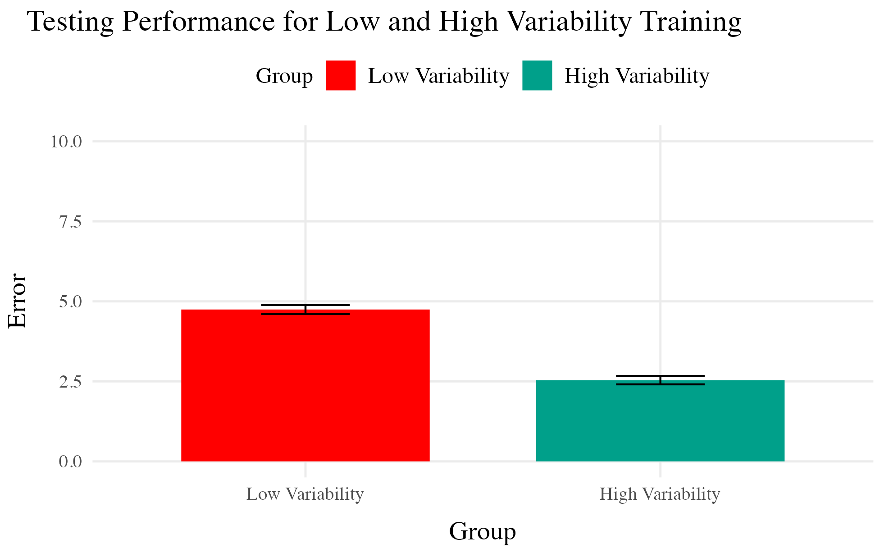
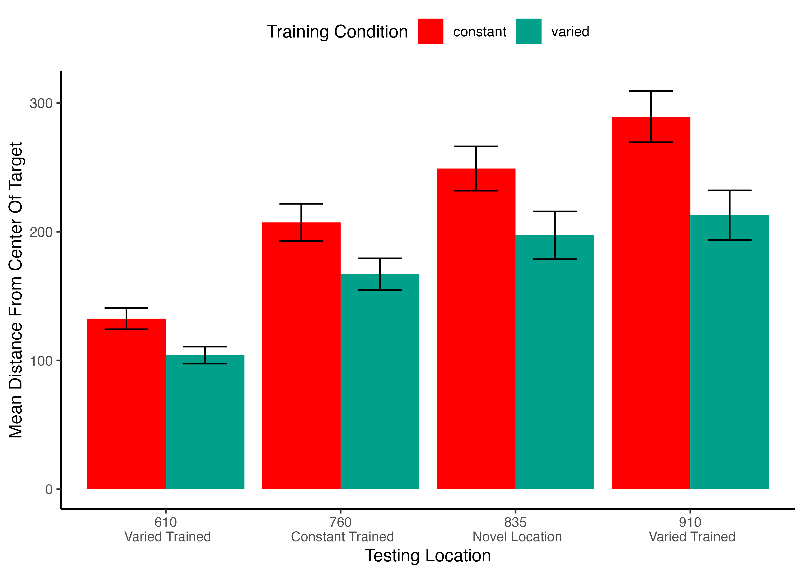

## Introduction

-   Investigate effects of training variability on learning and generalization
-   Focus areas: visuomotor skill learning and function learning tasks

------------------------------------------------------------------------

## Background and Motivation

-   Importance of training variability
-   Research gaps in visuomotor skill learning
-   Previous research in category learning, language learning, and function learning

------------------------------------------------------------------------

## Common Empirical Patterns

### Training

-   Both training conditions complete the same number of training trials.
-   Varied group has worse training performance.

### Testing

-   Tested from novel conditions.
-   Varied group has better test performance

------------------------------------------------------------------------

## But also plenty of contradictory results and complications

-   Cases where varied training makes no difference
-   Cases where more training variation results in worse outcomes
-   Cases where the influence of variation interacts with some other factor
    -   difficulty
    -   prior knowledge
    -   Frequency effects, or amount of training/learning before testing

------------------------------------------------------------------------

## Theoretical Frameworks

-   Schema Theory (Schmidt, 1975)
-   Desirable Difficulties Framework (Bjork & Bjork, 2011)
-   Challenge Point Framework (Guadagnoli & Lee, 2004)

<!--  -->

------------------------------------------------------------------------

## Overview of Current Work

-   Project 1: Visuomotor projectile launching task
-   Project 2: Visuomotor extrapolation task

------------------------------------------------------------------------

## Project 1 - Hit The Target (HTT)

-   Influence of varied practice in a projectile launching task
-   Experiments 1 & 2:
    -   Constant vs. varied training groups
    -   Performance metrics and transfer testing

------------------------------------------------------------------------

## Project 1 - Task & Procedure

<!--  -->

-   **Training Stage** - 200 training trials. Constant groups throws from single position. Varied group 60 trials from 2 locations.
-   **Transfer Stage** - All subjects tested from both positions they were trained, and the positions trained by other group
-   **Data recorded** - For every throw, recorded the X velocity and Y velocity of ball at release

------------------------------------------------------------------------

## Project 1 - Manipulations

### Experiment 1

-   Train a varied group from 2 positions, and a constant group from 1. Then test both groups, from the training positions and a novel position.

### Experiment 2

-   6 constant conditions, each trained from a unique location, and a varied condition trained from 2 locations

------------------------------------------------------------------------

## Project 1 - Results

### Experiment 1

### Experiment 2

------------------------------------------------------------------------

## Project 1 - Discussion

-   Varied training group's superior performance
-   Computational modeling results with IGAS
-   Theoretical implications

------------------------------------------------------------------------

## Project 1 Computational Model

### Model of Similarity between training and solutions

------------------------------------------------------------------------

## Project 1 Computational Model

-   For each subject, compute similarity between training throws and each of the 6 testing locations
-   Test whether similarity explains the difference in performance between Constant and Varied conditions
    -   Assuming equivalent generalization (1 c for both groups) - similarity improves model fit, but does not explain group difference
    -   Assume training condition influences generalization gradient (fit c separately) - now similarity does explain the difference between Constant and Varied.

**Equation 1:** $$ Similarity_{I,J} = \sum_{i=I}\sum_{j=J} (e^{-c^\cdot d^{p}_{i,j}}) $$
**Equation 2:** $$ d_{i,j} = \sqrt{(x_{Train_i}-x_{Solution_j})^2 + (y_{Train_i}-y_{Solution_j})^2 } $$

## Project 1 General Discussion

------------------------------------------------------------------------

## Project 2 - Variability and Extrapolation in a Function Learning Task

-   Influence of varied practice in a function learning task
-   Experiments 1, 2, and 3:
    -   Training regimes and testing conditions
    -   Learning, discrimination, and extrapolation performance metrics

------------------------------------------------------------------------

## Project 2 - Questions and Goals

**Empirical**
- Design a task-space large enough to assess multiple degrees of extrapolation
- Compare varied and constant generalization from several distinct distances from their nearest training condition

**Model-based**
- If variation does influence extrapolation, can a connectionist model with similarity-based activation provide a good account?
- Can our modelling framework simultaneously account for both training and testing data?
- Accounting for the full distribution of responses

------------------------------------------------------------------------

## Task

<!-- assets/htw_vid.mov -->

------------------------------------------------------------------------

## Project 2 - Methodology

-   A total of 156 participants from IU's online subject pool
-   Varied group trains from 3 "velocity bands", constant group from 1

## Project 2 - Methodology

------------------------------------------------------------------------

## Project 2 - Experiment 1 Results

## Project 2 - Experiment 1 Results

## Project 2 - Experiment 2 Design

## Project 2 - Experiment 2 Results

## Project 2 - Experiment 2 Results

## Project 2 - Experiment 2 Results

## Project 2 - Experiment 3 Design

-   Ordinal feedback
-   Include both the original order (E1) and reverse order (E2)

## Project 3 - Experiment 3 Results

## Project 3 - Experiment 3 Results

## Project 3 - Experiment 3 Results

------------------------------------------------------------------------

## Project 2 - ALM

------------------------------------------------------------------------

## ALM

|  | **ALM Response Generation** |  |
|-------------------|-----------------------------|-------------------------|
| Input Activation | $a_i(X) = \frac{e^{-c(X-X_i)^2}}{\sum_{k=1}^M e^{-c(X-X_k)^2}}$ | Input nodes activate as a function of Gaussian similarity to stimulus |
| Output Activation | $O_j(X) = \sum_{k=1}^M w_{ji} \cdot a_i(X)$ | Output unit $O_j$ activation is the weighted sum of input activations and association weights |
| Output Probability | $P[Y_j|X] = \frac{O_j(X)}{\sum_{k=1}^M O_k(X)}$ | The response, $Y_j$ probabilites computed via Luce's choice rule |
| Mean Output | $m(X) = \sum_{j=1}^L Y_j \cdot \frac{O_j(x)}{\sum_{k=1}^M O_k(X)}$ | Weighted average of probabilities determines response to X |
|  | **ALM Learning** |  |
| Feedback | $f_j(Z) = e^{-c(Z-Y_j)^2}$ | feedback signal Z computed as similarity between ideal response and observed response |
| magnitude of error | $\Delta_{ji}=(f_{j}(Z)-o_{j}(X))a_{i}(X)$ | Delta rule to update weights. |
| Update Weights | $w_{ji}^{new}=w_{ji}+\eta\Delta_{ji}$ | Updates scaled by learning rate parameter $\eta$. |

------------------------------------------------------------------------

## EXAM

|  | **EXAM Response Generation** |  |
|-------|---------------------------------|--------------------------------|
| Instance Retrieval | $P[X_i|X] = \frac{a_i(X)}{\sum_{k=1}^M a_k(X)}$ | Novel test stimulus $X$ activates input nodes $X_i$ |
| Slope Computation | $S = \frac{m(X_{1})-m(X_{2})}{X_{1}-X_{2}}$ | Slope value, $S$ computed from nearest training instances |
| Response | $E[Y|X_i] = m(X_i) + S \cdot [X - X_i]$ | Final EXAM response is the ALM response for the nearest training stimulus, $m(X_i)$, adjusted by local slope $S$. |

------------------------------------------------------------------------

## Project 2 - Model Fitting Procedure

### Approximate Bayesian Computation

## Modelling Results

## General Discussion

-   Compare HTT and HTW
-   Empirical findings summary
-   Computational modeling contributions

------------------------------------------------------------------------

## Comparison

| Dimension | HTT (Project 1) | HTW (Project 2) |
|----------------|-------------------------------|-------------------------|
| Task Description | Projectile launching to hit a target | Projectile launching to hit wall at a specific velocity |
| Task Complexity | More complex parabolic trajectory, both x and y velocities relevant to outcome | Simpler 1D mapping of force to outcome. Only x velocity is relevant. |
| Task Space | More complex: xy velocity combinations closer to the solution space may still result in worse feedback due to striking the barrier. | Simpler: smooth, linear mapping between velocity and feedback. |
| Perceptual salience of Varied Conditions | Varied conditions (# of throwing distances) are perceptually distinct, i.e. salient differences in distance between launching box and target. | Varied conditions (# of velocity bands) are less salient - only difference is the numeral displayed on screen. |
| Testing Feedback | Testing always included feedback | Primary testing stage had no feedback. |
| Potential for Learning during Testing | Limited potential for learning during testing due to feedback. | Some potential for learning during no-feedback testing by observing ball trajectory. |
| Training Experience | Varied group gets half as much experience on any one position as the constant group. | Varied group gets 1/3 as much experience on any one velocity band as the constant group. |
| Testing Structure | Random interleaving of trained/transfer testing distances. | Blocked structure, separately testing trained vs extrapolation testing bands. |

------------------------------------------------------------------------

## Theoretical Contributions

-   Insights into training variability effects on learning and generalization
-   Computational models applications

------------------------------------------------------------------------

## Practical Implications

-   Training programs design implications
-   Future research considerations

------------------------------------------------------------------------

## Limitations and Future Directions

-   Study limitations
-   Future research suggestions

------------------------------------------------------------------------

## Conclusion

-   Recap of key findings
-   Final thoughts on training variability's role in learning

------------------------------------------------------------------------

## Questions and Discussion

-   Open floor for questions from the committee and audience

## Future Research Directions

### Theoretical Extensions

-   Investigate the role of individual differences in training variability effects.
-   Explore the impact of different types of feedback on learning and generalization.
-   Examine the influence of task complexity on the benefits of varied training.

### Methodological Innovations

-   Develop new experimental paradigms to test training variability in more complex tasks.
-   Utilize advanced computational models to simulate learning processes under varied conditions.
-   Implement longitudinal studies to assess long-term effects of training variability.

### Practical Applications

-   Design adaptive training programs that adjust variability based on learner performance.
-   Apply findings to educational settings to enhance learning outcomes.
-   Use insights to improve training protocols in professional skill development.

### Collaborative Opportunities

-   Partner with educational institutions to test training variability in classroom settings.
-   Collaborate with industry professionals to apply research findings in real-world training programs.
-   Engage with interdisciplinary teams to explore the broader implications of training variability.

------------------------------------------------------------------------
