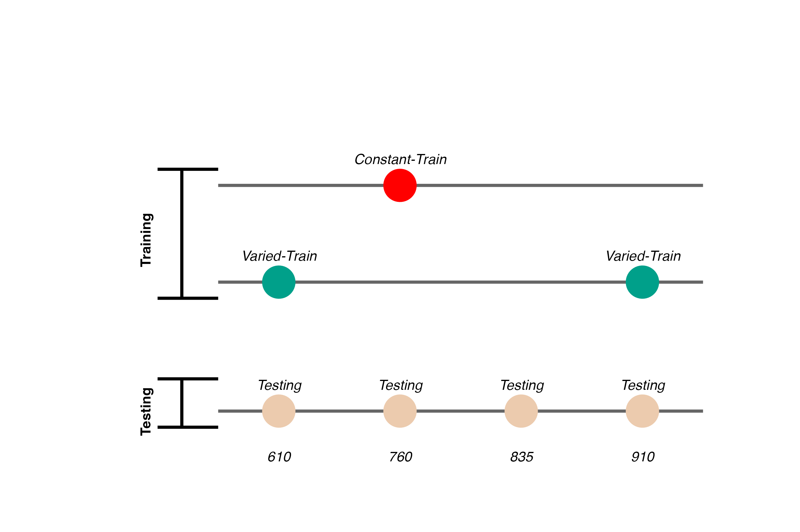
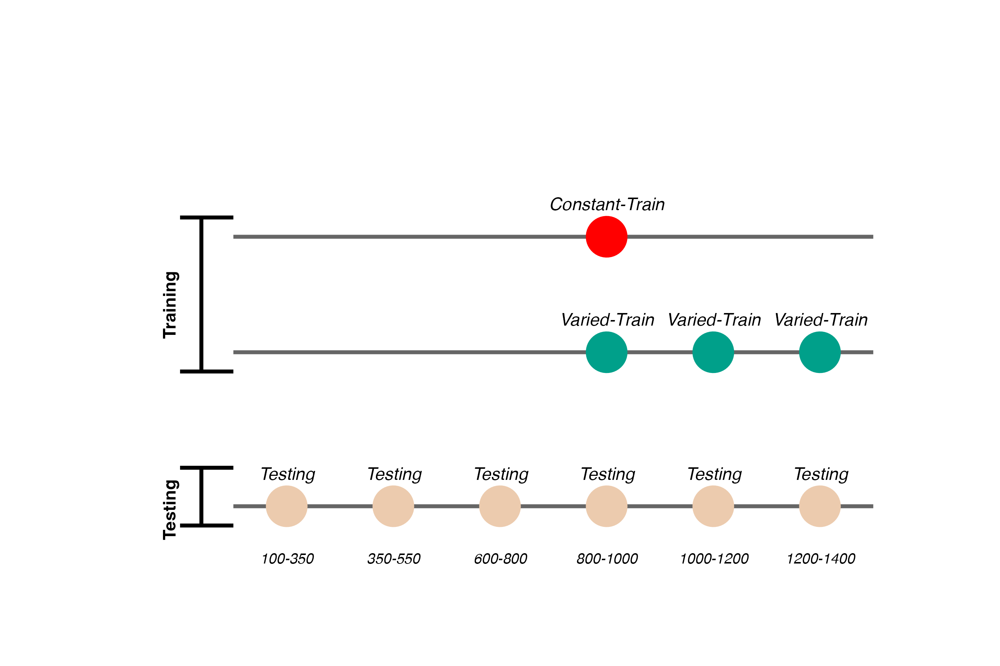
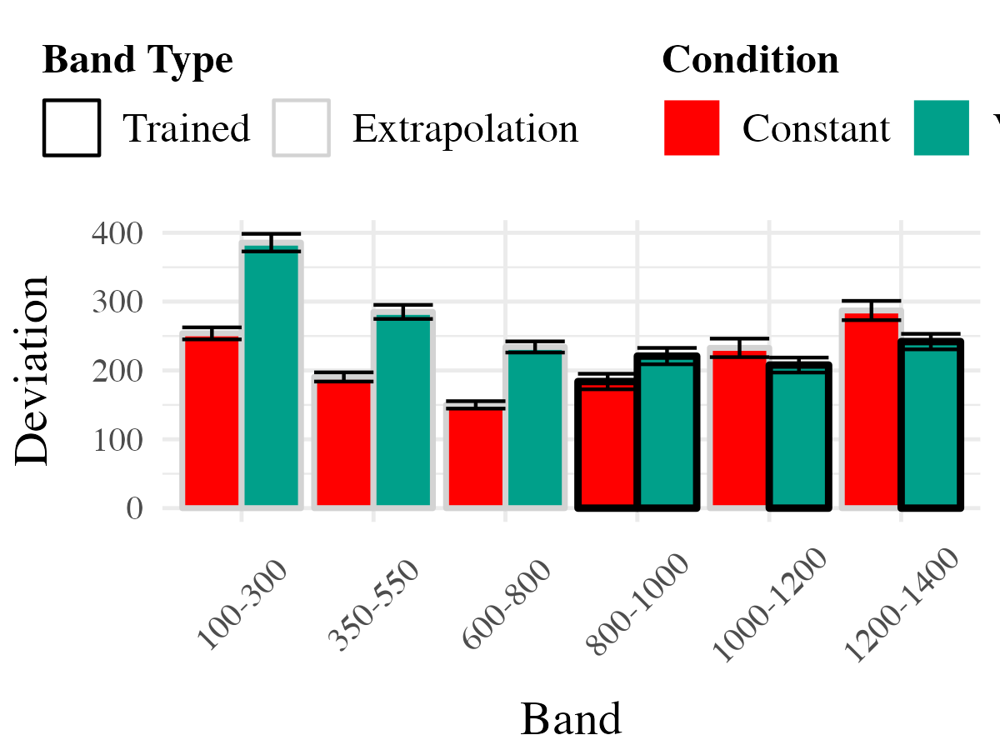
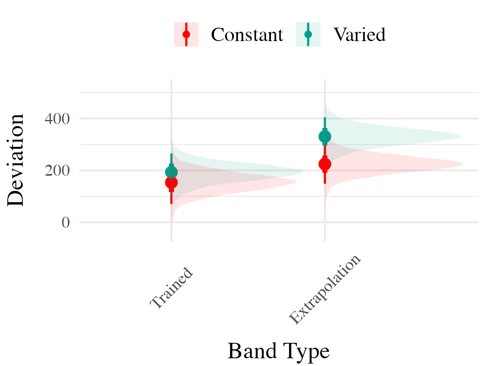
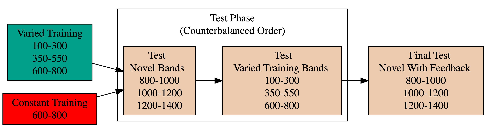
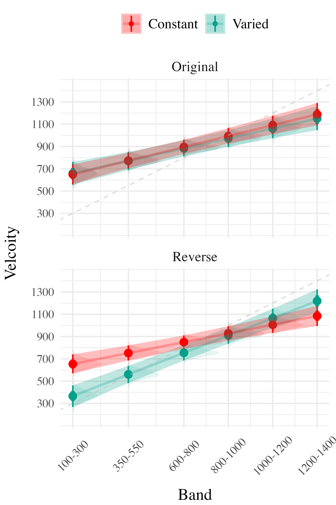
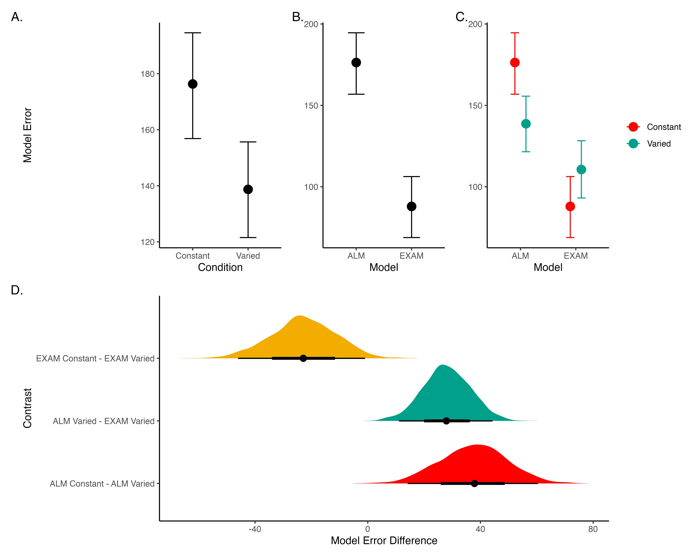
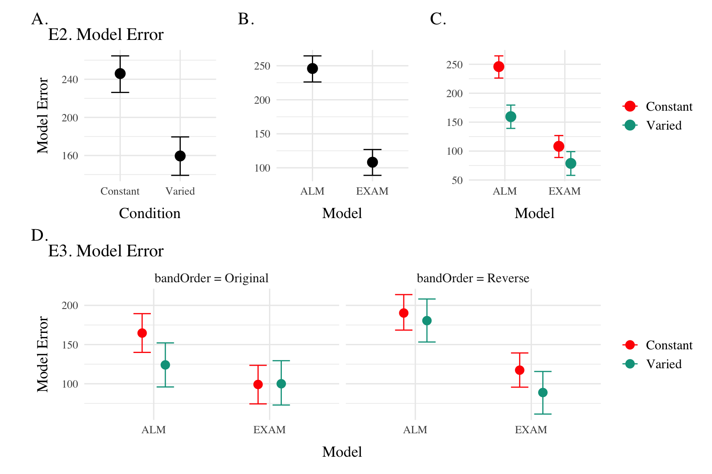
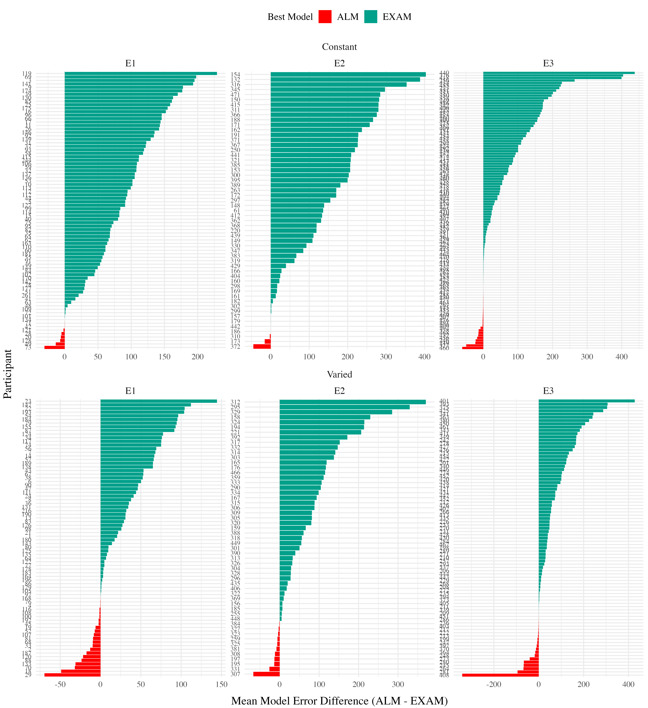

# Learning Generalization

-   Learning is often specific
-   Longstanding scientific interest in how to improve generalization or transfer

------------------------------------------------------------------------

## Variability

-   Variation during training linked to improved transfer in numerous domains
-   What does "variability mean in the context of learning interventions?"

## Types of Variability

-   The number of unique items/problems experienced
-   How spread out examples are

## My Dissertation Focus

-   Number of unique examples

-   Visuomotor skill learning and function learning

-   Addressing methodological shortcomings of previous work

-   Adapting cognitive models from other domains to account for results

------------------------------------------------------------------------

## Common Experimental Manipulations

-   Varied vs. Constant

## Common Empirical Patterns

### Training

-   Both training conditions complete the same number of training trials.
-   Varied group has worse training performance.

### Testing

-   Tested from novel conditions.
-   Varied group has better test performance

------------------------------------------------------------------------

## But also plenty of contradictory results and complications

-   Cases where varied training doesn't benefit generalization
-   Cases where more training variation results in worse outcomes
-   Cases where the influence of variation interacts with some other factor
    -   difficulty
    -   prior knowledge
    -   Frequency effects, or amount of training/learning before testing

------------------------------------------------------------------------

## Overview

### Project 1

-   Visuomotor projectile launching task
-   two experiments
-   Beneficial effect of variability
-   Instance-based similarity model

### Project 2

-   Visuomotor extrapolation task
-   Three experiments
-   Effect of variability is null or negative
-   Connectionist model (ALM) and hybrid associative & rule model (EXAM)

------------------------------------------------------------------------

------------------------------------------------------------------------

## Project 1

 

### An instance-based model account of the benefits of varied practice in visuomotor skill[^1]

   

------------------------------------------------------------------------

## Theoretical Frameworks

 

-   Desirable Difficulties Framework (Bjork & Bjork, 2011)
       
-   Challenge Point Framework (Guadagnoli & Lee, 2004)

-   Schema Theory (Schmidt, 1975)

Schmidt (1975) Bjork & Bjork (2011) Guadagnoli & Lee (2004)

Variety of theoretical explanations
Schema theory in paticular has been extremely influential

------------------------------------------------------------------------

## Issues with previous research

-   Assumptions about what is encoded
-   Assumptions about the formation of abstractions
-   Aggregation issues and similarity confounds

 

-   If generalization decays exponentially with distance, constant groups 1 and 2 may have far less generalization potential to the testing condition.
-   performance of individual constant groups often not reported in analyses.

e.g. (Chua et al., 2019; Del Rey et al., 1982; McCracken & Stelmach, 1977)

------------------------------------------------------------------------

## Designs that avoid similarity issue

### Kerr & Booth 1978

-   Bean bag tossing task
-   Constant and varied conditions train from distinct positions
-   Both groups are tested from the position where the constant group trained
-   Impressive demonstration of varied training outperforming constant training

Kerr & Booth (1978)

------------------------------------------------------------------------

## Experiment 1

-   Conceptual replication of Kerr & Booth design
-   Also test positions novel to both groups
-   Validate computerized visuomotor learning task

## Experiment 1 Design

-   Constant trains from one position (760)
    -   200 trials
-   Varied trains from two positions (610 and 910)
    -   100 trials per position
-   Both groups are tested from all three training positions, and a new position novel to both groups (835)

------------------------------------------------------------------------

## Hit The Target Task

-   **Training Stage** - 200 training trials with feedback. Constant groups trains from single position. Varied group practices from two positions.
-   **Transfer Stage** - All subjects tested from both positions they were trained, and the positions trained by other group
-   **Data recorded** - For every throw, recorded the X velocity and Y velocity of ball at release

-   Use mouse to flick the ball towards the target
-   Must release from orange square
-   Subjects have flexibility in terms of trajectory and release point inside the square
-   Nicety of computerized task - we record the precise details easily

------------------------------------------------------------------------

------------------------------------------------------------------------

## Project 1 - Experiment 1 Results

#### Training

#### Testing

Varied training significantly better at the position that was novel for all subjects. Also better even at the position that the constant group trained at.

4 different positions, the varied group trained from the easiest and the hardest position, they also interpolated the constant group.

------------------------------------------------------------------------

## Experiment 2 Design

task mostly the same - minor adjustments to barrier
6 different constant groups
varied group doesn't train on either the easiest or the hardest position

larger design to give us more data to work with for modelling

## Project 1 - Experiment 2 Results

#### Training

#### Testing

-   This time we can compare varied and constant training - by just comparing the varied group to
    the 2 constant groups that trained at the same locations
-   Here we have all 6 of the constant groups collapsed together
-   also did more fine grained grained comparisons

------------------------------------------------------------------------

## Project 1 Computational Model

### Instance encoding, and similarity-based generalization assumptions

-   Instances refers to individual throws (x and y velocity)
-   Similarity refers to the distance between training throws and the solution space of each of the eventual testing positions.

------------------------------------------------------------------------

## Project 1 Computational Model

#### Computing Similarity

-   Euclidean distance between each training throw, and each solution space
    -   separately for each participant, and each of the testing positions
-   Similarity computed as a Gaussian decay function of distance, i.e. larger distances result in lower similarity
-   Each participant gets their own similarity score for each of the 6 testing positions
    -   similarity score for a given testing position is the sum of the similarities between each training throw and the entire empirical solution space

#### Model Definition

-   $d_{i,j} = \sqrt{(x_{Train_i}-x_{Solution_j})^2 + (y_{Train_i}-y_{Solution_j})^2 }$
-   $Similarity_{I,J} = \sum_{i=I}\sum_{j=J} (e^{-c^\cdot d^{p}_{i,j}})$

## Non-linear similarity

------------------------------------------------------------------------

## Does this similarity metric work?

-   Our similarity measure does is a significant predictor of testing performance.
    -   Remains significant when controlling for training accuracy, and training condition.

------------------------------------------------------------------------

## Accounting for group-level effect

-   The base version of the model fit a single $c$ parameter
    -   thus assuming that everyone generalizes to the same degree

-   We next fit a 2-c version, separately optimizing for varied and constant groups, resulting in new 2-c similarity scores for each participant.
    -   The optimal c value for the varied group is smaller than that of the constant group, indicative of broader generalization.

-   When 2-c similarity is added to the linear model predicting testing performance as a function of condition, the effect of training condition is no longer significant.
    -   not the case with the original 1-c similarities.

-   Thus the influence of varied training can be explained by an instance-based similarity model, IF one assumes flexibility in the generalization gradient.

## Conclusions

-   New empirical support for a benefit of variability in visuomotor skill tasks

-   Some support for the less common pattern observed by Kerr & Booth (1978)

-   Demonstrated the utility of a similarity based approach in this domain

------------------------------------------------------------------------

# Project 2

------------------------------------------------------------------------

## Project 2

### Impact of Training Variability on Visuomotor Function Learning and Extrapolation

-   Influence of varied practice in a function learning task
-   Experiments 1, 2, and 3:
    -   Training regimes and testing conditions
    -   Learning, discrimination, and extrapolation performance metrics

------------------------------------------------------------------------

## Project 2 - Questions and Goals

**Empirical**
- Design a task-space large enough to assess multiple degrees of extrapolation
- Compare varied and constant generalization from several distinct distances from their nearest training condition

**Model-based**
- If variation does influence extrapolation, can an associative learning model with similarity-based activation provide a good account?
- Can our modelling framework simultaneously account for both training and testing data?
- Accounting for the full distribution of responses

------------------------------------------------------------------------

## Hit The Wall Task

<!-- assets/htw_vid.mov -->

-   Target velocity presented at top of screen
-   Participants attempt to "hit the wall" at the correct velocity
-   Feedback during training - how many units above or below the target-band
-   Only the "x velocity" component of the throw is relevant to the task

------------------------------------------------------------------------

## Project 2 - Experiment 1 Design

   

-   156 participants included in final analysis
-   Varied group trains from 3 "velocity bands", constant group from 1
-   Both groups complete same total number of training trials

------------------------------------------------------------------------

## Project 2 - Experiment 1 Results

## Project 2 - Experiment 2 Design

    

-   Training and Testing bands are in reversed order, relative to Experiment 1
-   110 participants included in final analysis

## Project 2 - Experiment 2 Results

## Project 2 - Experiment 3

-   Ordinal Feedback
    -   directional feedback indicating too high, too low, or correct
-   Both Original (Experiment 1), and reverse (Experiment 2) orders included
-   195 participants included in final analysis

## Project 2 - Experiment 3 Results

## Experiment 3 - Accuracy

## Experiment 3 - Discrimination

------------------------------------------------------------------------

# Project 2 - Computational Modeling

## The Associative Learning Model ALM

-   Two layer network - adapted from ALCOVE (Kruschke (1992))
-   Input layer node for each stimulus, output node for each response
-   Input nodes activate as a function of their Gaussian similarity to the stimulus
-   Weights udpated via delta rule - error driven learning
-   Provides good account of human learning data, and interpolation performance, but struggles with extrapolation (DeLosh et al., 1997)

------------------------------------------------------------------------

## Extrapolation - Association Model (EXAM)

-   Extension to ALM to account for human extrapolation behavior
-   When a novel stimulus is presented, EXAM assumes the nearest 2-3 prior examples are retrieved, and used to compute a slope
-   The slope is used to adjust the ALM response

|  | **EXAM Response Generation** |  |
|-------|---------------------------------|--------------------------------|
| Slope Computation | $S = \frac{m(X_{1})-m(X_{2})}{X_{1}-X_{2}}$ | Slope value, $S$ computed from nearest training instances |
| Response | $E[Y|X_i] = m(X_i) + S \cdot [X - X_i]$ | Final EXAM response is the ALM response for the nearest training stimulus, $m(X_i)$, adjusted by local slope $S$. |

------------------------------------------------------------------------

## Project 2 - Model Fitting Procedure

### Approximate Bayesian Computation (ABC)

-   simulation based parameter estimation (Kangasrääsiö et al., 2019; Turner & Van Zandt, 2012)
-   Useful for models with unknown likelihood functions (e.g. many neural network and drift diffusion models)
-   full distribution of plausible model predictions for each participant

## Project 2 - Model Fitting Procedure

### Model Fitting Approach

-   Two parameters for both ALM and EXAM
    -   generalization parameter: $c$
    -   learning rate parameter: $lr$
-   ALM and EXAM fit separately to each individual participant
-   Rejection based ABC used to obtain 200 posterior samples, per participant, per model
    -   i.e. 200 plausible values of $c$ and $lr$
-   All models fit with three different approaches
    1.  Fit to only the training data
    2.  Fit to both training and testing data
    3.  Fit to only testing data

------------------------------------------------------------------------

## Modelling Results

#### Posterior Predictive Distribution

Empirical data and Model predictions for mean velocity across target bands. Fitting methods (Test Only, Test & Train, Train Only) - are separated across rows, and Training Condition (Constant vs. Varied) are separated by columns. Each facet contains the predictions of ALM and EXAM, alongside the observed data.

## Model Comparison - Experiment 1

Figure 21: A-C) Conditional effects of Model (ALM vs EXAM) and Condition (Constant vs. Varied). Lower values on the y axis indicate better model fit. D) Specific contrasts of model performance comparing 1) EXAM fits between constant and varied training; 2) ALM vs. EXAM for the varied group; 3) ALM fits between constant and varied. Negative error differences indicate that the term on the left side (e.g., EXAM Constant) tended to have smaller model residuals.

## Model Comparison - Experiment 2 and 3

Conditional effects of Model (ALM vs EXAM) and Condition (Constant vs. Varied) on Model Error for Experiment 2 and 3 data. Experiment 3 also includes a control for the order of training vs. testing bands (original order vs. reverse order).

------------------------------------------------------------------------

## Modelling Results

### Best fitting models per participant

Difference in model errors for each participant, with models fit to both train and test data. Positive values favor EXAM, while negative values favor ALM

------------------------------------------------------------------------

# General Discussion

-   Compare HTT and HTW
-   Empirical findings summary
-   Computational modeling contributions

------------------------------------------------------------------------

## Comparison

| Dimension | HTT (Project 1) | HTW (Project 2) |
|----------------|-------------------------------|-------------------------|
| Task Description | Projectile launching to hit a target | Projectile launching to hit wall at a specific velocity |
| Task Complexity | More complex parabolic trajectory, both x and y velocities relevant to outcome | Simpler 1D mapping of force to outcome. Only x velocity is relevant. |
| Task Space | More complex: xy velocity combinations closer to the solution space may still result in worse feedback due to striking the barrier. | Simpler: smooth, linear mapping between velocity and feedback. |
| Perceptual salience of Varied Conditions | Varied conditions (# of throwing distances) are perceptually distinct, i.e. salient differences in distance between launching box and target. | Varied conditions (# of velocity bands) are less salient - only difference is the numeral displayed on screen. |
| Testing Feedback | Testing always included feedback | Primary testing stage had no feedback. |
| Potential for Learning during Testing | Limited potential for learning during testing due to feedback. | Some potential for learning during no-feedback testing by observing ball trajectory. |
| Training Experience | Varied group gets half as much experience on any one position as the constant group. | Varied group gets 1/3 as much experience on any one velocity band as the constant group. |
| Testing Structure | Random interleaving of trained/transfer testing distances. | Blocked structure, separately testing trained vs extrapolation testing bands. |

------------------------------------------------------------------------

## Conclusion

## References

Bjork, E. L., & Bjork, R. A. (2011). Making things hard on yourself, but in a good way: Creating desirable difficulties to enhance learning. *Psychology and the Real World: Essays Illustrating Fundamental Contributions to Society*, *2*, 59--68.

Chua, L.-K., Dimapilis, M. K., Iwatsuki, T., Abdollahipour, R., Lewthwaite, R., & Wulf, G. (2019). Practice variability promotes an external focus of attention and enhances motor skill learning. *Human Movement Science*, *64*, 307--319. <https://doi.org/10.1016/j.humov.2019.02.015>

Del Rey, P., Wughalter, E. H., & Whitehurst, M. (1982). The Effects of Contextual Interference on Females With Varied Experience in Open Sport Skills. *Research Quarterly for Exercise and Sport*, *53*(2), 108--115. <https://doi.org/10.1080/02701367.1982.10605236>

DeLosh, E. L., McDaniel, M. A., & Busemeyer, J. R. (1997). Extrapolation: The Sine Qua Non for Abstraction in Function Learning. *Journal of Experimental Psychology: Learning, Memory, and Cognition*, *23*(4), 19. <https://doi.org/10.1037/0278-7393.23.4.968>

Gorman, T. E., & Goldstone, R. L. (2022). An instance-based model account of the benefits of varied practice in visuomotor skill. *Cognitive Psychology*, *137*, 101491. <https://doi.org/10.1016/j.cogpsych.2022.101491>

Guadagnoli, M. A., & Lee, T. D. (2004). Challenge Point: A Framework for Conceptualizing the Effects of Various Practice Conditions in Motor Learning. *Journal of Motor Behavior*, *36*(2), 212--224. <https://doi.org/10.3200/JMBR.36.2.212-224>

Kangasrääsiö, A., Jokinen, J. P. P., Oulasvirta, A., Howes, A., & Kaski, S. (2019). Parameter Inference for Computational Cognitive Models with Approximate Bayesian Computation. *Cognitive Science*, *43*(6), e12738. <https://doi.org/10.1111/cogs.12738>

Kerr, R., & Booth, B. (1978). Specific and varied practice of motor skill. *Perceptual and Motor Skills*, *46*(2), 395--401. <https://doi.org/10.1177/003151257804600201>

Kruschke, J. K. (1992). ALCOVE: An exemplar-based connectionist model of Category Learning. *Psychological Review*, *99*(1). <https://doi.org/10.1037/0033-295X.99.1.22>

McCracken, H. D., & Stelmach, G. E. (1977). A Test of the Schema Theory of Discrete Motor Learning. *Journal of Motor Behavior*, *9*(3), 193--201. <https://doi.org/10.1080/00222895.1977.10735109>

Schmidt, R. A. (1975). A schema theory of discrete motor skill learning. *Psychological Review*, *82*(4), 225--260. <https://doi.org/10.1037/h0076770>

Turner, B. M., & Van Zandt, T. (2012). A tutorial on approximate Bayesian computation. *Journal of Mathematical Psychology*, *56*(2), 69--85. <https://doi.org/10.1016/j.jmp.2012.02.005>

------------------------------------------------------------------------

## Extras

------------------------------------------------------------------------

------------------------------------------------------------------------

## ALM

|  | **ALM Response Generation** |  |
|-------------------|-----------------------------|-------------------------|
| Input Activation | $a_i(X) = \frac{e^{-c(X-X_i)^2}}{\sum_{k=1}^M e^{-c(X-X_k)^2}}$ | Input nodes activate as a function of Gaussian similarity to stimulus |
| Output Activation | $O_j(X) = \sum_{k=1}^M w_{ji} \cdot a_i(X)$ | Output unit $O_j$ activation is the weighted sum of input activations and association weights |
| Output Probability | $P[Y_j|X] = \frac{O_j(X)}{\sum_{k=1}^M O_k(X)}$ | The response, $Y_j$ probabilites computed via Luce's choice rule |
| Mean Output | $m(X) = \sum_{j=1}^L Y_j \cdot \frac{O_j(x)}{\sum_{k=1}^M O_k(X)}$ | Weighted average of probabilities determines response to X |
|  | **ALM Learning** |  |
| Feedback | $f_j(Z) = e^{-c(Z-Y_j)^2}$ | feedback signal Z computed as similarity between ideal response and observed response |
| magnitude of error | $\Delta_{ji}=(f_{j}(Z)-o_{j}(X))a_{i}(X)$ | Delta rule to update weights. |
| Update Weights | $w_{ji}^{new}=w_{ji}+\eta\Delta_{ji}$ | Updates scaled by learning rate parameter $\eta$. |

------------------------------------------------------------------------

## EXAM

|  | **EXAM Response Generation** |  |
|-------|---------------------------------|--------------------------------|
| Instance Retrieval | $P[X_i|X] = \frac{a_i(X)}{\sum_{k=1}^M a_k(X)}$ | Novel test stimulus $X$ activates input nodes $X_i$ |
| Slope Computation | $S = \frac{m(X_{1})-m(X_{2})}{X_{1}-X_{2}}$ | Slope value, $S$ computed from nearest training instances |
| Response | $E[Y|X_i] = m(X_i) + S \cdot [X - X_i]$ | Final EXAM response is the ALM response for the nearest training stimulus, $m(X_i)$, adjusted by local slope $S$. |

------------------------------------------------------------------------

[^1]: Now published in Cognitive Psychology - (Gorman & Goldstone, 2022)
