# IGAS Project
Thomas E. Gorman

<link href="../site_libs/lightable-0.0.1/lightable.css" rel="stylesheet" />

- [Abstract](#abstract)
- [Introduction](#introduction)
  - [Similarity and instance-based approaches to transfer of
    learning](#similarity-and-instance-based-approaches-to-transfer-of-learning)
  - [Issues with Previous Research](#issues-with-previous-research)
- [Experiment 1](#experiment-1)
  - [Methods](#methods)
    - [Sample Size Estimation](#sample-size-estimation)
    - [Participants](#participants)
      - [Task](#task)
      - [Procedure](#procedure)
  - [Results](#results)
  - [Data Processing and Statistical
    Packages](#data-processing-and-statistical-packages)
  - [Training Phase](#training-phase)
  - [Testing Phase](#testing-phase)
  - [Discussion](#discussion)
- [Experiment 2](#experiment-2)
  - [Methods](#methods-1)
    - [Participants](#participants-1)
    - [Task and Procedure](#task-and-procedure)
  - [Results](#results-1)
    - [Data Processing and Statistical
      Packages](#data-processing-and-statistical-packages-1)
    - [Training Phase](#training-phase-1)
    - [Testing Phase](#testing-phase-1)
  - [Discussion](#discussion-1)
  - [Fitting model parameters separately by
    group](#fitting-model-parameters-separately-by-group)
- [General Discussion](#general-discussion)
  - [Limitations](#limitations)
  - [Conclusion](#conclusion)
- [Appendix](#appendix)
  - [exponential learning models fit to individual
    subjects](#exponential-learning-models-fit-to-individual-subjects)
  - [Group comparison of learning rate
    fits](#group-comparison-of-learning-rate-fits)
  - [First vs. second half of testing
    stage](#first-vs-second-half-of-testing-stage)
  - [Group Comparison for asymptote-starting
    performance](#group-comparison-for-asymptote-starting-performance)
  - [Relative distance and
    under/overshooting](#relative-distance-and-underovershooting)
    - [experiment 1 training - relative
      distances](#experiment-1-training---relative-distances)
    - [experiment 2 training - relative
      distances](#experiment-2-training---relative-distances)
    - [Experiment 1 Testing - relative
      distances](#experiment-1-testing---relative-distances)
    - [Experiment 2 Testing - relative
      distances](#experiment-2-testing---relative-distances)
    - [Experimenet 1 - intermittent
      testing](#experimenet-1---intermittent-testing)
  - [Training plots - Experiment 1](#training-plots---experiment-1)
    - [Not in manuscript](#not-in-manuscript)
    - [fit to testing performance averaged across
      positions](#fit-to-testing-performance-averaged-across-positions)
    - [statistical tests for starting
      performance](#statistical-tests-for-starting-performance)
    - [statistical tests for
      asymptote](#statistical-tests-for-asymptote)
- [References](#references)

# Abstract

Exposing learners to variability during training has been demonstrated
to improve performance in subsequent transfer testing. Such variability
benefits are often accounted for by assuming that learners are
developing some general task schema or structure. However much of this
research has neglected to account for differences in similarity between
varied and constant training conditions. In a between-groups
manipulation, we trained participants on a simple projectile launching
task, with either varied or constant conditions. We replicate previous
findings showing a transfer advantage of varied over constant training.
Furthermore, we show that a standard similarity model is insufficient to
account for the benefits of variation, but, if the model is adjusted to
assume that varied learners are tuned towards a broader generalization
gradient, then a similarity-based model is sufficient to explain the
observed benefits of variation. Our results therefore suggest that some
variability benefits can be accommodated within instance-based models
without positing the learning of some schemata or structure.

# Introduction

## Similarity and instance-based approaches to transfer of learning

Notions of similarity have long played a central role in many prominent
models of generalization of learning, as well as in the longstanding
theoretical issue of whether learners abstract an aggregate, summary
representation, or if they simply store individual instances. Early
models of learning often assumed that discrete experiences with some
task or category were not stored individually in memory, but instead
promoted the formation of a summary representation, often referred to as
a prototype or schema, and that exposure to novel examples would then
prompt the retrieval of whichever preexisting prototype was most similar
(Posner & Keele, 1968). Prototype models were later challenged by the
success of instance-based or exemplar models – which were shown to
provide an account of generalization as good or better than prototype
models, with the advantage of not assuming the explicit construction of
an internal prototype (Estes, 1994; Hintzman, 1984; Medin & Schaffer,
1978; Nosofsky, 1986). Instance-based models assume that learners encode
each experience with a task as a separate instance/exemplar/trace, and
that each encoded trace is in turn compared against novel stimuli. As
the number of stored instances increases, so does the likelihood that
some previously stored instance will be retrieved to aid in the
performance of a novel task. Stored instances are retrieved in the
context of novel stimuli or tasks if they are sufficiently similar, thus
suggesting that the process of computing similarity is of central
importance to generalization.

Similarity, defined in this literature as a function of psychological
distance between instances or categories, has provided a successful
account of generalization across numerous tasks and domains. In an
influential study demonstrating an ordinal similarity effect,
experimenters employed a numerosity judgment task in which participants
quickly report the number of dots flashed on a screen. Performance (in
terms of response times to new patterns) on novel dot configurations
varied as an inverse function of their similarity to previously trained
dot configurations Palmeri (1997). That is, performance was better on
novel configurations moderately similar to trained configurations than
to configurations with low-similarity, and also better on low-similarity
configurations than to even less similar, unrelated configurations.
Instance-based approaches have had some success accounting for
performance in certain sub-domains of motor learning (Cohen & Rosenbaum,
2004; Crump & Logan, 2010; Meigh et al., 2018; Poldrack et al., 1999;
Wifall et al., 2017). Crump & Logan (2010) trained participants to type
words on an unfamiliar keyboard, while constraining the letters
composing the training words to a pre-specified letter set. Following
training, typing speed was tested on previously experienced words
composed of previously experienced letters; novel words composed of
letters from the trained letter set; and novel words composed of letters
from an untrained letter set. Consistent with an instance-based account,
transfer performance was graded such that participants were fastest at
typing the words they had previously trained on, followed by novel words
composed of letters they had trained on, and slowest performance for new
words composed of untrained letters.

## Issues with Previous Research

Although the benefits of training variation in visuomotor skill learning
have been observed many times, null findings have also been repeatedly
found, leading some researchers to question the veracity of the
variability of practice hypothesis (Newell, 2003; Van Rossum, 1990).
Critics have also pointed out that investigations of the effects of
training variability, of the sort described above, often fail to control
for the effect of similarity between training and testing conditions.
For training tasks in which participants have numerous degrees of
freedom (e.g. projectile throwing tasks where participants control the x
and y velocity of the projectile), varied groups are likely to
experience a wider range of the task space over the course of their
training (e.g. more unique combinations of x and y velocities).
Experimenters may attempt to account for this possibility by ensuring
that the training location(s) of the varied and constant groups are an
equal distance away from the eventual transfer locations, such that
their training throws are, on average, equally similar to throws that
would lead to good performance at the transfer locations. However, even
this level of experimental control may still be insufficient to rule out
the effect of similarity on transfer. Given that psychological
similarity is typically best described as either a Gaussian or
exponentially decaying function of psychological distance (Ennis et al.,
1988; Ghahramani et al., 1996; Logan, 1988; Nosofsky, 1992; Shepard,
1987; Thoroughman & Taylor, 2005), it is plausible that a subset of the
most similar training instances could have a disproportionate impact on
generalization to transfer conditions, even if the average distance
between training and transfer conditions is identical between groups.
<a href="#fig-toy-model1" class="quarto-xref">Figure 1</a> demonstrates
the consequences of a generalization gradient that drops off as a
Gaussian function of distance from training, as compared to a linear
drop-off.

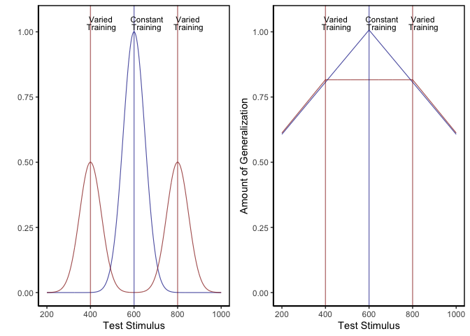

Figure 1: Left panel- Generalization predicted from a simple model that
assumes a linear generalization function. A varied group (red vertical
lines indicate the 2 training locations) trained from positions 400 and
800, and a constant group (blue vertical line), trained from position
600. Right panel- if a Gaussian generalization function is assumed, then
varied training (400, 800) is predicted to result in better
generalization to positions close to 400 and 800 than does constant
training at 600. (For interpretation of the references to color in this
figure legend, the reader is referred to the web version of this
article.)

In addition to largely overlooking the potential for non-linear
generalization to confound interpretations of training manipulations,
the visuomotor skill learning literature also rarely considers
alternatives to schema representations (Chamberlin & Magill, 1992b).
Although schema-theory remains influential within certain literatures,
instance or exemplar-based models have accounted for human behavior
across myriad domains (Jamieson et al., 2022; Logan, 2002). As mentioned
above, instance based accounts have been shown to perform well on a
variety of different tasks with motoric components (Crump & Logan, 2010;
Gandolfo et al., 1996; Meigh et al., 2018; Rosenbaum et al., 1995; van
Dam & Ernst, 2015). However, such accounts have received little
attention within the subdomain of visuomotor skill learning focused on
the benefits of varied training.

The present work examines whether the commonly observed benefits of
varied training can be accounted for by a theoretrically motivated
measure of the similarity between training throws and the testing
solution space. We first attempt to replicate previous work finding an
advantage of varied training over constant training in a projectile
launching task. We then examine the extent to which this advantage can
be explained by an instance-based similarity model.

# Experiment 1

## Methods

### Sample Size Estimation

To obtain an independent estimate of effect size, we identified previous
investigations which included between-subjects contrasts of varied and
constant conditions following training on an accuracy based projectile
launching task (Chua et al., 2019; Goodwin et al., 1998; Kerr & Booth,
1978; Wulf, 1991). We then averaged effects across these studies,
yielding a Cohen’s f =.43. The GPower 3.1 software package (Faul et al.,
2009) was then used to determine that a power of 80% requires a sample
size of at least 23 participants per condition. All experiments reported
in the present manuscript exceed this minimum number of participants per
condition.

### Participants

Participants were recruited from an undergraduate population that is 63%
female and consists almost entirely of individuals aged 18 to 22 years.
A total of 110 Indiana University psychology students participated in
Experiment 1. We subsequently excluded 34 participants poor performance
at one of the dependent measures of the task (2.5-3 standard deviations
worse than the median subject at the task) or for displaying a pattern
of responses that was clearly indicative of a lack of engagement with
the task (e.g. simply dropping the ball on each trial rather than
throwing it at the target), or for reporting that they completed the
experiment on a phone or tablet device, despite the instructions not to
use one of these devices. A total of 74 participants were retained for
the final analyses, 35 in the varied group and 39 in the constant group.

#### Task

The experimental task was programmed in JavaScript, using packages from
the Phaser physics engine (https://phaser.io) and the jsPsych library
(de Leeuw, 2015). The stimuli, presented on a black background,
consisted of a circular blue ball - controlled by the participant via
the mouse or trackpad cursor; a rectangular green target; a red
rectangular barrier located between the ball and the target; and an
orange square within which the participant could control the ball before
releasing it in a throw towards the target. Because the task was
administered online, the absolute distance between stimuli could vary
depending on the size of the computer monitor being used, but the
relative distance between the stimuli was held constant. Likewise, the
distance between the center of the target and the training and testing
locations was scaled such that relative distances were preserved
regardless of screen size. For the sake of brevity, subsequent mentions
of this relative distance between stimuli, or the position where the
ball landed in relation to the center of the target, will be referred to
simply as distance.
<a href="#fig-IGAS_Methods" class="quarto-xref">Figure 2</a> displays
the layout of the task, as it would appear to a participant at the start
of a trial, with the ball appearing in the center of the orange square.
Using a mouse or trackpad, participants click down on the ball to take
control of the ball, connecting the movement of the ball to the movement
of the cursor. Participants can then “wind up” the ball by dragging it
(within the confines of the orange square) and then launch the ball by
releasing the cursor. If the ball does not land on the target,
participants are presented with feedback in red text at the top right of
the screen, specifying how many scaled units away the ball was from the
center of the target. If the ball was thrown outside of the boundary of
the screen participants are given feedback as to how far away from the
target center the ball would have been if it had continued its
trajectory. If the ball strikes the barrier (from the side or by landing
on top), feedback is presented telling participants to avoid hitting the
barrier. If participants drag the ball outside of the orange square
before releasing it, the trial terminates, and they are reminded to
release the ball within the orange square. If the ball lands on the
target, feedback is presented in green text, confirming that the target
was hit, and presenting additional feedback on how many units away the
ball was from the exact center of the target.

<a href="https://pcl.sitehost.iu.edu/tg/demos/igas_expt1_demo.html"
target="_blank">Link to abbreviated example of task</a>.

Figure 2: The stimuli of the task consisted of a blue ball, which the
participants would launch at the green target, while avoiding the red
barrier. On each trial, the ball would appear in the center of the
orange square, with the position of the orange square varying between
experimental conditions. Participants were constrained to release the
ball within the square

#### Procedure

Participants first electronically consented to participate, and then
read instructions for the task which explained how to control the ball,
and the goal of throwing the ball as close to the center of the target
as possible. The training phase was split into 10 blocks of 20 trials,
for a total of 200 training trials. Participants in the constant
condition trained exclusively from a single location (760 scaled units
from the target center). Participants in the varied condition trained
from two locations (610 and 910 scaled units from the target center),
encountering each location 100 times. The sequence of throwing locations
was pseudo-random for the varied group, with the constraint that within
every block of 20 training throws both training locations would occur 10
times. Participants in both conditions also received intermittent
testing trials after every 20 training trials. Intermittent testing
trials provided no feedback of any kind. The ball would disappear from
view as soon as it left the orange square, and participants were
prompted to start the next trial without receiving any information about
the accuracy of the throw. Each intermittent testing stage consisted of
two trials from each of the three training positions (i.e. all
participants executed two trials each from Positions 610, 760, and 910
during each of the 10 intermittent testing stages). Following training,
all participants completed a final testing phase from four positions: 1)
their training location, 2) the training location(s) of the other group,
3) a location novel to both groups. The testing phase consisted of 15
trials from each of the four locations, presented in a randomized order.
All trials in the final testing phase included feedback. After finishing
the final testing portion of the study, participants were queried as to
whether they completed the study using a mouse, a trackpad, or some
other device (this information was used in the exclusion process
described above). Finally, participants were debriefed as to the
hypotheses and manipulation of the study.

## Results

## Data Processing and Statistical Packages

To prepare the data, we removed trials that were not easily
interpretable as performance indicators in our task. Removed trials
included: 1) those in which participants dragged the ball outside of the
orange starting box without releasing it, 2) trials in which
participants clicked on the ball, and then immediately released it,
causing the ball to drop straight down, 3) outlier trials in which the
ball was thrown more than 2.5 standard deviations further than the
average throw (calculated separately for each throwing position), and 4)
trials in which the ball struck the barrier. The primary measure of
performance used in all analyses was the absolute distance away from the
center of the target. The absolute distance was calculated on every
trial, and then averaged within each subject to yield a single
performance score, for each position. A consistent pattern across
training and testing phases in both experiments was for participants to
perform worse from throwing positions further away from the target – a
pattern which we refer to as the difficulty of the positions. However,
there were no interactions between throwing position and training
conditions, allowing us to collapse across positions in cases where
contrasts for specific positions were not of interest. All data
processing and statistical analyses were performed in R version 4.32
(Team, 2020). ANOVAs for group comparisons were performed using the
rstatix package (Kassambara, 2021).

## Training Phase

<a href="#fig-IGAS_Training1" class="quarto-xref">Figure 3</a> below
shows aggregate training performance binned into three stages
representing the beginning, middle, and end of the training phase.
Because the two conditions trained from target distances that were not
equally difficult, it was not possible to directly compare performance
between conditions in the training phase. Our focus for the training
data analysis was instead to establish that participants did improve
their performance over the course of training, and to examine whether
there was any interaction between training stage and condition.
Descriptive statistics for the intermittent testing phase are provided
in the supplementary materials.

We performed an ANOVA comparison with stage as a within-group factor and
condition as between-group factor. The analysis revealed a significant
effect of training stage F(2,142)=62.4, p\<.001, $\eta^{2}_G$ = .17,
such that performance improved over the course of training. There was no
significant effect of condition F(1,71)=1.42, p=.24, $\eta^{2}_G$ = .02,
and no significant interaction between condition and training stage,
F(2,142)=.10, p=.91, $\eta^{2}_G$ \< .01.

Figure 3: Training performance for varied and constant participants
binned into three stages. Shorter bars indicate better performance (ball
landing closer to the center of the target). Error bars indicate
standard error of the mean.

## Testing Phase

In Experiment 1, a single constant-trained group was compared against a
single varied-trained group. At the transfer phase, all participants
were tested from 3 positions: 1) the positions(s) from their own
training, 2) the training position(s) of the other group, and 3) a
position novel to both groups. Overall, group performance was compared
with a mixed type III ANOVA, with condition (varied vs. constant) as a
between-subject factor and throwing location as a within-subject
variable. The effect of throwing position was strong, F(3,213) = 56.12,
p\<.001, η2G = .23. The effect of training condition was significant
F(1,71)=8.19, p\<.01, η2G = .07. There was no significant interaction
between group and position, F(3,213)=1.81, p=.15, η2G = .01.

Figure 4: Testing performance for each of the 4 testing positions,
compared between training conditions. Positions 610 and 910 were trained
on by the varied group, and novel for the constant group. Position 760
was trained on by the constant group, and novel for the varied group.
Position 835 was novel for both groups. Shorter bars are indicative of
better performance (the ball landing closer to the center of the
target). Error bars indicate standard error of the mean.

  
  

Table 1: Testing performance for varied and constant groups in
experiment 1. Mean absolute deviation from the center of the target,
with standard deviations in parenthesis.

| Position | Constant       | Varied         |
|:---------|:---------------|:---------------|
| 610      | 132.48(50.85)  | 104.2(38.92)   |
| 760      | 207.26(89.19)  | 167.12(72.29)  |
| 835      | 249.13(105.92) | 197.22(109.71) |
| 910      | 289.36(122.48) | 212.86(113.93) |

## Discussion

In Experiment 1, we found that varied training resulted in superior
testing performance than constant training, from both a position novel
to both groups, and from the position at which the constant group was
trained, which was novel to the varied condition. The superiority of
varied training over constant training even at the constant training
position is of particular note, given that testing at this position
should have been highly similar for participants in the constant
condition. It should also be noted, though, that testing at the constant
trained position is not exactly identical to training from that
position, given that the context of testing is different in several ways
from that of training, such as the testing trials from the different
positions being intermixed, as well as a simple change in context as a
function of time. Such contextual differences will be further considered
in the General Discussion.

In addition to the variation of throwing position during training, the
participants in the varied condition of Experiment 1 also received
training practice from the closest/easiest position, as well as from the
furthest/most difficult position that would later be encountered by all
participants during testing. The varied condition also had the potential
advantage of interpolating both of the novel positions from which they
would later be tested. Experiment 2 thus sought to address these issues
by comparing a varied condition to multiple constant conditions.

# Experiment 2

In Experiment 2, we sought to replicate our findings from Experiment 1
with a new sample of participants, while also addressing the possibility
of the pattern of results in Experiment 1 being explained by some
idiosyncrasy of the particular training location of the constant group
relative to the varied group. To this end, Experiment 2 employed the
same basic procedure as Experiment 1, but was designed with six separate
constant groups each trained from one of six different locations (400,
500, 625, 675, 800, or 900), and a varied group trained from two
locations (500 and 800). Participants in all seven groups were then
tested from each of the 6 unique positions.

## Methods

### Participants

A total of 306 Indiana University psychology students participated in
Experiment 2, which was also conducted online. As was the case in
Experiment 1, the undergraduate population from which we recruited
participants was 63% female and primarily composed of 18–22-year-old
individuals. Using the same procedure as Experiment 1, we excluded 98
participants for exceptionally poor performance at one of the dependent
measures of the task, or for displaying a pattern of responses
indicative of a lack of engagement with the task. A total of 208
participants were included in the final analyses with 31 in the varied
group and 32, 28, 37, 25, 29, 26 participants in the constant groups
training from location 400, 500, 625, 675, 800, and 900, respectively.
All participants were compensated with course credit.

### Task and Procedure

The task of Experiment 2 was identical to that of Experiment 1, in all
but some minor adjustments to the height of the barrier, and the
relative distance between the barrier and the target. Additionally, the
intermittent testing trials featured in Experiment 1 were not utilized
in Experiment 2. An abbreviated demo of the task used for Experiment 2
can be found at
(https://pcl.sitehost.iu.edu/tg/demos/igas_expt2_demo.html).

The procedure for Experiment 2 was also quite similar to Experiment 1.
Participants completed 140 training trials, all of which were from the
same position for the constant groups and split evenly (70 trials each -
randomized) for the varied group. In the testing phase, participants
completed 30 trials from each of the six locations that had been used
separately across each of the constant groups during training. Each of
the constant groups thus experienced one trained location and five novel
throwing locations in the testing phase, while the varied group
experiences 2 previously trained, and 4 novel locations.

## Results

### Data Processing and Statistical Packages

After confirming that condition and throwing position did not have any
significant interactions, we standardized performance within each
position, and then average across position to yield a single performance
measure per participant. This standardization did not influence our
pattern of results. As in Experiment 1, we performed type III ANOVAs due
to our unbalanced design, however the pattern of results presented below
is not altered if type 1 or type III tests are used instead. The
statistical software for the primary analyses was the same as for
Experiment 1. Individual learning rates in the testing phase, compared
between groups in the supplementary analyses, were fit using the TEfit
package in R (Cochrane, 2020).

### Training Phase

The different training conditions trained from positions that were not
equivalently difficult and are thus not easily amenable to comparison.
As previously stated, the primary interest of the training data is
confirmation that some learning did occur.
<a href="#fig-e2train" class="quarto-xref">Figure 5</a> depicts the
training performance of the varied group alongside that of the aggregate
of the six constant groups (5a), and each of the 6 separate constant
groups (5b). An ANOVA comparison with training stage (beginning, middle,
end) as a within-group factor and group (the varied condition vs. the 6
constant conditions collapsed together) as a between-subject factor
revealed no significant effect of group on training performance,
F(1,206)=.55,p=.49, $\eta^{2}_G$ \<.01, a significant effect of training
stage F(2,412)=77.91, p\<.001, $\eta^{2}_G$ =.05, and no significant
interaction between group and training stage, F(2,412)=.489 p=.61,
$\eta^{2}_G$ \<.01. We also tested for a difference in training
performance between the varied group and the two constant groups that
trained matching throwing positions (i.e., the constant groups training
from position 500, and position 800). The results of our ANOVA on this
limited dataset mirrors that of the full-group analysis, with no
significant effect of group F(1,86)=.48, p=.49, $\eta^{2}_G$ \<.01, a
significant effect of training stage F(2,172)=56.29, p\<.001,
$\eta^{2}_G$ =.11, and no significant interaction between group and
training stage, F(2,172)=.341 p=.71, $\eta^{2}_G$ \<.01.

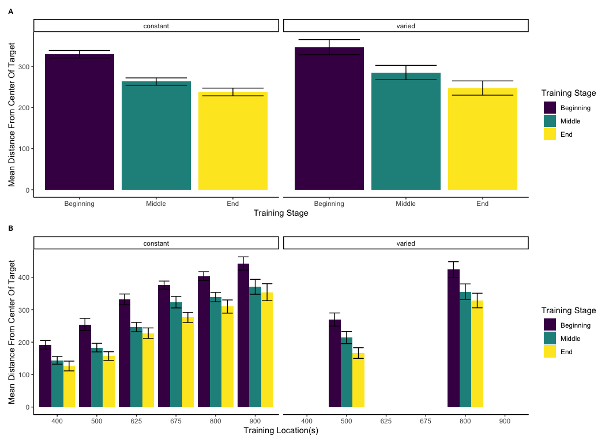

Figure 5: Training performance for the six constant conditions, and the
varied condition, binned into three stages. On the left side, the six
constant groups are averaged together, as are the two training positions
for the varied group. On the right side, the six constant groups are
shown separately, with each set of bars representing the beginning,
middle, and end of training for a single constant group that trained
from the position indicated on the x-axis. Figure 5b also shows training
performance separately for both of the throwing locations trained by the
varied group. Error bars indicate standard error of the mean.

### Testing Phase

In Experiment 2, a single varied condition (trained from two positions,
500 and 800), was compared against six separate constant groups (trained
from a single position, 400, 500, 625, 675, 800 or 900). For the testing
phase, all participants were tested from all six positions, four of
which were novel for the varied condition, and five of which were novel
for each of the constant groups. For a general comparison, we took the
absolute deviations for each throwing position and computed standardized
scores across all participants, and then averaged across throwing
position. The six constant groups were then collapsed together allowing
us to make a simple comparison between training conditions (constant
vs. varied). A type III between-subjects ANOVA was performed, yielding a
significant effect of condition F(1,206)=4.33, p=.039, $\eta^{2}_G$
=.02. Descriptive statistics for each condition are shown in table 2. In
<a href="#fig-e2testa" class="quarto-xref">Figure 6</a> visualizes the
consistent advantage of the varied condition over the constant groups
across the testing positions.
<a href="#fig-e2testa" class="quarto-xref">Figure 6</a> shows
performance between the varied condition and the individual constant
groups.

Figure 6: Testing phase performance from each of the six testing
positions. The six constant conditions are averaged together into a
single constant group, compared against the single varied-trained
group.B) Transfer performance from each of the 6 throwing locations from
which all participants were tested. Each bar represents performance from
one of seven distinct training groups (six constant groups in red, one
varied group in blue). The x axis labels indicate the location(s) from
which each group trained. Lower values along the y axis reflect better
performance at the task (closer distance to target center). Error bars
indicate standard error of the mean.

  
  
  

Table 2: Transfer performance from each of the 6 throwing locations from
which all participants were tested. Each bar represents performance from
one of seven distinct training groups (six constant groups in red, one
varied group in blue). The x axis labels indicate the location(s) from
which each group trained. Lower values along the y axis reflect better
performance at the task (closer distance to target center). Error bars
indicate standard error of the mean.

| Position | Constant       | Varied         |
|:---------|:---------------|:---------------|
| 400      | 100.59(46.3)   | 83.92(33.76)   |
| 500      | 152.28(69.82)  | 134.38(61.38)  |
| 625      | 211.21(90.95)  | 183.51(75.92)  |
| 675      | 233.32(93.35)  | 206.32(94.64)  |
| 800      | 283.24(102.85) | 242.65(89.73)  |
| 900      | 343.51(114.33) | 289.62(110.07) |

Next, we compared the testing performance of constant and varied groups
from only positions that participants had not encountered during
training. Constant participants each had 5 novel positions, whereas
varied participants tested from 4 novel positions (400,625,675,900). We
first standardized performance within in each position, and then
averaged across positions. Here again, we found a significant effect of
condition (constant vs. varied): F(1,206)=4.30, p=.039, $\eta^{2}_G$ =
.02 .

Table 3: Testing performance from novel positions. Includes data only
from positions that were not encountered during the training stage
(e.g. excludes positions 500 and 800 for the varied group, and one of
the six locations for each of the constant groups). Table presents Mean
absolute deviations from the center of the target, and standard
deviations in parenthesis.

| Position | Constant       | Varied         |
|:---------|:---------------|:---------------|
| 400      | 98.84(45.31)   | 83.92(33.76)   |
| 500      | 152.12(69.94)  | NA             |
| 625      | 212.91(92.76)  | 183.51(75.92)  |
| 675      | 232.9(95.53)   | 206.32(94.64)  |
| 800      | 285.91(102.81) | NA             |
| 900      | 346.96(111.35) | 289.62(110.07) |

Finally, corresponding to the comparison of position 760 from Experiment
1, we compared the test performance of the varied group against the
constant group from only the positions that the constant groups trained.
Such positions were novel to the varied group (thus this analysis
omitted two constant groups that trained from positions 500 or 800 as
those positions were not novel to the varied group).
<a href="#fig-e2test1" class="quarto-xref">Figure 7</a> displays the
particular subset of comparisons utilized for this analysis. Again, we
standardized performance within each position before performing the
analyses on the aggregated data. In this case, the effect of condition
did not reach statistical significance F(1,149)=3.14, p=.079,
$\eta^{2}_G$ = .02. Table 4 provides descriptive statistics.

Figure 7: A comparison of throwing location that are identical to those
trained by the constant participants (e.g. constant participants trained
at position 900, tested from position 900), which are also novel to the
varied-trained participants (thus excluding positions 500 and 800).
Error bars indicate standard error of the mean.

  
  

Table 4: Testing performance from the locations trained by constant
participants and novel to varied participants. Locations 500 and 800 are
not included as these were trained by the varied participants. Table
presents Mean absolute deviation from the center of the target, and
standard deviations in parenthesis.

| Position | Constant      | Varied         |
|:---------|:--------------|:---------------|
| 400      | 108.85(50.63) | 83.92(33.76)   |
| 625      | 204.75(84.66) | 183.51(75.92)  |
| 675      | 235.75(81.15) | 206.32(94.64)  |
| 900      | 323.5(130.9)  | 289.62(110.07) |

## Discussion

The results of Experiment 2 largely conform to the findings of
Experiment 1. Participants in both varied and constant conditions
improved at the task during the training phase. We did not observe the
common finding of training under varied conditions producing worse
performance during acquisition than training under constant conditions
(Catalano & Kleiner, 1984; Wrisberg et al., 1987), which has been
suggested to relate to the subsequent benefits of varied training in
retention and generalization testing (Soderstrom & Bjork, 2015). However
our finding of no difference in training performance between constant
and varied groups has been observed in previous work (Chua et al., 2019;
Moxley, 1979; Pigott & Shapiro, 1984).

In the testing phase, our varied group significantly outperformed the
constant conditions in both a general comparison, and in an analysis
limited to novel throwing positions. The observed benefit of varied over
constant training echoes the findings of many previous visuomotor skill
learning studies that have continued to emerge since the introduction of
Schmidt’s influential Schema Theory (Catalano & Kleiner, 1984; Chua et
al., 2019; Goodwin et al., 1998; McCracken & Stelmach, 1977; Moxley,
1979; Newell & Shapiro, 1976; Pigott & Shapiro, 1984; Roller et al.,
2001; Schmidt, 1975; Willey & Liu, 2018; Wrisberg et al., 1987; Wulf,
1991). We also join a much smaller set of research to observe this
pattern in a computerized task (Seow et al., 2019). One departure from
the Experiment 1 findings concerns the pattern wherein the varied group
outperformed the constant group even from the training position of the
constant group, which was significant in Experiment 1, but did not reach
significance in Experiment 2. Although this pattern has been observed
elsewhere in the literature (Goode et al., 2008; Kerr & Booth, 1978),
the overall evidence for this effect appears to be far weaker than for
the more general benefit of varied training in conditions novel to all
training groups. \# Computational Model

*Controlling for the similarity between training and testing.* The
primary goal of Experiment 2 was to examine whether the benefits of
variability would persist after accounting for individual differences in
the similarity between trained and tested throwing locations. To this
end, we modelled each throw as a two-dimensional point in the space of x
and y velocities applied to the projectile at the moment of release. For
each participant, we took each individual training throw, and computed
the similarity between that throw and the entire population of throws
within the solution space for each of the 6 testing positions. We
defined the solution space empirically as the set of all combinations of
x and y throw velocities that resulted in hitting the target. We then
summed each of the trial-level similarities to produce a single
similarity for each testing position score relating how the participant
threw the ball during training and the solutions that would result in
target hits from each of the six testing positions – thus resulting in
six separate similarity scores for each participant.
<a href="#fig-taskSpace" class="quarto-xref">Figure 8</a> visualizes the
solution space for each location and illustrates how different
combinations of x and y velocity result in successfully striking the
target from different launching positions. As illustrated in
<a href="#fig-taskSpace" class="quarto-xref">Figure 8</a>, the solution
throws represent just a small fraction of the entire space of velocity
combinations used by participants throughout the experiment.

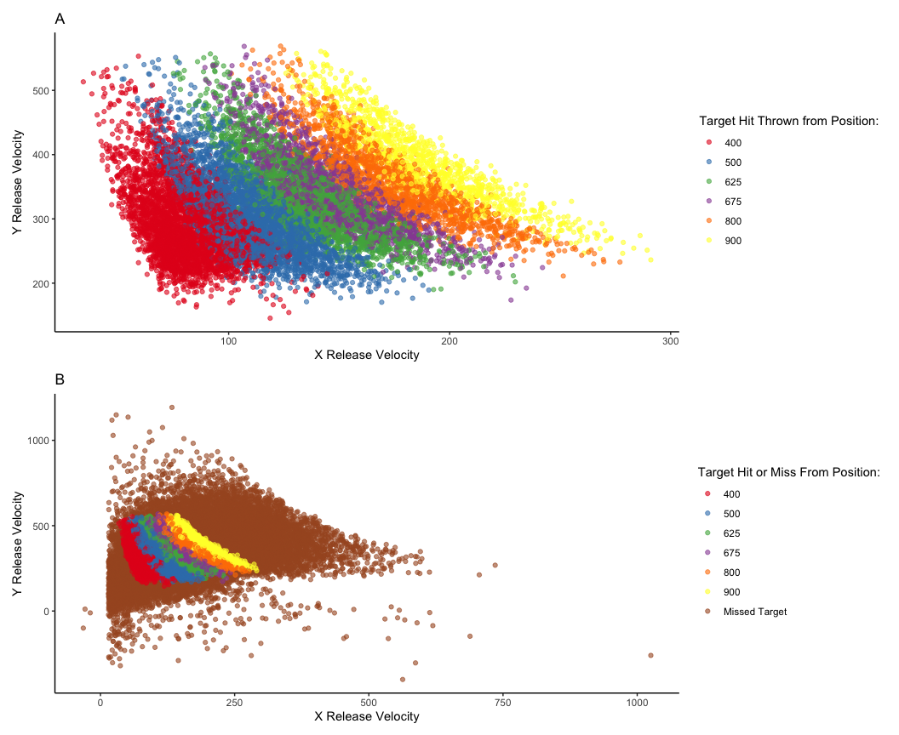

Figure 8: A) A visual representation of the combinations of throw
parameters (x and y velocities applied to the ball at launch), which
resulted in target hits during the testing phase. This empirical
solution space was compiled from all of the participants in experiment
2. B) shows the solution space within the context of all of the throws
made throughout the testing phase of the experiment.

For each individual trial, the Euclidean distance (Equation 1) was
computed between the velocity components (x and y) of that trial and the
velocity components of each individual solution throw for each of the 6
positions from which participants would be tested in the final phase of
the study. The P parameter in Equation 1 is set equal to 2, reflecting a
Gaussian similarity gradient. Then, as per an instance-based model of
similarity (Logan, 2002; Nosofsky, 1992), these distances were
multiplied by a sensitivity parameter, c, and then exponentiated to
yield a similarity value. The parameter c controls the rate with which
similarity-based generalization drops off as the Euclidean distance
between two throws in x- and y-velocity space increases. If c has a
large value, then even a small difference between two throws’ velocities
greatly decreases the extent of generalization from one to the other. A
small value for c produces broad generalization from one throw to
another despite relatively large differences in their velocities. The
similarity values for each training individual throw made by a given
participant were then summed to yield a final similarity score, with a
separate score computed for each of the 6 testing positions. The final
similarity score is construable as index of how accurate the throws a
participant made during the training phase would be for each of the
testing positions.

**Equation 1:** $$ Similarity_{I,J} = \sum_{i=I}\sum_{j=J}
(e^{-c^\cdot d^{p}_{i,j}}) $$

**Equation 2:**
$$ d_{i,j} = \sqrt{(x_{Train_i}-x_{Solution_j})^2 + (y_{Train_i}-y_{Solution_j})^2 } $$

A simple linear regression revealed that these similarity scores were
significantly predictive of performance in the transfer stage, t
=-15.88, p\<.01, $r^2$=.17, such that greater similarity between
training throws and solution spaces for each of the test locations
resulted in better performance. We then repeated the group comparisons
above while including similarity as a covariate in the model. Comparing
the varied and constant groups in testing performance from all testing
positions yielded a significant effect of similarity, F(1, 205)=85.66,
p\<.001, $\eta^{2}_G$ =.29, and also a significant effect of condition
(varied vs. constant), F(1, 205)=6.03, p=.015, $\eta^{2}_G$ =.03. The
group comparison limited to only novel locations for the varied group
pit against trained location for the constant group resulted in a
significant effect of similarity, F(1,148)=31.12, p\<.001, $\eta^{2}_G$
=.18 as well as for condition F(1,148)=11.55, p\<.001, $\eta^{2}_G$
=.07. For all comparisons, the pattern of results was consistent with
the initial findings from Experiment 2, with the varied group still
performing significantly better than the constant group.

## Fitting model parameters separately by group

To directly control for similarity in Experiment 2, we developed a
model-based measure of the similarity between training throws and
testing conditions. This similarity measure was a significant predictor
of testing performance, e.g., participants whose training throws were
more similar to throws that resulted in target hits from the testing
positions, tended to perform better during the testing phase.
Importantly, the similarity measure did not explain away the group-level
benefits of varied training, which remained significant in our linear
model predicting testing performance after similarity was added to the
model. However, previous research has suggested that participants may
differ in their level of generalization as a function of prior
experience, and that such differences in generalization gradients can be
captured by fitting the generalization parameter of an instance-based
model separately to each group (Hahn et al., 2005; Lamberts, 1994).
Relatedly, the influential Bayesian generalization model developed by
Tenenbaum & Griffiths (2001) predicts that the breadth of generalization
will increase when a rational agent encounters a wider variety of
examples. Following these leads, we assume that in addition to learning
the task itself, participants are also adjusting how generalizable their
experience should be. Varied versus constant participants may be
expected to learn to generalize their experience to different degrees.
To accommodate this difference, the generalization parameter of the
instance-based model (in the present case, the c parameter) can be
allowed to vary between the two groups to reflect the tendency of
learners to adaptively tune the extent of their generalization. One
specific hypothesis is that people adaptively set a value of c to fit
the variability of their training experience (Nosofsky & Johansen, 2000;
Sakamoto et al., 2006). If one’s training experience is relatively
variable, as with the variable training condition, then one might infer
that future test situations will also be variable, in which case a low
value of c will allow better generalization because generalization will
drop off slowly with training-to-testing distance. Conversely, if one’s
training experience has little variability, as found in the constant
training conditions, then one might adopt a high value of c so that
generalization falls off rapidly away from the trained positions.

To address this possibility, we compared the original instance-based
model of similarity fit against a modified model which separately fits
the generalization parameter, c, to varied and constant participants. To
perform this parameter fitting, we used the optim function in R, and fit
the model to find the c value(s) that maximized the correlation between
similarity and testing performance.

Both models generate distinct similarity values between training and
testing locations. Much like the analyses in Experiment 2, these
similarity values are regressed against testing performance in models of
the form shown below. As was the case previously, testing performance is
defined as the mean absolute distance from the center of the target
(with a separate score for each participant, from each position).

Linear models 1 and 3 both show that similarity is a significant
predictor of testing performance (p\<.01). Of greater interest is the
difference between linear model 2, in which similarity is computed from
a single c value fit from all participants (Similarity1c), with linear
model 4, which fits the c parameter separately between groups
(Similarity2c). In linear model 2, the effect of training group remains
significant when controlling for Similarity1c (p\<.01), with the varied
group still performing significantly better. However, in linear model 4
the addition of the Similarity2c predictor results in the effect of
training group becoming nonsignificant (p=.40), suggesting that the
effect of varied vs. constant training is accounted for by the
Similarity2c predictor. Next, to further establish a difference between
the models, we performed nested model comparisons using ANOVA, to see if
the addition of the training group parameter led to a significant
improvement in model performance. In the first comparison, ANOVA(Linear
Model 1, Linear Model 2), the addition of the training group predictor
significantly improved the performance of the model (F=22.07, p\<.01).
However, in the second model comparison, ANOVA (Linear model 3, Linear
Model 4) found no improvement in model performance with the addition of
the training group predictor (F=1.61, p=.20).

Finally, we sought to confirm that similarity values generated from the
adjusted Similarity2c model had more predictive power than those
generated from the original Similarity1c model. Using the BIC function
in R, we compared BIC values between linear model 1 (BIC=14604.00) and
linear model 3 (BIC = 14587.64). The lower BIC value of model 3 suggests
a modest advantage for predicting performance using a similarity measure
computed with two c values over similarity computed with a single c
value. When fit with separate c values, the best fitting c parameters
for the model consistently optimized such that the c value for the
varied group (c=.00008) was smaller in magnitude than the c value for
the constant group(c= .00011). Recall that similarity decreases as a
Gaussian function of distance (equation 1 above), and a smaller value of
c will result in a more gradual drop-off in similarity as the distance
between training throws and testing solutions increases.

In summary, our modeling suggests that an instance-based model which
assumes equivalent generalization gradients between constant and varied
trained participants is unable to account for the extent of benefits of
varied over constant training observed at testing. The evidence for this
in the comparative model fits is that when a varied/constant dummy-coded
variable for condition is explicitly added to the model, the variable
adds a significant contribution to the prediction of test performance,
with the variable condition yielding better performance than the
constant conditions. However, if the instance-based generalization model
is modified to assume that the training groups can differ in the
steepness of their generalization gradient, by incorporating a separate
generalization parameter for each group, then the instance-based model
can account for our experimental results without explicitly taking
training group into account. Henceforth this model will be referred to
as the Instance-based Generalization with Adaptive Similarity (IGAS)
model.

# General Discussion

Across two experiments, we found evidence in support of the benefits of
variability hypothesis in a simple, computerized projectile throwing
task. Generalization was observed in both constant and varied
participants, in that both groups tended to perform better at novel
positions in the testing phase than did participants who started with
those positions in the training phase. However, varied trained
participants consistently performed better than constant trained
participants, in terms of both the testing phase in general, and in a
comparison that only included untrained positions. We also found some
evidence for the less commonly observed pattern wherein varied-trained
participants outperform constant-trained participants even from
conditions identical to the constant group training (Goode et al., 2008;
Green et al., 1995; Kerr & Booth, 1978). In Experiment 1 varied
participants performed significantly better on this identity comparison.
In Experiment 2, the comparison was not significant initially, but
became significant after controlling for the similarity measure that
incorporates only a single value for the steepness of similarity-based
generalization (c). Furthermore, we showed that the general pattern of
results from Experiment 2 could be parsimoniously accommodated by an
instance-based similarity model, but only with the assumption that
constant and varied participants generalize their training experience to
different degrees.

Our results thus suggest that the benefits of variation cannot be
explained by the varied-trained participants simply covering a broader
range of the task space. Rather, the modeling suggests that varied
participants also learn to adaptively tune their generalization function
such that throwing locations generalize more broadly to one another than
they do in the constant condition. A learning system could end up
adopting a higher c value in the constant than variable training
conditions by monitoring the trial-by-trial variability of the training
items. The c parameter would be adapted downwards when adjacent training
items are dissimilar to each other and adapted upwards when adjacent
training items are the same. In this fashion, contextually appropriate c
values could be empirically learned. This learning procedure would
capture the insight that if a situation has a high amount variability,
then the learner should be predisposed toward thinking that subsequent
test items will also show considerable variability, in which case
generalization gradients should be broad, as is achieved by low values
for c. Sakamoto et al. (2006) implemented a similar learning mechanism
for updating the generalization paramater in an exemplar-based model
(although in their model, a separate generalization parameter is
assigned to each exemplar). In their experiment, participants were
trained on a high variability and a low variability category, and the
dynamically updated generalization parameter was necessary to account
for broader generalization observed around the high variability category
when participants were tested with an ambiguous intermediary item. In a
subsequent work (Sakamoto et al., 2008), the same authors showed that a
similar learning mechanism could account for the pattern wherein
participants generalize more broadly around a category when the average
distance between the category exemplars is larger (however the only
model tested in this work was a prototype model).

Also of interest is whether the IGAS model can predict the pattern of
results wherein the varied condition outperforms the constant condition
even from the position on which the constant condition trained. Although
our models were fit using all of the Experiment 2 training and testing
data, not just that of the identity comparisons, in
<a href="#fig-Toy-Model-dis" class="quarto-xref">Figure 9</a> we
demonstrate how a simplified version of the IGAS model could in
principle produce such a pattern. In addition to the assumption of
differential generalization between varied and constant conditions, our
simplified model makes explicit an assumption that is incorporated into
the full IGAS model – namely that even when being tested from a position
identical to that which was trained, there are always some psychological
contextual differences between training and testing throws, resulting in
a non-zero dissimilarity.

Figure 9: A simple model depicting the necessity of both of two
separately fit generalization parameters, c, and a positive distance
between training and testing contexts, in order for an instance model to
predict a pattern of varied training from stimuli 400 and 800
outperforming constant training from position 600 at a test position of
600. For the top left panel, in which the generalization model assumes a
single c value (-.008) for both varied and constant conditions, and
identical contexts across training and testing, the equation which
generates the varied condition is - Amount of Generalization =
$e^{(c\cdot|x-800|)} + e^{(c\cdot|x-400|)}$, whereas the constant group
generalization is generated from $2\cdot e^{(c\cdot|x-600|)}$. For the
top right panel, the c constants in the original equations are different
for the 2 conditions, with $c=-.002$ for the varied condition, and
$c=-.008$ for the constant condition. The bottom two panels are
generated from identical equations to those immediately above, except
for the addition of extra distance (100 units) to reflect the assumption
of some change in context between training and testing conditions. Thus,
the generalization model for the varied condition in the bottom-right
panel is of the form - Amount of Generalization =
$e^{(c_{varied}\cdot|x-800|)}+e^{(c_{varied}\cdot|x-400|)}$ .

As described above, the idea that learners flexibly adjust their
generalization gradient based on prior experience does have precedent in
the domains of category learning (Aha & Goldstone, 1992; Briscoe &
Feldman, 2011; Hahn et al., 2005; Lamberts, 1994; Op de Beeck et al.,
2008), and sensorimotor adaptation (Marongelli & Thoroughman, 2013;
Taylor & Ivry, 2013; Thoroughman & Taylor, 2005). Lamberts (1994) showed
that a simple manipulation of background knowledge during a
categorization test resulted in participants generalizing their training
experience more or less broadly, and moreover that such a pattern could
be captured by allowing the generalization parameter of an
instance-based similarity model to be fit separately between conditions.
The flexible generalization parameter has also successfully accounted
for generalization behavior in cases where participants have been
trained on categories that differ in their relative variability (Hahn et
al., 2005; Sakamoto et al., 2006). However, to the best of our
knowledge, IGAS is the first instance-based similarity model that has
been put forward to account for the effect of varied training in a
visuomotor skill task. Although IGAS was inspired by work in the domain
of category learning, its success in a distinct domain may not be
surprising in light of the numerous prior observations that at least
certain aspects of learning and generalization may operate under common
principles across different tasks and domains (Censor et al., 2012;
Hills et al., 2010; Jamieson et al., 2022; Law & Gold, 2010; Roark et
al., 2021; Rosenbaum et al., 2001; Vigo et al., 2018; Wall et al., 2021;
Wu et al., 2020; Yang et al., 2020).

Our modelling approach does differ from category learning
implementations of instance-based models in several ways. One such
difference is the nature of the training instances that are assumed to
be stored. In category learning studies, instances are represented as
points in a multidimensional space of all of the attributes that define
a category item (e.g. size/color/shape). Rather than defining instances
in terms of what stimuli learners experience, our approach assumes that
stored, motor instances reflect how they act, in terms of the velocity
applied to the ball on each throw. An advantage of many motor learning
tasks is the relative ease with which task execution variables can be
directly measured (e.g. movement force, velocity, angle, posture) in
addition to the decision and response time measures that typically
exhaust the data generated from more classical cognitive tasks. Of
course, whether learners actually are storing each individual motor
instance is a fundamental question beyond the scope of the current work
– though as described in the introduction there is some evidence in
support of this idea (Chamberlin & Magill, 1992a; Crump & Logan, 2010;
Hommel, 1998; Meigh et al., 2018; Poldrack et al., 1999). A particularly
noteworthy instance-based model of sensory-motor behavior is the
Knowledge II model of Rosenbaum and colleagues (Cohen & Rosenbaum, 2004;
Rosenbaum et al., 1995). Knowledge II explicitly defines instances as
postures (joint combinations), and is thus far more detailed than IGAS
in regards to the contents of stored instances. Knowledge II also
differs from IGAS in that learning is accounted for by both the
retrieval of stored postures, and the generation of novel postures via
the modification of retrieved postures. A promising avenue for future
research would be to combine the adaptive similarity mechanism of IGAS
with the novel instance generation mechanisms of Knowledge II.

Our findings also have some conceptual overlap with an earlier study on
the effects of varied training in a coincident timing task (Catalano &
Kleiner, 1984). In this task, participants observe a series of lamps
lighting up consecutively, and attempt to time a button press with the
onset of the final lamp. The design consisted of four separate constant
groups, each training from a single lighting velocity, and a single
varied group training with all four of the lighting velocities used by
the individual constant groups. Participants were then split into four
separate testing conditions, each of which were tested from a single
novel lighting velocity of varying distance from the training
conditions. The result of primary interest was that all participants
performed worse as the distance between training and testing velocity
increased – a typical generalization decrement. However, varied
participants showed less of a decrement than did constant participants.
The authors take this result as evidence that varied training results in
a less-steep generalization gradient than does constant training.
Although the experimental conclusions of Catalano and Kleiner are
similar to our own, our work is novel in that we account for our results
with a cognitive model, and without assuming the formation of a schema.
Additionally, the way in which Catalano and Kleiner collapse their
separate constant groups together may result in similarity confounds
between varied and constant conditions that leaves their study open to
methodological criticisms, especially in light of related work which
demonstrated that the extent to which varied training may be beneficial
can depend on whether the constant group they are compared against
trained from similar conditions to those later tested (Wrisberg et al.,
1987). Our study alleviates such concerns by explicitly controlling for
similarity.

## Limitations

A limitation of this study concerns the ordering of the testing/transfer
trials at the conclusion of both experiments. Participants were tested
from each separate position (4 in Experiment 1, 6 in Experiment 2) in a
random, intermixed order. Because the varied group was trained from two
positions that were also randomly ordered, they may have benefited from
experience with this type of sequencing, whereas the constant groups had
no experience with switching between positions trial to trial. This
concern is somewhat ameliorated by the fact that the testing phase
performance of the constant groups from their trained position was not
significantly worse than their level of performance at the end of the
training phase, suggesting that they were not harmed by random ordering
of positions during testing. It should also be noted that the
computerized task utilized in the present work is relatively simple
compared to many of the real-world tasks utilized in prior research. It
is thus conceivable that the effect of variability in more complex tasks
is distinct from the process put forward in the present work. An
important challenge for future work will be to assess the extent to
which IGAS can account for generalization in relatively complex tasks
with far more degrees of freedom.

It is common for psychological process models of categorization learning
to use an approach such as multidimensional scaling so as to transform
the stimuli from the physical dimensions used in the particular task
into the psychological dimensions more reflective of the actual human
representations (Nosofsky, 1992; Shepard, 1987). Such scaling typically
entails having participants rate the similarity between individual items
and using these similarity judgements to then compute the psychological
distances between stimuli, which can then be fed into a subsequent
model. In the present investigation, there was no such way to scale the
x and y velocity components in terms of the psychological similarity,
and thus our modelling does rely on the assumption that the
psychological distances between the different throwing positions are
proportional to absolute distances in the metric space of the task
(e.g. the relative distance between positions 400 and 500 is equivalent
to that between 800 and 900). However, an advantage of our approach is
that we are measuring similarity in terms of how participants behave
(applying a velocity to the ball), rather than the metric features of
the task stimuli.

## Conclusion

Our experiments add to the longstanding body of research investigating
the effect of training variability on learning and generalization. Both
experiments demonstrate a reliable benefit of varied training over
constant training in a projectile launching task. We also introduce the
Instance-based Generalization with Adaptive Similarity (IGAS) as a novel
explanation for the effect of variability on generalization. The key
assumption made by IGAS is that the amount of variation encountered
during training influences the steepness of the generalization gradient.
Instance-based models augmented with this assumption may be a valuable
approach towards better understanding skill generalization and transfer.

# Appendix

<!-- Reviewer #2: This study addresses a question that is important both theoretically and practically. However, the authors need to rule out the following, less interesting alternative. Namely, the results could be due to task practice effect, as follows.
&#10;Since there was no pre-training test, and no practice trials (as far as I can tell), and since the task was an online motor task that participants could not rely on their prior motor experience, trying to launch the ball to the target could only be done via trial and error. For the varied training group, they got to practice at two distances. Therefore, they had a better "calibration" in terms of the relationship between launching speed and target distance. This was likely beneficial both in Exp.1 when both transfer distances were interpolations from the two trained distances, and in Exp.2 when two transfer distances were interpolations and two were extrapolations but the latter two were immediately next to the training distances.
&#10;In comparison, since the constant group trained at only a single distance, any transfer distance (or at least the first transfer distance tested) was extrapolation even if this transfer distance was shorter than the trained, because the participants did not know beforehand how to shoot the ball to the shortest distance due to the existence of the barrier. If the transfer distance was longer, for sure that was extrapolation.
&#10;
Regardless, the above analysis suggests that the constant group would always be a step behind the varied group. The number of trials at each transfer distance may not be sufficient for them to catch up the varied group either (whether there was learning during testing should be checked). If such disadvantage for the constant group is indeed due to the lack of tryout opportunities, then the authors should verify whether the same results still hold if all groups were provided opportunities to practice, or if pre-training tests across all distances were offered. -->

### exponential learning models fit to individual subjects

### Group comparison of learning rate fits

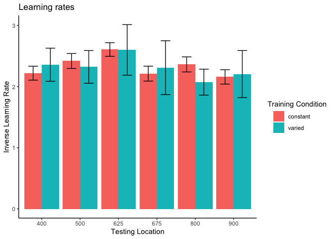

### First vs. second half of testing stage

### Group Comparison for asymptote-starting performance

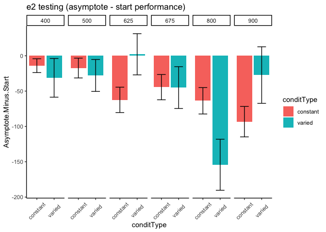

### Relative distance and under/overshooting

Reviewer 3 Absolute versus relative distance: From a methodological
standpoint, I understand the need to differentiate these two types of
distance. However, from a theoretical perspective there may be some
issue in differentiating these two concepts. Schema theory relies on
relative (or invariant) information to inform the motor program.
However, both distances would be important to an instance or exemplar
representation. You may want to consider commenting on this issue.

Reviewer 2 For the same reason, the plots showing improvement during
training could be due to participants learning the task, rather than
fine motor skills. Although task learning and motor learning are
impossible to separate cleanly, the common practice in the field is
indeed to offer practice trials to reduce the task learning aspects. The
authors should address this.

In addition to absolute errors (which is related to variance), the
authors should also provide other measures of performance, e.g., the
mean of the signed errors, so that readers have a better idea whether
there was any meaningful over- or undershooting.

#### experiment 1 training - relative distances

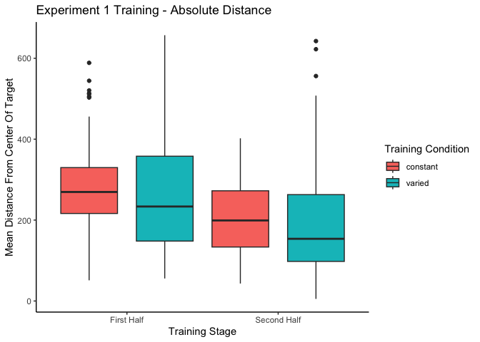

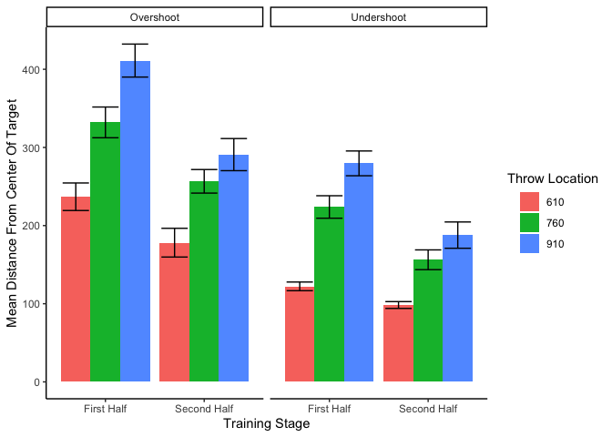

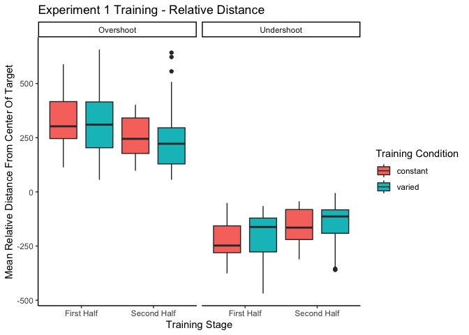

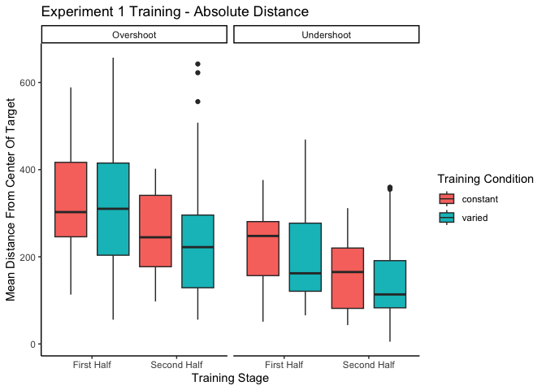

    =========================================================================
    conditType devianceDirection      610            760            910      
    -------------------------------------------------------------------------
    constant       Overshoot                    311.84(307.92)               
    constant      Undershoot                    188.05(163.62)               
    varied         Overshoot     211.69(234.97)                360.14(322.01)
    varied        Undershoot     107.35(81.21)                 244.85(196.47)
    -------------------------------------------------------------------------

    ======================================================
    conditType      610           760            910      
    ------------------------------------------------------
    constant                 121.03(269.17)               
    varied     39.91(178.12)                150.53(290.04)
    ------------------------------------------------------

    ====================================================================
    conditType     610           760            835            910      
    --------------------------------------------------------------------
    constant   7.13(124.02) 107.02(218.49) 142.42(252.34) 122.92(282.58)
    varied     3.19(96.67)   92.1(173.9)   103.84(214.4)  108.12(234.59)
    --------------------------------------------------------------------

#### experiment 2 training - relative distances

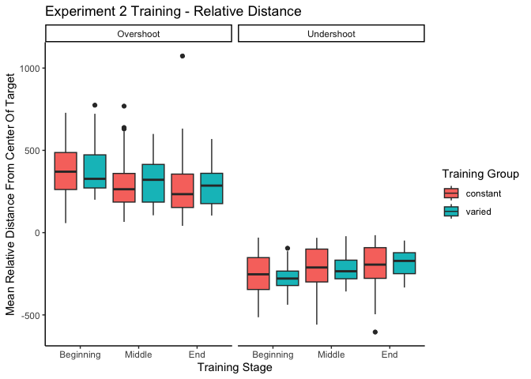

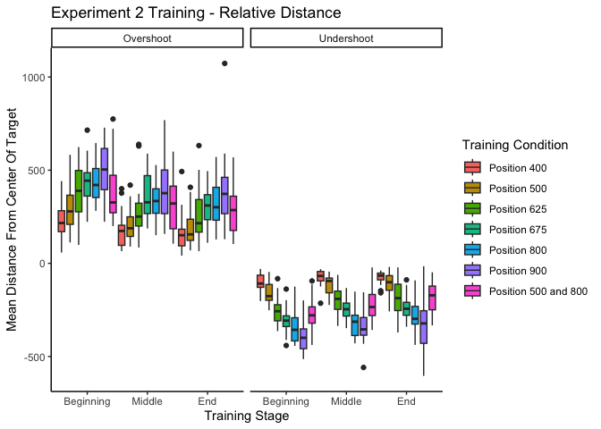

#### Experiment 1 Testing - relative distances

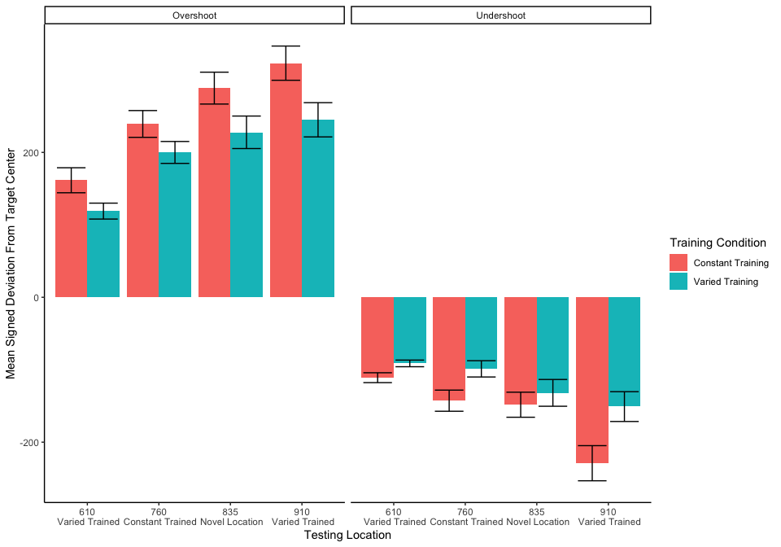

    ====================================================================================================================================
    conditType2         msdu_610       msdu_760       msdu_835       msdu_910      msds_610      msds_760      msds_835      msds_910   
    ------------------------------------------------------------------------------------------------------------------------------------
    Constant Training 136.27(84.29) 191.65(112.65) 219.46(139.91) 276.75(153.09) 25.28(158.98) 50.82(217.48) 73.14(250.93) 50.76(313.77)
    Varied Training   105.12(51.39)  149.37(93.4)  180.54(129.52) 198.64(137.84) 13.85(116.87) 50.59(169.59) 50.52(217.39) 49.94(237.71)
    ------------------------------------------------------------------------------------------------------------------------------------

    =========================================================================
    Condition              610           760           835           910     
    -------------------------------------------------------------------------
    Constant Training 25.28(158.98) 50.82(217.48) 73.14(250.93) 50.76(313.77)
    Varied Training   13.85(116.87) 50.59(169.59) 50.52(217.39) 49.94(237.71)
    -------------------------------------------------------------------------

#### Experiment 2 Testing - relative distances

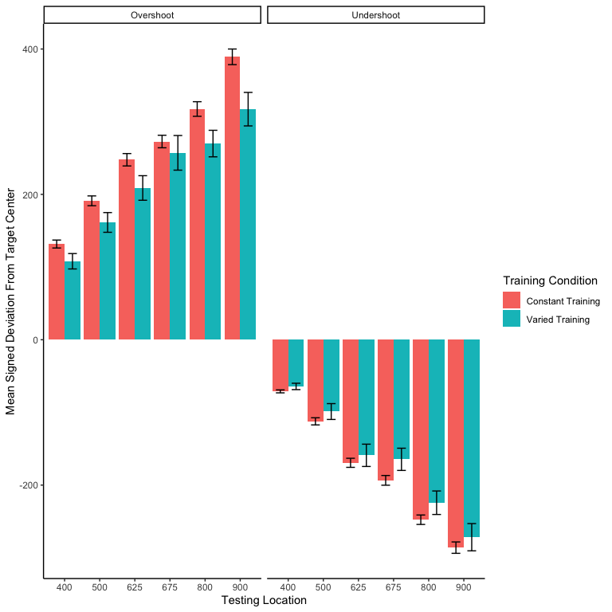

#### Experimenet 1 - intermittent testing

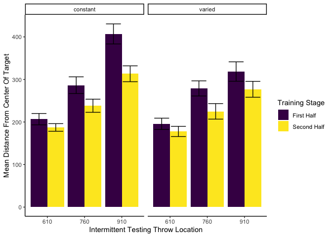

    ======================================================================================================
    Condition 610_First Half 760_First Half 910_First Half 610_Second Half 760_Second Half 910_Second Half
    ------------------------------------------------------------------------------------------------------
    constant  206.64(82.08)  286.51(121.07) 406.93(145.2)   187.2(55.24)    238.21(95.16)  313.27(114.86) 
    varied    195.68(78.58)  278.9(105.37)  318.53(134.81)  177.79(70.82)  224.98(108.04)   276.86(110.5) 
    ------------------------------------------------------------------------------------------------------

### Training plots - Experiment 1

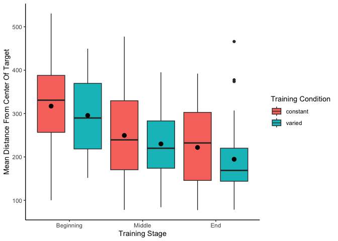

#### Not in manuscript

#### fit to testing performance averaged across positions

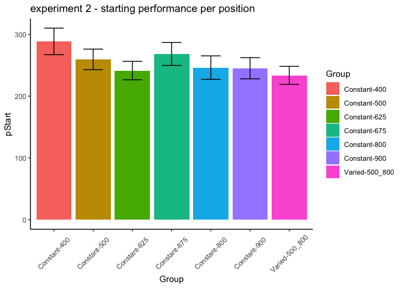

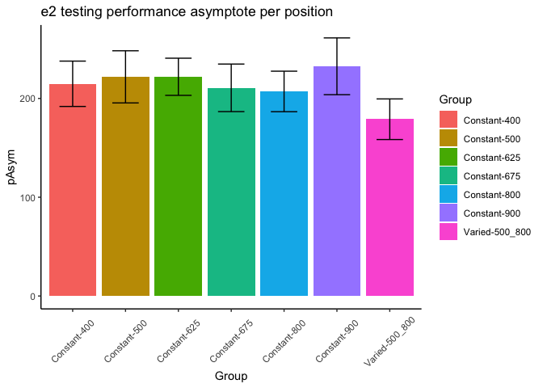

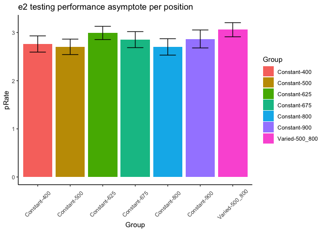

#### statistical tests for starting performance

    ANOVA Table (type III tests)

          Effect DFn DFd    F     p p<.05   ges
    1 conditType   1 206 3.04 0.083       0.015

#### statistical tests for asymptote

    ANOVA Table (type III tests)

          Effect DFn DFd    F     p p<.05   ges
    1 conditType   1 206 3.38 0.067       0.016

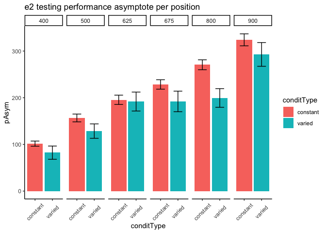

# References

Aha, D. W., & Goldstone, R. L. (1992). Concept Learning and Flexible
Weighting. *In Proceedings of the Fourteenth Annual Conference of the
Cognitive Science Society*, 534–539.

Briscoe, E., & Feldman, J. (2011). Conceptual complexity and the
bias/variance tradeoff. *Cognition*, *118*(1), 2–16.
<https://doi.org/10.1016/j.cognition.2010.10.004>

Catalano, J. F., & Kleiner, B. M. (1984). Distant Transfer in Coincident
Timing as a Function of Variability of Practice. *Perceptual and Motor
Skills*, *58*(3), 851–856. <https://doi.org/10.2466/pms.1984.58.3.851>

Censor, N., Sagi, D., & Cohen, L. G. (2012). Common mechanisms of human
perceptual and motor learning. *Nature Reviews Neuroscience*, *13*(9),
658–664. <https://doi.org/10.1038/nrn3315>

Chamberlin, C. J., & Magill, R. A. (1992a). A Note on Schema and
Exemplar Approaches to Motor Skill Representation in Memory. *Journal of
Motor Behavior*, *24*(2), 221–224.
<https://doi.org/10.1080/00222895.1992.9941617>

Chamberlin, C. J., & Magill, R. A. (1992b). The Memory Representation of
Motor Skills: A Test of Schema Theory. *Journal of Motor Behavior*,
*24*(4), 309–319. <https://doi.org/10.1080/00222895.1992.9941627>

Chua, L.-K., Dimapilis, M. K., Iwatsuki, T., Abdollahipour, R.,
Lewthwaite, R., & Wulf, G. (2019). Practice variability promotes an
external focus of attention and enhances motor skill learning. *Human
Movement Science*, *64*, 307–319.
<https://doi.org/10.1016/j.humov.2019.02.015>

Cochrane, A. (2020). TEfits: Nonlinear regression for time-evolving
indices. *Journal of Open Source Software*, *5*(52), 2535.
<https://doi.org/10.21105/joss.02535>

Cohen, R. G., & Rosenbaum, D. A. (2004). Where grasps are made reveals
how grasps are planned: Generation and recall of motor plans.
*Experimental Brain Research*, *157*(4).
<https://doi.org/10.1007/s00221-004-1862-9>

Crump, M. J. C., & Logan, G. D. (2010). Episodic contributions to
sequential control: Learning from a typist’s touch. *Journal of
Experimental Psychology: Human Perception and Performance*, *36*(3),
662–672. <https://doi.org/10.1037/a0018390>

de Leeuw, J. R. (2015). jsPsych: A
JavaScript library for creating behavioral experiments in a Web browser.
*Behavior Research Methods*, *47*(1), 1–12.
<https://doi.org/10.3758/s13428-014-0458-y>

Ennis, D. M., Palen, J. J., & Mullen, K. (1988). A multidimensional
stochastic theory of similarity. *Journal of Mathematical Psychology*,
*32*(4), 449–465. <https://doi.org/10.1016/0022-2496(88)90023-5>

Estes, W. K. (1994). *Classification and Cognition*. Oxford University
Press.

Faul, F., Erdfelder, E., Buchner, A., & Lang, A.-G. (2009). Statistical
power analyses using G\*Power 3.1: Tests for correlation and regression
analyses. *Behavior Research Methods*, *41*(4), 1149–1160.
<https://doi.org/10.3758/BRM.41.4.1149>

Gandolfo, F., Mussa-Ivaldi, F. A., & Bizzi, E. (1996). Motor learning by
field approximation. *Proceedings of the National Academy of Sciences*,
*93*(9), 3843–3846. <https://doi.org/10.1073/pnas.93.9.3843>

Ghahramani, Z., Wolpert, D. M., & Jordan, M. I. (1996). Generalization
to Local Remappings of the Visuomotor Coordinate Transformation.
*Journal of Neuroscience*, *16*(21), 7085–7096.
<https://doi.org/10.1523/JNEUROSCI.16-21-07085.1996>

Goode, M. K., Geraci, L., & Roediger, H. L. (2008). Superiority of
variable to repeated practice in transfer on anagram solution.
*Psychonomic Bulletin & Review*, *15*(3), 662–666.
<https://doi.org/10.3758/PBR.15.3.662>

Goodwin, J. E., Eckerson, J. M., Grimes, C. R., & Gordon, P. M. (1998).
Effect of Different Quantities of Variable Practice on Acquisition,
Retention, and Transfer of An Applied Motor Skill. *Perceptual and Motor
Skills*, *87*(1), 147–151. <https://doi.org/10.2466/pms.1998.87.1.147>

Green, D. P., Whitehead, J., & Sugden, D. A. (1995). Practice
Variability and Transfer of a Racket Skill. *Perceptual and Motor
Skills*, *81*(3_suppl), 1275–1281.
<https://doi.org/10.2466/pms.1995.81.3f.1275>

Hahn, U., Bailey, T. M., & Elvin, L. B. C. (2005). Effects of category
diversity on learning, memory, and generalization. *Memory & Cognition*,
*33*(2), 289–302. <https://doi.org/10.3758/BF03195318>

Hills, T. T., Todd, P. M., & Goldstone, R. L. (2010). The central
executive as a search process: Priming exploration and exploitation
across domains. *Journal of Experimental Psychology: General*, *139*(4),
590–609. <https://doi.org/10.1037/a0020666>

Hintzman, D. L. (1984). MINERVA 2: A simulation model of human memory.
*Behavior Research Methods, Instruments, & Computers*, *16*(2), 96–101.
<https://doi.org/10.3758/BF03202365>

Hommel, B. (1998). Event Files: Evidence for Automatic Integration of
Stimulus-Response Episodes. *Visual Cognition*, *5*(1-2), 183–216.
<https://doi.org/10.1080/713756773>

Jamieson, R. K., Johns, B. T., Vokey, J. R., & Jones, M. N. (2022).
Instance theory as a domain-general framework for cognitive psychology.
*Nature Reviews Psychology*, *1*(3), 174–183.
<https://doi.org/10.1038/s44159-022-00025-3>

Kassambara, A. (2021). *Rstatix: Pipe-Friendly Framework for Basic
Statistical Tests*.

Kerr, R., & Booth, B. (1978). Specific and varied practice of motor
skill. *Perceptual and Motor Skills*, *46*(2), 395–401.
<https://doi.org/10.1177/003151257804600201>

Lamberts, K. (1994). Flexible Tuning of Similarity in Exemplar-Based
Categorization. *Journal of Experimental Psychology: Learning, Memory,
and Cognition*, *20*(5), 1003–1021.
<https://doi.org/10.1037/0278-7393.20.5.1003>

Law, C.-T., & Gold, J. I. (2010). Shared Mechanisms of Perceptual
Learning and Decision Making. *Topics in Cognitive Science*, *2*(2),
226–238. <https://doi.org/10.1111/j.1756-8765.2009.01044.x>

Logan, G. D. (1988). Toward an instance theory of automatization.
*Psychological Review*, *95*(4), 492–527.
<https://doi.org/10.1037/0033-295X.95.4.492>

Logan, G. D. (2002). An instance theory of attention and memory.
*Psychological Review*, *109*(2), 376–400.
<https://doi.org/10.1037/0033-295X.109.2.376>

Marongelli, E., & Thoroughman, K. (2013). The advantage of flexible
neuronal tunings in neural network models for motor learning. *Frontiers
in Computational Neuroscience*, *7*, 100.
<https://doi.org/10.3389/fncom.2013.00100>

McCracken, H. D., & Stelmach, G. E. (1977). A Test of the Schema Theory
of Discrete Motor Learning. *Journal of Motor Behavior*, *9*(3),
193–201. <https://doi.org/10.1080/00222895.1977.10735109>

Medin, D. L., & Schaffer, M. M. (1978). Context Theory of Classification
Learning. *Psychological Review*, *85*(3), 207.
<https://doi.org/10.1037/0033-295X.85.3.207>

Meigh, K. M., Shaiman, S., Tompkins, C. A., Abbott, K. V., &
Nokes-Malach, T. (2018). What memory representation is acquired during
nonword speech production learning? The influence of stimulus features
and training modality on nonword encoding. *Cogent Psychology*, *5*(1),
1493714. <https://doi.org/10.1080/23311908.2018.1493714>

Moxley, S. E. (1979). Schema: The Variability of Practice Hypothesis.
*Journal of Motor Behavior*, *11*(1), 65–70.
<https://doi.org/10.1080/00222895.1979.10735173>

Newell, K. M. (2003). Schema Theory (1975): Retrospectives and
Prospectives. *Research Quarterly for Exercise and Sport*, *74*(4),
383–388. <https://doi.org/10.1080/02701367.2003.10609108>

Newell, K. M., & Shapiro, D. C. (1976). Variability of Practice and
Transfer of Training: Some Evidence Toward a Schema View of Motor
Learning. *Journal of Motor Behavior*, *8*(3), 233–243.
<https://doi.org/10.1080/00222895.1976.10735077>

Nosofsky, R. M. (1986). Attention, similarity, and the
identification-categorization relationship. *Journal of Experimental
Psychology: General*, *115*(1), 39–57.
<https://doi.org/10.1037/0096-3445.115.1.39>

Nosofsky, R. M. (1992). Similarity scaling and cognitive process models.
*Annual Review of Psychology*, *43*(1), 25–53.
<https://doi.org/10.1146/annurev.ps.43.020192.000325>

Nosofsky, R. M., & Johansen, M. K. (2000). Exemplar-based accounts of
"multiple-system" phenomena in perceptual categorization. *Psychonomic
Bulletin & Review*, *7*(3), 375–402.
<https://doi.org/10.1007/BF03543066>

Op de Beeck, H. P., Wagemans, J., & Vogels, R. (2008). The
representation of perceived shape similarity and its role for category
learning in monkeys: A modeling study. *Vision Research*, *48*(4),
598–610. <https://doi.org/10.1016/j.visres.2007.11.019>

Palmeri, T. J. (1997). Exemplar Similarity and the Development of
Automaticity. *Journal of Experimental Psychology: Human Learning and
Memory*, *23*(2), 324–354.

Pigott, R. E., & Shapiro, D. C. (1984). Motor Schema: The Structure of
the Variability Session. *Research Quarterly for Exercise and Sport*,
*55*(1), 41–45. <https://doi.org/10.1080/02701367.1984.10605353>

Poldrack, R. A., Selco, S. L., Field, J. E., & Cohen, N. J. (1999). The
relationship between skill learning and repetition priming: Experimental
and computational analyses. *Journal of Experimental Psychology:
Learning, Memory, and Cognition*, *25*(1), 208–235.
<https://doi.org/10.1037/0278-7393.25.1.208>

Posner, M. I., & Keele, S. W. (1968). On the genesis of abstract ideas.
*Journal of Experimental Psychology*, *77*(3), 353–363.
<https://doi.org/10.1037/h0025953>

Roark, C. L., Paulon, G., Sarkar, A., & Chandrasekaran, B. (2021).
Comparing perceptual category learning across modalities in the same
individuals. *Psychonomic Bulletin & Review*, *28*(3), 898–909.
<https://doi.org/10.3758/s13423-021-01878-0>

Roller, C. A., Cohen, H. S., Kimball, K. T., & Bloomberg, J. J. (2001).
Variable practice with lenses improves visuo-motor plasticity.
*Cognitive Brain Research*, *12*(2), 341–352.
<https://doi.org/10.1016/S0926-6410(01)00077-5>

Rosenbaum, D. A., Carlson, R. A., & Gilmore, R. O. (2001). Acquisition
of Intellectual and Perceptual-Motor Skills. *Annual Review of
Psychology*, *52*(1), 453–470.
<https://doi.org/10.1146/annurev.psych.52.1.453>

Rosenbaum, D. A., Loukopoulos, L. D., Meulenbroek, R. G., Vaughan, J., &
Engelbrecht, S. E. (1995). Planning reaches by evaluating stored
postures. *Psychological Review*, *102*(1), 28.
<https://doi.org/10.1037/0033-295X.102.1.28>

Sakamoto, Y., Jones, M., & Love, B. C. (2008). Putting the psychology
back into psychological models: Mechanistic versus rational approaches.
*Memory & Cognition*, *36*(6), 1057–1065.
<https://doi.org/10.3758/MC.36.6.1057>

Sakamoto, Y., Love, B. C., & Jones, M. (2006). Tracking Variability in
Learning: Contrasting Statistical and Similarity-Based Accounts.
*Proceedings of the 28th Annual Conference of the Cognitive Science
Society. Vancouver, Canada: Cognitive Science Society*.

Schmidt, R. A. (1975). A schema theory of discrete motor skill learning.
*Psychological Review*, *82*(4), 225–260.
<https://doi.org/10.1037/h0076770>

Seow, R. Y. T., Betts, S., & Anderson, J. R. (2019). Transfer effects of
varied practice and adaptation to changes in complex skill acquisition.
*Proceedings of the 17th International Conference on Cognitive
Modelling*, 222–227.

Shepard, R. N. (1987). Toward a universal law of generalization for
psychological science. *Science*, *237*(4820), 1317–1323.
<https://doi.org/10.1126/science.3629243>

Soderstrom, N. C., & Bjork, R. A. (2015). Learning versus performance:
An integrative review. *Perspectives on Psychological Science*, *10*(2),
176–199. <https://doi.org/10.1177/1745691615569000>

Taylor, J., & Ivry, R. (2013). Context-dependent generalization.
*Frontiers in Human Neuroscience*, *7*, 171.
<https://doi.org/10.3389/fnhum.2013.00171>

Team, R. C. (2020). *R: A Language and Environment for Statistical
Computing*. R: A Language and Environment for Statistical Computing.

Tenenbaum, J. B., & Griffiths, T. L. (2001). Generalization, similarity,
and Bayesian inference. *Behavioral and Brain Sciences*, *24*(4),
629–640. <https://doi.org/10.1017/S0140525X01000061>

Thoroughman, K. A., & Taylor, J. A. (2005). Rapid Reshaping of Human
Motor Generalization. *Journal of Neuroscience*, *25*(39), 8948–8953.
<https://doi.org/10.1523/JNEUROSCI.1771-05.2005>

van Dam, L. C. J., & Ernst, M. O. (2015). Mapping Shape to Visuomotor
Mapping: Learning and Generalisation of Sensorimotor Behaviour Based on
Contextual Information. *PLOS Computational Biology*, *11*(3), e1004172.
<https://doi.org/10.1371/journal.pcbi.1004172>

Van Rossum, J. H. A. (1990). Schmidt’s schema theory: The empirical base
of the variability of practice hypothesis. *Human Movement Science*,
*9*(3-5), 387–435. <https://doi.org/10.1016/0167-9457(90)90010-B>

Vigo, R., Doan, K.-M. C., Doan, C. A., & Pinegar, S. (2018). On the
learning difficulty of visual and auditory modal concepts: Evidence for
a single processing system. *Cognitive Processing*, *19*(1), 1–16.
<https://doi.org/10.1007/s10339-017-0840-7>

Wall, L., Gunawan, D., Brown, S. D., Tran, M.-N., Kohn, R., & Hawkins,
G. E. (2021). Identifying relationships between cognitive processes
across tasks, contexts, and time. *Behavior Research Methods*, *53*(1),
78–95. <https://doi.org/10.3758/s13428-020-01405-4>

Wifall, T., Buss, A. T., Farmer, T. A., Spencer, J. P., & Hazeltine, E.
(2017). Reaching into response selection: Stimulus and response
similarity influence central operations. *Journal of Experimental
Psychology: Human Perception and Performance*, *43*(3), 555–568.
<https://doi.org/10.1037/xhp0000301>

Willey, C. R., & Liu, Z. (2018). Long-term motor learning: Effects of
varied and specific practice. *Vision Research*, *152*, 10–16.
<https://doi.org/10.1016/j.visres.2017.03.012>

Wrisberg, C. A., Winter, T. P., & Kuhlman, J. S. (1987). The Variability
of Practice Hypothesis: Further Tests and Methodological Discussion.
*Research Quarterly for Exercise and Sport*, *58*(4), 369–374.
<https://doi.org/10.1080/02701367.1987.10608114>

Wu, C. M., Schulz, E., Garvert, M. M., Meder, B., & Schuck, N. W.
(2020). Similarities and differences in spatial and non-spatial
cognitive maps. *PLOS Computational Biology*, *16*(9).
<https://doi.org/10.1101/2020.01.21.914556>

Wulf, G. (1991). The effect of type of practice on motor learning in
children. *Applied Cognitive Psychology*, *5*(2), 123–134.
<https://doi.org/10.1002/acp.2350050206>

Yang, J., Yan, F.-F., Chen, L., Xi, J., Fan, S., Zhang, P., Lu, Z.-L., &
Huang, C.-B. (2020). General learning ability in perceptual learning.
*Proceedings of the National Academy of Sciences*, *117*(32),
19092–19100. <https://doi.org/10.1073/pnas.2002903117>

